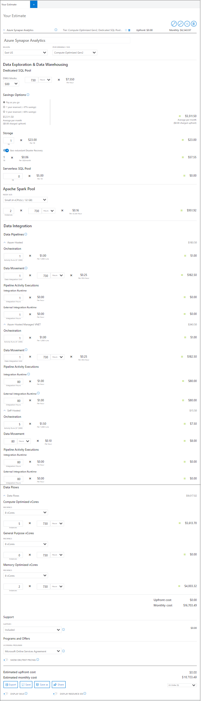
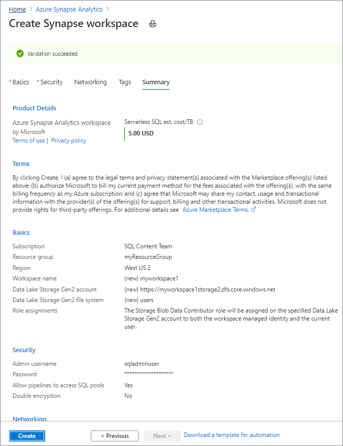
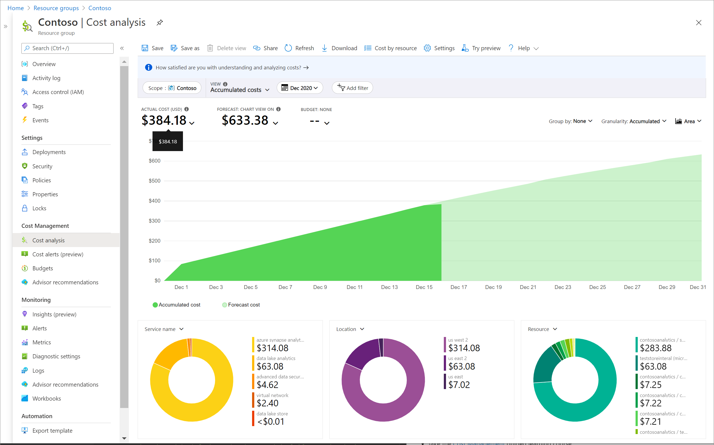
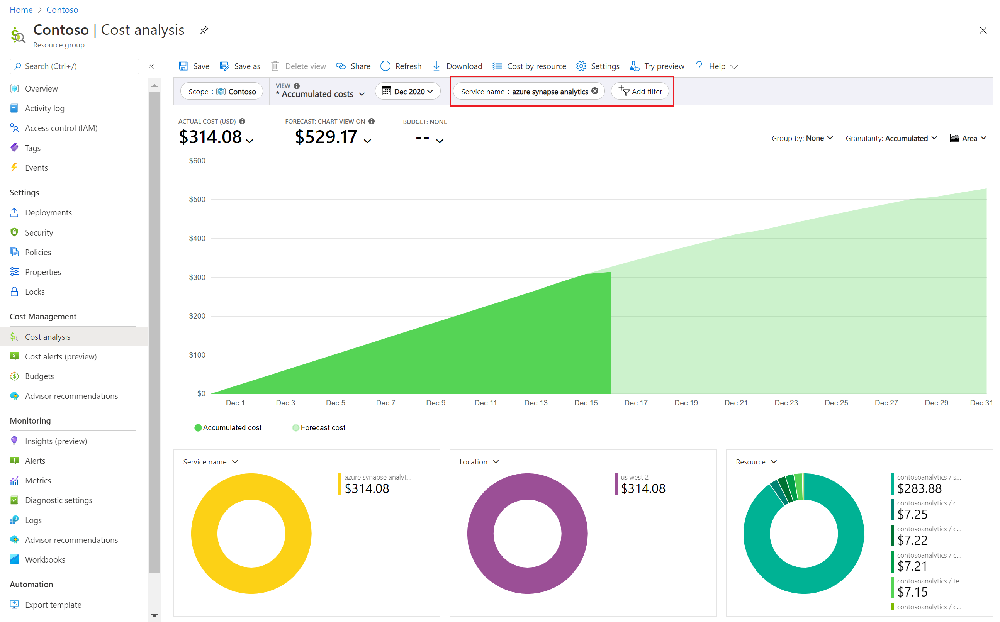

# Plan and manage costs for Azure Synapse Analytics

This article describes how to plan for and manage costs for Azure Synapse Analytics. First, you use the Azure pricing calculator to help plan for Azure Synapse costs 
before you add any resources for the service to estimate costs. Next, as you add Azure Synapse resources, review the estimated costs.

After you've started using Azure Synapse resources, use Cost Management features to set budgets and monitor costs. You can also review forecasted costs and identify spending trends to identify areas where you might want to act. Costs for Azure Synapse are only a portion of the monthly costs in your Azure bill. Although this article explains how to plan for and manage costs for Azure Synapse, you're billed for all Azure services and resources used in your Azure subscription, including the third-party services.

## Prerequisites

Cost analysis in Cost Management supports most Azure account types, but not all of them. To view the full list of supported account types, see [Understand Cost Management data](../cost-management-billing/costs/understand-cost-mgt-data.md?WT.mc_id=costmanagementcontent_docsacmhorizontal_-inproduct-learn). To view cost data, you need at least read access for an Azure account. For information about assigning access to Azure Cost Management data, see [Assign access to data](../cost-management-billing/costs/assign-access-acm-data.md?WT.mc_id=costmanagementcontent_docsacmhorizontal_-inproduct-learn).

## Estimate costs before using Azure Synapse Analytics

Use the [Azure pricing calculator](https://azure.microsoft.com/pricing/calculator/) to estimate costs before you add Azure Synapse Analytics.

Azure Synapse has various resources that have different charges as seen in the cost estimate below. 

## Understand the full billing model for Azure Synapse Analytics

Azure Synapse runs on Azure infrastructure that accrues costs along with Azure Synapse when you deploy the new resource. It's important to understand that additional infrastructure might accrue cost. You need to manage that cost when you make changes to deployed resources. 

### Costs that typically accrue with Azure Synapse Analytics

When you create resources for Azure Synapse, resources for other Azure services are also created. They include:

- Data Lake Storage Gen2

 ### Costs might accrue after resource deletion

After you delete Azure Synapse resources, the following resources might continue to exist. They continue to accrue costs until you delete them.

- Data Lake Storage Gen2

### Using Azure Prepayment credit with Azure Synapse 

You can pay for Azure Synapse charges with your Azure Prepayment (previously called monetary commitment) credit. However, you can't use Azure Prepayment credit to pay for charges for third party products and services including those from the Azure Marketplace.

## Review estimated costs in the Azure portal

As you create resources for Azure Synapse Analytics, you see estimated costs. A workspace has a serverless SQL pool created with the workspace. Serverless SQL pool will not incur charges until you run queries. Other resources, such as dedicated SQL pools and serverless Apache Spark pools, will need to be created within the workspace.

To create a <ResourceName> and view the estimated price:

1. Navigate to the service in the Azure portal.
2. Create the resource.
3. Review the estimated price shown in the summary.
4. Finish creating the resource.

If your Azure subscription has a spending limit, Azure prevents you from spending over your credit amount. As you create and use Azure resources, your credits are used. When you reach your credit limit, the resources that you deployed are disabled for the rest of that billing period. You can't change your credit limit, but you can remove it. For more information about spending limits, see [Azure spending limit](../cost-management-billing/manage/spending-limit.md).

## Monitor costs

As you use Azure Synapse resources, you incur costs. Azure resource usage unit costs vary by time intervals (seconds, minutes, hours, and days) or by unit usage (bytes, megabytes, and so on.) As soon as you start using resources in Azure Synapse, costs are incurred and you can see the costs in [cost analysis](../cost-management-billing/costs/quick-acm-cost-analysis.md?WT.mc_id=costmanagementcontent_docsacmhorizontal_-inproduct-learn).

When you use cost analysis, you view costs for Azure Synapse Analytics in graphs and tables for different time intervals. Some examples are by day, current and prior month, and year. You also view costs against budgets and forecasted costs. Switching to longer views over time can help you identify spending trends. And you see where overspending might have occurred. If you've created budgets, you can also easily see where they're exceeded.

To view Azure Synapse costs in cost analysis:

1. Sign in to the Azure portal.
2. Open the scope, either the subscription or the resource group, in the Azure portal and select **Cost analysis** in the menu. For example, go to **Subscriptions**, select a subscription from the list, and then select  **Cost analysis** in the menu. Select **Scope** to switch to a different scope in cost analysis.
3. By default, cost for services are shown in the first donut chart. Select the area in the chart labeled Azure Synapse.

Actual monthly costs are shown when you initially open cost analysis. Here's an example showing all monthly usage costs.

- To narrow costs for a single service, like Azure Synapse, select **Add filter** and then select **Service name**. Then, select **Azure Synapse Analytics**.

Here's an example showing costs for just Azure Synapse.

In the preceding example, you see the current cost for the service. Costs by Azure regions (locations) and Azure Synapse costs by resource group are also shown. From here, you can explore costs on your own.

## Create budgets

You can create [budgets](../cost-management-billing/costs/tutorial-acm-create-budgets.md?WT.mc_id=costmanagementcontent_docsacmhorizontal_-inproduct-learn) to manage costs and create [alerts](../cost-management-billing/costs/cost-mgt-alerts-monitor-usage-spending.md?WT.mc_id=costmanagementcontent_docsacmhorizontal_-inproduct-learn) that automatically notify stakeholders of spending anomalies and overspending risks. Alerts are based on spending compared to budget and cost thresholds. Budgets and alerts are created for Azure subscriptions and resource groups, so they're useful as part of an overall cost monitoring strategy. 

Budgets can be created with filters for specific resources or services in Azure if you want more granularity present in your monitoring. Filters help ensure that you don't accidentally create new resources that cost you additional money. For more about the filter options when you create a budget, see [Group and filter options](../cost-management-billing/costs/group-filter.md?WT.mc_id=costmanagementcontent_docsacmhorizontal_-inproduct-learn).

## Export cost data

You can also [export your cost data](../cost-management-billing/costs/tutorial-export-acm-data.md?WT.mc_id=costmanagementcontent_docsacmhorizontal_-inproduct-learn) to a storage account. This is helpful when you need or others to do additional data analysis for costs. For example, a finance teams can analyze the data using Excel or Power BI. You can export your costs on a daily, weekly, or monthly schedule and set a custom date range. Exporting cost data is the recommended way to retrieve cost datasets.

## Other ways to manage and reduce costs for Azure Synapse 

### Serverless SQL pool

To learn more about costs for serverless SQL pool see [Cost management for serverless SQL pool in Azure Synapse Analytics](./sql/data-processed.md)

### Dedicated SQL pool

You can control costs for a dedicated SQL pool by pausing the resource when it is not is use. For example, if you won't be using the database during the night and on weekends, you can pause it during those times, and resume it during the day. For more information see [Pause and resume compute in dedicated SQL pool via the Azure portal](./sql-data-warehouse/pause-and-resume-compute-portal.md?toc=/azure/synapse-analytics/toc.json&bc=/azure/synapse-analytics/breadcrumb/toc.json)

### Serverless Apache Spark pool

To control costs for your serverless Apache Spark pool, enable the serverless Apache Spark automatic pause feature and set your timeout value accordingly.  When using Synapse Studio for your development, the studio sends a keep alive message to keep the session active which is also configurable, so set a short timeout value for automatic pause.  When you are done, close your session and the Apache Spark pool will automatically pause once the timeout value is reached.
 
During development, create multiple Apache Spark pool definitions of various sizes.  Creating Apache Spark pool definitions are free and you will only be charged for usage.  Apache Spark usage in Azure Synapse is charged per vCore hour and prorated by the minute.  For example, use small pool sizes for code development and validation while using larger pool sizes for performance testing.

### Data integration - pipelines and data flows 

To learn more about data integration cost see [Plan and manage costs for Azure Data Factory](../data-factory/plan-manage-costs.md)

## Next steps

- Learn [how to optimize your cloud investment with Azure Cost Management](../cost-management-billing/costs/cost-mgt-best-practices.md?WT.mc_id=costmanagementcontent_docsacmhorizontal_-inproduct-learn).
- Learn more about managing costs with [cost analysis](../cost-management-billing/costs/quick-acm-cost-analysis.md?WT.mc_id=costmanagementcontent_docsacmhorizontal_-inproduct-learn).
- Learn about how to [prevent unexpected costs](../cost-management-billing/cost-management-billing-overview.md?WT.mc_id=costmanagementcontent_docsacmhorizontal_-inproduct-learn).
- Take the [Cost Management](/learn/paths/control-spending-manage-bills?WT.mc_id=costmanagementcontent_docsacmhorizontal_-inproduct-learn) guided learning course.
- Learn about planning and managing costs for [Azure Machine Learning](../machine-learning/concept-plan-manage-cost.md)