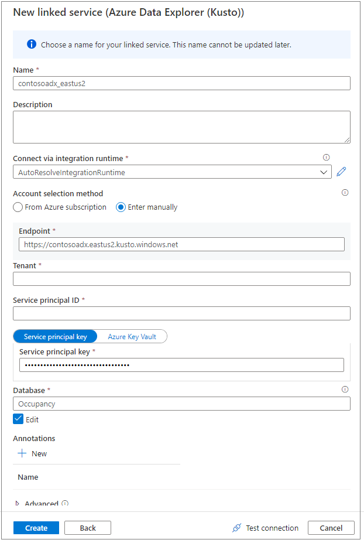
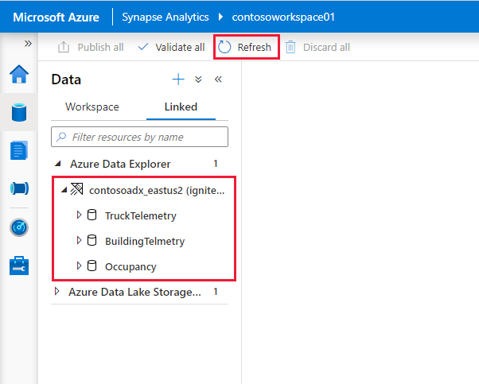

# Connect to Azure Data Explorer using Apache Spark for Azure Synapse Analytics

This article describes how to access an Azure Data Explorer database from Synapse Studio with Apache Spark for Azure Synapse Analytics.

## Prerequisites

* [Create an Azure Data Explorer cluster and database](/azure/data-explorer/create-cluster-database-portal).
* Have an existing Azure Synapse Analytics workspace, or create a new workspace by following the steps in [Quickstart: Create an Azure Synapse workspace](./quickstart-create-workspace.md).
* Have an existing Apache Spark pool, or create a new pool by following the steps in [Quickstart: Create an Apache Spark pool using the Azure portal](./quickstart-create-apache-spark-pool-portal.md).
* [Create an Azure Active Directory (Azure AD) app by provisioning an Azure AD application](/azure/data-explorer/kusto/management/access-control/how-to-provision-aad-app).
* Grant your Azure AD app access to your database by following the steps in [Manage Azure Data Explorer database permissions](/azure/data-explorer/manage-database-permissions).

## Go to Synapse Studio

From an Azure Synapse workspace, select **Launch Synapse Studio**. On the Synapse Studio home page, select **Data** to go to **Data Object Explorer**.

## Connect an Azure Data Explorer database to an Azure Synapse workspace

Connecting an Azure Data Explorer database to a workspace is done through a linked service. With an Azure Data Explorer linked service, you can browse and explore data, read, and write from Apache Spark for Azure Synapse. You can also run integration jobs in a pipeline.

From the Data Object Explorer, follow these steps to directly connect an Azure Data Explorer cluster:

1. Select the **+** icon near **Data**.
1. Select **Connect** to connect to external data.
1. Select **Azure Data Explorer (Kusto)**.
1. Select **Continue**.
1. Use a friendly name to name the linked service. The name will appear in the Data Object Explorer and is used by Azure Synapse runtimes to connect to the database.
1. Select the Azure Data Explorer cluster from your subscription, or enter the URI.
1. Enter the **Service principal ID** and **Service principal key**. Ensure this service principal has view access on the database for read operation and ingestor access for ingesting data.
1. Enter the Azure Data Explorer database name.
1. Select **Test connection** to ensure you have the right permissions.
1. Select **Create**.

    

    > [!NOTE]
    > (Optional) **Test connection** doesn't validate write access. Ensure your service principal ID has write access to the Azure Data Explorer database.

1. Azure Data Explorer clusters and databases appear on the **Linked** tab under the **Azure Data Explorer** section.

    

1. Before you can interact with the linked service from a notebook, it must be published to the Workspace. Click **Publish** in the toolbar, review the pending changes and click **OK**.

    > [!NOTE]
    > In the current release, the database objects are populated based on your Azure AD account permissions on the Azure Data Explorer databases. When you run the Apache Spark notebooks or integration jobs, the credential in the link service will be used (for example, service principal).

## Quickly interact with code-generated actions

When you right-click a database or table, a list of sample Spark notebooks appears. Select an option to read, write, or stream data to Azure Data Explorer.

Here's an example of reading data. Attach the notebook to your Spark pool, and run the cell.

   > [!NOTE]
   > First-time execution might take more than three minutes to initiate the Spark session. Subsequent executions will be significantly faster.

## Limitations

The Azure Data Explorer connector is currently not supported with Azure Synapse managed virtual networks.

## Next steps

* [Sample code with advanced options](https://github.com/Azure/azure-kusto-spark/blob/master/samples/src/main/python/SynapseSample.py)
* [Azure Data Explorer (Kusto) Spark connector](https://github.com/Azure/azure-kusto-spark)
