# Quickstart: Load data into dedicated SQL pool using the copy activity

Azure Synapse Analytics offers various analytics engines to help you ingest, transform, model, and analyze your data. A dedicated SQL pool offers T-SQL based compute and storage capabilities. After creating a dedicated SQL pool in your Synapse workspace, data can be loaded, modeled, processed, and delivered for faster analytic insight.

In this quickstart, you learn how to *load data from Azure SQL Database into Azure Synapse Analytics*. You can follow similar steps to copy data from other types of data stores. This similar flow applies to data copy for other sources and sinks as well.

## Prerequisites

* Azure subscription: If you don't have an Azure subscription, create a [free account](https://azure.microsoft.com/free/) before you begin.
* Azure Synapse workspace: Create a Synapse workspace using the Azure portal following the instructions in [Quickstart: Create a Synapse workspace](quickstart-create-workspace.md).
* Azure SQL Database: This tutorial copies data from the Adventure Works LT sample dataset in Azure SQL Database. You can create this sample database in SQL Database by following the instructions in [Create a sample database in Azure SQL Database](../azure-sql/database/single-database-create-quickstart.md). Or you can use other data stores by following similar steps.
* Azure storage account: Azure Storage is used as the *staging* area in the copy operation. If you don't have an Azure storage account, see the instructions in [Create a storage account](../storage/common/storage-account-create.md).
* Azure Synapse Analytics: You use a dedicated SQL pool as a sink data store. If you don't have an Azure Synapse Analytics instance, see [Create a dedicated SQL pool](quickstart-create-sql-pool-portal.md) for steps to create one.

### Navigate to the Synapse Studio

After your Synapse workspace is created, you have two ways to open Synapse Studio:

* Open your Synapse workspace in the [Azure portal](https://ms.portal.azure.com/#home). Select **Open** on the Open Synapse Studio card under Getting started.
* Open [Azure Synapse Analytics](https://web.azuresynapse.net/) and sign in to your workspace.

In this quickstart, we use the workspace named "adftest2020" as an example. It will automatically navigate you to the Synapse Studio home page.

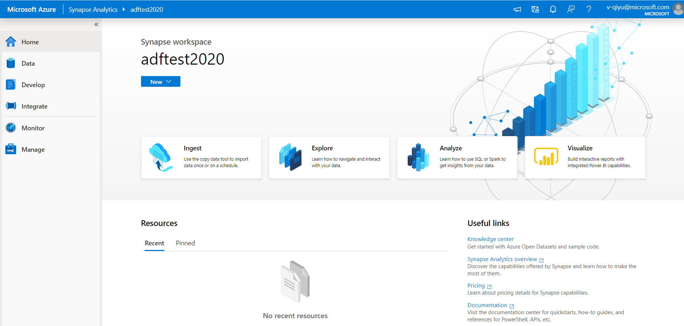

## Create linked services

In Azure Synapse Analytics, a linked service is where you define your connection information to other services. In this section, you'll create following two kinds of linked services: Azure SQL Database and Azure Data Lake Storage Gen2 (ADLS Gen2) linked services.

1. On the Synapse Studio home page, select the **Manage** tab in the left navigation.
1. Under External connections, select Linked services.
  
   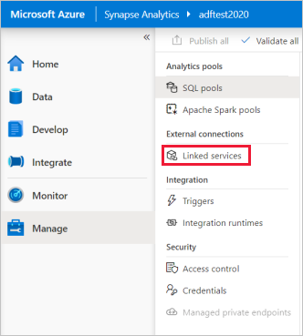

1. To add a linked service, select **New**.
1. Select **Azure SQL Database** from the gallery, and then select **Continue**. You can type "sql" in the search box to filter the connectors.

   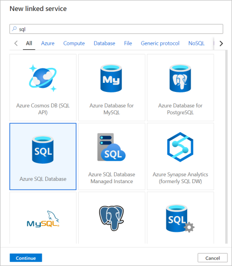

1. In the New Linked Service page, select your server name and DB name from the dropdown list, and specify the username and password. Click **Test connection** to validate the settings, then select **Create**.

   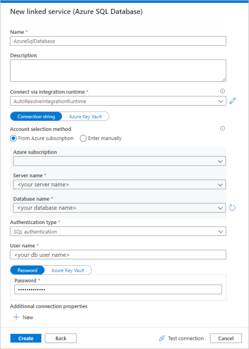

1. Repeat steps 3-4, but select **Azure Data Lake Storage Gen2** instead from the gallery. In the New Linked Service page, select your storage account name from the dropdown list. Click **Test connection** to validate the settings, then select **Create**. 

   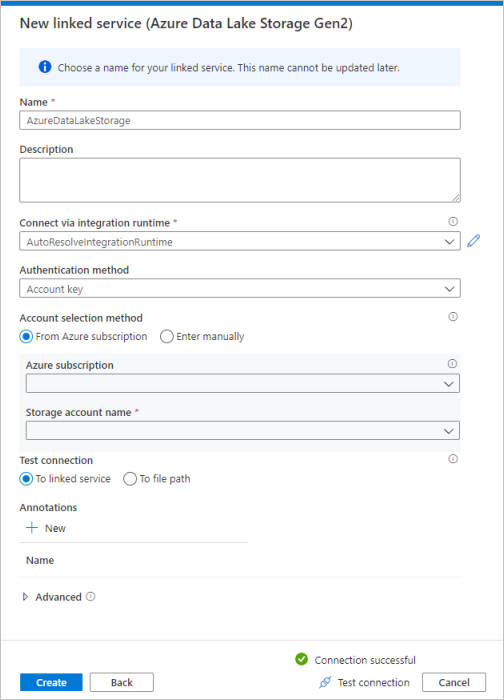
 
## Create a pipeline

A pipeline contains the logical flow for an execution of a set of activities. In this section, you'll create a pipeline containing a copy activity that ingests data from Azure SQL Database into a dedicated SQL pool.

1. Go to the **Integrate** tab. Select on the plus icon next to the pipelines header and select Pipeline.

   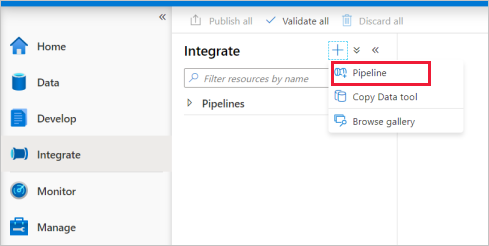

1. Under *Move and Transform* in the *Activities* pane, drag **Copy data** onto the pipeline canvas.
1. Select on the copy activity and go to the Source tab. Select **New** to create a new source dataset.

   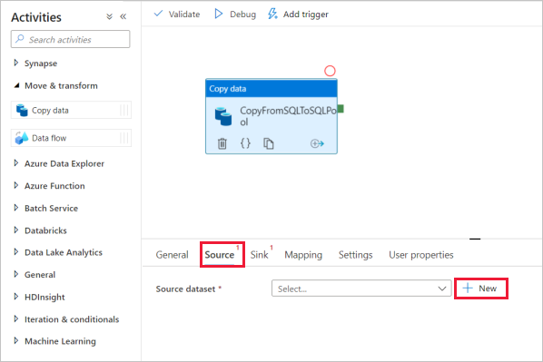

1. Select **Azure SQL Database** as your data store and select **Continue**.
1. In the *Set properties* pane, select the Azure SQL Database linked service you created in earlier step. 
1. Under Table name, select a sample table to use in following copy activity. In this quickstart, we use "SalesLT.Customer" table as an example. 

   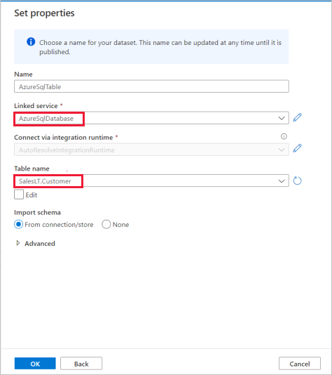
1. Select **OK** when finished.
1. Select the copy activity and go to the Sink tab. Select **New** to create a new sink dataset.
1. Select **Azure Synapse dedicated SQL pool** as your data store and select **Continue**.
1. In the  **Set properties** pane, select the SQL Analytics pool you created in earlier step. If you're writing to an existing table, under *Table name* select it from the dropdown. Otherwise, check "Edit" and enter in your new table name. Select **OK** when finished.
1. For Sink dataset settings, enable **Auto create table** in the Table option field.

   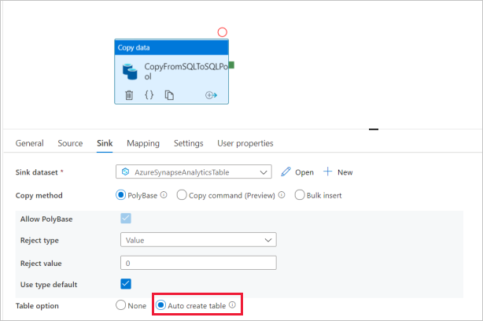

1. In the **Settings** page, select the checkbox for **Enable staging**. This option applies if your source data is not compatible with PolyBase. In **Staging settings** section, select the Azure Data Lake Storage Gen2 linked service you created in earlier step as the staging storage. 

    The storage is used for staging the data before it loads into Azure Synapse Analytics by using PolyBase. After the copy is complete, the interim data in Azure Data Lake Storage Gen2 is automatically cleaned up.

   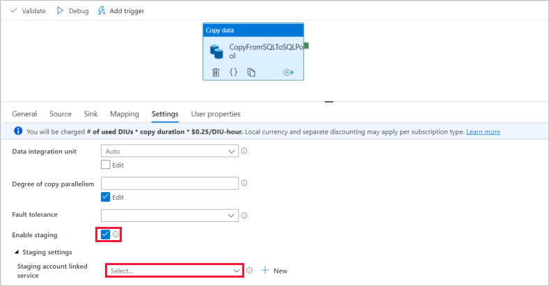

1. To validate the pipeline, select **Validate** on the toolbar. You see the result of the Pipeline validation output on the right side of the page. 

## Debug and publish the pipeline

Once you've finished configuring your pipeline, you can execute a debug run before you publish your artifacts to verify everything is correct.

1. To debug the pipeline, select **Debug** on the toolbar. You see the status of the pipeline run in the **Output** tab at the bottom of the window. 

   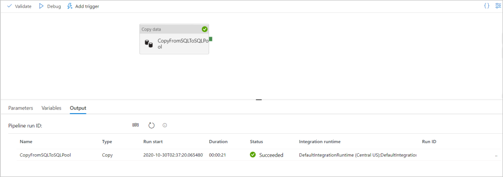

1. Once the pipeline run succeeds, in the top toolbar, select **Publish all**. This action publishes entities (datasets, and pipelines) you created to the Synapse Analytics service.
1. Wait until you see the **Successfully published** message. To see notification messages, select the bell button on the top-right. 

## Trigger and monitor the pipeline

In this section, you manually trigger the pipeline published in the previous step. 

1. Select **Add Trigger** on the toolbar, and then select **Trigger Now**. On the **Pipeline Run** page, select **OK**.  
1. Go to the **Monitor** tab located in the left sidebar. You see a pipeline run that is triggered by a manual trigger. 
1. When the pipeline run completes successfully, select the link under the **Pipeline name** column to view activity run details or to rerun the pipeline. In this example, there's only one activity, so you see only one entry in the list. 
1. For details about the copy operation, select the **Details** link (eyeglasses icon) under the **Activity name** column. You can monitor details like the volume of data copied from the source to the sink, data throughput, execution steps with corresponding duration, and used configurations.

   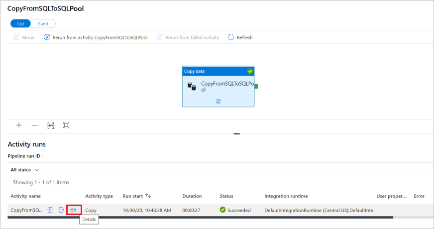

1. To switch back to the pipeline runs view, select the **All pipeline runs** link at the top. Select **Refresh** to refresh the list.
1. Verify your data is correctly written in the dedicated SQL pool.

## Next steps

Advance to the following article to learn about Azure Synapse Analytics support:

> [!div class="nextstepaction"]
> [Pipeline and activities](../data-factory/concepts-pipelines-activities.md?bc=%2fazure%2fsynapse-analytics%2fbreadcrumb%2ftoc.json&toc=%2fazure%2fsynapse-analytics%2ftoc.json)
> [Connector overview](../data-factory/connector-overview.md?bc=%2fazure%2fsynapse-analytics%2fbreadcrumb%2ftoc.json&toc=%2fazure%2fsynapse-analytics%2ftoc.json)
> [Copy activity](../data-factory/copy-activity-overview.md?bc=%2fazure%2fsynapse-analytics%2fbreadcrumb%2ftoc.json&toc=%2fazure%2fsynapse-analytics%2ftoc.json)