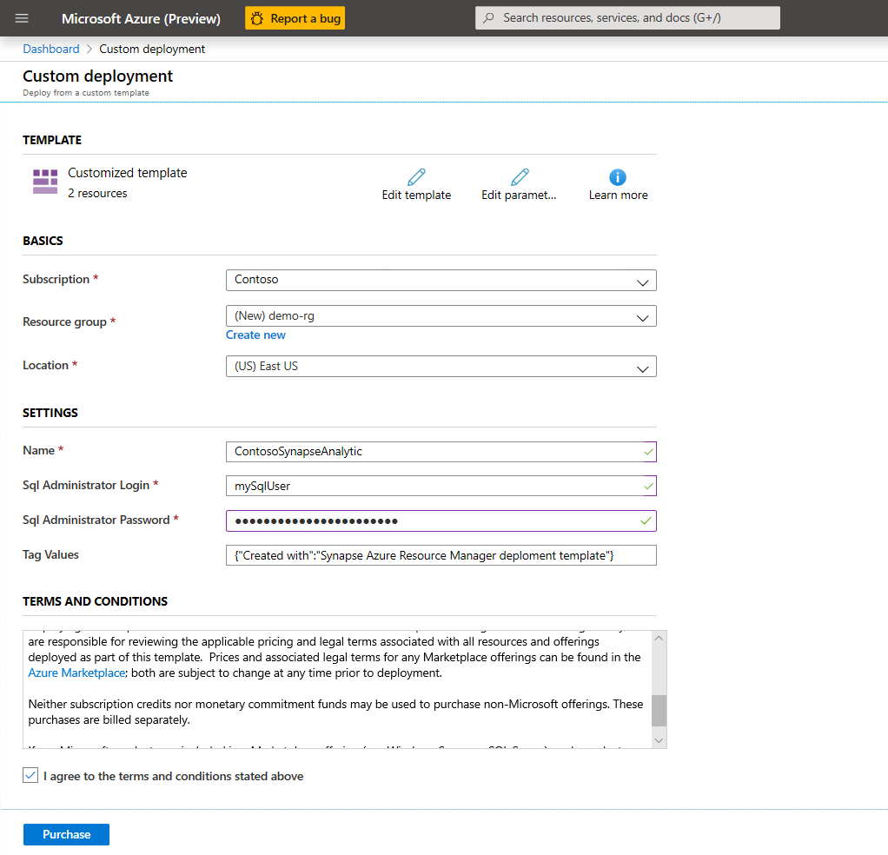

<!---Recommended: Removal all the comments in this template before you sign-off or merge to master.--->

<!---quickstarts are fundamental day-1 instructions for helping new customers use a subscription to quickly try out a specific product/service. The entire activity is a short set of steps that provides an initial experience.
You only use quickstarts when you can get the service, technology, or functionality into the hands of new customers in less than 10 minutes.
--->

# Quickstart: Create a workspace
<!---Required:
Starts with "quickstart: "
Make the first word following "quickstart:" a verb.
--->

<!---Required:
Lead with a light intro that describes, in customer-friendly language, what the customer will learn, or do, or accomplish. Answer the fundamental “why would I want to do this?” question.
--->

In this quickstart, you will create new Synapse workspace with one (default) Data Lake storage and [SQL Analytic On-demand capability](/sql-analytics/on-demand.md) query service. 
   
If you don't have an Azure subscription, [create a free account](https://azure.microsoft.com/free/).

<!--- Required, if a free trial account exists
Because quickstarts are intended to help new customers use a subscription to quickly try out a specific product/service, include a link to a free trial before the first H2, if one exists. You can find listed examples in [Write quickstarts](contribute-how-to-mvc-quickstart.md)
--->

<!---Avoid notes, tips, and important boxes. Readers tend to skip over them. Better to put that info directly into the article text.--->

## Prerequisites

- For all steps in this quickstart, sign in to the [Azure portal](https://portal.azure.com/).
<!---If you feel like your quickstart has a lot of prerequisites, the quickstart may be the wrong content type - a tutorial or how-to guide may be the better option.
If you need them, make Prerequisites your first H2 in a quickstart.
If there’s something a customer needs to take care of before they start (for example, creating a VM) it’s OK to link to that content before they begin.
--->

## Sign in to <service/product/tool name>

<!--Sign in to the [<service> portal](url). --->
<!---If you need to sign in to the portal to do the quickstart, this H2 and link are required.--->

## Using Azure template

<!---Required:
Quickstarts are prescriptive and guide the customer through an end-to-end procedure. Make sure to use specific naming for setting up accounts and configuring technology.
Don't link off to other content - include whatever the customer needs to complete the scenario in the article. For example, if the customer needs to set permissions, include the permissions they need to set, and the specific settings in the quickstart procedure. Don't send the customer to another article to read about it.
In a break from tradition, do not link to reference topics in the procedural part of the quickstart when using cmdlets or code. Provide customers what they need to know in the quickstart to successfully complete the quickstart.
For portal-based procedures, minimize bullets and numbering.
For the CLI or PowerShell based procedures, don't use bullets or numbering.
--->

Azure Resource Deployment template is the simplest way to create Synapse workspace. Make sure that you sign in to Azure portal before creating deployment.

1. Use **Azure Deploy** button to deploy the template.

<a href="https://portal.azure.com/#create/Microsoft.Template/uri/https%3A%2F%2Fraw.githubusercontent.com%2Fmicrosoft%2Fsql-server-samples%2Fmaster%2Fsamples%2Fmanage%2Fsynapse-analytics%2Fazuredeploy.json" target="_blank">

</a>

2. Enter the subscription, create new resource group and data center region where you want to deploy your workspace. Enter the name of the workspace and underlying Data Lake storage, username/password for the login that can use [SQL Analytic On-demand capability](/sql-analytics/on-demand.md), and optional tags that will be added to your workspace.



> [!NOTE]
> This quick-start template will create a workspace in the default region of the selected resource group. If you choose an existing resource group you cannot change the region. 

3. Check "I agree with terms and conditions" checkbox and press `Purchase` button. **Note:** you will **not be charged** for the resources if you don't use them because SQL Analytic On-demand is serverless pay-per-usage service.
<!---    --->
   <!---Use screenshots but be judicious to maintain a reasonable length. Make sure screenshots align to the [current standards](contribute-mvc-screen-shots.md).
   If users access your product/service via a web browser the first screenshot should always include the full browser window in Chrome or Safari. This is to show users that the portal is browser-based - OS and browser agnostic.--->

If you have entered valid information (supported region, valid names) your Synapse workspace and Data Lake storage will be deployed in few minutes. 

> [!NOTE]
> If you are using AAD authentication to query the files on Azure Storage, you need to [assign **Data Reader** or **Storage Blob Data Contributor** RBAC permissions to these users](../storage/common/storage-auth-aad-rbac-portal.md#assign-a-built-in-rbac-role). 

## Using Azure portal

The Azure portal provides user-friendly experience that you can use to create and configure Synapse workspace.

1. In Azure portal, use **Create a resource** button and [create Azure Data Lake Gen2 storage account](../storage/blobs/data-lake-storage-quickstart-create-account.md) with [hierarchical namespace](../storage/blobs/data-lake-storage-namespace.md).
2. When the storage is created, go to Blob Storage container and add new File system that should be used for Synapse workspace
3. In Azure portal, use **Create a resource** button and search for "Synapse Analytics". Choose a service with the name **Azure Synapse Analytics (preview)**. Note: do not choose a service with label **(formerly SQL DW)** because this is single SQL Pool.
4. Enter the subscription, resource group, workspace name, data center region where you want to deploy your workspace. Choose name of Data Lake and file system that you created in previous step. Enter the name of the workspace and underlying Data Lake storage, username/password for the login that can use [SQL Analytic On-demand capability](/sql-analytics/on-demand.md), and optional tags that will be added to your workspace.
5. Review the changes and create resource.

If you are using AAD authentication to query the files on Azure Storage, you need to [assign **Data Reader** or **Storage Blob Data Contributor** RBAC permissions to these users](../storage/common/storage-auth-aad-rbac-portal.md#assign-rbac-roles-using-the-azure-portal). Assign this role on storage account scope (don't use inherited roles from subscription or groups).

## Using Azure PowerShell

Azure PowerShell is still not available.
<!---Code requires specific formatting. Here are a few useful examples of commonly used code blocks. Make sure to use the interactive functionality where possible.
For the CLI or PowerShell based procedures, don't use bullets or numbering.--->

```azurepowershell-interactive
    
```
If you are using AAD authentication to query the files on Azure Storage, you need to [assign **Data Reader** or **Storage Blob Data Contributor** RBAC permissions to these users](../storage/common/storage-auth-aad-rbac-powershell.md#storage-account-scope).

## Using Azure Command Line Interface

Azure CLI is still not available.

```azurecli-interactive 

```

## Clean up resources

To remove the resource group and its associated resources, including the new storage account, use the Azure portal, Azure CLI, or Azure PowerShell.

To remove resources using the Azure portal:
1. In the Azure portal, expand the menu on the left side to open the menu of services, and choose **Resource Groups** to display the list of your resource groups.
2. Locate the resource group to delete, and right-click the **More** button (**...**) on the right side of the listing.
3. Select **Delete resource group**, and confirm.

To remove the resource group and its associated resources using Azure CLI, use the [az group delete](/cli/azure/group) command.

```azurecli-interactive
az group delete --name myResourceGroup
```

To remove resources using Azure PowerShell, use the [Remove-AzResourceGroup](/powershell/module/az.resources/remove-azresourcegroup) command: 

```azurepowershell-interactive
Remove-AzResourceGroup -Name $resourceGroup
```

<!---Required:
To avoid any costs associated with following the quickstart procedure, a Clean up resources (H2) should come just before Next steps (H2)
--->

## Next steps

<!--
Advance to the next article to learn how to create...
> [!div class="nextstepaction"]
> [Next steps button](tutorial-facilities-app.md)
--->

<!--- Required:
Quickstarts should always have a Next steps H2 that points to the next logical quickstart in a series, or, if there are no other quickstarts, to some other cool thing the customer can do. A single link in the blue box format should direct the customer to the next article - and you can shorten the title in the boxes if the original one doesn’t fit.
Do not use a "More info section" or a "Resources section" or a "See also section". --->

- Enable AAD users to query files [by assigning **Data Reader** or **Storage Blob Data Contributor** RBAC permissions on Azure storage](../storage/common/storage-auth-aad-rbac-portal.md#assign-a-built-in-rbac-role) 
- [Query files on Azure Storage using SQL On-Demand](sql-analytics/quickstart-sql-on-demand.md)
- [Create Spark Pool](spark/apache-spark-notebook-create-spark-use-sql.md)
- [Create Power BI report on files stored on Azure storage](sql-analytics/tutorial-connect-power-bi-desktop.md)
