# Quickstart: Create an Apache Spark GPU-enabled Pool in Azure Synapse Analytics using the Azure portal

An Apache Spark pool provides open-source big data compute capabilities where data can be loaded, modeled, processed, and distributed for faster analytic insight. Synapse now offers the ability to create Apache Spark pools that use GPUs on the backend to run your Spark workloads on GPUs for accelerated processing.

In this quickstart, you learn how to use the Azure portal to create an Apache Spark GPU-enabled pool in an Azure Synapse Analytics workspace.

> [!NOTE]
> Azure Synapse GPU-enabled pools are currently in Public Preview.

If you don't have an Azure subscription, [create a free account before you begin](https://azure.microsoft.com/free/).

## Prerequisites

- You'll need an Azure subscription. If needed, [create a free Azure account](https://azure.microsoft.com/free/)
- [Synapse Analytics workspace](quickstart-create-workspace.md)

## Sign in to the Azure portal

Sign in to the [Azure portal](https://portal.azure.com/)

## Navigate to the Synapse workspace 
1. Navigate to the Synapse workspace where the Apache Spark pool will be created by typing the service name (or resource name directly) into the search bar.
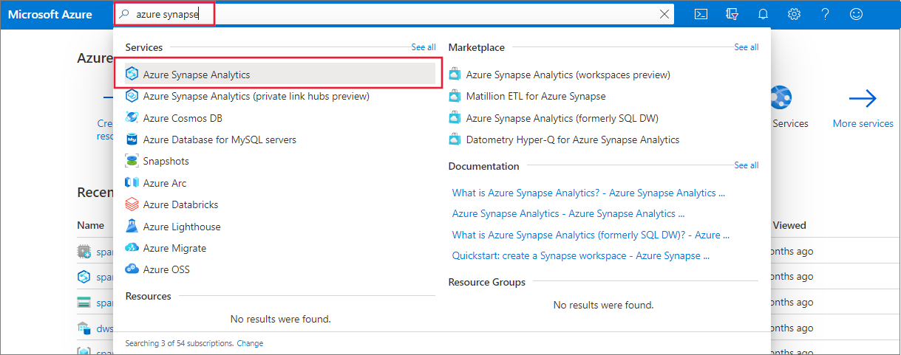
2. From the list of workspaces, type the name (or part of the name) of the workspace to open. For this example, we'll use a workspace named **contosoanalytics**.
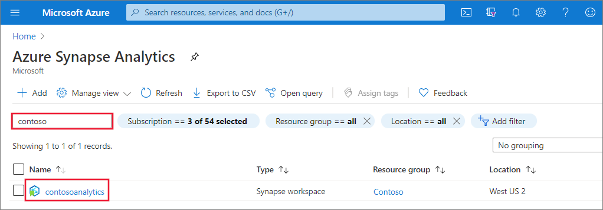

## Create new Azure Synapse GPU-enabled pool

1. In the Synapse workspace where you want to create the Apache Spark pool, select **New Apache Spark pool**.
    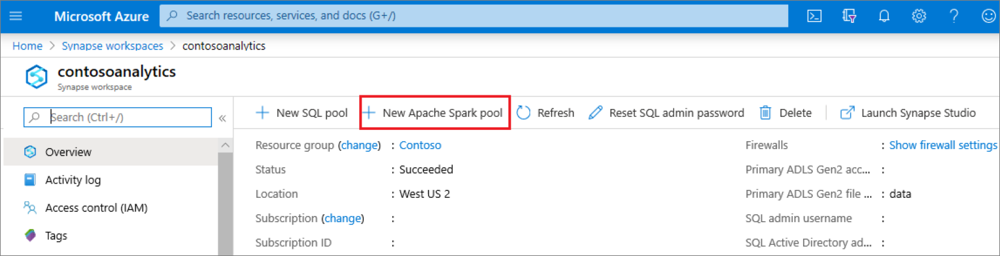
2. Enter the following details in the **Basics** tab:

    |Setting | Suggested value | Description |
    | :------ | :-------------- | :---------- |
    | **Apache Spark pool name** | A valid pool name | This is the name that the Apache Spark pool will have. |
    | **Node size family** | Hardware Accelerated | Choose Hardware Accelerated from the drop down menu |
    | **Node size** | Large (16 vCPU / 110 GB / 1 GPU) | Set this to the smallest size to reduce costs for this quickstart |
    | **Autoscale** | Disabled | We don't need autoscale for this quickstart |
    | **Number of nodes** | 3 | Use a small size to limit costs for this quickstart |

    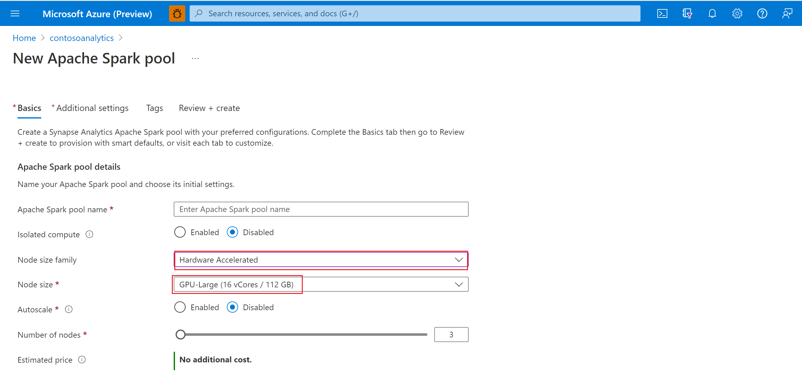
    > [!IMPORTANT]
    > Note that there are specific limitations for the names that Apache Spark pools can use. Names must contain letters or numbers only, must be 15 or less characters, must start with a letter, not contain reserved words, and be unique in the workspace.

3. Select **Next: additional settings** and review the default settings. Do not modify any default settings. Note that GPU pools can **only be created with Apache Spark 3.1**.
    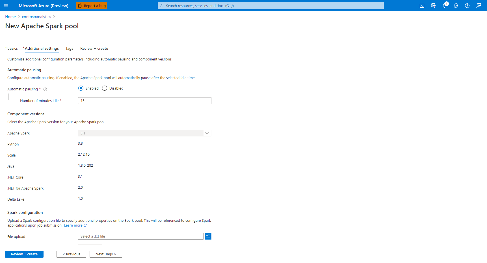

4. Select **Next: tags**. Don't add any tags.

    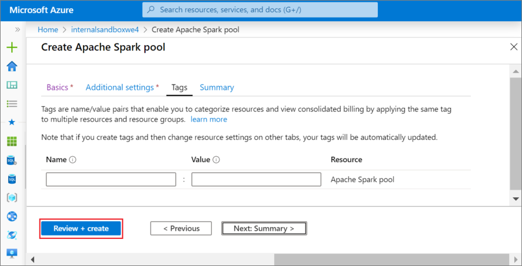

5. Select **Review + create**.

6. Make sure that the details look correct based on what was previously entered, and select **Create**.
    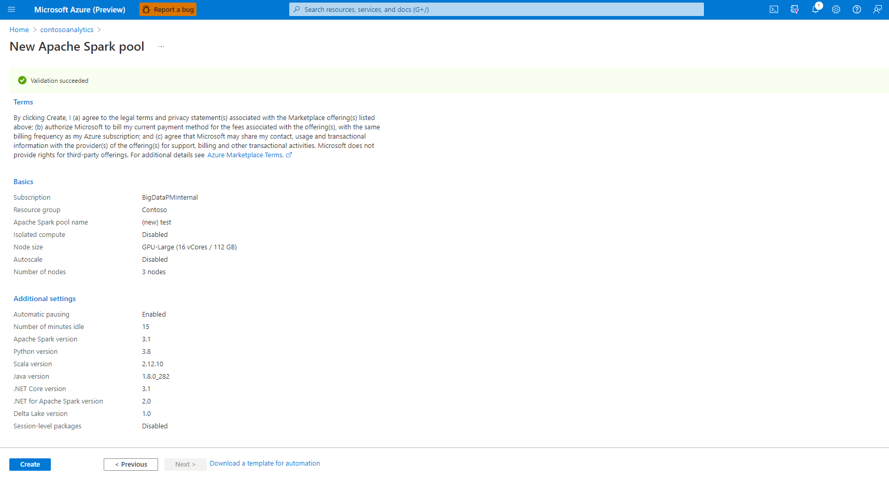

7. At this point, the resource provisioning flow will start, indicating once it's complete.
    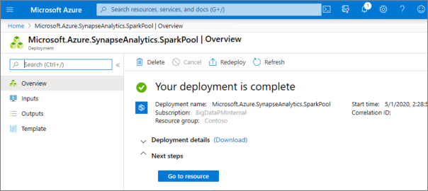

8. After the provisioning completes, navigating back to the workspace will show a new entry for the newly created Azure Synapse GPU-enabled pool.
    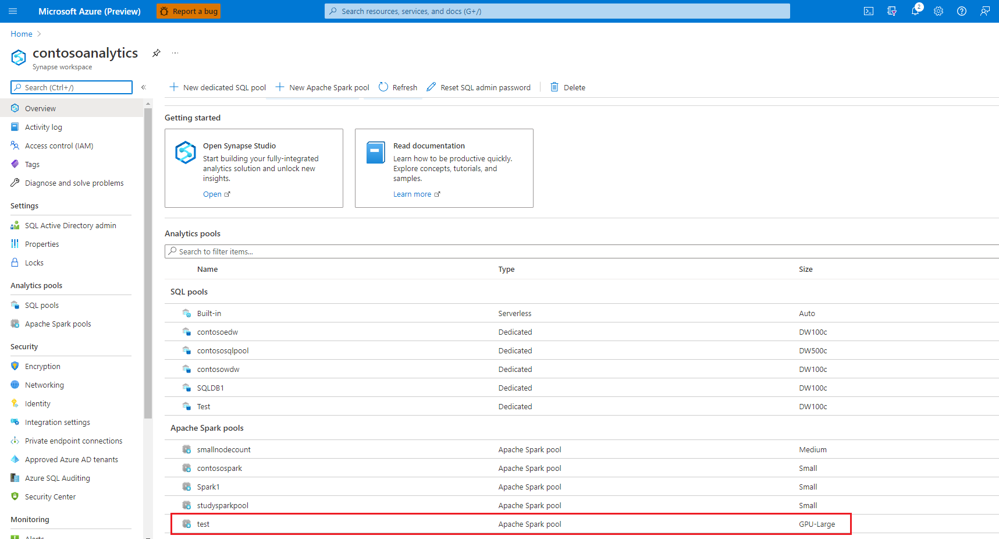

9. At this point, there are no resources running, no charges for Spark, you have created metadata about the Spark instances you want to create.

## Clean up resources

Follow the steps below to delete the Apache Spark pool from the workspace.
> [!WARNING]
> Deleting an Apache Spark pool will remove the analytics engine from the workspace. It will no longer be possible to connect to the pool, and all queries, pipelines, and notebooks that use this Apache Spark pool will no longer work.

If you want to delete the Apache Spark pool, do the following:

1. Navigate to the Apache Spark pools blade in the workspace.
2. Select the Apache Spark pool to be deleted (in this case, **contosospark**).
3. Press **delete**.

 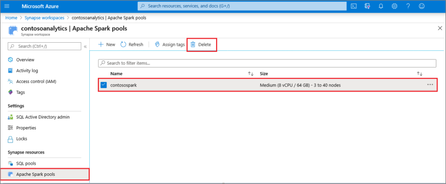

4. Confirm the deletion, and press **Delete** button.

 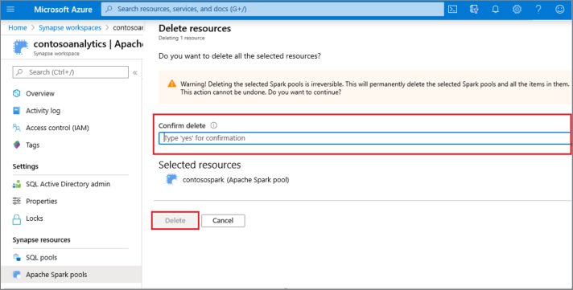

5. When the process completes successfully, the Apache Spark pool will no longer be listed in the workspace resources.

## Next steps

- See [Quickstart: Create an Apache Spark notebook to run on a GPU pool](spark/apache-spark-rapids-gpu.md).
