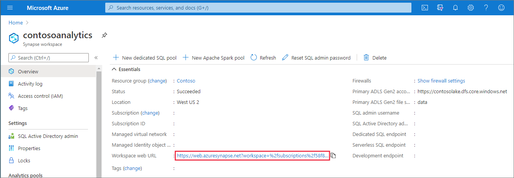
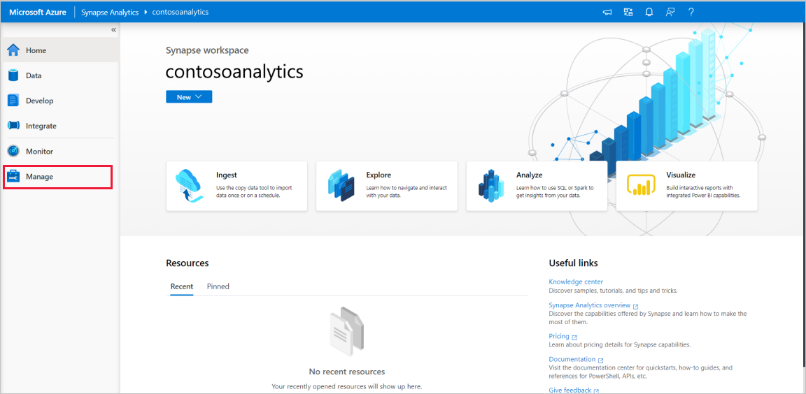
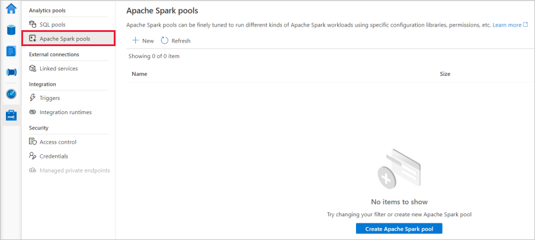
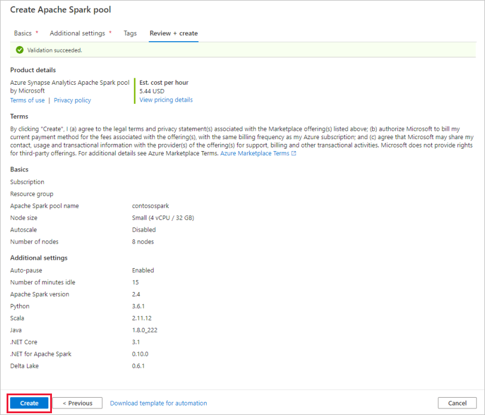
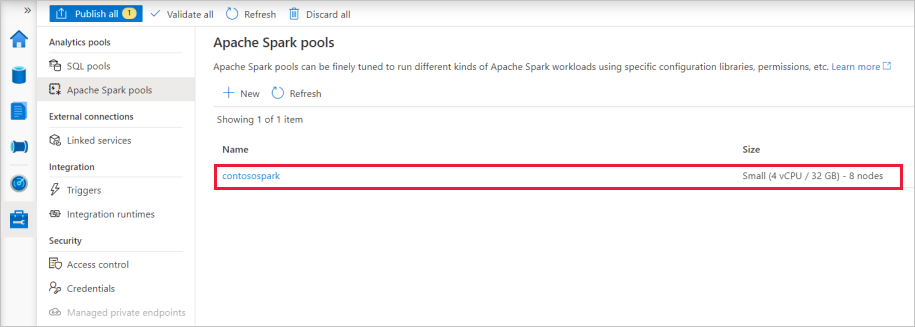
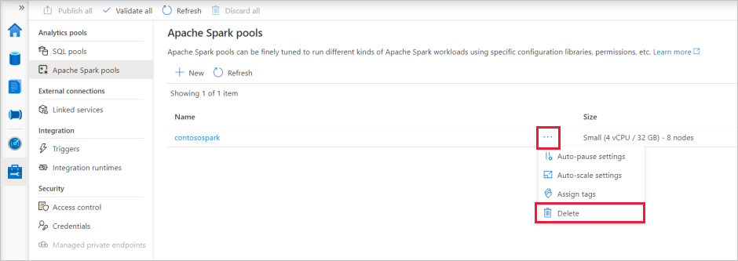

# Quickstart: Create a serverless Apache Spark pool using Synapse Studio

Azure Synapse Analytics offers various analytics engines to help you ingest, transform, model, analyze,  and serve your data. Apache Spark pool offers open-source big data compute capabilities. After creating an Apache Spark pool in your Synapse workspace, data can be loaded, modeled, processed, and served to obtain insights.  

This quickstart describes the steps to create an Apache Spark pool in a Synapse workspace by using Synapse Studio.

> [!IMPORTANT]
> Billing for Spark instances is prorated per minute, whether you are using them or not. Be sure to shutdown your Spark instance after you have finished using it, or set a short timeout. For more information, see the **Clean up resources** section of this article.

If you don't have an Azure subscription, [create a free account before you begin](https://azure.microsoft.com/free/).

## Prerequisites

- You'll need an Azure subscription. If needed, [create a free Azure account](https://azure.microsoft.com/free/)
- [Synapse workspace](./quickstart-create-workspace.md)

## Sign in to the Azure portal

Sign in to the [Azure portal](https://portal.azure.com/)

## Navigate to the Synapse workspace

1. Navigate to the Synapse workspace where the Apache Spark pool will be created by typing the service name (or resource name directly) into the search bar.

    
1. From the list of workspaces, type the name (or part of the name) of the workspace to open. For this example, we'll use a workspace named **contosoanalytics**.

    

## Launch Synapse Studio 

From the workspace overview, select the **Workspace web URL** to open Synapse Studio.

## Create the Apache Spark pool in Synapse Studio

1. On the Synapse Studio home page, navigate to the **Management Hub** in the left navigation by selecting the **Manage** icon.

    

1. Once in the Management Hub, navigate to the **Apache Spark pools** section to see the current list of Apache Spark pools that are available in the workspace.
    
    

1. Select **+ New** and the new Apache Spark pool create wizard will appear. 

1. Enter the following details in the **Basics** tab:

    | Setting | Suggested value | Description |
    | :------ | :-------------- | :---------- |
    | **Apache Spark pool name** | contosospark | This is the name that the Apache Spark pool will have. |
    | **Node size** | Small (4 vCPU / 32 GB) | Set this to the smallest size to reduce costs for this quickstart |
    | **Autoscale** | Disabled | We won't need autoscale in this quickstart |
    | **Number of nodes** | 8 | Use a small size to limit costs in this quickstart|
    | **Dynamically allocate executors** |  Disabled | This setting maps to the dynamic allocation property in Spark configuration for Spark Application executors allocation. We won't need autoscale in this quickstart.|
    
    
    
    > [!IMPORTANT]
    > Note that there are specific limitations for the names that Apache Spark pools can use. Names must contain letters or numbers only, must be 15 or less characters, must start with a letter, not contain reserved words, and be unique in the workspace.

1. In the next tab (Additional settings), leave all settings as defaults.

1. We won't add any tags for now, so select **Review + create**.

1. In the **Review + create** tab, make sure that the details look correct based on what was previously entered, and press **Create**. 

    

1. The Apache Spark pool will start the provisioning process.

1. Once the provisioning is complete, the new Apache Spark pool will appear in the list.
    
    

## Clean up Apache Spark pool resources using Synapse Studio

Follow the steps below to delete the Apache Spark pool from the workspace using Synapse Studio.
> [!WARNING]
> Deleting a Spark pool will remove the analytics engine from the workspace. It will no longer be possible to connect to the pool, and all queries, pipelines, and notebooks that use this Spark pool will no longer work.

If you want to delete the Apache Spark pool, do the following:

1. Navigate to the Apache Spark pools in the Management Hub in Synapse Studio.
1. Select the ellipsis next to the Apache pool to be deleted (in this case, **contosospark**) to show the commands for the Apache Spark pool.

    

1. Press **delete**.
1. Confirm the deletion, and press **Delete** button.
1. When the process completes successfully, the Apache Spark pool will no longer be listed in the workspace resources. 

## Next steps

- See [Quickstart: Create an Apache Spark pool in Synapse Studio using web tools](quickstart-apache-spark-notebook.md).
- See [Quickstart: Create an Apache Spark pool using the Azure portal](quickstart-create-apache-spark-pool-portal.md).
