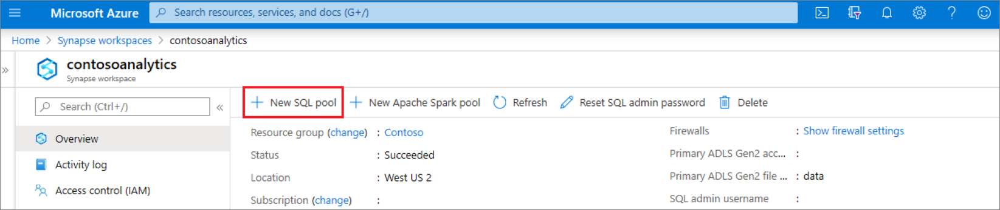
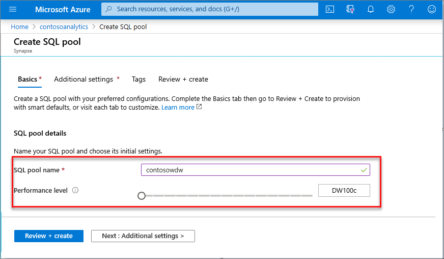
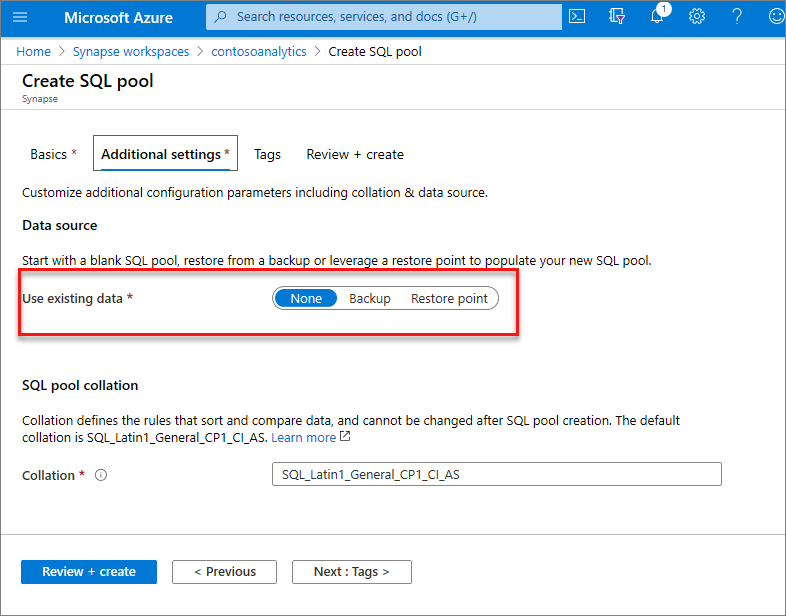
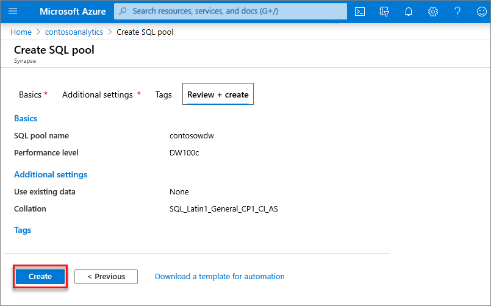
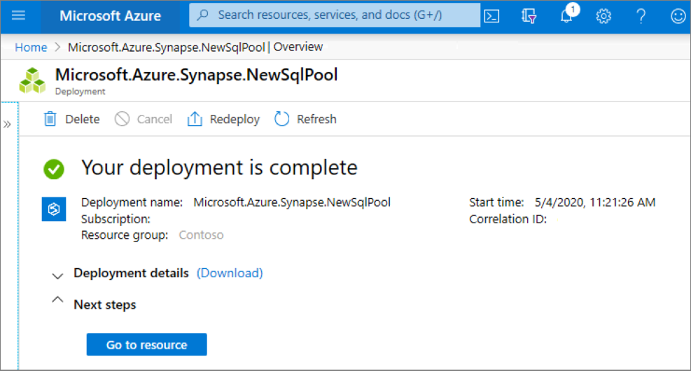
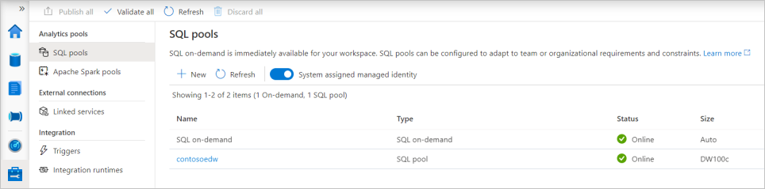
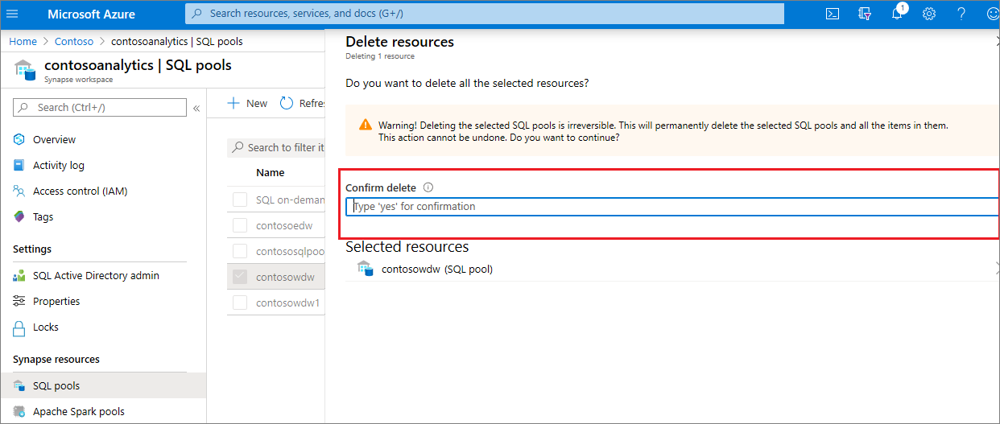

# Quickstart: Create a dedicated SQL pool using the Azure portal

Azure Synapse Analytics offers various analytics engines to help you ingest, transform, model, and analyze your data. A dedicated SQL pool offers T-SQL based compute and storage capabilities. After creating a dedicated SQL pool in your Synapse workspace, data can be loaded, modeled, processed, and delivered for faster analytic insight.

In this quickstart, you learn how to create a dedicated SQL pool in a Synapse workspace by using the Azure portal.

If you don't have an Azure subscription, [create a free account before you begin](https://azure.microsoft.com/free/).

## Prerequisites

- You'll need an Azure subscription. If needed, [create a free Azure account](https://azure.microsoft.com/free/)
- [Synapse workspace](./quickstart-create-workspace.md)

## Sign in to the Azure portal

Sign in to the [Azure portal](https://portal.azure.com/)

## Navigate to the Synapse workspace

1. Navigate to the Synapse workspace where the dedicated SQL pool will be created by typing the service name (or resource name directly) into the search bar.
. 
1. From the list of workspaces, type the name (or part of the name) of the workspace to open. For this example, we'll use a workspace named **contosoanalytics**.

## Create new dedicated SQL pool

1. In the Synapse workspace where you want to create the dedicated SQL pool, select **New dedicated SQL pool** command in the top bar.

2. Enter the following details in the **Basics** tab:

    | Setting | Suggested value | Description |
    | :------ | :-------------- | :---------- |
    | **Dedicated SQL pool name** | Any valid name | Name of the dedicated SQL pool. |
    | **Performance level** | DW100c | Set to the smallest size to reduce costs for this quickstart |

  
    

    > [!IMPORTANT]
    > Note that there are specific limitations for the names that dedicated SQL pools can use. Names can't contain special characters, must be 60 or less characters, not contain reserved words, and be unique in the workspace.

3. Select **Next: Additional settings**.
4. Select **None** to provision the dedicated SQL pool without data. Leave the default collation selected.

    If you want to restore your dedicated SQL pool from a restore point, select **Restore point**. For more information on how to perform a restore, see [How-to: Restore an existing dedicated SQL pool](backuprestore/restore-sql-pool.md)

5. Select **Review + create**.
6. Make sure that the details look correct based on what was previously entered. Select **Create**.

7. At this point, the resource provisioning flow will start.
 

8. After the provisioning completes, navigating back to the workspace will show a new entry for the newly created dedicated SQL pool.
 

After the dedicated SQL pool is created, it will be available in the workspace for loading data, processing streams, reading from the lake, etc.

## Clean up resources

Follow the steps below to delete the dedicated SQL pool from the workspace.
> [!WARNING]
> Deleting a dedicated SQL pool will both remove the analytics engine and the data stored in the database of the deleted dedicated SQL pool from the workspace. It will no longer be possible to connect to the dedicated SQL pool, and all queries, pipelines, and notebooks that read or write to this dedicated SQL pool will no longer work.

If you want to delete the dedicated SQL pool, complete the following steps:

1. Navigate to the SQL pools blade in the workspace blade
1. Select the dedicated SQL pool to be deleted (in this case, **contosowdw**)
1. Once selected, press **delete**
1. Confirm the deletion, and press **Delete** button
 
1. When the process completes successfully, the dedicated SQL pool will no longer be listed in the workspace resources.

## Next steps

- See [Quickstart: Create a serverless Apache Spark pool in Synapse Studio using web tools](quickstart-apache-spark-notebook.md).
- See [Quickstart: Create a serverless Apache Spark pool using the Azure portal](quickstart-create-apache-spark-pool-portal.md).
