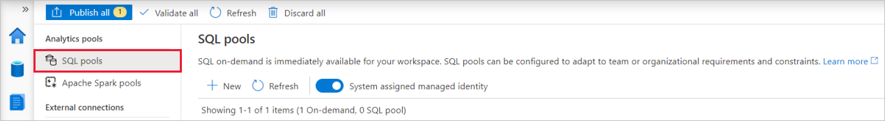
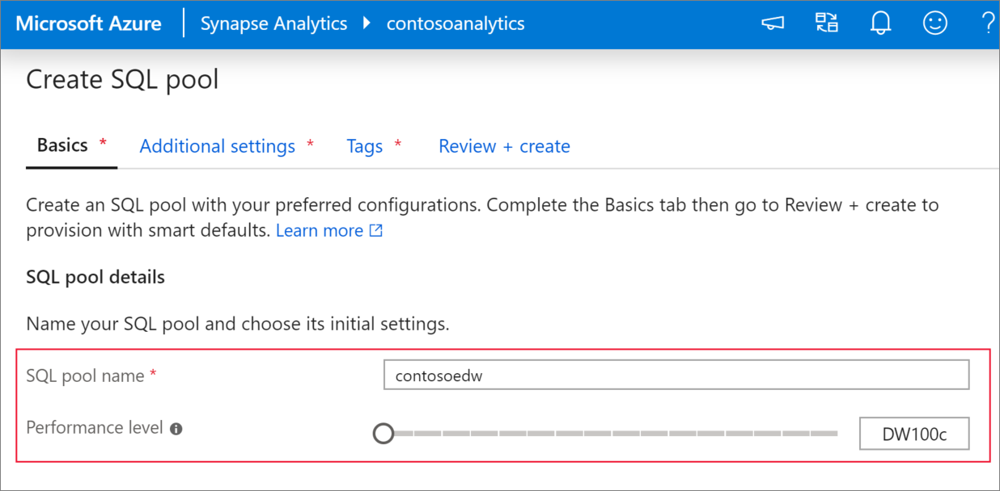
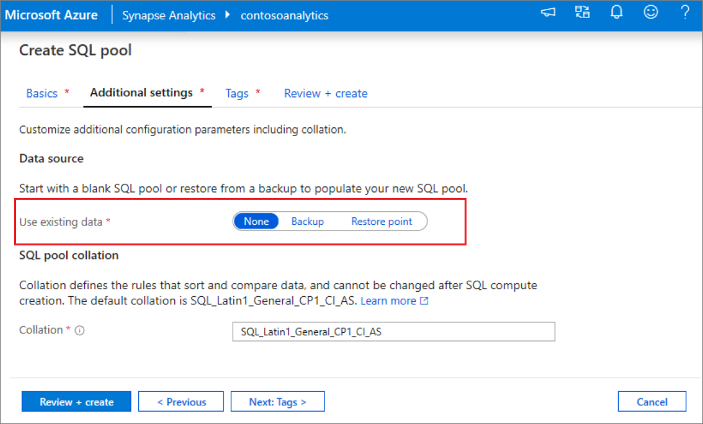
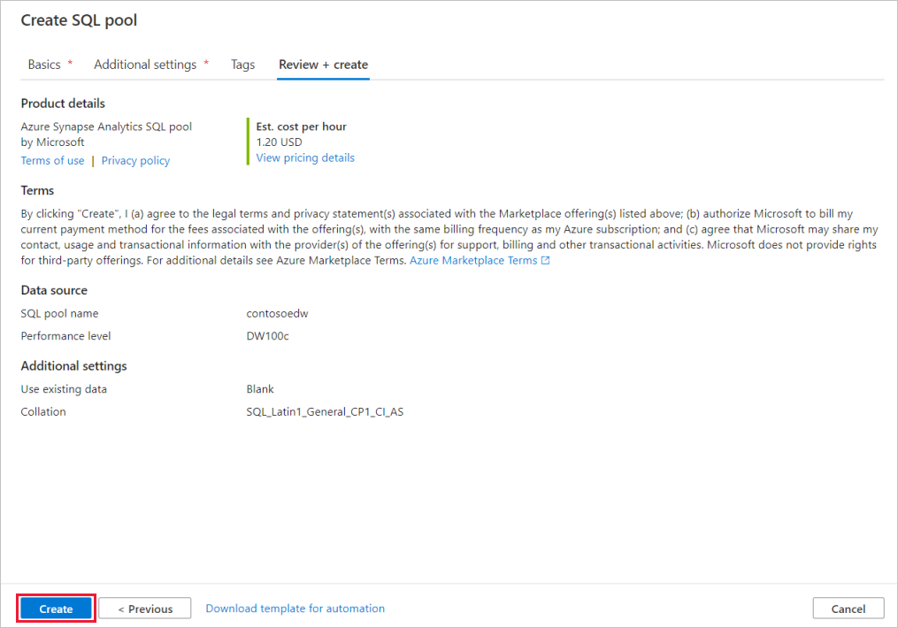
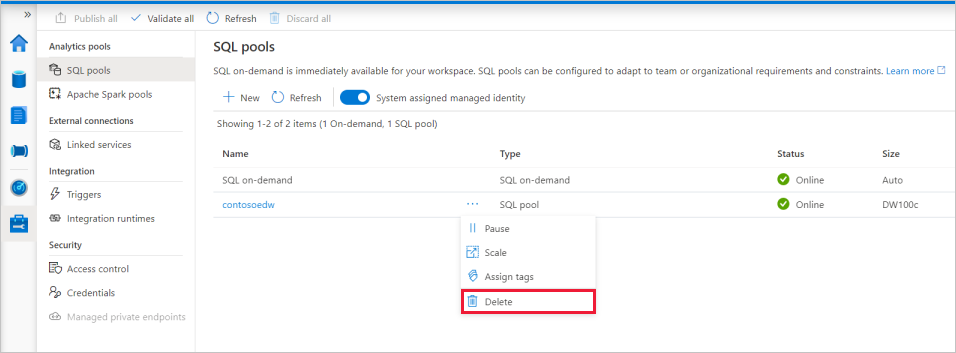

# Quickstart: Create a dedicated SQL pool using Synapse Studio

Azure Synapse Analytics offers various analytics engines to help you ingest, transform, model, and analyze your data. A dedicated SQL pool offers T-SQL based compute and storage capabilities. After creating a dedicated SQL pool in your Synapse workspace, data can be loaded, modeled, processed, and delivered for faster analytic insight.

This quickstart describes the steps to create a dedicated SQL pool in a Synapse workspace using Synapse Studio.

If you don't have an Azure subscription, [create a free account before you begin](https://azure.microsoft.com/free/).

## Prerequisites

- Azure subscription - [create one for free](https://azure.microsoft.com/free/)
- [Synapse workspace](quickstart-create-workspace.md)

## Sign in to the Azure portal

Sign in to the [Azure portal](https://portal.azure.com/)

## Navigate to the Synapse workspace

1. Navigate to the Synapse workspace where the dedicated SQL pool will be created by typing the service name (or resource name directly) into the search bar.

    
1. From the list of workspaces, type the name (or part of the name) of the workspace to open. For this example, we'll use a workspace named **contosoanalytics**.

    

## Launch Synapse Studio

1. From the workspace overview, click on the link for the **Workspace web URL** to launch  Synapse Studio.

    

## Create a dedicated SQL pool in Synapse Studio

1. On the Synapse Studio home page, navigate to the **Management Hub** in the left navigation by selecting the **Manage** icon.

    

1. Once in the Management Hub, navigate to the **SQL pools** section to see the current list of SQL pools that are available in the workspace.

    

1. Select **+ New** command and the new SQL pool create wizard will appear. 

    

1. Enter the following details in the **Basics** tab:

    | Setting | Suggested value | Description |
    | :------ | :-------------- | :---------- |
    | **SQL pool name** | contosoedw | This is the name that the dedicated SQL pool will have. |
    | **Performance level** | DW100c | Set this to the smallest size to reduce costs for this quickstart |

    
    > [!IMPORTANT]
    > Note that there are specific limitations for the names that dedicated SQL pools can use. Names can't contain special characters, must be 15 or less characters, not contain reserved words, and be unique in the workspace.

4. In the next tab, **Additional settings**, select **none** to provision the SQL pool without data. Leave the default collation as selected.

    

1. We won't add any tags for now, so next select **Review + create**.

1. In the **Review + create** tab, make sure that the details look correct based on what was previously entered, and press **create**. 

    

1. At this point, the resource provisioning flow will start.

1. After the provisioning completes, navigating back to the workspace will show a new entry for the newly created SQL pool.

    

1. Once the dedicated SQL pool is created, it will be available in the workspace for loading data, processing streams, reading from the lake, etc.

## Clean up dedicated SQL pool using Synapse Studio    

Follow the steps below to delete the dedicated SQL pool from the workspace using Synapse Studio.
> [!WARNING]
> Deleting a dedicated SQL pool will remove the analytics engine from the workspace. It will no longer be possible to connect to the pool, and all queries, pipelines, scripts that use this dedicated SQL pool will no longer work.

If you want to delete the dedicated SQL pool, do the following:

1. Navigate to the SQL pools in the Management Hub in Synapse Studio.
1. Select the ellipsis in the dedicated SQL pool to be deleted (in this case, **contosoedw**) to show the commands for the dedicated SQL pool:

    
1. Press **delete**.
1. Confirm the deletion, and press **Delete** button.
1. When the process completes successfully, the dedicated SQL pool will no longer be listed in the workspace resources.

## Next steps 
- See [Quickstart: Create an Apache Spark notebook](quickstart-apache-spark-notebook.md).
- See [Quickstart: Create a dedicated SQL pool using the Azure portal](quickstart-create-sql-pool-portal.md).
