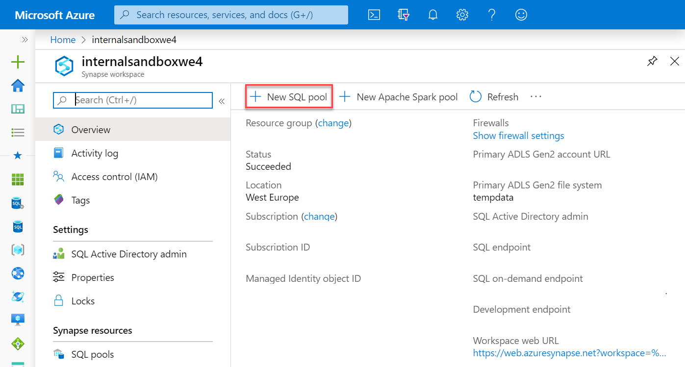
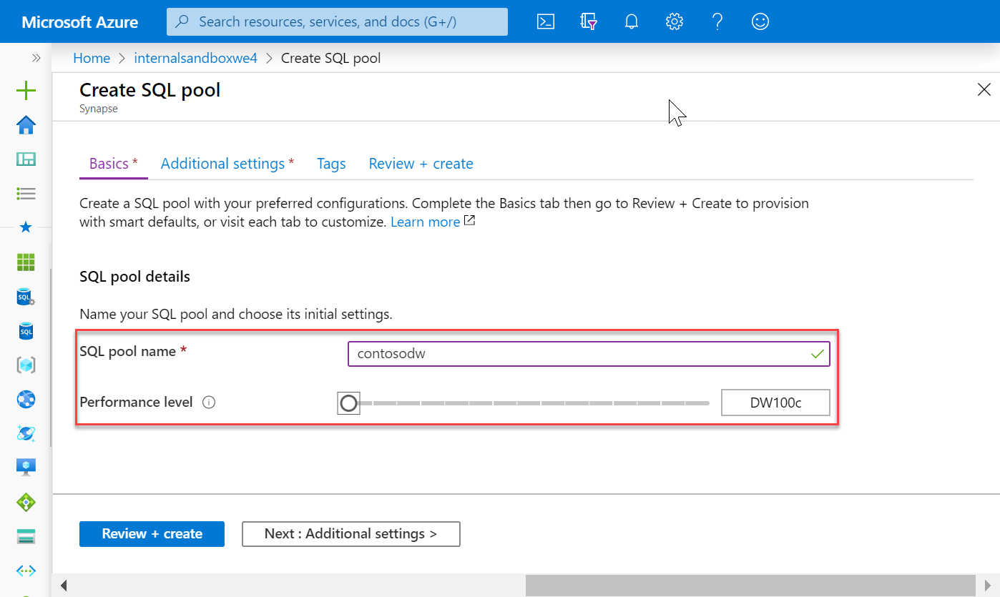
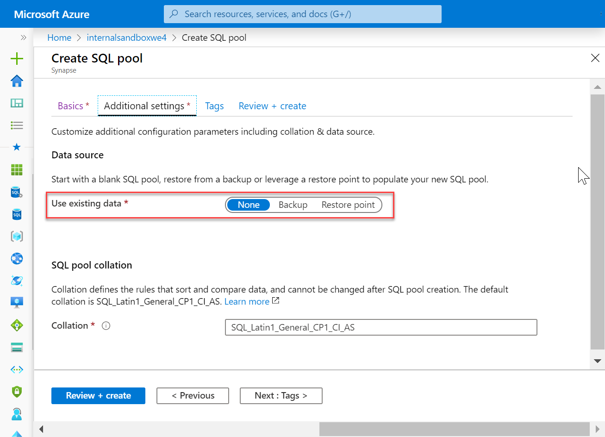
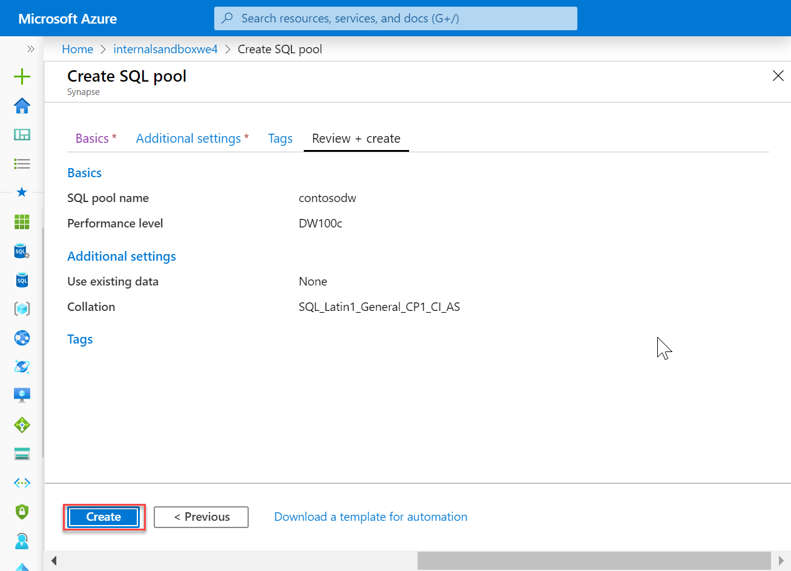
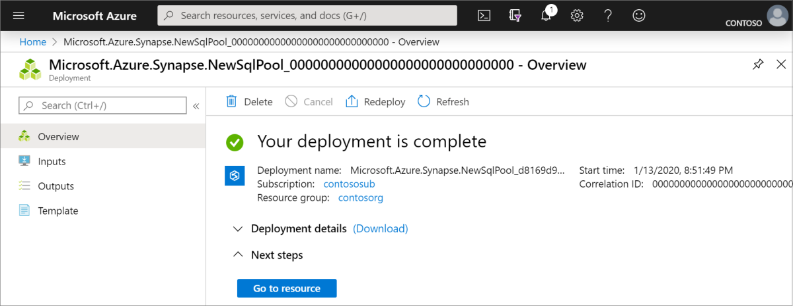
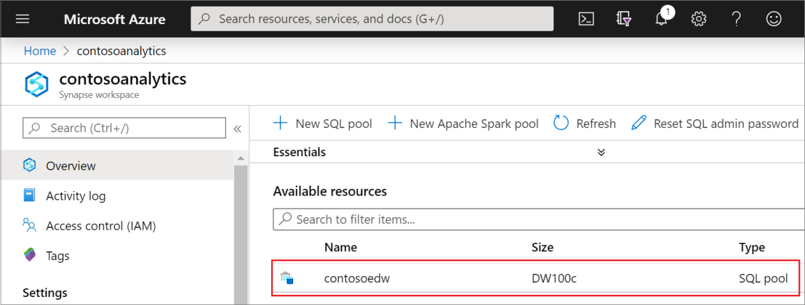

# Quickstart: Create a SQL pool 

Azure Synapse Analytics offers various analytics engines to help you ingest, transform, model, analyze, and serve your data. A SQL pool offers T-SQL based compute and storage capabilities. After creating a SQL pool in your Synapse Workspace, data can be loaded, modeled, processed, and served to obtain insights.  

This quickstart describes the steps to create a SQL pool in a Synapse Workspace by using the Azure portal.

If you don't have an Azure subscription, [create a free account before you begin](https://azure.microsoft.com/free/).

## Prerequisites

[Synapse Workspace](quickstart-create-workspace.md)

## Sign in to the Azure portal

Sign in to the [Azure portal](https://portal.azure.com/)

## Navigate to the Synapse Workspace

1. Navigate to the Synapse Workspace where the SQL pool will be created by typing the service name (or resource name directly) into the search bar:
.
1. From the list of workspaces, type the name (or part of the name) of the workspace to open. In this case, we will use a workspace named **contosoanalytics**

1. Select the **New SQL pool** command in the top bar.

1. Enter the following details in the **Basics** tab:

    | Setting | Suggested value | Description |
    | :------ | :-------------- | :---------- |
    | **SQL pool name** | contosoedw | Name of the SQL pool. |
    | **Performance level** | DW100c | Set to the smallest size to reduce costs for this quickstart |
    ||||
  
    
    > [!IMPORTANT]
    > Note that there are specific limitations for the names that SQL pools can use. Names can't contain special characters, must be 15 or less characters, not contain reserved words, and be unique in the workspace.

1. In the next tab (Additional settings), select **none** to provision the SQL pool without data. Leave the default collation selected.

1. We won't add any tags for now, so select **Next: Review + create**.

1. In the **Review + create** tab, make sure that the details look correct based on what was previously entered, and press **create**. 

1. At this point, the resource provisioning flow will start.
 

1. After the provisioning completes, navigating back to the workspace will show a new entry for the newly created SQL pool.
 

## Clean up resources

Follow the steps below to delete the SQL pool from the workspace.
> [!WARNING]
> Deleting a SQL pool will both remove the analytics engine and the data stored in the database of the deleted SQL pool from the workspace. It will no longer be possible to connect to the SQL pool, and all queries, pipelines, and notebooks that read or write to this SQL pool will no longer work.

If you want to delete the SQL pool, complete the following steps:

1. Navigate to the SQL pools blade in the workspace blade
1. Select the SQL pool to be deleted (in this case, **contosoedw**)
1. Select it and press **delete**.
1. Confirm the deletion, and press **Delete** button.
 
1. When the process completes successfully, the SQL pool will no longer be listed in the workspace resources. 

## Next steps

After the SQL pool is created, it will be available in the workspace for loading data, processing streams, reading from the lake, etc. 

See the other Azure Synapse quickstarts to get started using the SQL pool.
