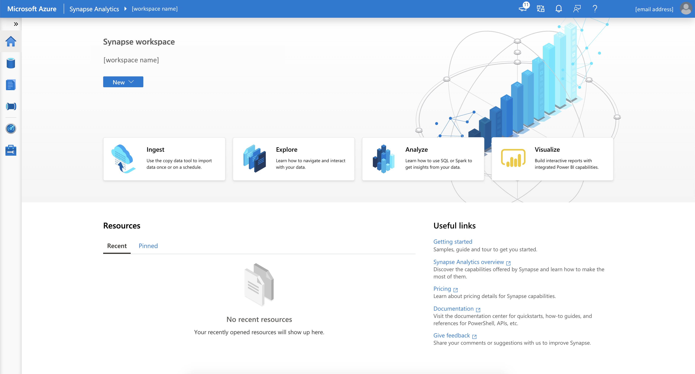

# Quickstart: Create an Azure synapse workspace with Azure CLI

The Azure CLI is Azure's command-line experience for managing Azure resources. You can use it in your browser with Azure Cloud Shell. You can also install it on macOS, Linux, or Windows and run it from the command line.

In this quickstart, you learn to create a Synapse workspace by using the Azure CLI.

[!INCLUDE [quickstarts-free-trial-note](../../includes/quickstarts-free-trial-note.md)]

## Prerequisites

- Download and install [jq](https://stedolan.github.io/jq/download/), a lightweight and flexible command-line JSON processor
- [Azure Data Lake Storage Gen2 storage account](../storage/common/storage-account-create.md)

    > [!IMPORTANT]
    > The Azure Synapse workspace needs to be able to read and write to the selected ADLS Gen2 account. In addition, for any storage account that you link as the primary storage account, you must have enabled **hierarchical namespace**  at the creation of the storage account, as described on the [Create a Storage Account](../storage/common/storage-account-create.md?tabs=azure-portal#create-a-storage-account) page. 

[!INCLUDE [azure-cli-prepare-your-environment.md](~/reusable-content/azure-cli/azure-cli-prepare-your-environment-no-header.md)]

## Create an Azure Synapse workspace using the Azure CLI

1. Define necessary environment variables to create resources for Azure Synapse workspace.

    | Environment Variable Name | Description |
    |---|---|---|
    |StorageAccountName| Name for your existing ADLS Gen2 storage account.|
    |StorageAccountResourceGroup| Name of your existing ADLS Gen2 storage account resource group. |
    |FileShareName| Name of your existing storage file system.|
    |SynapseResourceGroup| Choose a new name for your Azure Synapse resource group. |
    |Region| Choose one of the [Azure regions](https://azure.microsoft.com/global-infrastructure/geographies/#overview). |
    |SynapseWorkspaceName| Choose a unique name for your new Azure Synapse Workspace. |
    |SqlUser| Choose a value for a new username.|
    |SqlPassword| Choose a secure password.|
    |||

1. Create a resource group as a container for your Azure Synapse workspace:
    ```azurecli
    az group create --name $SynapseResourceGroup --location $Region
    ```

1. Create an Azure Synapse Workspace:
    ```azurecli
    az synapse workspace create \
      --name $SynapseWorkspaceName \
      --resource-group $SynapseResourceGroup \
      --storage-account $StorageAccountName \
      --file-system $FileShareName \
      --sql-admin-login-user $SqlUser \
      --sql-admin-login-password $SqlPassword \
      --location $Region
    ```

1. Get Web and Dev URL for Azure Synapse Workspace:
    ```azurecli
    WorkspaceWeb=$(az synapse workspace show --name $SynapseWorkspaceName --resource-group $SynapseResourceGroup | jq -r '.connectivityEndpoints | .web')

    WorkspaceDev=$(az synapse workspace show --name $SynapseWorkspaceName --resource-group $SynapseResourceGroup | jq -r '.connectivityEndpoints | .dev')
    ```

1. Create a Firewall Rule to allow your access to Azure Synapse Workspace from your machine:

    ```azurecli
    ClientIP=$(curl -sb -H "Accept: application/json" "$WorkspaceDev" | jq -r '.message')
    ClientIP=${ClientIP##'Client Ip address : '}
    echo "Creating a firewall rule to enable access for IP address: $ClientIP"

    az synapse workspace firewall-rule create --end-ip-address $ClientIP --start-ip-address $ClientIP --name "Allow Client IP" --resource-group $SynapseResourceGroup --workspace-name $SynapseWorkspaceName
    ```

1. Open the Azure Synapse Workspace Web URL address stored in environment variable `WorkspaceWeb` to access your workspace:

    ```azurecli
    echo "Open your Azure Synapse Workspace Web URL in the browser: $WorkspaceWeb"
    ```
    
    [  ](media/quickstart-create-synapse-workspace-cli/create-workspace-cli-1.png#lightbox)

1. Once deployed, additional permissions are required. 
- In the Azure portal, assign other users of the workspace to the **Contributor** role in the workspace. For detailed steps, see [Assign Azure roles using the Azure portal](../role-based-access-control/role-assignments-portal.md). 
- Assign other users the appropriate **[Synapse RBAC roles](security/synapse-workspace-synapse-rbac-roles.md)** using Synapse Studio.
- A member of the **Owner** role of the Azure Storage account must assign the **Storage Blob Data Contributor** role to the Azure Synapse workspace MSI and other users.

## Clean up resources

Follow the steps below to delete the Azure Synapse workspace.
> [!WARNING]
> Deleting an Azure Synapse workspace will remove the analytics engines and the data stored in the database of the contained SQL pools and workspace metadata. It will no longer be possible to connect to the SQL or Apache Spark endpoints. All code artifacts will be deleted (queries, notebooks, job definitions and pipelines).
>
> Deleting the workspace will **not** affect the data in the Data Lake Store Gen2 linked to the workspace.

If you want to delete the Azure Synapse workspace, complete the following command:

```azurecli
az synapse workspace delete --name $SynapseWorkspaceName --resource-group $SynapseResourceGroup
```

## Next steps

Next, you can [create SQL pools](quickstart-create-sql-pool-studio.md) or [create Apache Spark pools](quickstart-create-apache-spark-pool-studio.md) to start analyzing and exploring your data.
