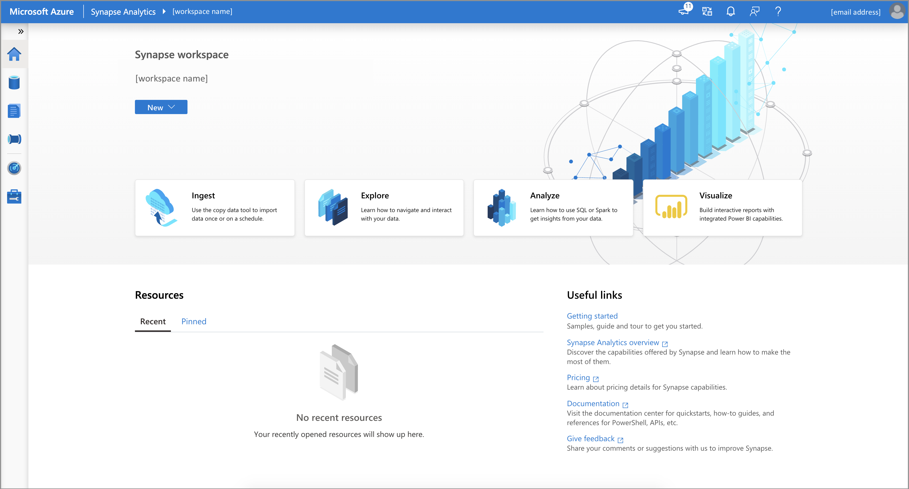

# Quickstart: Create an Azure synapse workspace with Azure PowerShell

Azure PowerShell is a set of cmdlets for managing Azure resources directly from PowerShell. You can
use it in your browser with Azure Cloud Shell. You can also install it on macOS, Linux, or Windows.

In this quickstart, you learn to create a Synapse workspace using Azure PowerShell.

If you don't have an Azure subscription, create a [free](https://azure.microsoft.com/free/) account
before you begin.

## Prerequisites

- [Azure Data Lake Storage Gen2 storage account](../storage/common/storage-account-create.md)

    > [!IMPORTANT]
    > The Azure Synapse workspace needs to be able to read and write to the selected ADLS Gen2
    > account. For any storage account that you link as the primary storage account, you must enable
    > **hierarchical namespace** at the creation of the storage account as described in
    > [Create a storage account](../storage/common/storage-account-create.md?tabs=azure-powershell#create-a-storage-account).

If you choose to use Cloud Shell, see
[Overview of Azure Cloud Shell](../cloud-shell/overview.md) for more
information.

### Install the Azure PowerShell module locally

If you choose to use PowerShell locally, this article requires that you install the Az PowerShell
module and connect to your Azure account using the
[Connect-AzAccount](/powershell/module/az.accounts/connect-azaccount) cmdlet. For more information
about installing the Az PowerShell module, see
[Install Azure PowerShell](/powershell/azure/install-az-ps).

For more information about authentication with Azure PowerShell, see [Sign in with Azure PowerShell](/powershell/azure/authenticate-azureps).

### Install the Azure Synapse PowerShell module

> [!IMPORTANT]
> While the **Az.Synapse** PowerShell module is in preview, you must install it separately using
> the `Install-Module` cmdlet. After this PowerShell module becomes generally available, it will be
> part of future Az PowerShell module releases and available by default from within Azure Cloud
> Shell.

```azurepowershell-interactive
Install-Module -Name Az.Synapse
```

## Create an Azure Synapse workspace using Azure PowerShell

1. Define necessary environment variables to create resources for Azure Synapse workspace.

   |        Variable name        |                                                 Description                                                 |
   | --------------------------- | ----------------------------------------------------------------------------------------------------------- |
   | StorageAccountName          | Name for your existing ADLS Gen2 storage account.                                                           |
   | StorageAccountResourceGroup | Name of your existing ADLS Gen2 storage account resource group.                                             |
   | FileShareName               | Name of your existing storage file system.                                                                  |
   | SynapseResourceGroup        | Choose a new name for your Azure Synapse resource group.                                                    |
   | Region                      | Choose one of the [Azure regions](https://azure.microsoft.com/global-infrastructure/geographies/#overview). |
   | SynapseWorkspaceName        | Choose a unique name for your new Azure Synapse Workspace.                                                  |
   | SqlUser                     | Choose a value for a new username.                                                                          |
   | SqlPassword                 | Choose a secure password.                                                                                   |
   | ClientIP                    | Public IP Address of the system you're running PowerShell from.                                             |
   |                             |                                                                                                             |

1. Create a resource group as a container for your Azure Synapse workspace:

   ```azurepowershell-interactive
   New-AzResourceGroup -Name $SynapseResourceGroup -Location $Region
   ```

1. Create an Azure Synapse Workspace:

   ```azurepowershell-interactive
   $Cred = New-Object -TypeName System.Management.Automation.PSCredential ($SqlUser, (ConvertTo-SecureString $SqlPassword -AsPlainText -Force))

   $WorkspaceParams = @{
     Name = $SynapseWorkspaceName
     ResourceGroupName = $SynapseResourceGroup
     DefaultDataLakeStorageAccountName = $StorageAccountName
     DefaultDataLakeStorageFilesystem = $FileShareName
     SqlAdministratorLoginCredential = $Cred
     Location = $Region
   }
   New-AzSynapseWorkspace @WorkspaceParams
   ```

1. Get Web and Dev URL for Azure Synapse Workspace:

   ```azurepowershell-interactive
   $WorkspaceWeb = (Get-AzSynapseWorkspace -Name $SynapseWorkspaceName -ResourceGroupName $StorageAccountResourceGroup).ConnectivityEndpoints.Web
   $WorkspaceDev = (Get-AzSynapseWorkspace -Name $SynapseWorkspaceName -ResourceGroupName $StorageAccountResourceGroup).ConnectivityEndpoints.Dev
   ```

1. Create a Firewall Rule to allow your access to Azure Synapse Workspace from your machine:

   ```azurepowershell-interactive
   $FirewallParams = @{
     WorkspaceName = $SynapseWorkspaceName
     Name = 'Allow Client IP'
     ResourceGroupName = $StorageAccountResourceGroup
     StartIpAddress = $ClientIP
     EndIpAddress = $ClientIP
   }
   New-AzSynapseFirewallRule @FirewallParams
   ```

1. Open the Azure Synapse Workspace Web URL address stored in environment variable `WorkspaceWeb` to
   access your workspace:

   ```azurepowershell-interactive
   Start-Process $WorkspaceWeb
   ```

   

## Clean up resources

Follow the steps below to delete the Azure Synapse workspace.

> [!WARNING]
> Deleting an Azure Synapse workspace will remove the analytics engines and the data stored in the
> database of the contained SQL pools and workspace metadata. It will no longer be possible to
> connect to the SQL or Apache Spark endpoints. All code artifacts will be deleted (queries,
> notebooks, job definitions and pipelines). Deleting the workspace will **not** affect the data in
> the Data Lake Store Gen2 linked to the workspace.

If the Azure Synapse workspace created in this article isn't needed, you can delete it by running
the following example.

```azurepowershell-interactive
Remove-AzSynapseWorkspace -Name $SynapseWorkspaceNam -ResourceGroupName $SynapseResourceGroup
```

## Next steps

Next, you can [create SQL pools](quickstart-create-sql-pool-studio.md) or
[create Apache Spark pools](quickstart-create-apache-spark-pool-studio.md) to start analyzing and
exploring your data.