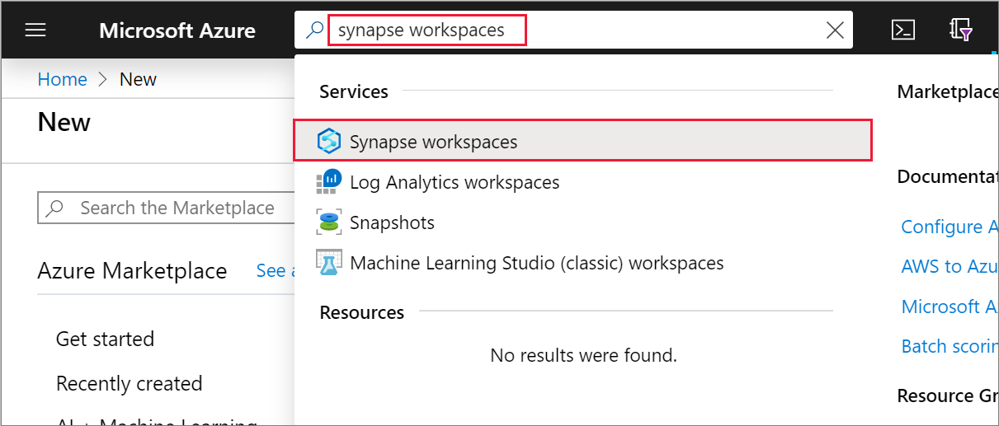
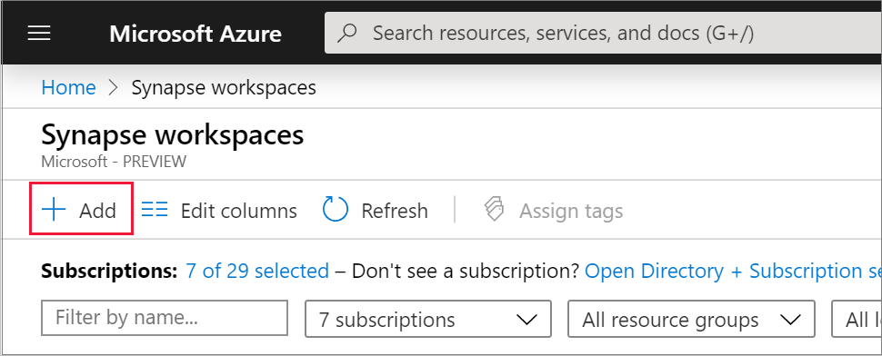
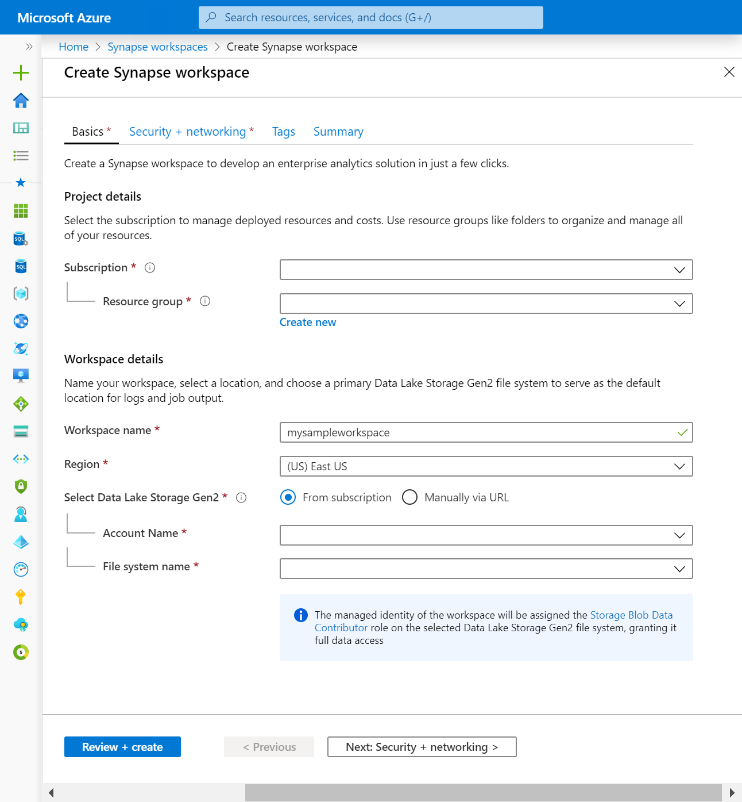
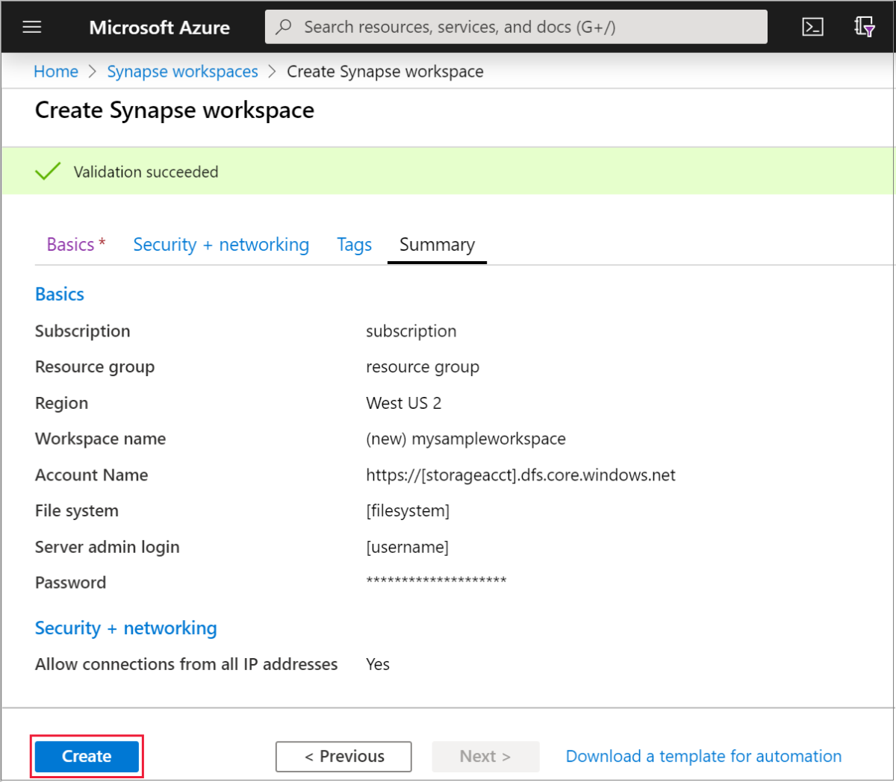
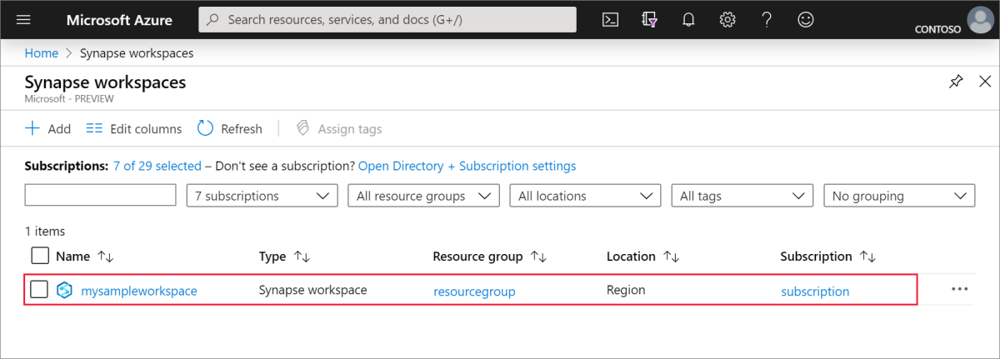
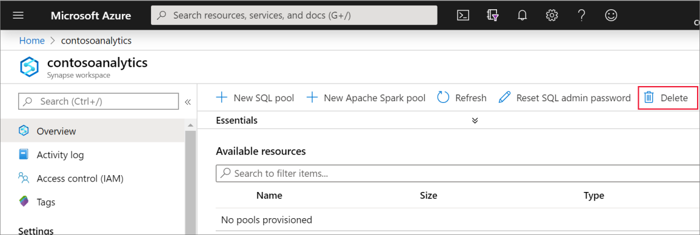
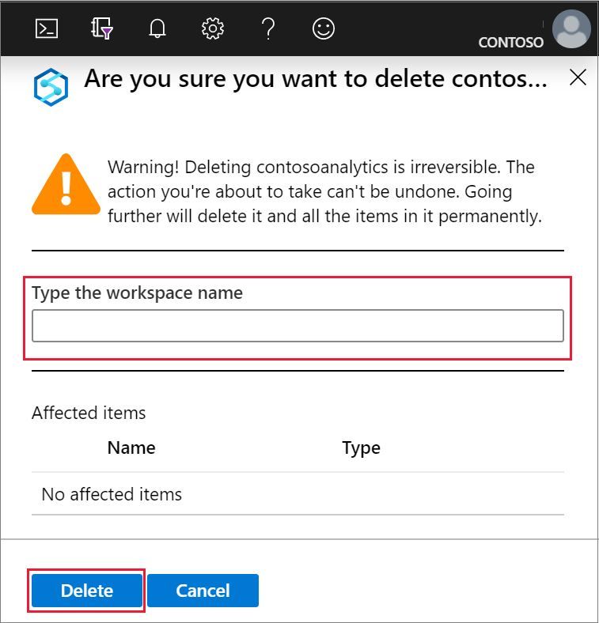

# Quickstart: Create a Synapse workspace

This quickstart describes the steps to create an Azure Synapse workspace by using the Azure portal.

If you don't have an Azure subscription, [create a free account before you begin](https://azure.microsoft.com/free/).

## Prerequisites

- [Azure Data Lake Storage Gen2 storage account](../storage/common/storage-account-create.md?toc=/azure/synapse-analytics/toc.json&bc=/azure/synapse-analytics/breadcrumb/toc.json)

## Sign in to the Azure portal

Sign in to the [Azure portal](https://portal.azure.com/)

## Create an Azure Synapse workspace using the Azure portal

1. In the Microsoft Azure search pane, enter **Synapse workspace** and then select this service.

2. On the **Synapse workspaces** page, click **+ Add**.

3. Fill out the **Azure Synapse workspace** form with the following information:

    | Setting | Suggested value | Description |
    | :------ | :-------------- | :---------- |
    | **Subscription** | *Your subscription* | For details about your subscriptions, see [Subscriptions](https://account.windowsazure.com/Subscriptions). |
    | **Resource group** | *Any resource group* | For valid resource group names, see [Naming rules and restrictions](/azure/architecture/best-practices/resource-naming?toc=/azure/synapse-analytics/toc.json&bc=/azure/synapse-analytics/breadcrumb/toc.json&view=azure-sqldw-latest). |
    | **Workspace name** | mysampleworkspace | Specifies the name of the workspace, which will also be used for connection endpoints.|
    | **Region** | East US2 | Specifies the location of the workspace.|
    | **Data Lake Storage Gen2** | Account: `storage account name`   File system: `root file system to use` | Specifies the ADLS Gen2 storage account name to use as primary storage and the file system to use.|
    ||||

    

    The storage account can be selected from:
    - A list of ADLS Gen2 accounts available in your subscription
    - Entered manually using the account name

    > [!IMPORTANT]
    > The Azure Synapse workspace needs to be able to read and write to the selected ADLS Gen2 account. In addition, for any storage account that you link as the primary storage account, you must have enabled **hierarchical namespace**  at the creation of the storage account.
    >
    > Below the ADLS Gen2 selection fields, there is a note saying that the managed identity of the workspace will be assigned the **Storaqe Blob Data Contributor** role on the selected Data Lake Storage Gen2 file system granting it full access.

4. (Optional) Modify any of the **Security + networking defaults** tab:
5. (Optional) Add any tags in the **Tags** tab.
6. The **Summary** tab will run the necessary validations to ensure that the workspace can be successfully created. Once the validation succeeds, press **Create** 
7. Once the resource provisioning process completes successfully, you'll see an entry for the created workspace in the list of Synapse workspaces. 

## Clean up resources

Follow the steps below to delete the Azure Synapse workspace.
> [!WARNING]
> Deleting a Azure Synapse workspace will remove the analytics engines and the data stored in the database of the contained SQL pools and workspace metadata. It will no longer be possible to connect to the SQL endpoints, Apache Spark endpoints. All code artifacts will be deleted (queries, notebooks, job definitions and pipelines).
>
> Deleting the workspace will **not** affect the data in the Data Lake Store Gen2 linked to the workspace.

If you want to delete the Azure Synapse workspace, complete the following steps:

1. Navigate to the Azure Synapse workspace to delete.
1. Press **delete** on the command bar.
 
1. Confirm the deletion, and press the **Delete** button.
 
1. When the process completes successfully, the Azure Synapse workspace will no longer be listed in the list of workspaces.

## Next steps

Next, you can [create SQL pools](quickstart-create-sql-pool-studio.md) or [create Apache Spark pools](quickstart-create-apache-spark-pool-studio.md) to start analyzing and exploring your data.
