# Quickstart: Transform data using mapping data flows

In this quickstart, you'll use Azure Synapse Analytics to create a pipeline that transforms data from an Azure Data Lake Storage Gen2 (ADLS Gen2) source to an ADLS Gen2 sink using mapping data flow. The configuration pattern in this quickstart can be expanded upon when transforming data using mapping data flow

In this quickstart, you do the following steps:

> [!div class="checklist"]
> * Create a pipeline with a Data Flow activity in Azure Synapse Analytics.
> * Build a mapping data flow with four transformations.
> * Test run the pipeline.
> * Monitor a Data Flow activity

## Prerequisites

* **Azure subscription**: If you don't have an Azure subscription, create a [free account](https://azure.microsoft.com/free/) before you begin.
* **Azure Synapse workspace**: Create a Synapse workspace using the Azure portal following the instructions in [Quickstart: Create a Synapse workspace](quickstart-create-workspace.md).
* **Azure storage account**: You use ADLS storage as *source* and *sink* data stores. If you don't have a storage account, see [Create an Azure storage account](../storage/common/storage-account-create.md) for steps to create one.

    The file that we are transforming in this tutorial is MoviesDB.csv, which can be found [here](https://raw.githubusercontent.com/djpmsft/adf-ready-demo/master/moviesDB.csv). To retrieve the file from GitHub, copy the contents to a text editor of your choice to save locally as a .csv file. To upload the file to your storage account, see [Upload blobs with the Azure portal](../storage/blobs/storage-quickstart-blobs-portal.md). The examples will be referencing a container named 'sample-data'.

### Navigate to the Synapse Studio

After your Azure Synapse workspace is created, you have two ways to open Synapse Studio:

* Open your Synapse workspace in the [Azure portal](https://ms.portal.azure.com/#home). Select **Open** on the Open Synapse Studio card under Getting started.
* Open [Azure Synapse Analytics](https://web.azuresynapse.net/) and sign in to your workspace.

In this quickstart, we use the workspace named "adftest2020" as an example. It will automatically navigate you to the Synapse Studio home page.


## Create a pipeline with a Data Flow activity

A pipeline contains the logical flow for an execution of a set of activities. In this section, you'll create a pipeline that contains a Data Flow activity.

1. Go to the **Integrate** tab. Select on the plus icon next to the pipelines header and select Pipeline.

   

1. In the **Properties** settings page of the pipeline, enter **TransformMovies** for **Name**.

1. Under *Move and Transform* in the *Activities* pane, drag **Data flow** onto the pipeline canvas.

1. In the **Adding data flow** page pop-up, select **Create new data flow** -> **Data flow**. Click **OK** when done.

   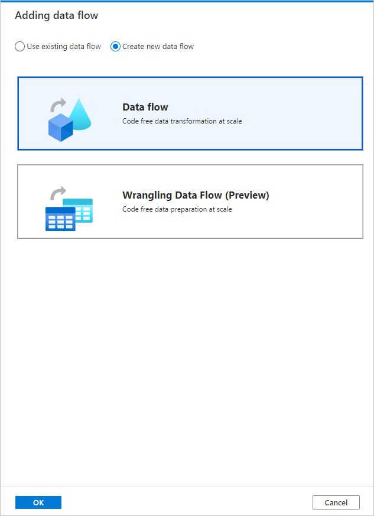

1. Name your data flow **TransformMovies** on the **Properties** page.

## Build transformation logic in the data flow canvas

Once you create your Data Flow, you'll be automatically sent to the data flow canvas. In this step, you'll build a data flow that takes the MoviesDB.csv in ADLS storage and aggregates the average rating of comedies from 1910 to 2000. You'll then write this file back to the ADLS storage.

1. Above the data flow canvas, slide the **Data flow debug** slider on. Debug mode allows for interactive testing of transformation logic against a live Spark cluster. Data Flow clusters take 5-7 minutes to warm up and users are recommended to turn on debug first if they plan to do Data Flow development. For more information, see [Debug Mode](../data-factory/concepts-data-flow-debug-mode.md?bc=%2fazure%2fsynapse-analytics%2fbreadcrumb%2ftoc.json&toc=%2fazure%2fsynapse-analytics%2ftoc.json).

    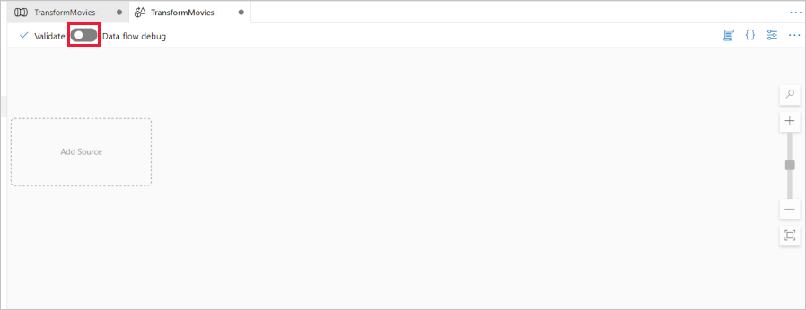

1. In the data flow canvas, add a source by clicking on the **Add Source** box.

1. Name your source **MoviesDB**. Click on **New** to create a new source dataset.

    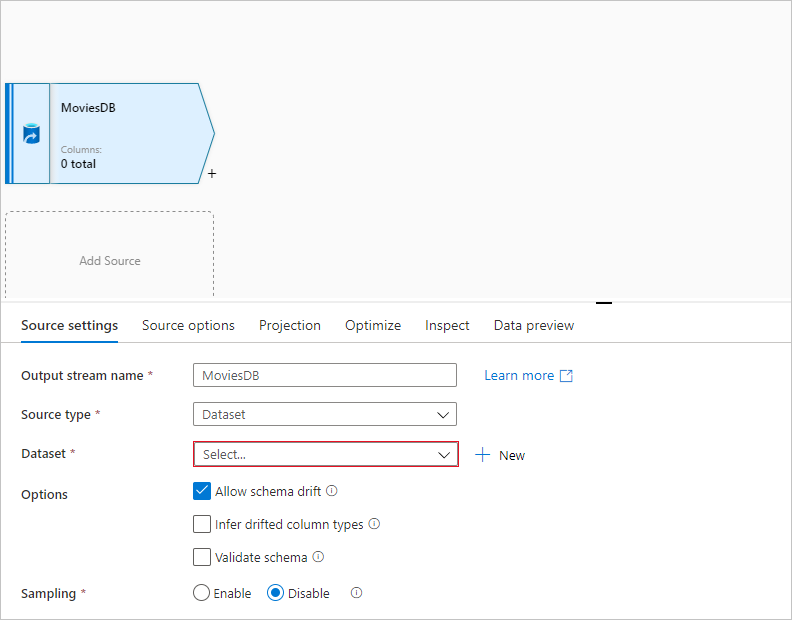

1. Choose **Azure Data Lake Storage Gen2**. Click Continue.

    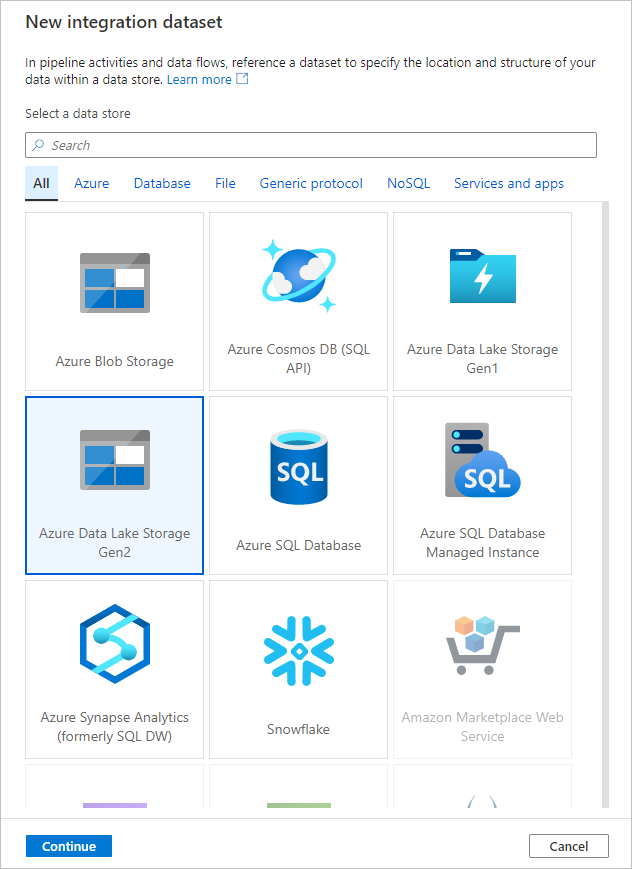

1. Choose **DelimitedText**. Click Continue.

1. Name your dataset **MoviesDB**. In the linked service dropdown, choose **New**.

1. In the linked service creation screen, name your ADLS Gen2 linked service **ADLSGen2** and specify your authentication method. Then enter your connection credentials. In this quickstart, we're using Account key to connect to our storage account. You can click **Test connection** to verify your credentials were entered correctly. Click **Create** when finished.

    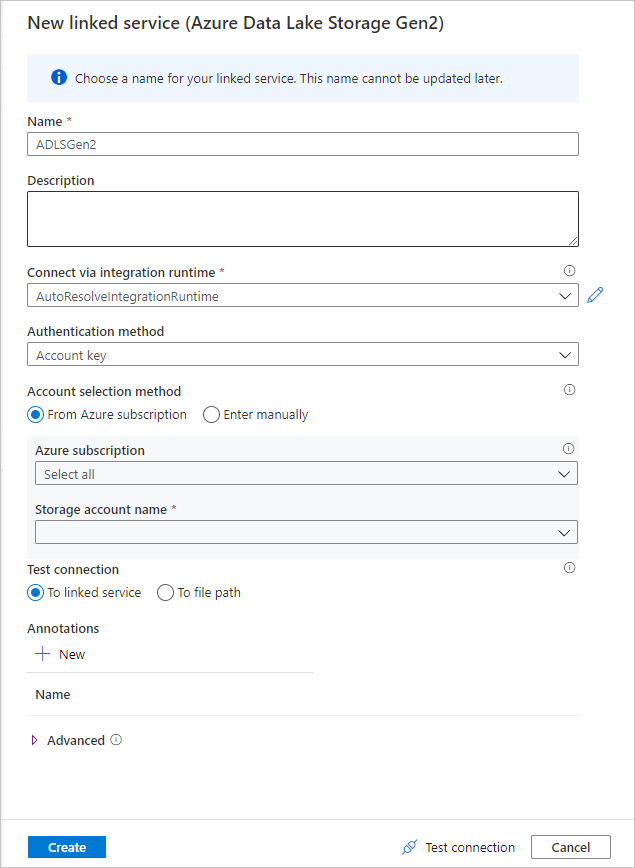

1. Once you're back at the dataset creation screen, under the **File path** field, enter where your file is located. In this quickstart, the file "MoviesDB.csv" is located in container "sample-data". As the file has headers, check **First row as header**. Select **From connection/store** to import the header schema directly from the file in storage. Click **OK** when done.

    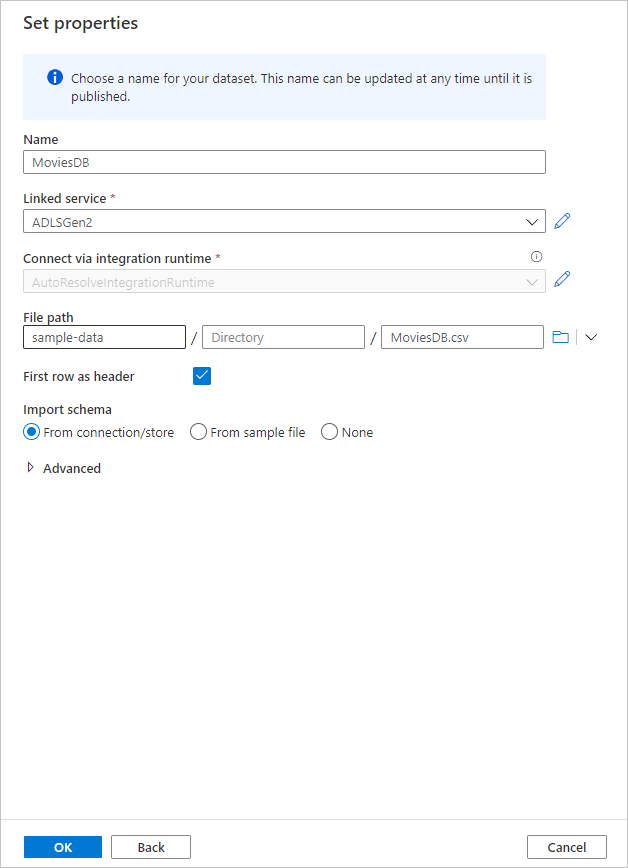

1. If your debug cluster has started, go to the **Data Preview** tab of the source transformation and click **Refresh** to get a snapshot of the data. You can use data preview to verify your transformation is configured correctly.

    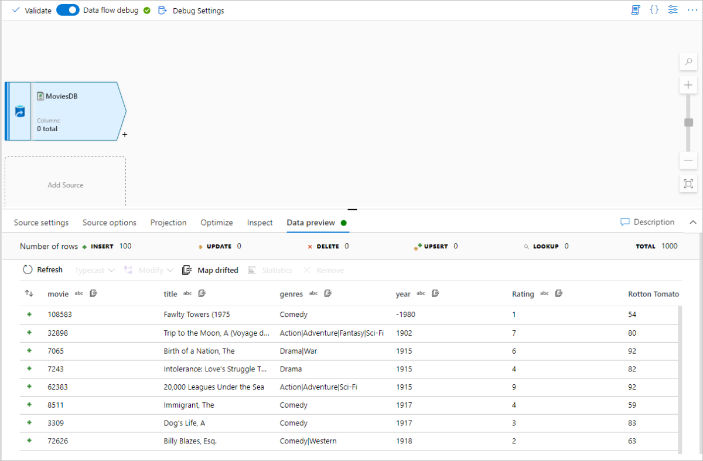

1. Next to your source node on the data flow canvas, click on the plus icon to add a new transformation. The first transformation you're adding is a **Filter**.

    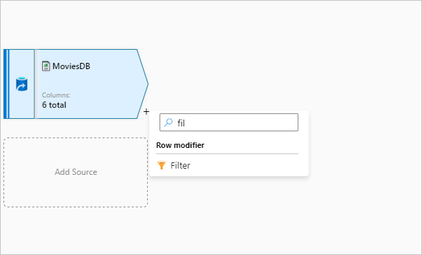

1. Name your filter transformation **FilterYears**. Click on the expression box next to **Filter on** to open the expression builder. Here you'll specify your filtering condition.

1. The data flow expression builder lets you interactively build expressions to use in various transformations. Expressions can include built-in functions, columns from the input schema, and user-defined parameters. For more information on how to build expressions, see [Data Flow expression builder](../data-factory/concepts-data-flow-expression-builder.md?bc=%2fazure%2fsynapse-analytics%2fbreadcrumb%2ftoc.json&toc=%2fazure%2fsynapse-analytics%2ftoc.json).

    In this quickstart, you want to filter movies of genre comedy that came out between the years 1910 and 2000. As year is currently a string, you need to convert it to an integer using the ```toInteger()``` function. Use the greater than or equals to (>=) and less than or equals to (<=) operators to compare against literal year values 1910 and 200-. Union these expressions together with the and (&&) operator. The expression comes out as:

    ```toInteger(year) >= 1910 && toInteger(year) <= 2000```

    To find which movies are comedies, you can use the ```rlike()``` function to find pattern 'Comedy' in the column genres. Union the rlike expression with the year comparison to get:

    ```toInteger(year) >= 1910 && toInteger(year) <= 2000 && rlike(genres, 'Comedy')```

    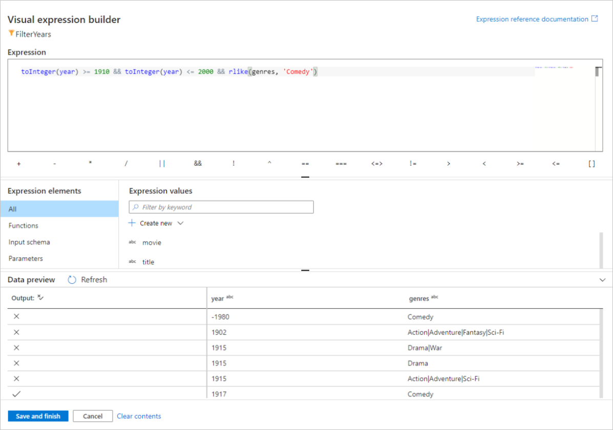

    If you've a debug cluster active, you can verify your logic by clicking **Refresh** to see expression output compared to the inputs used. There's more than one right answer on how you can accomplish this logic using the data flow expression language.

    Click **Save and Finish** once you're done with your expression.

1. Fetch a **Data Preview** to verify the filter is working correctly.

1. The next transformation you'll add is an **Aggregate** transformation under **Schema modifier**.

    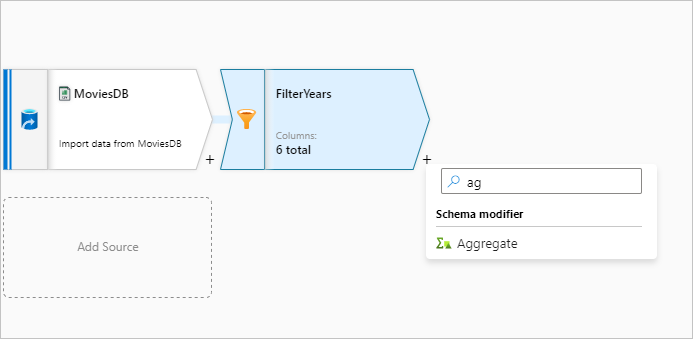

1. Name your aggregate transformation **AggregateComedyRatings**. In the **Group by** tab, select **year** from the dropdown to group the aggregations by the year the movie came out.

    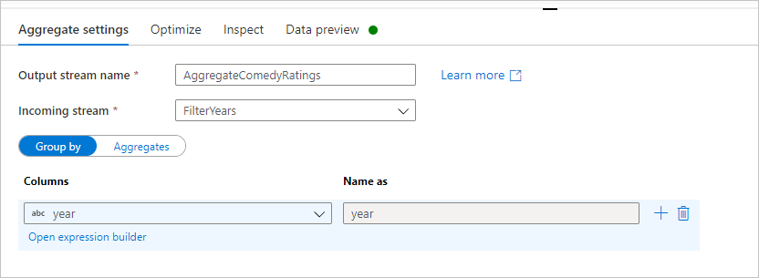

1. Go to the **Aggregates** tab. In the left text box, name the aggregate column **AverageComedyRating**. Click on the right expression box to enter the aggregate expression via the expression builder.

    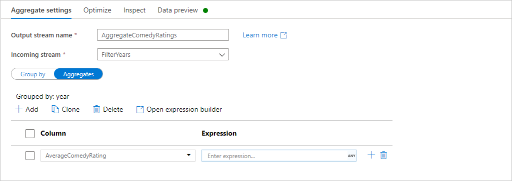

1. To get the average of column **Rating**, use the ```avg()``` aggregate function. As **Rating** is a string and ```avg()``` takes in a numerical input, we must convert the value to a number via the ```toInteger()``` function. This expression looks like:

    ```avg(toInteger(Rating))```

    Click **Save and Finish** when done.

    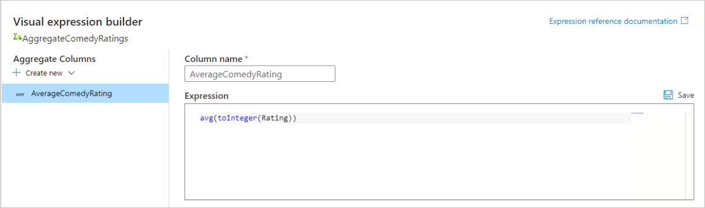

1. Go to the **Data Preview** tab to view the transformation output. Notice only two columns are there, **year** and **AverageComedyRating**.

    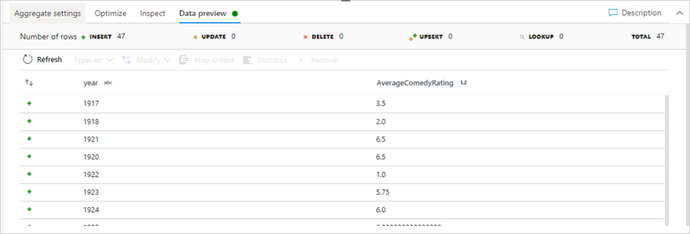

1. Next, you want to add a **Sink** transformation under **Destination**.

    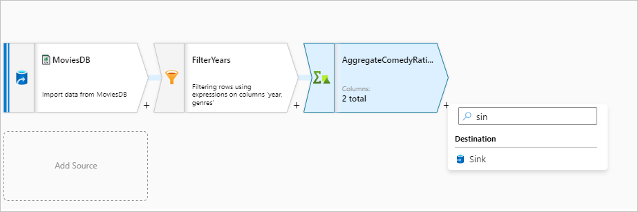

1. Name your sink **Sink**. Click **New** to create your sink dataset.

1. Choose **Azure Data Lake Storage Gen2**. Click Continue.

1. Choose **DelimitedText**. Click Continue.

1. Name your sink dataset **MoviesSink**. For linked service, choose the ADLS Gen2 linked service you created in step 7. Enter an output folder to write your data to. In this quickstart, we're writing to folder 'output' in container 'sample-data'. The folder doesn't need to exist beforehand and can be dynamically created. Set **First row as header** as true and select **None** for **Import schema**. Click **OK** when done.

    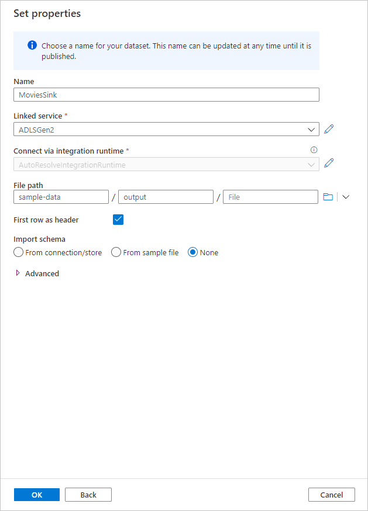

Now you've finished building your data flow. You're ready to run it in your pipeline.

## Running and monitoring the Data Flow

You can debug a pipeline before you publish it. In this step, you're going to trigger a debug run of the data flow pipeline. While data preview doesn't write data, a debug run will write data to your sink destination.

1. Go to the pipeline canvas. Click **Debug** to trigger a debug run.

    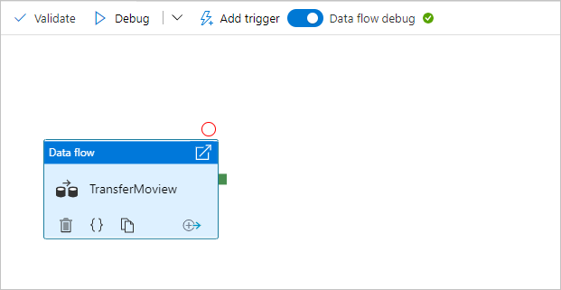

1. Pipeline debug of Data Flow activities uses the active debug cluster but still take at least a minute to initialize. You can track the progress via the **Output** tab. Once the run is successful, click on the eyeglasses icon to open the monitoring pane.

    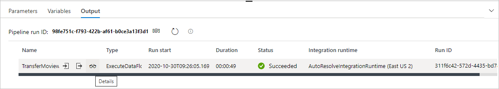

1. In the monitoring pane, you can see the number of rows and time spent in each transformation step.

    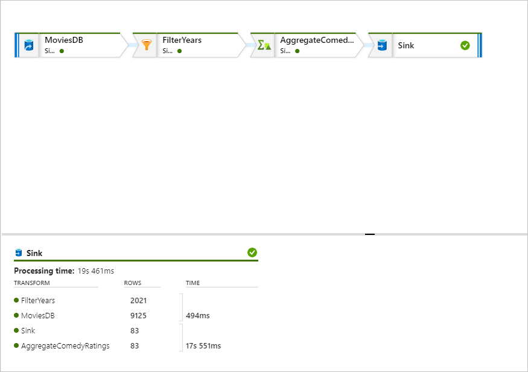

1. Click on a transformation to get detailed information about the columns and partitioning of the data.

    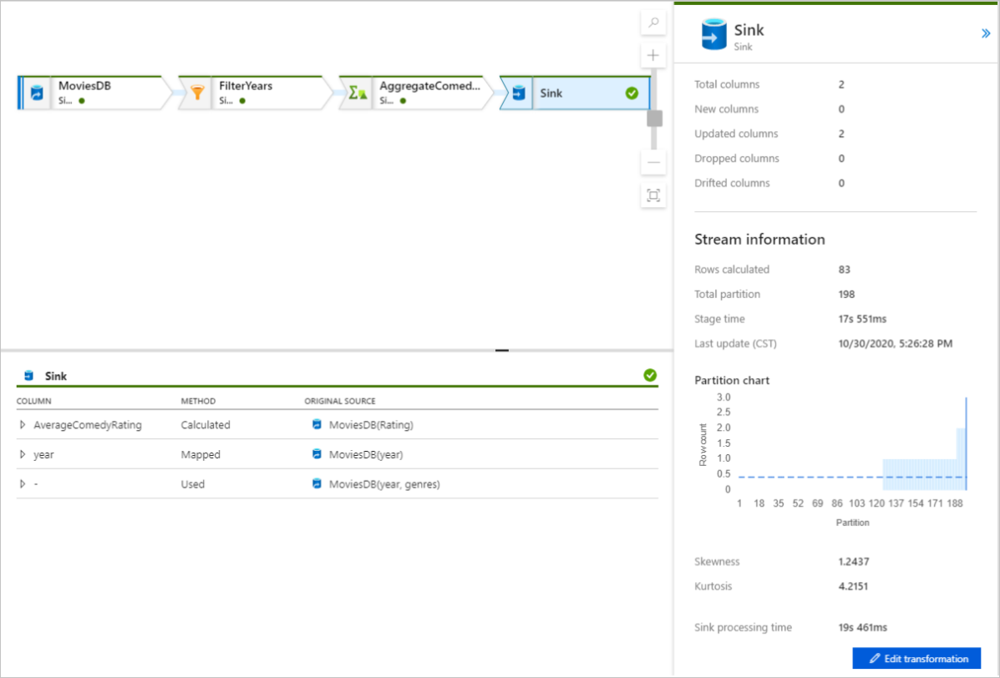

If you followed this quickstart correctly, you should have written 83 rows and 2 columns into your sink folder. You can verify the data by checking your blob storage.


## Next steps

Advance to the following articles to learn about Azure Synapse Analytics support:

> [!div class="nextstepaction"]
> [Pipeline and activities](../data-factory/concepts-pipelines-activities.md?bc=%2fazure%2fsynapse-analytics%2fbreadcrumb%2ftoc.json&toc=%2fazure%2fsynapse-analytics%2ftoc.json)
> [Mapping data flow overview](../data-factory/concepts-data-flow-overview.md?bc=%2fazure%2fsynapse-analytics%2fbreadcrumb%2ftoc.json&toc=%2fazure%2fsynapse-analytics%2ftoc.json)
> [Data flow expression language](../data-factory/data-flow-expression-functions.md?bc=%2fazure%2fsynapse-analytics%2fbreadcrumb%2ftoc.json&toc=%2fazure%2fsynapse-analytics%2ftoc.json)