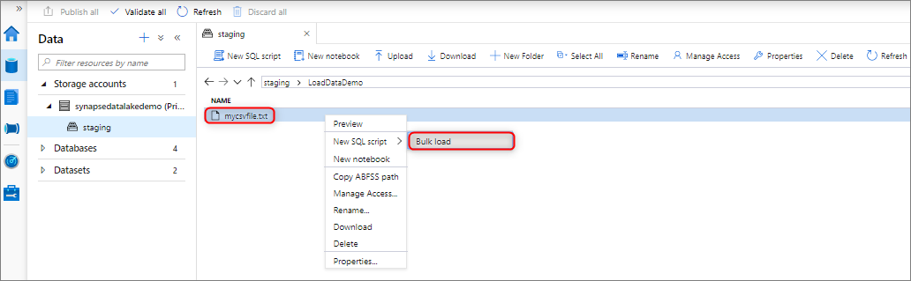
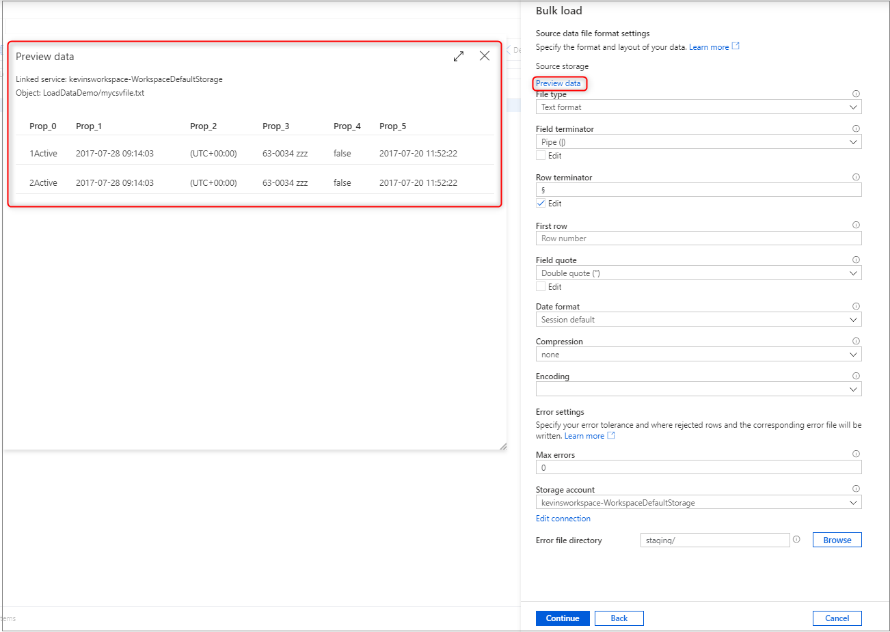
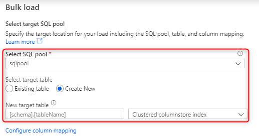
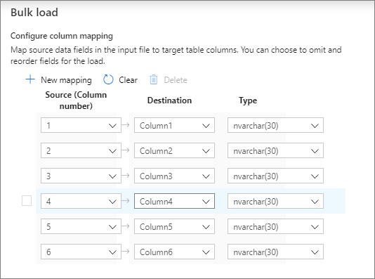
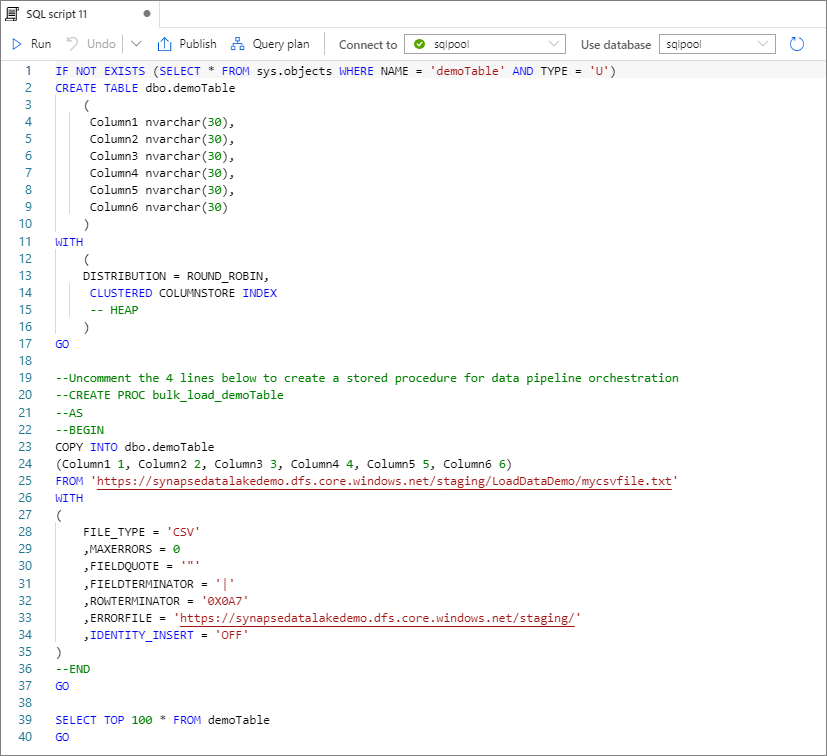

# Quickstart: Bulk loading with Synapse Studio

Loading data is easy with the Bulk Load wizard in Synapse Studio. Synapse Studio is a feature of Azure Synapse Analytics. The Bulk Load wizard guides you through creating a T-SQL script with the [COPY statement](/sql/t-sql/statements/copy-into-transact-sql?view=azure-sqldw-latest&preserve-view=true) to bulk load data into a dedicated SQL pool. 

## Entry points to the Bulk Load wizard

You can bulk load data by right-clicking the following area within Synapse Studio: a file or folder from an Azure storage account that's attached to your workspace.

## Prerequisites

- The wizard generates a COPY statement, which uses Microsoft Entra pass-through for authentication. Your [Microsoft Entra user must have access](./sql-data-warehouse/quickstart-bulk-load-copy-tsql-examples.md#d-azure-active-directory-authentication) to the workspace with at least the Storage Blob Data Contributor Azure role for the Azure Data Lake Storage Gen2 account. 

- You must have the required [permissions to use the COPY statement](/sql/t-sql/statements/copy-into-transact-sql?view=azure-sqldw-latest&preserve-view=true#permissions) and Create Table permissions if you're creating a new table to load to.

- The linked service associated with the Data Lake Storage Gen2 account *must have access to the file or folder* to load. For example, if the authentication mechanism for the linked service is a managed identity, the workspace's managed identity must have at least Storage Blob Data Reader permission on the storage account.

- If a virtual network is enabled on your workspace, make sure the integrated runtime associated with the Data Lake Storage Gen2 account's linked services for the source data and error file location has interactive authoring enabled. Interactive authoring is required for autoschema detection, previewing the source file contents, and browsing Data Lake Storage Gen2 storage accounts within the wizard.

## Steps

1. On the **Source storage location** panel, select the storage account and the file or folder you're loading from. The wizard automatically tries to detect Parquet files and delimited text (CSV) files, including mapping the source fields from the file to the appropriate target SQL data types. 

   

2. Select the file format settings, including your error settings for when there are rejected rows during the bulk load process. You can also select **Preview data** to see how the COPY statement will parse the file to help you configure the file format settings. Select **Preview data** every time you change a file format setting, to see how the COPY statement will parse the file with the updated setting.

    

   > [!NOTE]  
   >
   > - The Bulk Load wizard doesn't support previewing the data with multi-character field terminators. When you specify a multi-character field terminator, the wizard will preview the data within a single column. 
   > - When you select **Infer column names**, the Bulk Load wizard will parse the columns names from the first row specified by the **First row** field. The Bulk Load wizard will automatically increment the `FIRSTROW` value in the COPY statement by 1 to ignore this header row. 
   > - Specifying multi-character row terminators is supported in the COPY statement. However, the Bulk Load wizard doesn't support it and will throw an error.

3. Select the dedicated SQL pool that you're using to load, including whether the load will be for an existing table or a new table.
   
4. Select **Configure column mapping** to make sure you have the appropriate column mapping. Note columns names will be detected automatically if you enabled **Infer column names**. For new tables, configuring the column mapping is critical for updating the target column data types.

   
5. Select **Open script**. A T-SQL script is generated with the COPY statement to load from your data lake.
   

## Next steps

- Check the [COPY statement](/sql/t-sql/statements/copy-into-transact-sql?view=azure-sqldw-latest&preserve-view=true#syntax) article for more information on COPY capabilities.
- Check the [data loading overview](./sql-data-warehouse/design-elt-data-loading.md#what-is-elt) article for information about using an extract, transform, and load (ETL) process.
