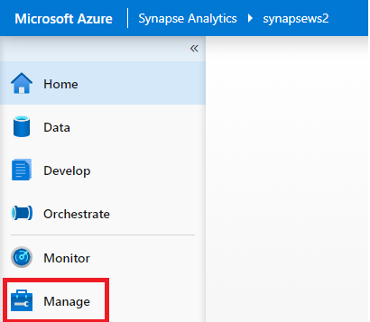
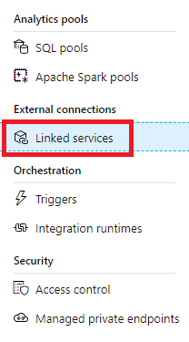
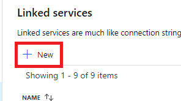
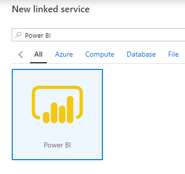
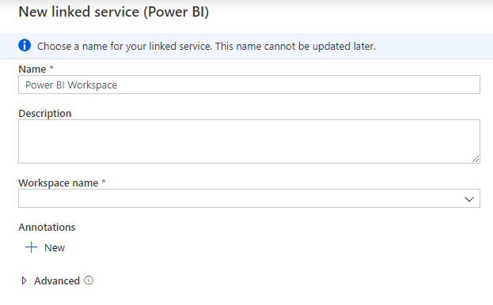
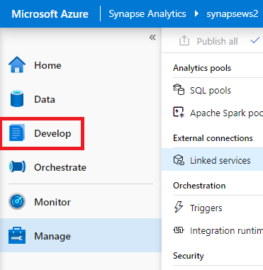
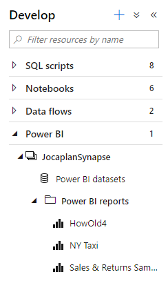
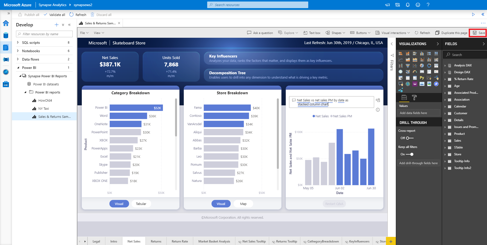

# Quickstart: Linking a Power BI workspace to a Synapse workspace

In this quickstart, you will learn how to connect a Power BI workspace to an Azure Synapse Analytics workspace to create new Power BI reports and datasets from Synapse Studio.

If you don't have an Azure subscription, [create a free account before you begin](https://azure.microsoft.com/free/).

## Prerequisites

- [Create an Azure Synapse workspace and associated storage account](quickstart-create-workspace.md)
- [A Power BI Professional or Premium workspace](/power-bi/service-create-the-new-workspaces)

## Link Power BI workspace to your Synapse workspace

1. Starting from Synapse Studio, click **Manage**.

    

2. Under **External Connections**, click **Linked services**.

    

3. Click **+ New**.

    

4. Click **Power BI** and click **Continue**.

    

5. Enter a name for the linked service and select a workspace from the dropdown list.

    

6. Click **Create**.

## View Power BI workspace in Synapse Studio

Once your workspaces are linked, you can browse your Power BI datasets, edit/create new Power BI Reports from Synapse Studio.

1. Click **Develop**.

    

2. Expand Power BI and the workspace you wish to use.

    

New reports can be created clicking **+** at the top of the **Develop** tab. Existing reports can be edited by clicking on the report name. Any saved changes will be written back to the Power BI workspace.

## Next steps

Learn more about [creating Power BI report on files stored on Azure Storage](sql/tutorial-connect-power-bi-desktop.md).
