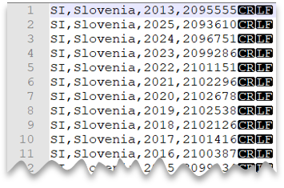

# Quickstart: Use SQL on-demand

Synapse SQL on-demand  (preview) is a serverless query service that enables you to run SQL queries on files placed in Azure Storage. In this quickstart, you'll learn how to query various types of files using SQL on-demand. Supported formats are listed in [OPENROWSET](sql/develop-openrowset.md).

This quickstart shows querying: CSV, Apache Parquet, and JSON files.

## Prerequisites

Choose a SQL client to issue queries:

- [Azure Synapse Studio](quickstart-synapse-studio.md) is a web tool that you can use to browse files in storage and create SQL queries.
- [Azure Data Studio](sql/get-started-azure-data-studio.md) is a client tool that enables you to run SQL queries and notebooks on your On-demand database.
- [SQL Server Management Studio](sql/get-started-ssms.md) is a client tool that enables you to run SQL queries on your On-demand database.

Parameters for this quickstart:

| Parameter                                 | Description                                                   |
| ----------------------------------------- | ------------------------------------------------------------- |
| SQL on-demand service endpoint address    | Used as server name                                   |
| SQL on-demand service endpoint region     | Used to determine what storage will we use in samples |
| Username and password for endpoint access | Used to access endpoint                               |
| The database used to create views         | Database used as starting point in samples       |

## First-time setup

Before using the samples:

- Create database for your views (in case you want to use views)
- Create credentials to be used by SQL on-demand to access files in storage

### Create database

Create your own database for demo purposes. You'll use this database to create your views and for the sample queries in this article.

> [!NOTE]
> The databases are used only for view metadata, not for actual data.
>Write down database name you use for use later in the Quickstart.

Use the following query, changing `mydbname` to a name of your choice:

```sql
CREATE DATABASE mydbname
```

### Create data source

To run queries using SQL on-demand, create data source that SQL on-demand can use use to access files in storage.
Execute the following code snippet to create data source used in samples in this section:

```sql
-- create master key that will protect the credentials:
CREATE MASTER KEY ENCRYPTION BY PASSWORD = <enter very strong password here>

-- create credentials for containers in our demo storage account
CREATE DATABASE SCOPED CREDENTIAL sqlondemand
WITH IDENTITY='SHARED ACCESS SIGNATURE',  
SECRET = 'sv=2018-03-28&ss=bf&srt=sco&sp=rl&st=2019-10-14T12%3A10%3A25Z&se=2061-12-31T12%3A10%3A00Z&sig=KlSU2ullCscyTS0An0nozEpo4tO5JAgGBvw%2FJX2lguw%3D'
GO
CREATE EXTERNAL DATA SOURCE SqlOnDemandDemo WITH (
    LOCATION = 'https://sqlondemandstorage.blob.core.windows.net',
    CREDENTIAL = sqlondemand
);
```

## Query CSV files

The following image is a preview of the file to be queried:



The following query shows how to read a CSV file that doesn't contain a header row, with Windows-style new line, and comma-delimited columns:

```sql
SELECT TOP 10 *
FROM OPENROWSET
  (
      BULK 'csv/population/*.csv',
      DATA_SOURCE = 'SqlOnDemandDemo',
      FORMAT = 'CSV', PARSER_VERSION = '2.0'
  )
WITH
  (
      country_code VARCHAR (5)
    , country_name VARCHAR (100)
    , year smallint
    , population bigint
  ) AS r
WHERE
  country_name = 'Luxembourg' AND year = 2017
```

You can specify schema at query compilation time.
For more examples, see how to [query CSV file](sql/query-single-csv-file.md).

## Query Parquet files

The following sample shows the automatic schema inference capabilities for querying Parquet files. It returns the number of rows in September of 2017 without specifying schema.

> [!NOTE]
> You do not have to specify columns in `OPENROWSET WITH` clause when reading Parquet files. In that case, SQL on-demand utilizes metadata in the Parquet file and binds columns by name.

```sql
SELECT COUNT_BIG(*)
FROM OPENROWSET
  (
      BULK 'parquet/taxi/year=2017/month=9/*.parquet',
      DATA_SOURCE = 'SqlOnDemandDemo',
      FORMAT='PARQUET'
  ) AS nyc
```

Find more information about [querying parquet files](sql/query-parquet-files.md).

## Query JSON files

### JSON sample file

Files are stored in *json* container, folder *books*, and contain single book entry with following structure:

```json
{  
   "_id":"ahokw88",
   "type":"Book",
   "title":"The AWK Programming Language",
   "year":"1988",
   "publisher":"Addison-Wesley",
   "authors":[  
      "Alfred V. Aho",
      "Brian W. Kernighan",
      "Peter J. Weinberger"
   ],
   "source":"DBLP"
}
```

### Query JSON files

The following query shows how to use [JSON_VALUE](/sql/t-sql/functions/json-value-transact-sql?toc=/azure/synapse-analytics/toc.json&bc=/azure/synapse-analytics/breadcrumb/toc.json&view=azure-sqldw-latest) to retrieve scalar values (title, publisher) from a book with the title *Probabilistic and Statistical Methods in Cryptology, An Introduction by Selected articles*:

```sql
SELECT
    JSON_VALUE(jsonContent, '$.title') AS title
  , JSON_VALUE(jsonContent, '$.publisher') as publisher
  , jsonContent
FROM OPENROWSET
  (
      BULK 'json/books/*.json',
      DATA_SOURCE = 'SqlOnDemandDemo'
    , FORMAT='CSV'
    , FIELDTERMINATOR ='0x0b'
    , FIELDQUOTE = '0x0b'
    , ROWTERMINATOR = '0x0b'
  )
WITH
  ( jsonContent varchar(8000) ) AS [r]
WHERE
  JSON_VALUE(jsonContent, '$.title') = 'Probabilistic and Statistical Methods in Cryptology, An Introduction by Selected Topics'
```

> [!IMPORTANT]
> We are reading the entire JSON file as single row/column. So, FIELDTERMINATOR, FIELDQUOTE, and ROWTERMINATOR are set to 0x0b because we do not expect to find it in the file.

## Next steps

You're now ready to continue on with the following articles:

- [Query single CSV file](sql/query-single-csv-file.md)
- [Query folders and multiple CSV files](sql/query-folders-multiple-csv-files.md)
- [Query specific files](sql/query-specific-files.md)
- [Query Parquet files](sql/query-parquet-files.md)
- [Query Parquet nested types](sql/query-parquet-nested-types.md)
- [Query JSON files](sql/query-json-files.md)
- [Creating and using views](sql/create-use-views.md)
- [Creating and using external tables](sql/create-use-external-tables.md)
- [Persist query result to Azure storage](sql/create-external-table-as-select.md)
- [Query single CSV file](sql/query-single-csv-file.md)
