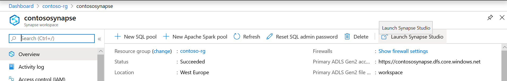
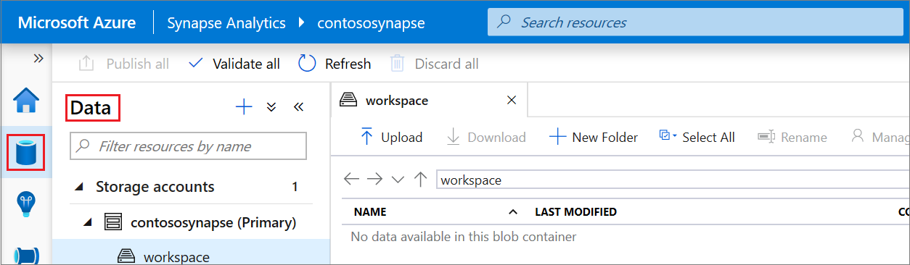
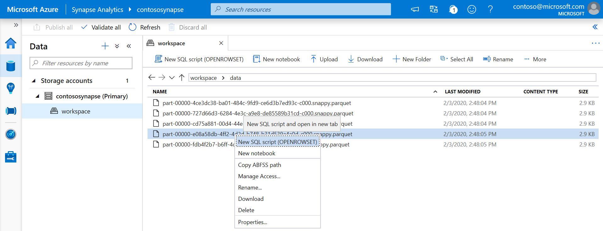
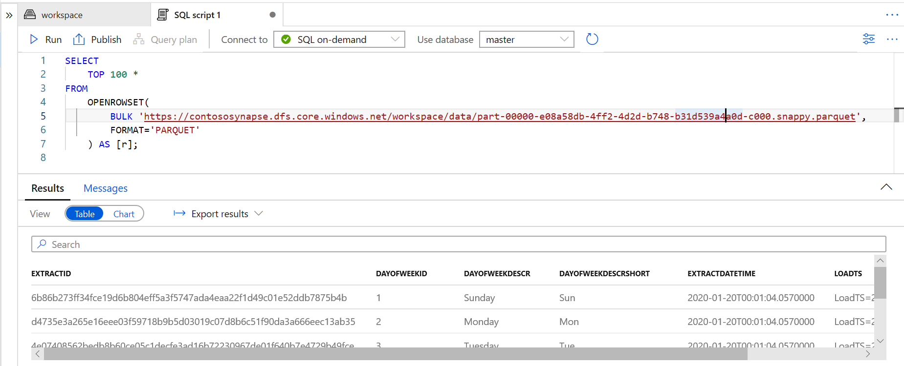

# Quickstart: Use Synapse Studio (preview)

In this quickstart, you'll learn how to query files using Synapse Studio.

If you don't have an Azure subscription, create a [free](https://azure.microsoft.com/free/) account before you begin.

## Sign in to the Azure portal

Sign in to the [Azure portal](https://portal.azure.com/).

## Prerequisites

[Create an Azure Synapse workspace and associated storage account](quickstart-create-workspace.md).

## Launch Synapse Studio

In your Azure Synapse workspace in the Azure portal, click **Launch Synapse Studio**.

Alternatively, you can launch Synapse Studio by clicking [Azure Synapse Analytics](https://web.azuresynapse.net) and providing the appropriate tenant, subscription, and workspace values.

## Browse storage accounts

Once you open Synapse Studio, browse to **Data** and then expand **Storage accounts** to view the storage account in the workspace.

You can create new folders and upload files using the links in toolbar to organize your files.

## Query files on storage account

> [!IMPORTANT]
> You need to be a member of the `Storage Blob Reader` role on the underlying storage in order to be able to query the files. Learn how to [assign **Storage Blob Data Reader** or **Storage Blob Data Contributor** RBAC permissions on Azure Storage](../storage/common/storage-auth-aad-rbac-portal.md?toc=/azure/synapse-analytics/toc.json&bc=/azure/synapse-analytics/breadcrumb/toc.json#assign-a-built-in-rbac-role).

1. Upload some `PARQUET` files.
2. Select one or more files and then create a new SQL script or a Spark notebook to see the content of the files. If you want to create a notebook, you would need to create an [Apache Spark pool in Synapse workspaces](quickstart-create-apache-spark-pool-studio.md).

   

3. Run the generated query or notebook to see the content of the file.

   

4. You can change the query to filter and sort results. Find language features that are available in SQL on-demand in [SQL features overview](sql/overview-features.md).

## Next steps

- Enable Azure AD users to query files [by assigning **Storage Blob Data Reader** or **Storage Blob Data Contributor** RBAC permissions on Azure Storage](../storage/common/storage-auth-aad-rbac-portal.md?toc=/azure/synapse-analytics/toc.json&bc=/azure/synapse-analytics/breadcrumb/toc.json#assign-a-built-in-rbac-role)
- [Query files on Azure Storage using SQL On-Demand](sql/on-demand-workspace-overview.md)
- [Create Apache Spark pool using Azure portal](quickstart-create-apache-spark-pool-portal.md)
- [Create Power BI report on files stored on Azure Storage](sql/tutorial-connect-power-bi-desktop.md)
