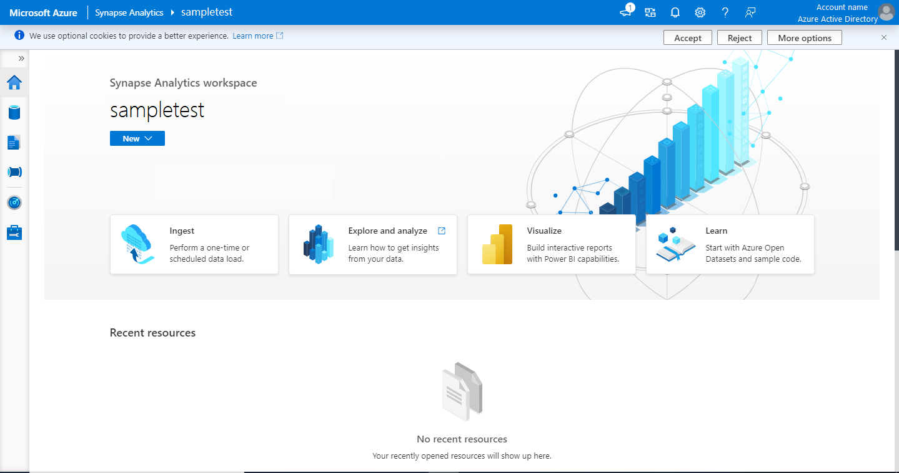
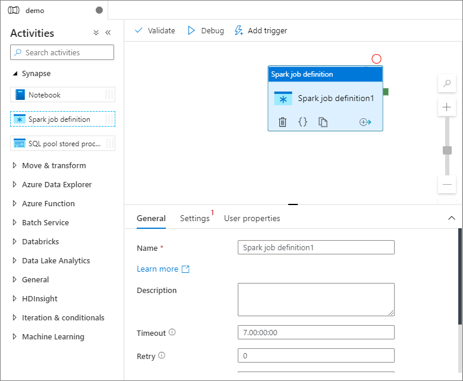
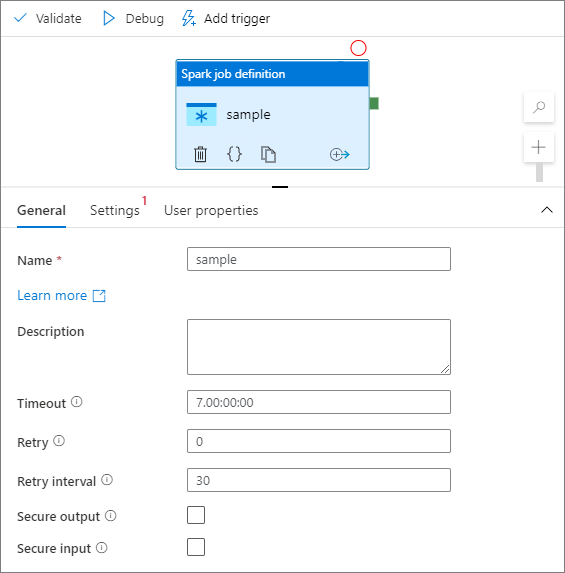
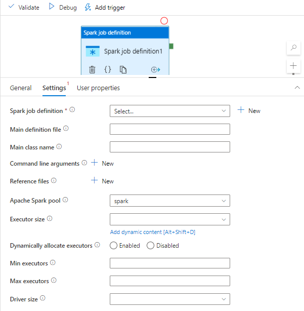
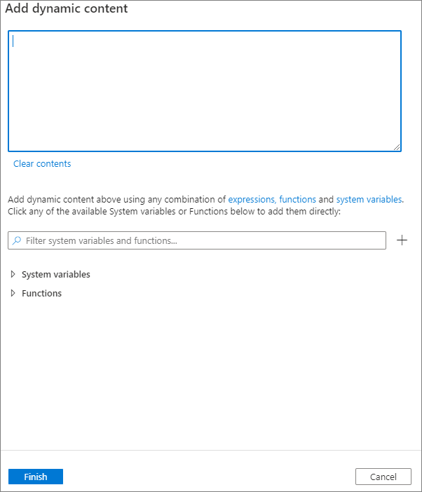
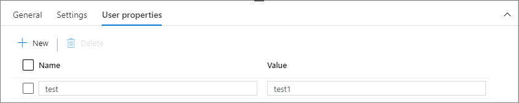

# Quickstart: Transform data using Apache Spark job definition

In this quickstart, you'll use Azure Synapse Analytics to create a pipeline using Apache Spark job definition.

## Prerequisites

* **Azure subscription**: If you don't have an Azure subscription, create a [free Azure account](https://azure.microsoft.com/free/) before you begin.
* **Azure Synapse workspace**: Create a Synapse workspace using the Azure portal following the instructions in [Quickstart: Create a Synapse workspace](quickstart-create-workspace.md).
* **Apache Spark job definition**: Create an Apache Spark job definition in the Synapse workspace following the instructions in [Tutorial: Create Apache Spark job definition in Synapse Studio](spark/apache-spark-job-definitions.md).

### Navigate to the Synapse Studio

After your Azure Synapse workspace is created, you have two ways to open Synapse Studio:

* Open your Synapse workspace in the [Azure portal](https://portal.azure.com). Select **Open** on the Open Synapse Studio card under **Getting started**.
* Open [Azure Synapse Analytics](https://web.azuresynapse.net/) and sign in to your workspace.

In this quickstart, we use the workspace named "sampletest" as an example. It will automatically navigate you to the Synapse Studio home page.

## Create a pipeline with an Apache Spark job definition

A pipeline contains the logical flow for an execution of a set of activities. In this section, you'll create a pipeline that contains an Apache Spark job definition activity.

1. Go to the **Integrate** tab. Select the plus icon next to the pipelines header and select **Pipeline**.

     

2. In the **Properties** settings page of the pipeline, enter **demo** for **Name**.

3. Under **Synapse** in the **Activities** pane, drag **Spark job definition** onto the pipeline canvas.

     

## Set Apache Spark job definition canvas

Once you create your Apache Spark job definition, you'll be automatically sent to the Spark job definition canvas.

### General settings

1. Select the spark job definition module on the canvas.

2. In the **General** tab, enter **sample** for **Name**.

3. (Option) You can also enter a description.

4. Timeout: Maximum amount of time an activity can run. Default is seven days, which is also the maximum amount of time allowed. Format is in D.HH:MM:SS.

5. Retry: Maximum number of retry attempts.

6. Retry interval: The number of seconds between each retry attempt.

7. Secure output: When checked, output from the activity won't be captured in logging.

8. Secure input: When checked, input from the activity won't be captured in logging.

     

### Settings tab 

On this panel, you can reference to the Spark job definition to run.

* Expand the Spark job definition list, you can choose an existing Apache Spark job definition. You can also create a new Apache Spark job definition by selecting the **New** button to reference the Spark job definition to be run.

* (Optional) You can fill in information for Apache Spark job definition. If the following settings are empty, the settings of the spark job definition itself will be used to run; if the following settings are not empty, these settings will replace the settings of the spark job definition itself. 
     
     |  Property   | Description   |  
     | ----- | ----- |  
     |Main definition file| The main file used for the job. Select a PY/JAR/ZIP file from your storage. You can select **Upload file** to upload the file to a storage account.   Sample: `abfss://…/path/to/wordcount.jar`|
     | References from subfolders | Scanning subfolders from the root folder of the main definition file, these files will be added as reference files. The folders named "jars", "pyFiles", "files" or "archives" will be scanned, and the folders name are case sensitive. |
     |Main class name| The fully qualified identifier or the main class that is in the main definition file.   Sample: `WordCount`|
     |Command-line arguments| You can add command-line arguments by clicking the **New** button. It should be noted that adding command-line arguments will override the command-line arguments defined by the Spark job definition.   *Sample: `abfss://…/path/to/shakespeare.txt` `abfss://…/path/to/result`*   |
     |Apache Spark pool| You can select Apache Spark pool from the list.|
     |Python code reference| Additional Python code files used for reference in the main definition file.   It supports passing files (.py, .py3, .zip) to the "pyFiles" property. It will override the "pyFiles" property defined in Spark job definition.  |
     |Reference files | Additional files used for reference in the main definition file. |
     |Dynamically allocate executors| This setting maps to the dynamic allocation property in Spark configuration for Spark Application executors allocation.|
     |Min executors| Min number of executors to be allocated in the specified Spark pool for the job.|
     |Max executors| Max number of executors to be allocated in the specified Spark pool for the job.|
     |Driver size| Number of cores and memory to be used for driver given in the specified Apache Spark pool for the job.|
     |Spark configuration| Specify values for Spark configuration properties listed in the topic: Spark Configuration - Application properties. Users can use default configuration and customized configuration. |
     
     

* You can add dynamic content by clicking the **Add Dynamic Content** button or by pressing the shortcut key <kbd>Alt</kbd>+<kbd>Shift</kbd>+<kbd>D</kbd>. In the **Add Dynamic Content** page, you can use any combination of expressions, functions, and system variables to add to dynamic content.

     

### User properties tab

You can add properties for Apache Spark job definition activity in this panel.

## Next steps

Advance to the following articles to learn about Azure Synapse Analytics support:

> [!div class="nextstepaction"]
> [Pipeline and activities](../data-factory/concepts-pipelines-activities.md?toc=%2fazure%2fsynapse-analytics%2ftoc.json)
> [Mapping data flow overview](../data-factory/concepts-data-flow-overview.md?toc=%2fazure%2fsynapse-analytics%2ftoc.json)
> [Data flow expression language](../data-factory/data-flow-expression-functions.md?toc=%2fazure%2fsynapse-analytics%2ftoc.json)
