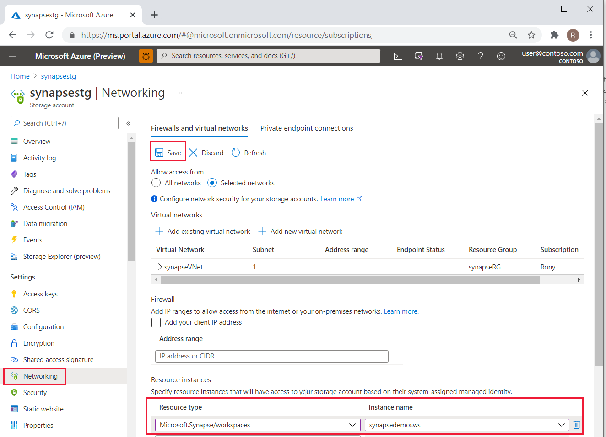

# Connect to a secure Azure storage account from your Synapse workspace

This article will teach you how to connect to a secure Azure storage account from your Azure Synapse workspace. You can link an Azure storage account to your Synapse workspace when you create your workspace. You can link more storage accounts after you create your workspace.

## Secured Azure storage accounts
Azure storage provides a layered security model that enables you to secure and control access to your storage accounts. You can configure IP firewall rules to grant traffic from selected public IP address ranges access to your storage account. You can also configure network rules to grant traffic from selected virtual networks access to your storage account. You can combine IP firewall rules that allow access from selected IP address ranges and network rules that grant access from selected virtual networks on the same storage account. These rules apply to the public endpoint of a storage account. You do not need any access rules to allow traffic from Managed private endpoints created in your workspace to a storage account. Storage firewall rules can be applied to existing storage accounts, or to new storage accounts when you create them. You can learn more about securing your storage account [here](../../storage/common/storage-network-security.md).

## Synapse workspaces and virtual networks
When you create a Synapse workspace, you can choose to enable a Managed virtual network to be associated with it. If you do not enable Managed virtual network for your workspace when you create it, your workspace is in a shared virtual network along with other Synapse workspaces that do not have a Managed virtual network associated with it. If you enabled Managed virtual network when you created the workspace, then your workspace is associated with a dedicated virtual network managed by Azure Synapse. These virtual networks are not created in your customer subscription. Therefore, you will not be able to grant traffic from these virtual networks access to your secured storage account using network rules described above.  

## Access a secured storage account
Synapse operates from networks that cannot be included in your network rules. The following needs to be done to enable access from your workspace to your secure storage account.

* Create an Azure Synapse workspace with a managed virtual network associated with it and create managed private endpoints from it to the secure storage account. 

    If you use Azure Portal to create your workspace, you can enable managed virtual network under the **Networking** tab as shown below. If you enable managed virtual network or Synapse determines that the  primary storage account is a secure storage account, then you have the option to create a managed private endpoint connection request to the secure storage account as shown below. The storage account owner will need to approve the connection request to establish the private link. Alternatively, Synapse will approve this connection request if the user creating an Apache Spark pool in the workspace has sufficient privileges to approve the connection request.
 
    

* Grant your Azure Synapse workspace access to your secure storage account as a trusted Azure service. As a trusted service, Azure Synapse will then use strong authentication to securely connect to your storage account.   

### Create a Synapse workspace with a managed virtual network and create managed private endpoints to your storage account
You can follow [these steps](./synapse-workspace-managed-vnet.md) to create a Synapse workspace that has a managed virtual network associated with it. Once the workspace with an associated managed virtual network is created, you can create a managed private endpoint to your secure storage account by following the steps listed [here](./how-to-create-managed-private-endpoints.md). 

### Grant your Azure Synapse workspace access to your secure storage account as a trusted Azure service
Analytic capabilities such as Dedicated SQL pool and Serverless SQL pool use multi-tenant infrastructure that is not deployed into the managed virtual network. In order for traffic from these capabilities to access the secured storage account, you must configure access to your storage account based on the workspace's system-assigned managed identity by following the steps below.

In Azure portal, navigate to your secured storage account. Select **Networking** from the left navigation pane. In the **Resource instances** section, select *Microsoft.Synapse/workspaces* as the **Resource type** and enter your workspace name for **Instance name**. Select **Save**.

You should now be able to access your secured storage account from the workspace.

## Next steps

Learn more about [Managed workspace virtual network](./synapse-workspace-managed-vnet.md).

Learn more about [Managed private endpoints](./synapse-workspace-managed-private-endpoints.md).