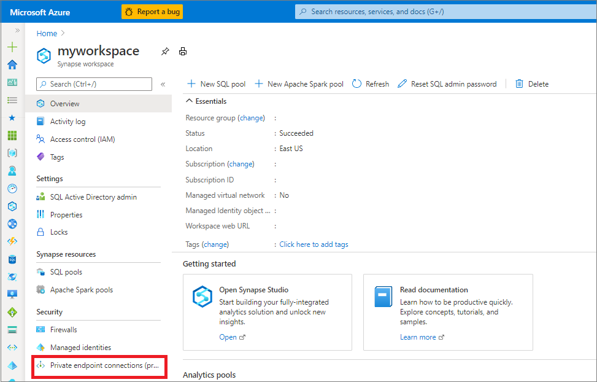
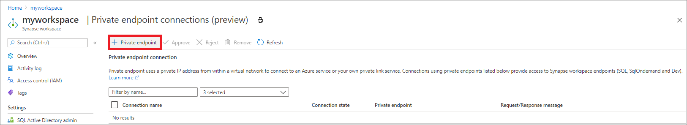
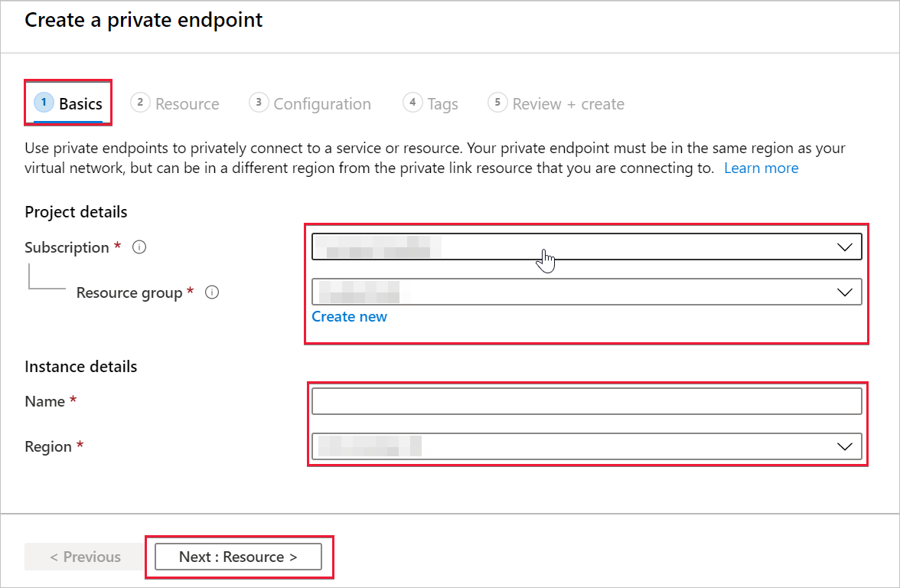
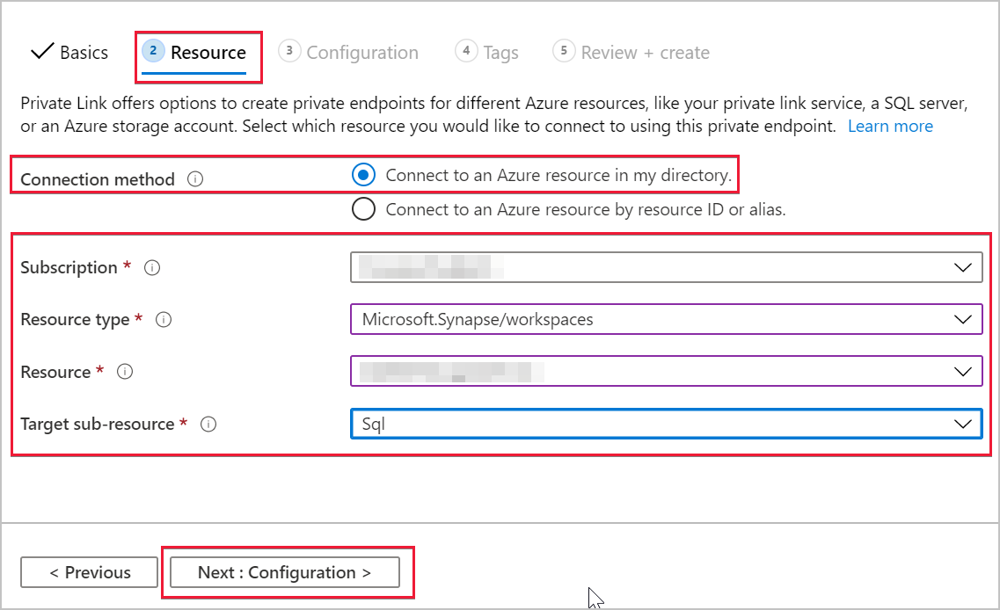
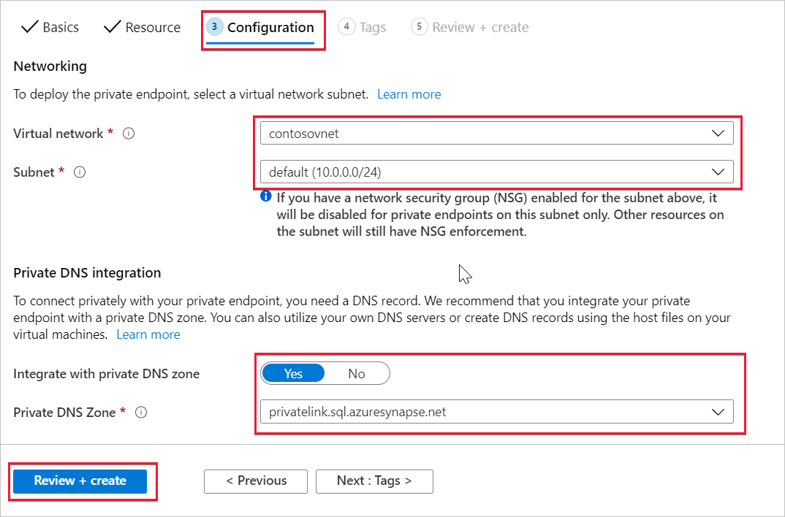
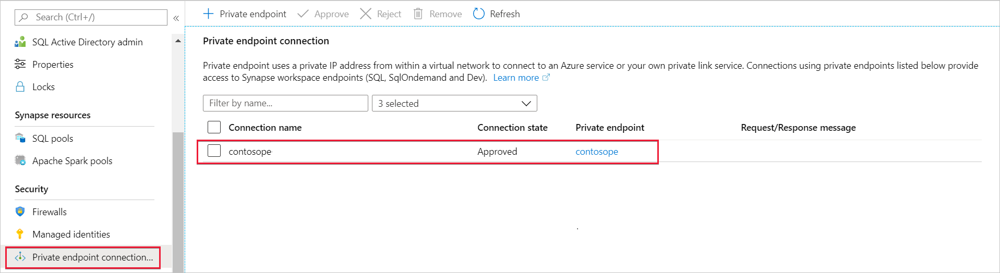

# Connect to your Azure Synapse workspace using private links

This article will teach you how to create a private endpoint to your Azure Synapse workspace. See [private links and private endpoints](../../private-link/index.yml) to learn more.

## Step 1: Register Network resource provider

If you haven't already done so, register the Network resource provider in the subscription hosting the Azure Synapse Workspace. Registering a resource provider configures your subscription to work with the resource provider. Choose *Microsoft.Network* from the list of resource providers when you [register](../../azure-resource-manager/management/resource-providers-and-types.md). 

If you are creating a private endpoint in a different subscription than the subscription hosting the Azure Synapse Workspace, register *Microsoft.Synapse* in the subscription hosting the private endpoint. This is required when trying to approve or delete the private endpoint connection.

If the required resource provider is already registered, then proceed to Step 2.

## Step 2: Open your Azure Synapse workspace in Azure portal

Select **Private endpoint connection** under **Security**. 

On the next screen select **+ Private endpoint**.

## Step 3: Select your subscription and region details

Under the **Basics** tab in the **Create a private endpoint** window, choose your **Subscription** and **Resource Group**. Give a **Name** to the private endpoint that you want to create. Select the **Region** where you want the private endpoint created.

Private endpoints are created in a subnet. The subscription, resource group, and region selected filter the private endpoint subnets. Select **Next: Resource >** when done.

## Step 4: Select your Azure Synapse workspace details

Select **Connect to an Azure resource in my directory** in the **Resource** tab. Select the **Subscription** that contains your Azure Synapse workspace. The **Resource type** for creating private endpoints to an Azure Synapse workspace is *Microsoft.Synapse/workspaces*.

Select your Azure Synapse workspace as the **Resource**. Every Azure Synapse workspace has three **Target sub-resource** that you can create a private endpoint to: Sql, SqlOnDemand, and Dev.
- Sql is for SQL query execution in dedicated SQL pools.
- SqlOnDemand is SQL query execution in the built-in serverless SQL pool.
- Dev is for accessing everything else inside Azure Synapse Analytics Studio workspaces.

Select **Next: Configuration>** to advance to the next part of the setup.

In the **Configuration** tab, select the **Virtual network** and the **Subnet** in which the private endpoint should be created. You also need to create a DNS record that maps to the private endpoint.

Select **Yes** for **Integrate with private DNS zone** to integrate your private endpoint with a private DNS zone. If you don't have a private DNS zone associated with your Microsoft Azure Virtual Network, then a new private DNS zone is created. Select **Review + create** when done.

When the deployment is complete, open your Azure Synapse workspace in Azure portal and select **Private endpoint connections**. The new private endpoint and private endpoint connection name associated to the private endpoint are shown.

## Next steps

Learn more about [Managed workspace Virtual Network](./synapse-workspace-managed-vnet.md)

Learn more about [Managed private endpoints](./synapse-workspace-managed-private-endpoints.md)

[Create Managed private endpoints to your data sources](./how-to-create-managed-private-endpoints.md)
