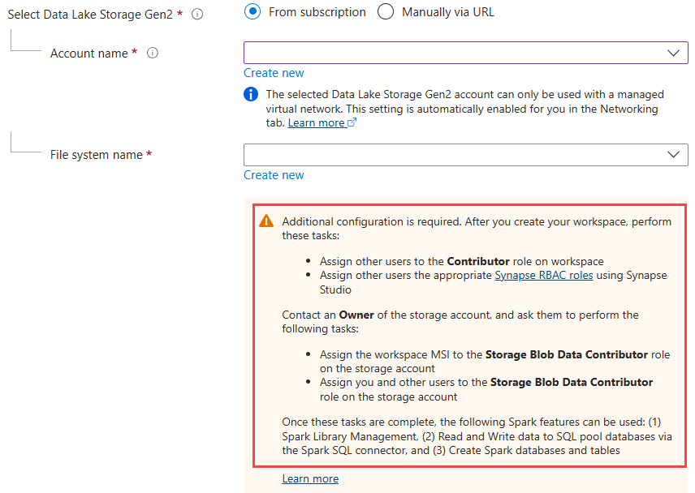

# Grant permissions to workspace managed identity

This article teaches you how to grant permissions to the managed identity in Azure synapse workspace. Permissions, in turn, allow access to dedicated SQL pools in the workspace and ADLS Gen2 storage account through the Azure portal.

>[!NOTE]
>This workspace managed identity will be referred to as managed identity through the rest of this document.

## Grant managed identity permissions to the dedicated SQL pool

The managed identity grants permissions to the dedicated SQL pools in the workspace. With permissions granted, you can orchestrate pipelines that perform dedicated SQL pool-related activities. When you create an Azure Synapse workspace using Azure portal, you can grant the managed identity CONTROL permissions on dedicated SQL pools.

Select **Security** when you're creating your Azure Synapse workspace. Then select **Allow pipelines (running as workspace's system assigned identity) to access SQL pools.**.

## Grant the managed identity permissions to ADLS Gen2 storage account

An ADLS Gen2 storage account is required to create an Azure Synapse workspace. To successfully launch Spark pools in Azure Synapse workspace, the Azure Synapse managed identity needs the *Storage Blob Data Contributor* role on this storage account . Pipeline orchestration in Azure Synapse also benefits from this role.

### Grant permissions to managed identity during workspace creation

Azure Synapse will attempt to grant the Storage Blob Data Contributor role to the managed identity after you create the Azure Synapse workspace using Azure portal. You provide the ADLS Gen2 storage account details in the **Basics** tab.

Choose the ADLS Gen2 storage account and filesystem in **Account name** and **File system name**.

If the workspace creator is also **Owner** of the ADLS Gen2 storage account, then Azure Synapse will assign the *Storage Blob Data Contributor* role to the managed identity. You'll see the following message below the storage account details that you entered.

If the workspace creator isn't the owner of the ADLS Gen2 storage account, then Azure Synapse doesn't assign the *Storage Blob Data Contributor* role to the managed identity. The message appearing below the storage account details notifies the workspace creator that they don't have sufficient permissions to grant the *Storage Blob Data Contributor* role to the managed identity.

As the message states, you can't create Spark pools unless the *Storage Blob Data Contributor* is assigned to the managed identity.

### Grant permissions to managed identity after workspace creation

During workspace creation, if you don't assign the *Storage Blob Data contributor* to the managed identity, then the **Owner** of the ADLS Gen2 storage account manually assigns that role to the identity. The following steps will help you to accomplish manual assignment.

#### Step 1: Navigate to the ADLS Gen2 storage account in Azure portal

In Azure portal, open the ADLS Gen2 storage account and select **Overview** from the left navigation. You'll only need to assign The *Storage Blob Data Contributor* role at the container or filesystem level. Select **Containers**.  

#### Step 2: Select the container

The managed identity should have data access to the container (file system) that was provided when the workspace was created. You can find this container or file system in Azure portal. Open the Azure Synapse workspace in Azure portal and select the **Overview** tab from the left navigation.

Select that same container or file system to grant the *Storage Blob Data Contributor* role to the managed identity.

#### Step 3: Open Access control and add role assignment

1. Select **Access control (IAM)**.

1. Select **Add** > **Add role assignment** to open the Add role assignment page.

1. Assign the following role. For detailed steps, see [Assign Azure roles using the Azure portal](../../role-based-access-control/role-assignments-portal.md).
    
    | Setting | Value |
    | --- | --- |
    | Role | Storage Blob Contributor |
    | Assign access to | MANAGEDIDENTITY |
    | Members | managed identity name  |

    > [!NOTE]
    > The managed identity name is also the workspace name.

    

1. Select **Save** to add the role assignment.

#### Step 9: Verify that the Storage Blob Data Contributor role is assigned to the managed identity

Select **Access Control(IAM)** and then select **Role assignments**.

You should see your managed identity listed under the **Storage Blob Data Contributor** section with the *Storage Blob Data Contributor* role assigned to it. 

## Next steps

Learn more about [Workspace managed identity](./synapse-workspace-managed-identity.md)
