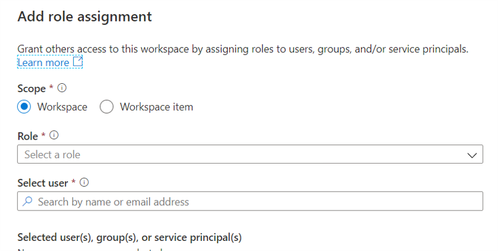

## How to manage Synapse RBAC role assignments in Synapse Studio

Synapse RBAC uses roles to assign permissions to users, groups and other security principals to enable access and use of Synapse resources and code artifacts.  [Learn more](fwlink)

This article explains how to add and delete Synapse RBAC role assignments to grant and revoke access to Apache Spark pools, Integration runtimes, Linked Services, Credentials and code artifacts like SQL scripts and Spark notebooks and jobs. [Learn more](https://go.microsoft.com/fwlink/?linkid=2148306) about Synapse RBAC.

>[!Note]
>To manage Synapse RBAC role assignments you need to have the Synapse Administrator role on the workspace or at a lower level scope that includes the objects you want to manage. If you are a Synapse Administrator on the workspace you can grant access to all objects in the workspace. 

>[!Note]
>Access to SQL pools is managed using SQL permissions.  With the exception of the Synapse Administrator role, Synapse RBAC roles do not grant access to SQL pools.

>[!Note]
>Changes made to Synapse RBAC role assignments may take 2-3 minutes to apply.  

## Open Synapse Studio  

To assign a role to a user, group, service principal, or managed identity first [open the Synapse Studio](https://web.azuresynapse.net/) and select your workspace. 

 
 
 Once you've opened your workspace, expand the **Security** section on the left and select **Access control**. 

 

The Access control screen lists current role assignments.  You can filter the list by principal name or email and  selectively filter which object types, roles, and/or scopes are included.

## Add a Synapse role assignment

On the access control screen, click **+Add** to create a new role assignment

On the Add role assignment blade that opens allows assignments to be created at workspace scope or workspace item scope. 

## Add workspace-scoped role assignment

Select **Workspace** as the scope, then select the **Synapse RBAC role**, and then the **principal(s)** who are to be assigned the role.  You can select multiple principals. Select **Apply** to create the role assignments.  

The assigned role will apply to all applicable objects in the workspace.

## Add workspace item-scoped role assignment

Select **Workspace item** as the scope, then select the **scoping item type**, which may be Apache Spark pool, Integration runtime, Linked service or Credential.       

 

Then **select the item** to be used as the scope (e.g. a specific ApacheSpark pool or Linked service), then **select the role** to be assigned from the drop down.  The drop down lists only those roles that are valid for the given item type. [Learn more](https://go.microsoft.com/fwlink/?linkid=2148306).  

 
 
Then **select the principal(s)** to which the role is to be assigned.  Multiple principals may be selected.  Select **Apply** to create the role assignment(s).

## Delete a Synapse RBAC role assignment

To revoke Synapse RBAC access you delete the applicable role assignment.  On the Access control use the filters to locate the role assignment(s) to be deleted.  Check the role assignments and then click Remove access.   

## Next steps

[Understand the Synapse RBAC roles required to perform common tasks](./synapse-workspace-understand-what-role-you-need.md) 
