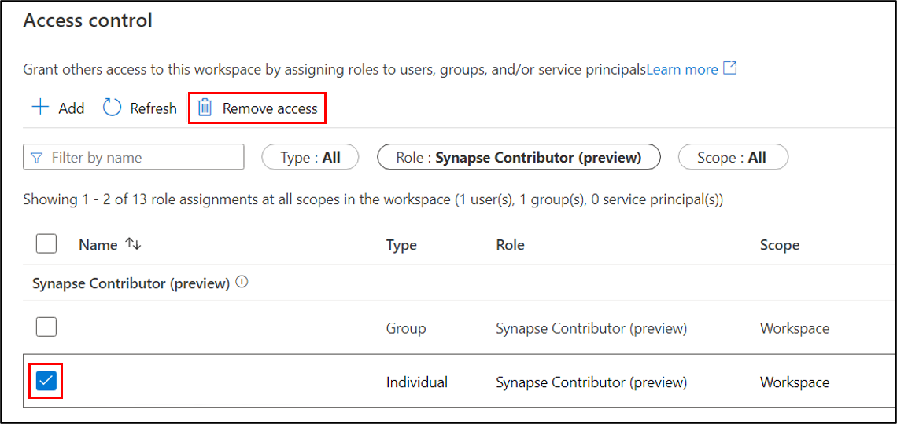

# How to manage Synapse RBAC role assignments in Synapse Studio

Synapse RBAC uses roles to assign permissions to users, groups, and other security principals to enable access and use of Synapse resources and code artifacts. For more information, see [What is Synapse role-based access control (RBAC)?](./synapse-workspace-synapse-rbac.md)

This article shows how to add and delete Synapse RBAC role assignments.

>[!Note]
>- To manage Synapse RBAC role assignments you need to have the Synapse Administrator role on the workspace or at a lower-level scope that includes the objects you want to manage. If you are a Synapse Administrator on the workspace you can grant access to all objects in the workspace. 
>- **Guest users** from a different AD tenant can also see and manage role assignments after being assigned the Synapse Administrator role.
>- To help you regain access to a workspace in the event that no Synapse Administrators are assigned or available to you, users with permissions to manage **Azure RBAC** role assignments on the workspace can also manage **Synapse RBAC** role assignments, allowing the addition of Synapse Administrator or other Synapse role assignments.
>- Access to SQL pools is managed using SQL permissions.  With the exception of the Synapse Administrator and Synapse SQL Administrator roles, Synapse RBAC roles do not grant access to SQL pools.

>[!important]
>- Changes made to Synapse RBAC role assignments may take 2-5 minutes to take effect. 
>- If you are managing Synapse RBAC permissions by modifying membership of security groups, then changes to membership are managed using Azure Active Directory.  Changes to group memberships may take 10-15 minutes or longer to take effect.

## Open Synapse Studio  

To assign a role to a user, group, service principal, or managed identity, first [open the Synapse Studio](https://web.azuresynapse.net/) and log into your workspace. 

 
 
 Once you've opened your workspace, expand the **Security** section on the left and select **Access control**. 

 

The Access control screen lists current role assignments.  You can filter the list by principal name or email, and  selectively filter the object types, roles, or scopes included. From this screen, you can add or remove role assignments.  

## Add a Synapse role assignment

On the access control screen, select **+Add** to create a new role assignment

On the Add role assignment tab, you can create role assignments at workspace scope or workspace item scope. 

## Add workspace-scoped role assignment

First, select **Workspace** as the scope, then select the **Synapse RBAC role**.  Select the **principal(s)** to be assigned the role, then create the role assignment(s). 

 

The assigned role will apply for all applicable objects in the workspace.

## Add workspace item-scoped role assignment

To assign a role at a finer-grained scope, select **Workspace item** as the scope, then select the scoping **Item type**.       

 

Select the specific **item** to be used as the scope, then select the **role** to be assigned from the drop-down.  The drop-down lists only those roles that are valid for the selected item type. [Learn more](./synapse-workspace-synapse-rbac.md).  

 
 
Then **select the principal(s)** to which the role is to be assigned.  You can iteratively select multiple principals.  Select **Apply** to create the role assignment(s).

## Remove a Synapse RBAC role assignment

To revoke Synapse RBAC access, you remove the appropriate role assignments.  On the Access control screen, use the filters to locate the role assignment(s) to be removed.  Check the role assignments and then select **Remove access**.   

Remember that changes to role assignments will take 2-5 minutes to take effect.   

## Next steps

[Understand the Synapse RBAC roles required to perform common tasks](./synapse-workspace-understand-what-role-you-need.md)