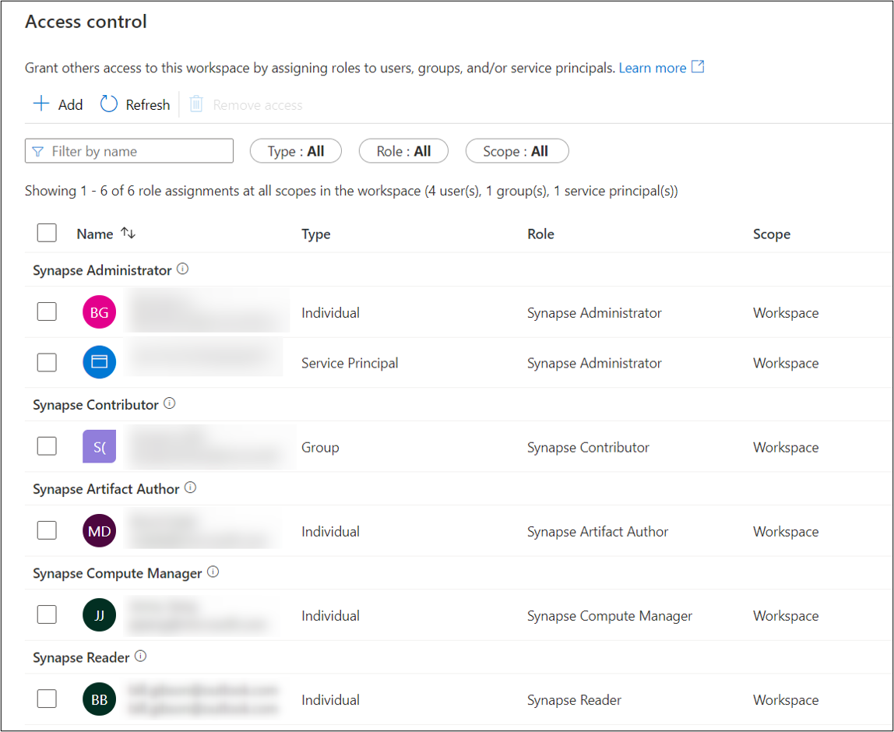

# How to review Synapse RBAC role assignments

Synapse RBAC roles are used to assign permissions to users, groups, and other security principals to enable access and use of Synapse resources.  [Learn more](https://go.microsoft.com/fwlink/?linkid=2148306)

This article explains how to review the current role assignments for a workspace.

A user with any Synapse RBAC role can list Synapse RBAC role assignments for all scopes, including assignments objects you don't have access to. Only a Synapse Administrator can grant Synapse RBAC access.  To be assigned additional permissions, contact a Synapse Administrator.    

## Open Synapse Studio  

To review role assignments, first [open the Synapse Studio](https://web.azuresynapse.net/) and select your workspace. 

 
 
 Once you've opened your workspace, select the **Manage** hub on the left, then expand the **Security** section and select **Access control**. 

 

## Review Workspace role assignments

The Access control screen lists all current role assignments for the workspace, grouped by role. 

 For each assignment, the principal name, principal type, role, and the scope at which it was assigned are shown.  All assignments are shown, including those assignments at workspace and lower-level scopes.

If a principal is assigned the same role at different scopes, you'll see multiple assignments for the principal, one for each scope.  

If a role is assigned at a group level, you'll see the group-level role assignment but not any assignments inherited by members of the group.  

You can filter the list by principal name or email, and selectively filter the object types, roles, and scopes. To see roles assigned to you, enter your name or email alias in the Name filter.  To change the roles assigned to you contact a Synapse Administrator for the workspace.

>[!Important] 
>If you are directly or indirectly a member of a group that is assigned roles, you may have permissions that are not shown.

When you create a new workspace, you and the workspace MSI service principal are automatically given the Synapse Administrator role at workspace scope.

## Next Steps

Learn [how to manage Synapse RBAC role assignments](./how-to-manage-synapse-rbac-role-assignments.md).

Learn [which role you need to do specific tasks](./synapse-workspace-understand-what-role-you-need.md)