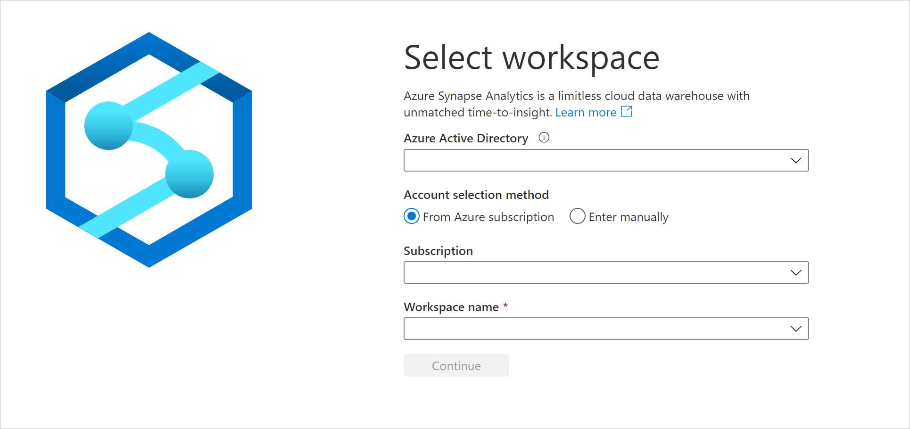
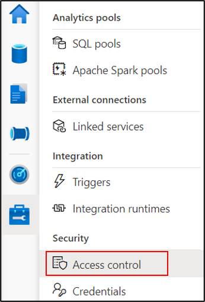
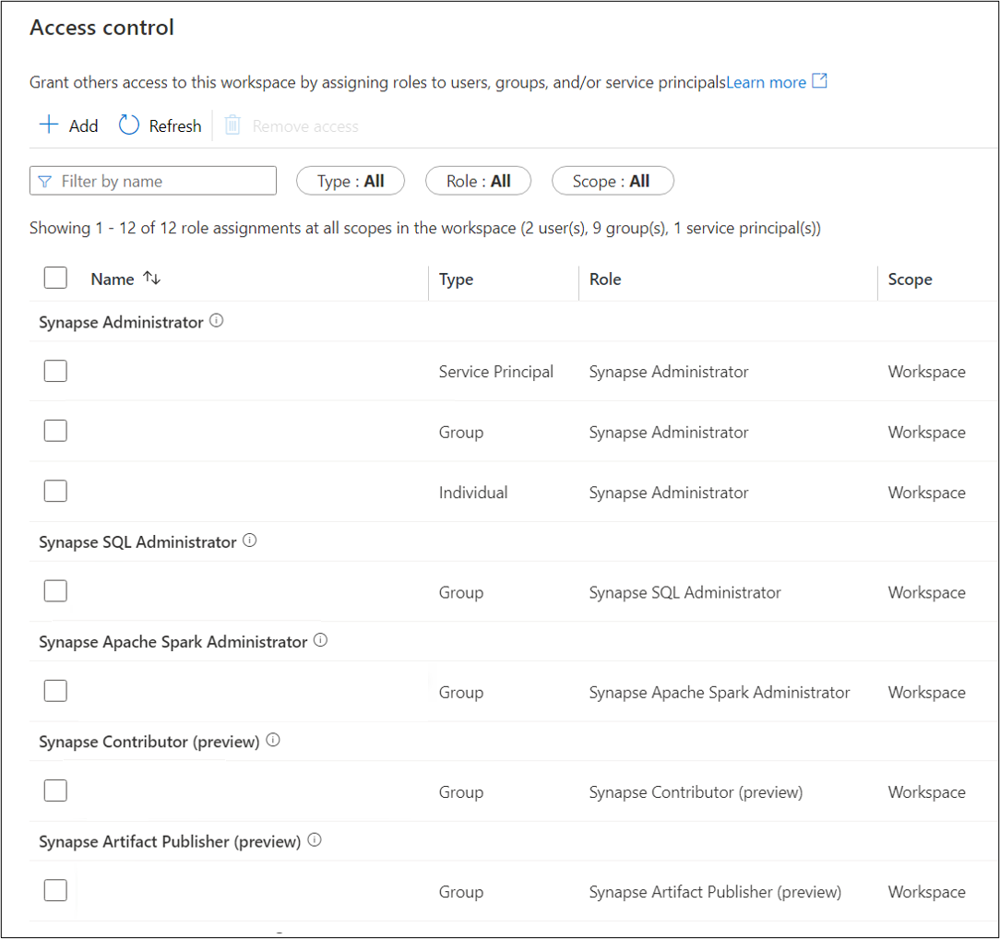

# How to review Synapse RBAC role assignments

Synapse RBAC roles are used to assign permissions to users, groups, and other security principals to enable access and use of Synapse resources. For more information, see [What is Synapse role-based access control (RBAC)?](./synapse-workspace-synapse-rbac.md)

This article explains how to review the current role assignments for a workspace.

With any Synapse RBAC role, you can list Synapse RBAC role assignments for all scopes, including assignments for objects you don't have access to. Only a Synapse Administrator can grant Synapse RBAC access.  

>[!Note]
> A guest users (users from a different AD tenant) can also see and manage role assignment after being assigned the Synapse Administrator role.    

## Open Synapse Studio  

To review role assignments, first [open the Synapse Studio](https://web.azuresynapse.net/) and select your workspace. To sign into your workspace, there are two **Account selection methods**. One is from **Azure subscription**, the other is from **Enter manually**. If you have the Synapse Azure role or higher level Azure roles, you can use both methods to log into the workspace. If you don't have the related Azure roles, and you were granted as the Synapse RBAC role, **Enter manually** is the only way to log into the workspace.

 
 
 Once you've opened your workspace, select the **Manage** hub on the left, then expand the **Security** section and select **Access control**. 

 

## Review workspace role assignments

The Access control screen lists all current role assignments for the workspace, grouped by role. Each assignment includes the principal name, principal type, role, and its scope.

If a principal is assigned the same role at different scopes, you'll see multiple assignments for the principal, one for each scope.  

If a role is assigned to a security group, you'll see the roles explicitly assigned to the group but not roles inherited from parent groups.  

You can filter the list by principal name or email, and selectively filter the object types, roles, and scopes. enter your name or email alias in the Name filter to see roles assigned to you. Only a Synapse Administrator can change your roles.

>[!Important] 
>If you are directly or indirectly a member of a group that is assigned roles, you may have permissions that are not shown.

>[!tip]
>You can find your group memberships using Microsoft Entra ID in the Azure portal.  

If you create a new workspace, you and the workspace MSI service principal are automatically given the Synapse Administrator role at workspace scope.

## Next steps

Learn [how to manage Synapse RBAC role assignments](./how-to-manage-synapse-rbac-role-assignments.md).

Learn [which role you need to do specific tasks](./synapse-workspace-understand-what-role-you-need.md)
