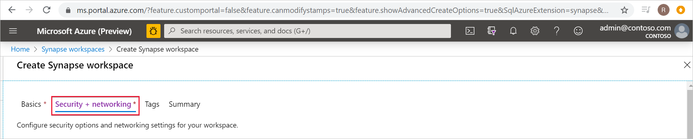
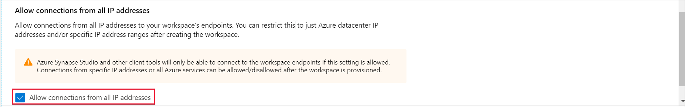
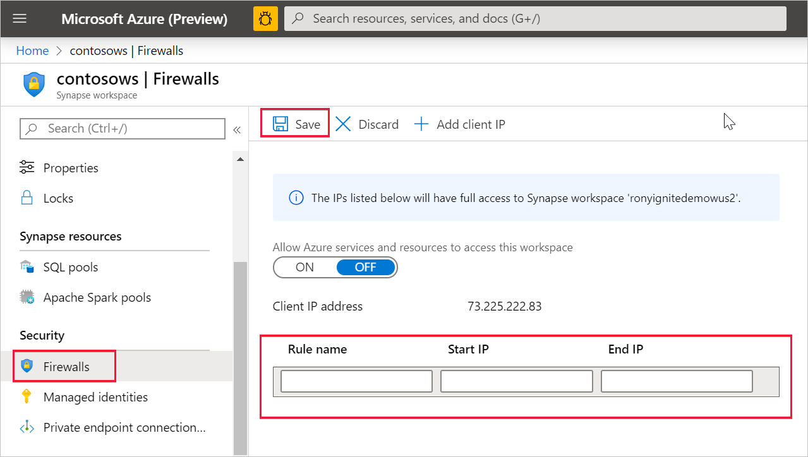

# Azure Synapse Analytics IP firewall rules (preview)

This article will explain IP firewall rules and teach you how to configure them in Azure Synapse Analytics.

## IP firewall rules

IP firewall rules grant or deny access to your Synapse workspace based on the originating IP address of each request. You can configure IP firewall rules for your workspace. IP firewall rules configured at the workspace level apply to all public endpoints of the workspace (SQL pools, SQL on-demand, and Development).

## Create and manage IP firewall rules

There are two ways IP firewall rules are added to a Synapse workspace. To add an IP firewall to your workspace, select **Security + networking** and check **Allow connections from all IP addresses** during workspace creation.

You can also add IP firewall rules to a Synapse workspace after the workspace is created. Select **Firewalls** under **Security** from Azure portal. To add a new IP firewall rule, give it a name, Start IP, and End IP. Select **Save** when done.

## Connecting to Synapse from your own network

You can connect to your Synapse workspace using Synapse Studio. You can also use SQL Server Management Studio (SSMS) to connect to the SQL resources (SQL pools and SQL on-demand) in your workspace.

Make sure that the firewall on your network and local computer allows outgoing communication on TCP ports 80, 443 and 1443 for Synapse Studio.

Also, you need to allow outgoing communication on UDP port 53 for Synapse Studio. To connect using tools such as SSMS and Power BI, you must allow outgoing communication on TCP port 1433.

If you're using the default Redirect connection policy setting, you may need to allow outgoing communication on additional ports. You can learn more about connection policies [here](https://docs.microsoft.com/azure/sql-database/sql-database-connectivity-architecture#connection-policy).

## Next steps

Create an [Azure Synapse Workspace](../quickstart-create-workspace.md)

Create an Azure Synapse workspace with a [Managed workspace VNet](./synapse-workspace-managed-vnet.md)