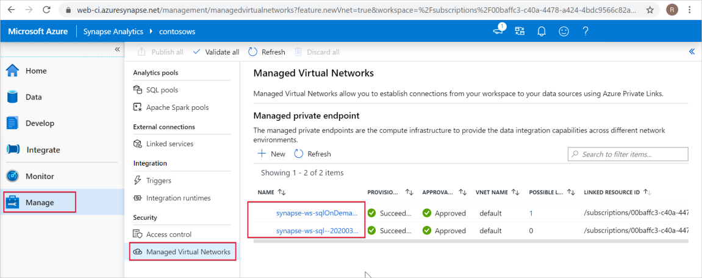

# Synapse Managed private endpoints (preview)

This article will explain Managed private endpoints in Azure Synapse Analytics.

## Managed private endpoints

Managed private endpoints are private endpoints created in the Managed workspace VNet establishing a private link to  Azure resources. Azure Synapse manages these private endpoints on your behalf.

Azure Synapse supports private links. Private link enables you to access Azure services (such as Azure Storage, Azure Cosmos DB, and Azure SQL Data Warehouse) and Azure hosted customer/partner services from your Azure VNet securely.

When you use a private link, traffic between your VNet and workspace traverses entirely over the Microsoft backbone network. Private Link protects against data exfiltration risks. You establish a private link to a resource by creating a private endpoint.

Private endpoint uses a private IP address from your VNet to effectively bring the service into your VNet. Private endpoints are mapped to a specific resource in Azure and not the entire service. Customers can limit connectivity to a specific resource approved by their organization. Learn more about [private links and private endpoints](https://docs.microsoft.com/azure/private-link/).

>[!IMPORTANT]
>Managed private endpoints are only supported in Azure Synapse workspaces with a Managed workspace VNet.

>[!NOTE]
>All outbound traffic from the Managed workspace VNet except through Managed private endpoints will be blocked in the future. It's recommended that you create Managed private endpoints to connect to all your Azure data sources external to the workspace. 

A private endpoint connection is created in a "Pending" state when you create a Managed private endpoint in Azure Synapse. An approval workflow is initiated. The private link resource owner is responsible to approve or reject the connection.

If the owner approves the connection, the private link is established. Otherwise, the private link won't be established. In either case, the Managed private endpoint will be updated with the status of the connection.

Only a Managed private endpoint in an approved state can send traffic to a given private link resource.

## Managed private endpoints for SQL pool and SQL on-demand

SQL pool and SQL on-demand are analytic capabilities in your Azure Synapse workspace. These capabilities use multi-tenant infrastructure that isn't deployed into the [Managed workspace VNet](./synapse-workspace-managed-vnet.md).

When a workspace is created, Azure Synapse creates two Managed private endpoints to SQL pool and SQL on-demand in that workspace. 

These two Managed private endpoints are listed in Azure Synapse Studio. Select **Manage** in the left navigation, then select **Managed Virtual Networks** to see then in the Studio.

The Managed private endpoint that targets SQL pool is called *synapse-ws-sql--\<workspacename\>* and the one that targets SQL on-demand is called *synapse-ws-sqlOnDemand--\<workspacename\>*.

These two Managed private endpoints are automatically created for you when you create your Azure Synapse workspace. You aren't charged for these two Managed private endpoints.

## Next steps

[Create Managed private endpoints to your data sources](./how-to-create-managed-private-endpoints.md)
