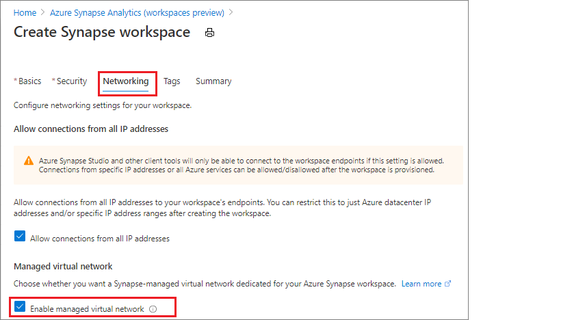
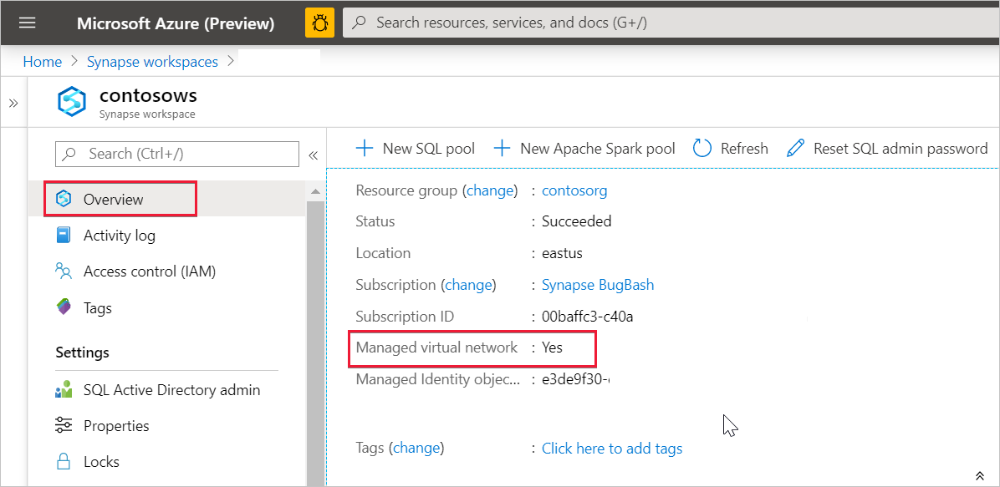

# Azure Synapse Analytics Managed Virtual Network (preview)

This article will explain Managed Virtual Network in Azure Synapse Analytics.

## Managed workspace VNet

When you create your Azure Synapse workspace, you can choose to associate it to a VNet. The VNet associated with your workspace is managed by Azure Synapse. This VNet is called a *Managed workspace VNet*.

Managed workspace VNet provides you value in four ways:

- With a Managed workspace VNet you can offload the burden of managing the VNet to Azure Synapse.
- You don't have to configure inbound NSG rules on your own VNets to allow Azure Synapse management traffic to enter your VNet. Misconfiguration of these NSG rules causes service disruption for customers.
- You don't need to create a subnet for your Spark clusters based on peak load.
- Managed workspace VNet along with Managed private endpoints protects against data exfiltration. You can only create Managed private endpoints in a workspace that has a Managed workspace VNet associated with it.

Creating a workspace with a Managed workspace VNet associated with it ensures that your workspace is network isolated from other workspaces. Azure Synapse provides various analytic capabilities in a workspace: Data integration, Apache Spark, SQL pool, and SQL on-demand.

If your workspace has a Managed workspace VNet, Data integration and Spark resources are deployed in it. A Managed workspace VNet also provides user-level isolation for Spark activities because each Spark cluster is in its own subnet.

SQL pool and SQL on-demand are multi-tenant capabilities and therefore reside outside of the Managed workspace VNet. Intra-workspace communication to SQL pool and SQL on-demand use Azure private links. These private links are automatically created for you when you create a workspace with a Managed workspace VNet associated to it.

>[!IMPORTANT]
>You cannot change this workspace configuration after the workspace is created. For example, you cannot reconfigure a workspace that does not have a Managed workspace VNet associated with it and associate a VNet to it. Similarly, you cannot reconfigure a workspace with a Managed workspace VNet associated to it and disassociate the VNet from it.

## Create an Azure Synapse workspace with a Managed workspace VNet

If you have not already done so, register the Network resource provider. Registering a resource provider configures your subscription to work with the resource provider. Choose *Microsoft.Network* from the list of resource providers when you [register](https://docs.microsoft.com/azure/azure-resource-manager/management/resource-providers-and-types).

To create an Azure Synapse workspace that has a Managed workspace VNet associated with it, select the **Security + networking** tab in Azure portal and check the **Enable managed virtual network** checkbox.

If you leave the checkbox unchecked, then your workspace won't have a VNet associated with it.

>[!IMPORTANT]
>You can only use private links in a workspace that has a Managed workspace VNet.

>[!NOTE]
>All outbound traffic from the Managed workspace VNet except through Managed private endpoints will be blocked in the future. It's recommended that you create Managed private endpoints to connect to all your Azure data sources external to the workspace. 

You can check whether your Azure Synapse workspace is associated to a Managed workspace VNet by selecting **Overview** from Azure portal.

## Next steps

Create an [Azure Synapse Workspace](../quickstart-create-workspace.md)

Learn more about [Managed private endpoints](./synapse-workspace-managed-private-endpoints.md)

[Create Managed private endpoints to your data sources](./how-to-create-managed-private-endpoints.md)
