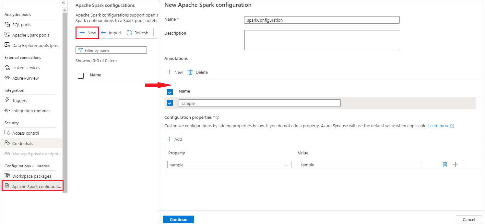
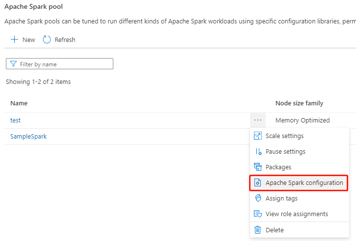
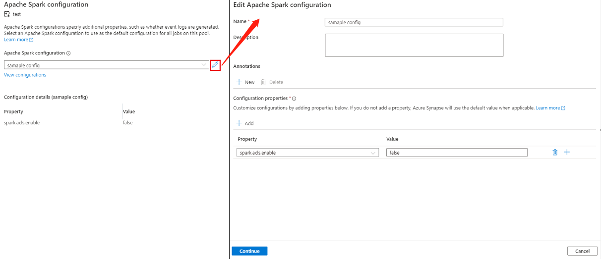
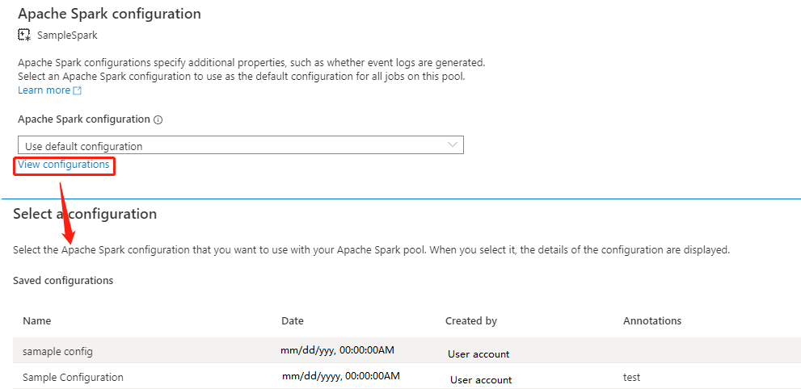
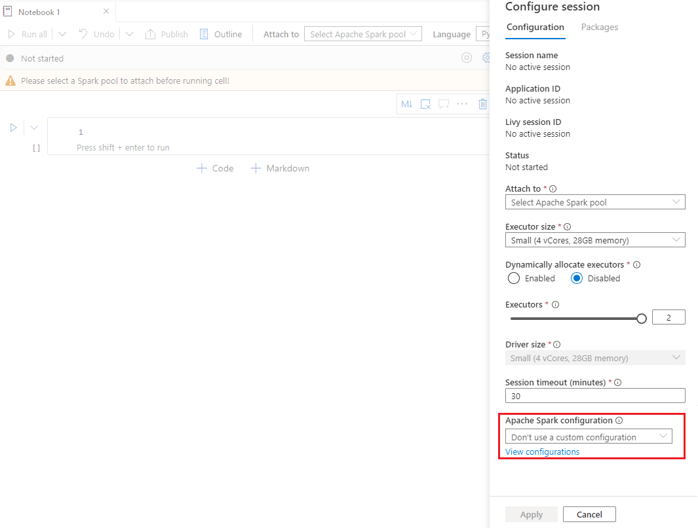
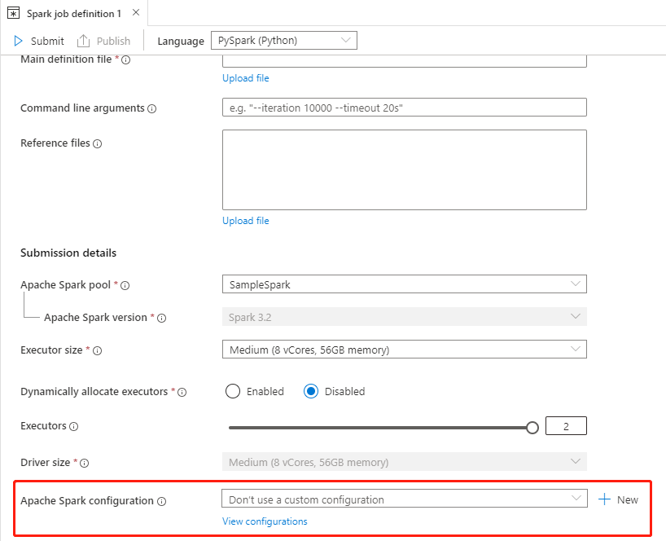
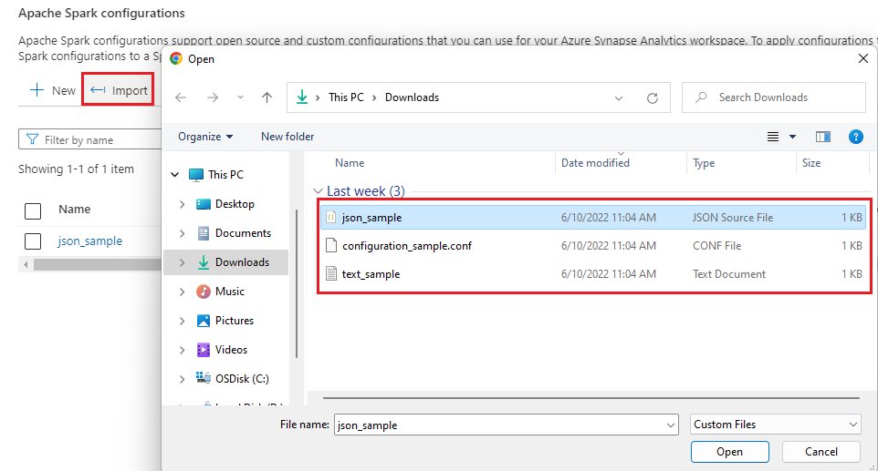
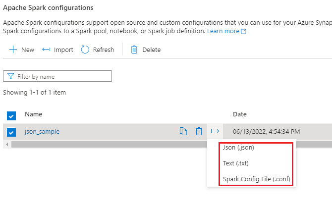

# Manage Apache Spark configuration

In this tutorial, you will learn how to create an Apache Spark configuration for your synapse studio. The created Apache Spark configuration can be managed in a standardized manner and when you create Notebook or Apache spark job definition can select the Apache Spark configuration that you want to use with your Apache Spark pool. When you select it, the details of the configuration are displayed.

## Create an Apache Spark Configuration 

You can create custom configurations from different entry points, such as from the Apache Spark configuration page of an existing spark pool.

## Create custom configurations in Apache Spark configurations

Follow the steps below to create an Apache Spark Configuration in Synapse Studio.

   1. Select **Manage** > **Apache Spark configurations**.
   2. Click on **New** button to create a new Apache Spark configuration, or click on **Import** a local .json file to your workspace.
   3. **New Apache Spark configuration** page will be opened after you click on **New** button.
   4. For **Name**, you can enter your preferred and valid name.
   5. For **Description**, you can input some description in it.
   6. For **Annotations**, you can add annotations by clicking the **New** button, and also you can delete existing annotations by selecting and clicking **Delete** button.
   7. For **Configuration properties**, customize the configuration by clicking **Add** button to add properties. If you do not add a property, Azure Synapse will use the default value when applicable. 
   
      
   
   8. Click on **Continue** button.
   9. Click on **Create** button when the validation succeeded.
   10. Publish all


> [!NOTE] 
>
> **Upload Apache Spark configuration** feature has been removed, but Synapse Studio will keep your previously uploaded configuration.

## Create an Apache Spark Configuration in already existing Apache Spark pool

Follow the steps below to create an Apache Spark configuration in an existing Apache Spark pool.

   1. Select an existing Apache Spark pool, and click on action "..." button.
   2. Select the **Apache Spark configuration** in the content list.
   
         

   3. For Apache Spark configuration, you can select an already created configuration from the drop-down list, or click on **+New** to create a new configuration.
      
      * If you click **+New**, the Apache Spark Configuration page will open, and you can create a new configuration by following the steps in [Create custom configurations in Apache Spark configurations](#create-custom-configurations-in-apache-spark-configurations).
      * If you select an existing configuration, the configuration details will be displayed at the bottom of the page, you can also click the **Edit** button to edit the existing configuration.
     
                
   
   4. Click **View Configurations** to open the **Select a Configuration** page. All configurations will be displayed on this page. You can select a configuration that you want to use on this Apache Spark pool.
  
         

   5. Click on **Apply** button to save your action.


## Create an Apache Spark Configuration in the Notebook's configure session

If you need to use a custom Apache Spark Configuration when creating a Notebook, you can create and configure it in the **configure session** by following the steps below.

   1. Create a new/Open an existing Notebook.
   2. Open the **Properties** of this notebook.
   3. Click on **Configure session** to open the Configure session page.
   4. Scroll down the configure session page, for Apache Spark configuration, expand the drop-down menu, you can click on New button to [create a new configuration](#create-custom-configurations-in-apache-spark-configurations). Or select an existing configuration, if you select an existing configuration, click the **Edit** icon to go to the Edit Apache Spark configuration page to edit the configuration.
   5. Click **View Configurations** to open the **Select a Configuration** page. All configurations will be displayed on this page. You can select a configuration that you want to use.

      

## Create an Apache Spark Configuration in Apache Spark job definitions

When you are creating a spark job definition, you need to use Apache Spark configuration, which can be created by following the steps below:

   1. Create a new/Open an existing Apache Spark job definitions.
   2. For **Apache Spark configuration**, you can click on New button to [create a new configuration](#create-custom-configurations-in-apache-spark-configurations). Or select an existing configuration in the drop-down menu, if you select an existing configuration, click the **Edit** icon to go to the Edit Apache Spark configuration page to edit the configuration.
   3. Click **View Configurations** to open the **Select a Configuration** page. All configurations will be displayed on this page. You can select a configuration that you want to use.

      


> [!NOTE] 
>
> If the Apache Spark configuration in the Notebook and Apache Spark job definition does not do anything special, the default configuration will be used when running the job.


## Import and Export an Apache Spark configuration

You can import .txt/.conf/.json config in three formats and then convert it to artifact and publish it. And can also export to one of these three formats.  

- Import .txt/.conf/.json configuration from local.

   


- Export .txt/.conf/.json configuration to local.

   


For .txt config file and .conf config file, you can refer to the following examples:

   ```txt

   spark.synapse.key1 sample
   spark.synapse.key2 true
   # spark.synapse.key3 sample2

   ```

For .json config file, you can refer to the following examples:

   ```json
   {
    "configs": {
      "spark.synapse.key1": "hello world",
     "spark.synapse.key2": "true"
    },
    "annotations": [
      "Sample"
    ]
   }
   ```


## Next steps

 - [Use serverless Apache Spark pool in Synapse Studio](../quickstart-create-apache-spark-pool-studio.md).
 - [Run a Spark application in notebook](./apache-spark-development-using-notebooks.md).
 - [Create Apache Spark job definition in Azure Studio](./apache-spark-job-definitions.md).
 - [Collect Apache Spark applications logs and metrics with Azure Storage account](./azure-synapse-diagnostic-emitters-azure-storage.md).
 - [Collect Apache Spark applications logs and metrics with Azure Event Hubs](./azure-synapse-diagnostic-emitters-azure-eventhub.md).
