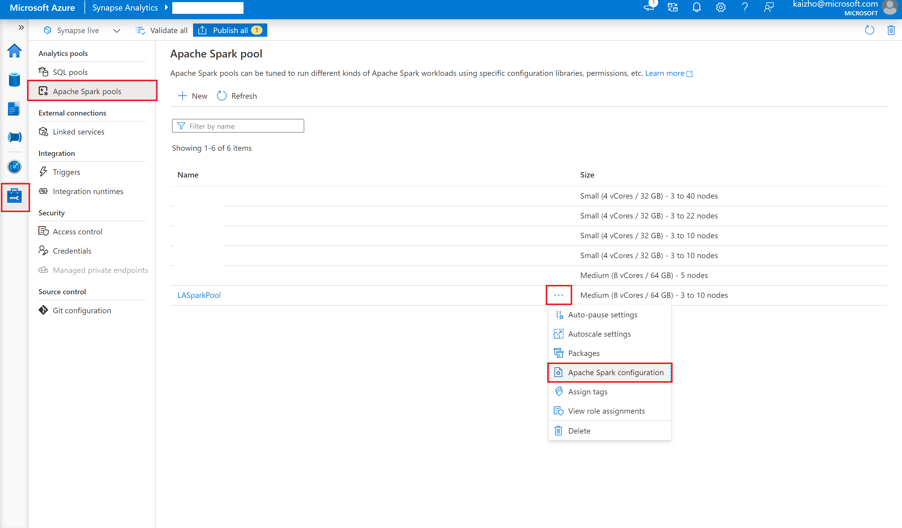
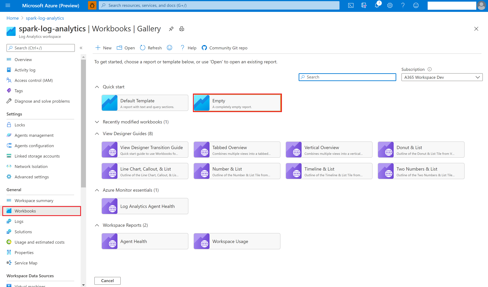
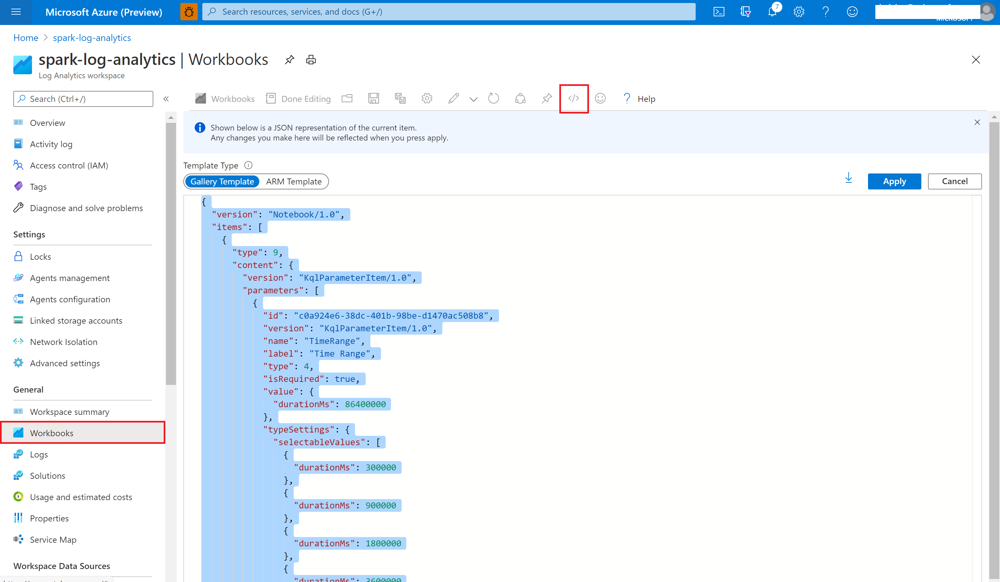
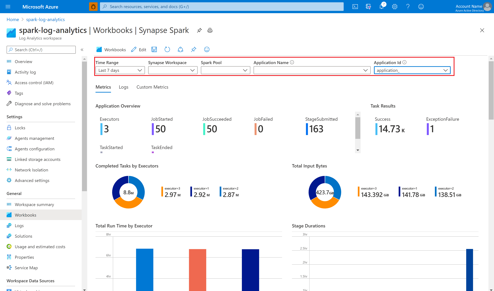
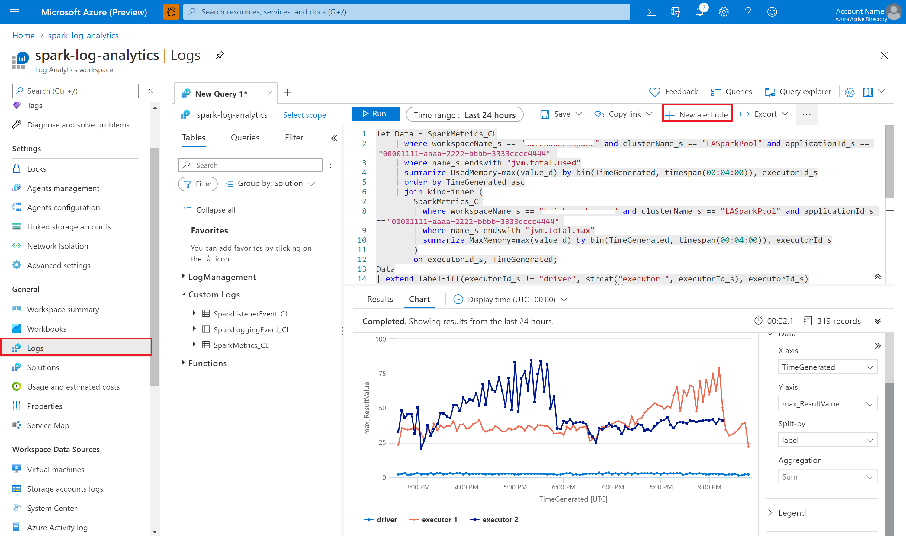
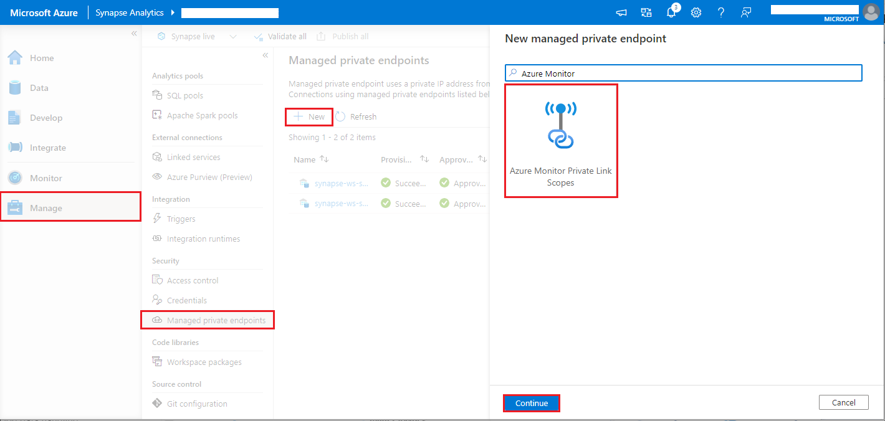
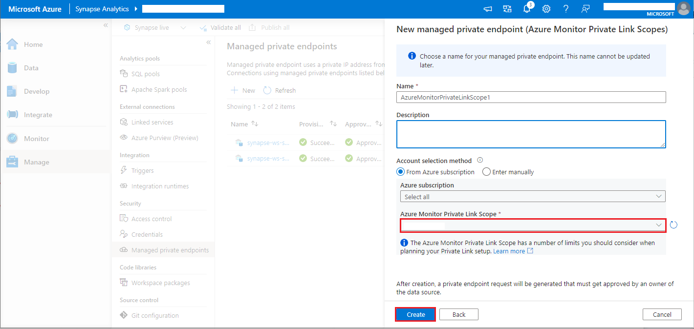

# Monitor Apache Spark applications with Azure Log Analytics

In this tutorial, you learn how to enable the Synapse Studio connector that's built in to Log Analytics. You can then collect and send Apache Spark application metrics and logs to your [Log Analytics workspace](../../azure-monitor/logs/quick-create-workspace.md). Finally, you can use an Azure Monitor workbook to visualize the metrics and logs.

## Configure workspace information

Follow these steps to configure the necessary information in Synapse Studio.

### Step 1: Create a Log Analytics workspace

Consult one of the following resources to create this workspace:
- [Create a workspace in the Azure portal.](../../azure-monitor/logs/quick-create-workspace.md)
- [Create a workspace with Azure CLI.](../../azure-monitor/logs/resource-manager-workspace.md)
- [Create and configure a workspace in Azure Monitor by using PowerShell.](../../azure-monitor/logs/powershell-workspace-configuration.md)

### Step 2: Prepare an Apache Spark configuration file

Use any of the following options to prepare the file.

#### Option 1: Configure with Log Analytics workspace ID and key 

Copy the following Apache Spark configuration, save it as *spark_loganalytics_conf.txt*, and fill in the following parameters:

   - `<LOG_ANALYTICS_WORKSPACE_ID>`: Log Analytics workspace ID.
   - `<LOG_ANALYTICS_WORKSPACE_KEY>`: Log Analytics key. To find this, in the Azure portal, go to **Azure Log Analytics workspace** > **Agents** > **Primary key**.

```properties
spark.synapse.logAnalytics.enabled true
spark.synapse.logAnalytics.workspaceId <LOG_ANALYTICS_WORKSPACE_ID>
spark.synapse.logAnalytics.secret <LOG_ANALYTICS_WORKSPACE_KEY>
```

#### Option 2: Configure with Azure Key Vault

> [!NOTE]
> You need to grant read secret permission to the users who will submit Apache Spark applications. For more information, see [Provide access to Key Vault keys, certificates, and secrets with an Azure role-based access control](../../key-vault/general/rbac-guide.md). When you enable this feature in a Synapse pipeline, you need to use **Option 3**. This is necessary to obtain the secret from Azure Key Vault with workspace managed identity.

To configure Azure Key Vault to store the workspace key, follow these steps:

1. Create and go to your key vault in the Azure portal.
2. On the settings page for the key vault, select **Secrets**.
3. Select **Generate/Import**.
4. On the **Create a secret** screen, choose the following values:
   - **Name**: Enter a name for the secret. For the default, enter `SparkLogAnalyticsSecret`.
   - **Value**: Enter the `<LOG_ANALYTICS_WORKSPACE_KEY>` for the secret.
   - Leave the other values to their defaults. Then select **Create**.
5. Copy the following Apache Spark configuration, save it as *spark_loganalytics_conf.txt*, and fill in the following parameters:

   - `<LOG_ANALYTICS_WORKSPACE_ID>`: The Log Analytics workspace ID.
   - `<AZURE_KEY_VAULT_NAME>`: The key vault name that you configured.
   - `<AZURE_KEY_VAULT_SECRET_KEY_NAME>` (optional): The secret name in the key vault for the workspace key. The default is `SparkLogAnalyticsSecret`.

```properties
spark.synapse.logAnalytics.enabled true
spark.synapse.logAnalytics.workspaceId <LOG_ANALYTICS_WORKSPACE_ID>
spark.synapse.logAnalytics.keyVault.name <AZURE_KEY_VAULT_NAME>
spark.synapse.logAnalytics.keyVault.key.secret <AZURE_KEY_VAULT_SECRET_KEY_NAME>
```

> [!NOTE]
> You can also store the workspace ID in Key Vault. Refer to the preceding steps, and store the workspace ID with the secret name `SparkLogAnalyticsWorkspaceId`. Alternatively, you can use the configuration `spark.synapse.logAnalytics.keyVault.key.workspaceId` to specify the workspace ID secret name in Key Vault.

#### Option 3. Configure with a linked service

> [!NOTE]
> In this option, you need to grant read secret permission to workspace managed identity. For more information, see [Provide access to Key Vault keys, certificates, and secrets with an Azure role-based access control](../../key-vault/general/rbac-guide.md).

To configure a Key Vault linked service in Synapse Studio to store the workspace key, follow these steps:

1. Follow all the steps in the preceding section, "Option 2."
2. Create a Key Vault linked service in Synapse Studio:

    a. Go to **Synapse Studio** > **Manage** > **Linked services**, and then select **New**.

    b. In the search box, search for **Azure Key Vault**.

    c. Enter a name for the linked service.

    d. Choose your key vault, and select **Create**.

3. Add a `spark.synapse.logAnalytics.keyVault.linkedServiceName` item to the Apache Spark configuration.

```properties
spark.synapse.logAnalytics.enabled true
spark.synapse.logAnalytics.workspaceId <LOG_ANALYTICS_WORKSPACE_ID>
spark.synapse.logAnalytics.keyVault.name <AZURE_KEY_VAULT_NAME>
spark.synapse.logAnalytics.keyVault.key.secret <AZURE_KEY_VAULT_SECRET_KEY_NAME>
spark.synapse.logAnalytics.keyVault.linkedServiceName <LINKED_SERVICE_NAME>
```

#### Available Apache Spark configuration

| Configuration name | Default value | Description |
| ------------------ | ------------- | ----------- |
| spark.synapse.logAnalytics.enabled | false | To enable the Log Analytics sink for the Spark applications, true. Otherwise, false. |
| spark.synapse.logAnalytics.workspaceId | - | The destination Log Analytics workspace ID. |
| spark.synapse.logAnalytics.secret | - | The destination Log Analytics workspace secret. |
| spark.synapse.logAnalytics.keyVault.linkedServiceName   | - | The Key Vault linked service name for the Log Analytics workspace ID and key. |
| spark.synapse.logAnalytics.keyVault.name | - | The Key Vault name for the Log Analytics ID and key. |
| spark.synapse.logAnalytics.keyVault.key.workspaceId | SparkLogAnalyticsWorkspaceId | The Key Vault secret name for the Log Analytics workspace ID. |
| spark.synapse.logAnalytics.keyVault.key.secret | SparkLogAnalyticsSecret | The Key Vault secret name for the Log Analytics workspace |
| spark.synapse.logAnalytics.uriSuffix | ods.opinsights.azure.com | The destination Log Analytics workspace [URI suffix][uri_suffix]. If your workspace isn't in Azure global, you need to update the URI suffix according to the respective cloud. |
| spark.synapse.logAnalytics.filter.eventName.match | - | Optional. The comma-separated spark event names, you can specify which events to collect. For example: `SparkListenerJobStart,SparkListenerJobEnd` |
| spark.synapse.logAnalytics.filter.loggerName.match | - | Optional. The comma-separated log4j logger names, you can specify which logs to collect. For example: `org.apache.spark.SparkContext,org.example.Logger` |
| spark.synapse.logAnalytics.filter.metricName.match | - | Optional. The comma-separated spark metric name suffixes, you can specify which metrics to collect. For example: `jvm.heap.used`|

> [!NOTE]  
> - For Microsoft Azure operated by 21Vianet, the `spark.synapse.logAnalytics.uriSuffix` parameter should be `ods.opinsights.azure.cn`. 
> - For Azure Government, the `spark.synapse.logAnalytics.uriSuffix` parameter should be `ods.opinsights.azure.us`. 
> - For any cloud except Azure, the `spark.synapse.logAnalytics.keyVault.name` parameter should be the fully qualified domain name (FQDN) of the Key Vault. For example, `AZURE_KEY_VAULT_NAME.vault.usgovcloudapi.net` for AzureUSGovernment.

[uri_suffix]: ../../azure-monitor/logs/data-collector-api.md#request-uri


### Step 3: Upload your Apache Spark configuration to an Apache Spark pool 

> [!NOTE]
>
> This step will be replaced by step 4.

You can upload the configuration file to your Azure Synapse Analytics Apache Spark pool. In Synapse Studio:

   1. Select **Manage** > **Apache Spark pools**.
   2. Next to your Apache Spark pool, select the **...** button.
   3. Select **Apache Spark configuration**. 
   4. Select **Upload**, and choose the *spark_loganalytics_conf.txt* file.
   5. Select **Upload**, and then select **Apply**.

      > [!div class="mx-imgBorder"]
      > 

> [!NOTE] 
>
> All the Apache Spark applications submitted to the Apache Spark pool will use the configuration setting to push the Apache Spark application metrics and logs to your specified workspace.


### Step 4: Create an Apache Spark Configuration

You can create an Apache Spark Configuration to your workspace, and when you create Notebook or Apache spark job definition can select the Apache Spark configuration that you want to use with your Apache Spark pool. When you select it, the details of the configuration are displayed.

   1. Select **Manage** > **Apache Spark configurations**.
   2. Click on **New** button to create a new Apache Spark configuration, or click on **Import** a local .json file to your workspace.
   3. **New Apache Spark configuration** page will be opened after you click on **New** button.
   4. For **Name**, you can enter your preferred and valid name.
   5. For **Description**, you can input some description in it.
   6. For **Annotations**, you can add annotations by clicking the **New** button, and also you can delete existing annotations by selecting and clicking **Delete** button.
   7. For **Configuration properties**, customize the configuration by clicking **Add** button to add properties. If you do not add a property, Azure Synapse will use the default value when applicable. 

      

## Submit an Apache Spark application and view the logs and metrics

Here's how:

1. Submit an Apache Spark application to the Apache Spark pool configured in the previous step. You can use any of the following ways to do so:
    - Run a notebook in Synapse Studio. 
    - In Synapse Studio, submit an Apache Spark batch job through an Apache Spark job definition.
    - Run a pipeline that contains Apache Spark activity.

1. Go to the specified Log Analytics workspace, and then view the application metrics and logs when the Apache Spark application starts to run.

## Write custom application logs

You can use the Apache Log4j library to write custom logs.

Example for Scala:

```scala
%%spark
val logger = org.apache.log4j.LogManager.getLogger("com.contoso.LoggerExample")
logger.info("info message")
logger.warn("warn message")
logger.error("error message")
//log exception
try {
      1/0
 } catch {
      case e:Exception =>logger.warn("Exception", e)
}
// run job for task level metrics
val data = sc.parallelize(Seq(1,2,3,4)).toDF().count()
```

Example for PySpark:

```python
%%pyspark
logger = sc._jvm.org.apache.log4j.LogManager.getLogger("com.contoso.PythonLoggerExample")
logger.info("info message")
logger.warn("warn message")
logger.error("error message")
```

## Use the sample workbook to visualize the metrics and logs

1. [Download the workbook](https://aka.ms/SynapseSparkLogAnalyticsWorkbook).
2. Open and copy the workbook file content.
3. In the [Azure portal](https://portal.azure.com/), select **Log Analytics workspace** > **Workbooks**. 
4. Open the **Empty** workbook. Use the **Advanced Editor** mode by selecting the **</>** icon.
5. Paste over any JSON code that exists.
6. Select **Apply**, and then select **Done Editing**.

    > [!div class="mx-imgBorder"]
    > 

    > [!div class="mx-imgBorder"]
    > 

Then, submit your Apache Spark application to the configured Apache Spark pool. After the application goes to a running state, choose the running application in the workbook dropdown list.

> [!div class="mx-imgBorder"]
> 

You can customize the workbook. For example, you can use Kusto queries and configure alerts.

> [!div class="mx-imgBorder"]
> 

## Query data with Kusto

The following is an example of querying Apache Spark events:

```kusto
SparkListenerEvent_CL
| where workspaceName_s == "{SynapseWorkspace}" and clusterName_s == "{SparkPool}" and livyId_s == "{LivyId}"
| order by TimeGenerated desc
| limit 100 
```

Here's an example of querying the Apache Spark application driver and executors logs:

```kusto
SparkLoggingEvent_CL
| where workspaceName_s == "{SynapseWorkspace}" and clusterName_s == "{SparkPool}" and livyId_s == "{LivyId}"
| order by TimeGenerated desc
| limit 100
```

And here's an example of querying Apache Spark metrics:

```kusto
SparkMetrics_CL
| where workspaceName_s == "{SynapseWorkspace}" and clusterName_s == "{SparkPool}" and livyId_s == "{LivyId}"
| where name_s endswith "jvm.total.used"
| summarize max(value_d) by bin(TimeGenerated, 30s), executorId_s
| order by TimeGenerated asc
```


## Create and manage alerts

Users can query to evaluate metrics and logs at a set frequency, and fire an alert based on the results. For more information, see [Create, view, and manage log alerts by using Azure Monitor](../../azure-monitor/alerts/alerts-log.md).

## Synapse workspace with data exfiltration protection enabled

After the Synapse workspace is created with [data exfiltration protection](../security/workspace-data-exfiltration-protection.md) enabled.

When you want to enable this feature, you need to create managed private endpoint connection requests to [Azure Monitor private link scopes (A M P L S)](../../azure-monitor/logs/private-link-security.md) in the workspace’s approved Microsoft Entra tenants.

You can follow below steps to create a managed private endpoint connection to Azure Monitor private link scopes (A M P L S):

1. If there is no existing A M P L S, you can follow [Azure Monitor Private Link connection setup](../../azure-monitor/logs/private-link-security.md) to create one.
2. Navigate to your A M P L S in Azure portal, on the **Azure Monitor Resources** page, click **Add** to add connection to your Azure Log Analytics workspace.
3. Navigate to **Synapse Studio > Manage > Managed private endpoints**, click **New** button, select **Azure Monitor Private Link Scopes**, and **continue**.
   > [!div class="mx-imgBorder"]
   > 
4. Choose your Azure Monitor Private Link Scope you created, and click **Create** button.
   > [!div class="mx-imgBorder"]
   > 
5. Wait a few minutes for private endpoint provisioning.
6. Navigate to your A M P L S in Azure portal again, on the **Private Endpoint connections** page, select the connection provisioned and **Approve**.

> [!NOTE] 
>  - The A M P L S object has a number of limits you should consider when planning your Private Link setup. See [A M P L S limits](../../azure-monitor/logs/private-link-security.md) for a deeper review of these limits. 
>  - Check if you have [right permission](../security/synapse-workspace-access-control-overview.md) to create managed private endpoint.

## Next steps

 - [Use serverless Apache Spark pool in Synapse Studio](../quickstart-create-apache-spark-pool-studio.md).
 - [Run a Spark application in notebook](./apache-spark-development-using-notebooks.md).
 - [Create Apache Spark job definition in Azure Studio](./apache-spark-job-definitions.md).
 - [Collect Apache Spark applications logs and metrics with Azure Storage account](./azure-synapse-diagnostic-emitters-azure-storage.md).
 - [Collect Apache Spark applications logs and metrics with Azure Event Hubs](./azure-synapse-diagnostic-emitters-azure-eventhub.md).
