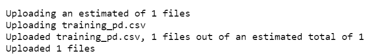
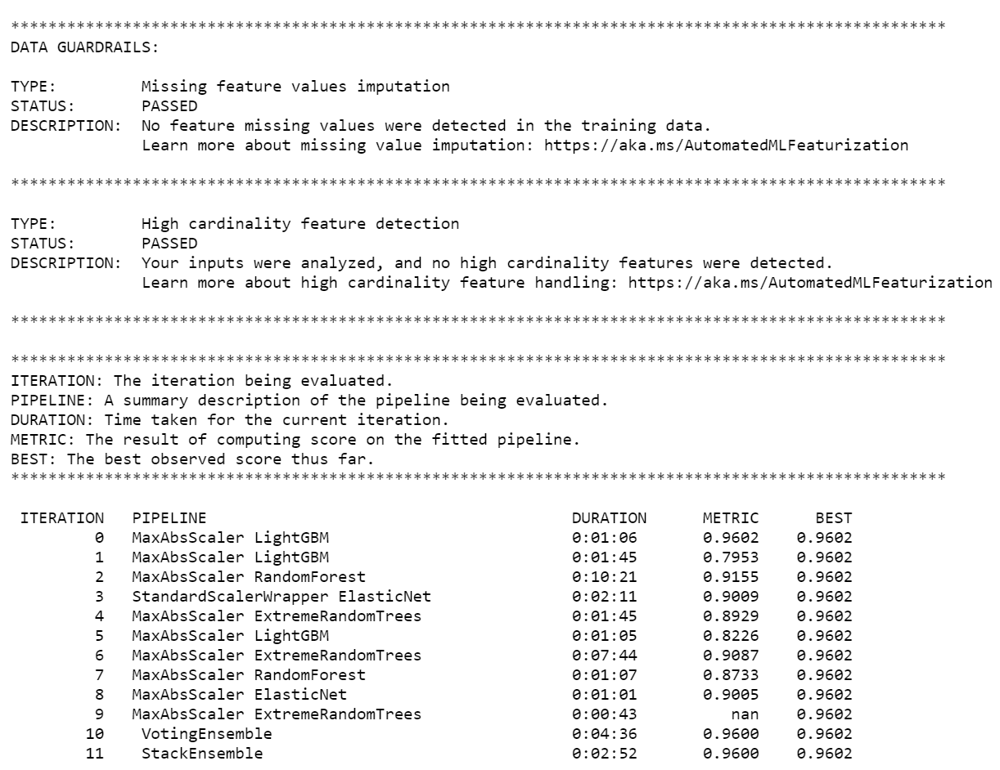
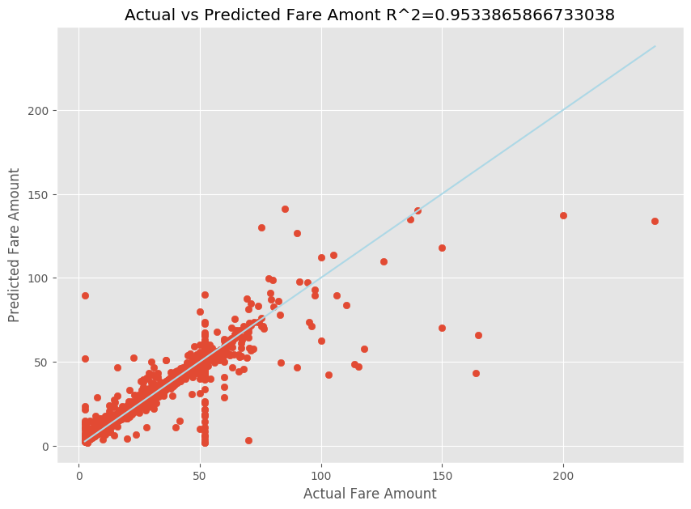

# Tutorial: Train a model in Python with automated machine learning

Azure Machine Learning is a cloud-based environment that allows you to train, deploy, automate, manage, and track machine learning models. 

In this tutorial, you use [automated machine learning](../../machine-learning/concept-automated-ml.md) in Azure Machine Learning to create a regression model to predict taxi fare prices. This process arrives at the best model by accepting training data and configuration settings, and automatically iterating through combinations of different methods, models, and hyperparameter settings.

In this tutorial, you learn how to:
- Download the data by using Apache Spark and Azure Open Datasets.
- Transform and clean data by using Apache Spark DataFrames.
- Train a regression model in automated machine learning.
- Calculate model accuracy.

## Before you begin

- Create a serverless Apache Spark pool by following the [Create a serverless Apache Spark pool](../quickstart-create-apache-spark-pool-studio.md) quickstart.
- Complete the [Azure Machine Learning workspace setup](../../machine-learning/quickstart-create-resources.md) tutorial if you don't have an existing Azure Machine Learning workspace. 

## Understand regression models

*Regression models* predict numerical output values based on independent predictors. In regression, the objective is to help establish the relationship among those independent predictor variables by estimating how one variable affects the others.  

### Example based on New York City taxi data

In this example, you use Spark to perform some analysis on taxi-trip tip data from New York City (NYC). The data is available through [Azure Open Datasets](https://azure.microsoft.com/services/open-datasets/catalog/nyc-taxi-limousine-commission-yellow-taxi-trip-records/). This subset of the dataset contains information about yellow taxi trips, including information about each trip, the start and end time and locations, and the cost.

> [!IMPORTANT]
> There might be additional charges for pulling this data from its storage location. In the following steps, you develop a model to predict NYC taxi fare prices. 

##  Download and prepare the data

Here's how:

1. Create a notebook by using the PySpark kernel. For instructions, see [Create a notebook](../quickstart-apache-spark-notebook.md#create-a-notebook).
   
    > [!Note]
    > Because of the PySpark kernel, you don't need to create any contexts explicitly. The Spark context is automatically created for you when you run the first code cell.
  
2. Because the raw data is in a Parquet format, you can use the Spark context to pull the file directly into memory as a DataFrame. Create a Spark DataFrame by retrieving the data via the Open Datasets API. Here, you use the Spark DataFrame `schema on read` properties to infer the datatypes and schema. 
   
    ```python
    blob_account_name = "azureopendatastorage"
    blob_container_name = "nyctlc"
    blob_relative_path = "yellow"
    blob_sas_token = r""

    # Allow Spark to read from the blob remotely
    wasbs_path = 'wasbs://%s@%s.blob.core.windows.net/%s' % (blob_container_name, blob_account_name, blob_relative_path)
    spark.conf.set('fs.azure.sas.%s.%s.blob.core.windows.net' % (blob_container_name, blob_account_name),blob_sas_token)

    # Spark read parquet; note that it won't load any data yet
    df = spark.read.parquet(wasbs_path)

    ```

3. Depending on the size of your Spark pool, the raw data might be too large or take too much time to operate on. You can filter this data down to something smaller, like a month of data, by using the ```start_date``` and ```end_date``` filters. After you filter a DataFrame, you also run the ```describe()``` function on the new DataFrame to see summary statistics for each field. 

   Based on the summary statistics, you can see that there are some irregularities in the data. For example, the statistics show that the minimum trip distance is less than 0. You need to filter out these irregular data points.
   
   ```python
   # Create an ingestion filter
   start_date = '2015-01-01 00:00:00'
   end_date = '2015-12-31 00:00:00'

   filtered_df = df.filter('tpepPickupDateTime > "' + start_date + '" and tpepPickupDateTime< "' + end_date + '"')

   filtered_df.describe().show()
   ```

4. Generate features from the dataset by selecting a set of columns and creating various time-based features from the pickup `datetime` field. Filter out the outliers that were identified from the earlier step, and then remove the last few columns because they're unnecessary for training.
   
   ```python
   from datetime import datetime
   from pyspark.sql.functions import *

   # To make development easier, faster, and less expensive, downsample for now
   sampled_taxi_df = filtered_df.sample(True, 0.001, seed=1234)

   taxi_df = sampled_taxi_df.select('vendorID', 'passengerCount', 'tripDistance',  'startLon', 'startLat', 'endLon' \
                                   , 'endLat', 'paymentType', 'fareAmount', 'tipAmount'\
                                   , column('puMonth').alias('month_num') \
                                   , date_format('tpepPickupDateTime', 'hh').alias('hour_of_day')\
                                   , date_format('tpepPickupDateTime', 'EEEE').alias('day_of_week')\
                                   , dayofmonth(col('tpepPickupDateTime')).alias('day_of_month')
                                   ,(unix_timestamp(col('tpepDropoffDateTime')) - unix_timestamp(col('tpepPickupDateTime'))).alias('trip_time'))\
                           .filter((sampled_taxi_df.passengerCount > 0) & (sampled_taxi_df.passengerCount < 8)\
                                   & (sampled_taxi_df.tipAmount >= 0)\
                                   & (sampled_taxi_df.fareAmount >= 1) & (sampled_taxi_df.fareAmount <= 250)\
                                   & (sampled_taxi_df.tipAmount < sampled_taxi_df.fareAmount)\
                                   & (sampled_taxi_df.tripDistance > 0) & (sampled_taxi_df.tripDistance <= 200)\
                                   & (sampled_taxi_df.rateCodeId <= 5)\
                                   & (sampled_taxi_df.paymentType.isin({"1", "2"})))
   taxi_df.show(10)
   ```
   
   As you can see, this will create a new DataFrame with additional columns for the day of the month, pickup hour, weekday, and total trip time. 

   

## Generate test and validation datasets

After you have your final dataset, you can split the data into training and test sets by using the ```random_ split ``` function in Spark. By using the provided weights, this function randomly splits the data into the training dataset for model training and the validation dataset for testing.

```python
# Random split dataset using Spark; convert Spark to pandas
training_data, validation_data = taxi_df.randomSplit([0.8,0.2], 223)

```
This step ensures that the data points to test the finished model haven't been used to train the model. 

## Connect to an Azure Machine Learning workspace
In Azure Machine Learning, a workspace is a class that accepts your Azure subscription and resource information. It also creates a cloud resource to monitor and track your model runs. In this step, you create a workspace object from the existing Azure Machine Learning workspace.
   
```python
from azureml.core import Workspace

# Enter your subscription id, resource group, and workspace name.
subscription_id = "<enter your subscription ID>" #you should be owner or contributor
resource_group = "<enter your resource group>" #you should be owner or contributor
workspace_name = "<enter your workspace name>" #your workspace name

ws = Workspace(workspace_name = workspace_name,
               subscription_id = subscription_id,
               resource_group = resource_group)
```

## Convert a DataFrame to an Azure Machine Learning dataset
To submit a remote experiment, convert your dataset into an Azure Machine Learning ```TabularDatset``` instance. [TabularDataset](/python/api/azureml-core/azureml.data.tabulardataset) represents data in a tabular format by parsing the provided files.

The following code gets the existing workspace and the default Azure Machine Learning datastore. It then passes the datastore and file locations to the path parameter to create a new ```TabularDataset``` instance. 

```python
import pandas 
from azureml.core import Dataset

# Get the Azure Machine Learning default datastore
datastore = ws.get_default_datastore()
training_pd = training_data.toPandas().to_csv('training_pd.csv', index=False)

# Convert into an Azure Machine Learning tabular dataset
datastore.upload_files(files = ['training_pd.csv'],
                       target_path = 'train-dataset/tabular/',
                       overwrite = True,
                       show_progress = True)
dataset_training = Dataset.Tabular.from_delimited_files(path = [(datastore, 'train-dataset/tabular/training_pd.csv')])
```


## Submit an automated experiment

The following sections walk you through the process of submitting an automated machine learning experiment.

### Define training settings
1. To submit an experiment, you need to define the experiment parameter and model settings for training. For the full list of settings, see [Configure automated machine learning experiments in Python](../../machine-learning/how-to-configure-auto-train.md).

   ```python
   import logging

   automl_settings = {
       "iteration_timeout_minutes": 10,
       "experiment_timeout_minutes": 30,
       "enable_early_stopping": True,
       "primary_metric": 'r2_score',
       "featurization": 'auto',
       "verbosity": logging.INFO,
       "n_cross_validations": 2}
   ```

1. Pass the defined training settings as a `kwargs` parameter to an `AutoMLConfig` object. Because you're using Spark, you must also pass the Spark context, which is automatically accessible by the ```sc``` variable. Additionally, you specify the training data and the type of model, which is regression in this case.

   ```python
   from azureml.train.automl import AutoMLConfig

   automl_config = AutoMLConfig(task='regression',
                                debug_log='automated_ml_errors.log',
                                training_data = dataset_training,
                                spark_context = sc,
                                model_explainability = False, 
                                label_column_name ="fareAmount",**automl_settings)
   ```

> [!NOTE]
>Automated machine learning pre-processing steps become part of the underlying model. These steps include feature normalization, handling missing data, and converting text to numeric. When you're using the model for predictions, the same pre-processing steps applied during training are applied to your input data automatically.

### Train the automatic regression model 
Next, you create an experiment object in your Azure Machine Learning workspace. An experiment acts as a container for your individual runs. 

```python
from azureml.core.experiment import Experiment

# Start an experiment in Azure Machine Learning
experiment = Experiment(ws, "aml-synapse-regression")
tags = {"Synapse": "regression"}
local_run = experiment.submit(automl_config, show_output=True, tags = tags)

# Use the get_details function to retrieve the detailed output for the run.
run_details = local_run.get_details()
```
When the experiment has finished, the output returns details about the completed iterations. For each iteration, you see the model type, the run duration, and the training accuracy. The `BEST` field tracks the best-running training score based on your metric type.



> [!NOTE]
> After you submit the automated machine learning experiment, it runs various iterations and model types. This run typically takes 60 to 90 minutes. 

### Retrieve the best model
To select the best model from your iterations, use the ```get_output``` function to return the best run and fitted model. The following code retrieves the best run and fitted model for any logged metric or a particular iteration.

```python
# Get best model
best_run, fitted_model = local_run.get_output()
```

### Test model accuracy
1. To test the model accuracy, use the best model to run taxi fare predictions on the test dataset. The ```predict``` function uses the best model and predicts the values of `y` (fare amount) from the validation dataset. 

   ```python
   # Test best model accuracy
   validation_data_pd = validation_data.toPandas()
   y_test = validation_data_pd.pop("fareAmount").to_frame()
   y_predict = fitted_model.predict(validation_data_pd)
   ```

1. The root-mean-square error is a frequently used measure of the differences between sample values predicted by a model and the values observed. You calculate the root-mean-square error of the results by comparing the `y_test` DataFrame to the values predicted by the model. 

   The function ```mean_squared_error``` takes two arrays and calculates the average squared error between them. You then take the square root of the result. This metric indicates roughly how far the taxi fare predictions are from the actual fare values.

   ```python
   from sklearn.metrics import mean_squared_error
   from math import sqrt

   # Calculate root-mean-square error
   y_actual = y_test.values.flatten().tolist()
   rmse = sqrt(mean_squared_error(y_actual, y_predict))

   print("Root Mean Square Error:")
   print(rmse)
   ```

   ```Output
   Root Mean Square Error:
   2.309997102577151
   ```
   The root-mean-square error is a good measure of how accurately the model predicts the response. From the results, you see that the model is fairly good at predicting taxi fares from the dataset's features, typically within $2.00.

1. Run the following code to calculate the mean-absolute-percent error. This metric expresses accuracy as a percentage of the error. It does this by calculating an absolute difference between each predicted and actual value and then summing all the differences. Then, it expresses that sum as a percentage of the total of the actual values.

   ```python
   # Calculate mean-absolute-percent error and model accuracy 
   sum_actuals = sum_errors = 0

   for actual_val, predict_val in zip(y_actual, y_predict):
       abs_error = actual_val - predict_val
       if abs_error < 0:
           abs_error = abs_error * -1

       sum_errors = sum_errors + abs_error
       sum_actuals = sum_actuals + actual_val

   mean_abs_percent_error = sum_errors / sum_actuals

   print("Model MAPE:")
   print(mean_abs_percent_error)
   print()
   print("Model Accuracy:")
   print(1 - mean_abs_percent_error)
   ```

   ```Output
   Model MAPE:
   0.03655071038487368

   Model Accuracy:
   0.9634492896151263
   ```
   From the two prediction accuracy metrics, you see that the model is fairly good at predicting taxi fares from the dataset's features. 

1. After fitting a linear regression model, you now need to determine how well the model fits the data. To do this, you plot the actual fare values against the predicted output. In addition, you calculate the R-squared measure to understand how close the data is to the fitted regression line.

   ```python
   import matplotlib.pyplot as plt
   import numpy as np
   from sklearn.metrics import mean_squared_error, r2_score

   # Calculate the R2 score by using the predicted and actual fare prices
   y_test_actual = y_test["fareAmount"]
   r2 = r2_score(y_test_actual, y_predict)

   # Plot the actual versus predicted fare amount values
   plt.style.use('ggplot')
   plt.figure(figsize=(10, 7))
   plt.scatter(y_test_actual,y_predict)
   plt.plot([np.min(y_test_actual), np.max(y_test_actual)], [np.min(y_test_actual), np.max(y_test_actual)], color='lightblue')
   plt.xlabel("Actual Fare Amount")
   plt.ylabel("Predicted Fare Amount")
   plt.title("Actual vs Predicted Fare Amount R^2={}".format(r2))
   plt.show()

   ```
   

   From the results, you can see that the R-squared measure accounts for 95 percent of the variance. This is also validated by the actual plot versus the observed plot. The more variance that the regression model accounts for, the closer the data points will fall to the fitted regression line.  

## Register the model to Azure Machine Learning
After you've validated your best model, you can register it to Azure Machine Learning. Then, you can download or deploy the registered model and receive all the files that you registered.

```python
description = 'My automated ML model'
model_path='outputs/model.pkl'
model = best_run.register_model(model_name = 'NYCYellowTaxiModel', model_path = model_path, description = description)
print(model.name, model.version)
```
```Output
NYCYellowTaxiModel 1
```
## View results in Azure Machine Learning
You can also access the results of the iterations by going to the experiment in your Azure Machine Learning workspace. Here, you can get additional details on the status of your run, attempted models, and other model metrics. 


## Next steps
- [Azure Synapse Analytics](../index.yml)
- [Tutorial: Build a machine learning app with Apache Spark MLlib and Azure Synapse Analytics](./apache-spark-machine-learning-mllib-notebook.md)
