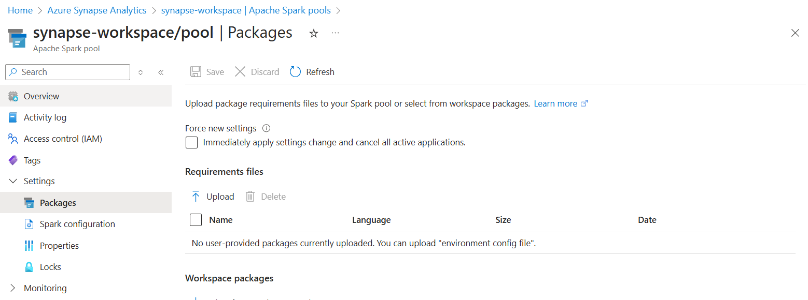

# Manage libraries for Apache Spark in Azure Synapse Analytics

Libraries provide reusable code that you may want to include in your programs or projects. To make third party or locally-built code available to your applications, you can install a library onto one of your serverless Apache Spark Pools (preview). Once a library is installed for a Spark pool, it is available for all sessions using the same pool. 

## Default Installation
Apache Spark in Azure Synapse Analytics has a full Anacondas install plus additional libraries. The full libraries list can be found at [Apache Spark version support](apache-spark-version-support.md). 

When a Spark instance starts up, these libraries will automatically be included. Additional Python and custom built packages can be added at the Spark pool (preview) level.


## Manage Python packages
Once you have identified the libraries that you would like to use for your Spark application, you can install them into a Spark pool (preview). 

 A *requirements.txt* file (output from the `pip freeze` command) can be used to upgrade the virtual environment. The packages listed in this file for install or upgrade are downloaded from PyPi at the time of pool startup. This requirements file is used every time a Spark instance is created from that Spark pool.

> [!IMPORTANT]
> - If the package you are installing is large or takes a long time to install, this affects the Spark instance start up time.
> - Packages which require compiler support at install time, such as GCC, are not supported.
> - Packages can not be downgraded, only added or upgraded.

### Requirements format

The following snippet shows the format for the requirements file. The PyPi package name is listed along with an exact version. This file follows the format described in the [pip freeze](https://pip.pypa.io/en/stable/reference/pip_freeze/) reference documentation. This example pins a specific version. 

```
absl-py==0.7.0
adal==1.2.1
alabaster==0.7.10
```

### Install Python packages
As you develop your Spark application, you may find that you need to update existing or install new libraries. Libraries can be updated during or after pool creation.

#### Install packages during pool creation
To install libraries onto a Spark pool (preview) during pool creation:
   
1. Navigate to your Azure Synapse Analytics workspace from the Azure portal.
   
2. Select **Create Apache Spark pool** and then select the **Additional Settings** tab. 
   
3. Upload the environment configuration file using the file selector in the **Packages** section of the page. 
   
    
 

#### Install packages from the Synapse Workspace
To update or add additional libraries to a Spark pool (preview) from the Azure Synapse Analytics portal:

1.  Navigate to your Azure Synapse Analytics workspace from the Azure portal.
   
2.  Launch your Azure Synapse Analytics workspace from the Azure portal.

3.  Select **Manage** from the main navigation panel and then select **Apache Spark pools**.
   
4. Select a single Spark pool and upload the environment configuration file using the file selector in the  **Packages** section of the page.

    
   
#### Install packages from the Azure portal
To install a library onto a Spark pool (preview) directly from the Azure portal:
   
 1. Navigate to your Azure Synapse Analytics workspace from the Azure portal.
   
 2. Under the **Synapse resources** section, select the **Apache Spark pools** tab and select a Spark pool from the list.
   
 3. Select **Packages** from the **Settings** section of the Spark pool. 

 4. Upload the environment configuration file using the file selector.

    

### Verify installed libraries

To verify if the correct versions of the correct libraries are installed run the following code

```python
import pip #needed to use the pip functions
for i in pip.get_installed_distributions(local_only=True):
    print(i)
```
### Update Python packages
Packages can be added or modified anytime between sessions. When a new package configuration file is uploaded, this will overwrite the existing packages and versions.  

To update or uninstall a library:
1. Navigate to your Azure Synapse Analytics workspace. 

2. Using the Azure portal or the Azure Synapse workspace, select the **Apache Spark pool** that you would like to update.

3. Navigate to the **Packages** section and upload a new environment configuration file
   
4. Once you save your changes, you will need to end active sessions and let the pool restart. Optionally, you can force active sessions to end by selecting the checkbox to **Force new settings**.

    
   

> [!IMPORTANT]
> By selecting the option to **Force new settings**, you will end the all current sessions for the selected Spark pool. Once the sessions are ended, you will have to wait for the pool to restart. 
>
> If this setting is unchecked, then you  will have to wait for the current Spark session to end or stop it manually. Once the session has ended, you will need to let the pool restart. 


## Manage a Python Wheel

### Install a custom Wheel file
Custom built wheel packages can be installed on the Apache Spark pool by uploading all the wheel files into the Azure Data Lake Storage (Gen2) account that is linked with the Synapse workspace. 

The files should be uploaded to the following path in the storage account's default container: 

```
abfss://<file_system>@<account_name>.dfs.core.windows.net/synapse/workspaces/<workspace_name>/sparkpools/<pool_name>/libraries/python/
```

>[!IMPORTANT]
>Custom packages can be added or modified between sessions. However, you will need to wait for the pool and session to restart to see the updated package.

## Next steps
- View the default libraries: [Apache Spark version support](apache-spark-version-support.md)
