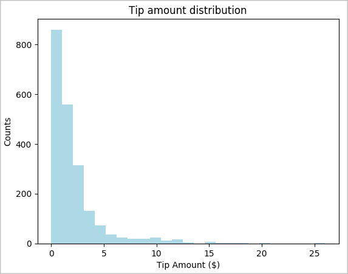
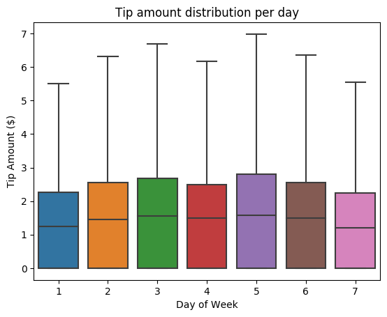
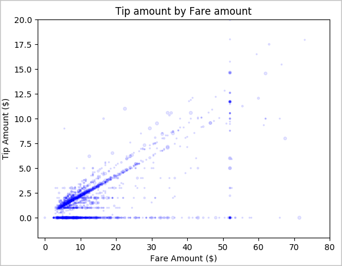

# Analyze data with Apache Spark

In this tutorial, you'll learn how to perform exploratory data analysis by using Azure Open Datasets and Apache Spark. You can then visualize the results in a Synapse Studio notebook in Azure Synapse Analytics.

In particular, we'll analyze the [New York City (NYC) Taxi](https://azure.microsoft.com/services/open-datasets/catalog/nyc-taxi-limousine-commission-yellow-taxi-trip-records/) dataset. The data is available through Azure Open Datasets. This subset of the dataset contains information about yellow taxi trips: information about each trip, the start and end time and locations, the cost, and other interesting attributes.
  
## Before you begin
Create an Apache Spark Pool by following the [Create an Apache Spark pool tutorial](../articles/../quickstart-create-apache-spark-pool-studio.md). 

## Download and prepare the data
1. Create a notebook by using the PySpark kernel. For instructions, see [Create a notebook](../quickstart-apache-spark-notebook.md#create-a-notebook). 
   
   > [!Note]
   > Because of the PySpark kernel, you don't need to create any contexts explicitly. The Spark context is automatically created for you when you run the first code cell.

2. In this tutorial, we'll use several different libraries to help us visualize the dataset. To do this analysis, import the following libraries: 

   ```python
   import matplotlib.pyplot as plt
   import seaborn as sns
   import pandas as pd
   ```

3. Because the raw data is in a Parquet format, you can use the Spark context to pull the file into memory as a DataFrame directly. Create a Spark DataFrame by retrieving the data via the Open Datasets API. Here, we use the Spark DataFrame *schema on read* properties to infer the datatypes and schema.

   ```python
   from azureml.opendatasets import NycTlcYellow
   from datetime import datetime
   from dateutil import parser

   end_date = parser.parse('2018-06-06')
   start_date = parser.parse('2018-05-01')
   nyc_tlc = NycTlcYellow(start_date=start_date, end_date=end_date)
   df = nyc_tlc.to_spark_dataframe()
   ```

4. After the data is read, we'll want to do some initial filtering to clean the dataset. We might remove unneeded columns and add columns that extract important information. In addition, we'll filter out anomalies within the dataset.

   ```python
   # Filter the dataset 
   from pyspark.sql.functions import *

   filtered_df = df.select('vendorID', 'passengerCount', 'tripDistance','paymentType', 'fareAmount', 'tipAmount'\
                                   , date_format('tpepPickupDateTime', 'hh').alias('hour_of_day')\
                                   , dayofweek('tpepPickupDateTime').alias('day_of_week')\
                                   , dayofmonth(col('tpepPickupDateTime')).alias('day_of_month'))\
                               .filter((df.passengerCount > 0)\
                                   & (df.tipAmount >= 0)\
                                   & (df.fareAmount >= 1) & (df.fareAmount <= 250)\
                                   & (df.tripDistance > 0) & (df.tripDistance <= 200))

   filtered_df.createOrReplaceTempView("taxi_dataset")
   ```

## Analyze data
As a data analyst, you have a wide range of tools available to help you extract insights from the data. In this part of the tutorial, we'll walk through a few useful tools available within Azure Synapse Analytics notebooks. In this analysis, we want to understand the factors that yield higher taxi tips for our selected period.

### Apache Spark SQL Magic 
First, we'll perform exploratory data analysis by Apache Spark SQL and magic commands with the Azure Synapse notebook. After we have our query, we'll visualize the results by using the built-in ```chart options``` capability. 

1. Within your notebook, create a new cell and copy the following code. By using this query, we want to understand how the average tip amounts have changed over the period we've selected. This query will also help us identify other useful insights, including the minimum/maximum tip amount per day and the average fare amount.
   
   ```sql
   %%sql
   SELECT 
       day_of_month
       , MIN(tipAmount) AS minTipAmount
       , MAX(tipAmount) AS maxTipAmount
       , AVG(tipAmount) AS avgTipAmount
       , AVG(fareAmount) as fareAmount
   FROM taxi_dataset 
   GROUP BY day_of_month
   ORDER BY day_of_month ASC
   ```

2. After our query finishes running, we can visualize the results by switching to the chart view. This example creates a line chart by specifying the ```day_of_month``` field as the key and ```avgTipAmount``` as the value. After you've made the selections, select **Apply** to refresh your chart. 
   
## Visualize data
In addition to the built-in notebook charting options, you can use popular open-source libraries to create your own visualizations. In the following examples, we'll use Seaborn and Matplotlib. These are commonly used Python libraries for data visualization. 

> [!Note]
> By default, every Apache Spark pool in Azure Synapse Analytics contains a set of commonly used and default libraries. You can view the full list of libraries in the [Azure Synapse runtime](../spark/apache-spark-version-support.md) documentation. In addition, to make third-party or locally built code available to your applications, you can [install a library](../spark/apache-spark-azure-portal-add-libraries.md) onto one of your Spark pools.

1. To make development easier and less expensive, we'll downsample the dataset. We'll use the built-in Apache Spark sampling capability. In addition, both Seaborn and Matplotlib require a Pandas DataFrame or NumPy array. To get a Pandas DataFrame, use the ```toPandas()``` command to convert the DataFrame.

   ```python
   # To make development easier, faster, and less expensive, downsample for now
   sampled_taxi_df = filtered_df.sample(True, 0.001, seed=1234)

   # The charting package needs a Pandas DataFrame or NumPy array to do the conversion
   sampled_taxi_pd_df = sampled_taxi_df.toPandas()
   ```

1. We  want to understand the distribution of tips in our dataset. We'll use Matplotlib to create a histogram that shows the distribution of tip amount and count. Based on the distribution, we can see that tips are skewed toward amounts less than or equal to $10.

   ```python
   # Look at a histogram of tips by count by using Matplotlib

   ax1 = sampled_taxi_pd_df['tipAmount'].plot(kind='hist', bins=25, facecolor='lightblue')
   ax1.set_title('Tip amount distribution')
   ax1.set_xlabel('Tip Amount ($)')
   ax1.set_ylabel('Counts')
   plt.suptitle('')
   plt.show()
   ```

   

1. Next, we want to understand the relationship between the tips for a given trip and the day of the week. Use Seaborn to create a box plot that summarizes the trends for each day of the week. 

   ```python
   # View the distribution of tips by day of week using Seaborn
   ax = sns.boxplot(x="day_of_week", y="tipAmount",data=sampled_taxi_pd_df, showfliers = False)
   ax.set_title('Tip amount distribution per day')
   ax.set_xlabel('Day of Week')
   ax.set_ylabel('Tip Amount ($)')
   plt.show()

   ```
   

4. Another hypothesis of ours might be that there's a positive relationship between the number of passengers and the total taxi tip amount. To verify this relationship, run the following code to generate a box plot that illustrates the distribution of tips for each passenger count. 
   
   ```python
   # How many passengers tipped by various amounts 
   ax2 = sampled_taxi_pd_df.boxplot(column=['tipAmount'], by=['passengerCount'])
   ax2.set_title('Tip amount by Passenger count')
   ax2.set_xlabel('Passenger count')
   ax2.set_ylabel('Tip Amount ($)')
   ax2.set_ylim(0,30)
   plt.suptitle('')
   plt.show()
   ```
   

1. Last, we want to understand the relationship between the fare amount and the tip amount. Based on the results, we can see that there are several observations where people don't tip. However, we also see a positive relationship between the overall fare and tip amounts.
   
   ```python
   # Look at the relationship between fare and tip amounts

   ax = sampled_taxi_pd_df.plot(kind='scatter', x= 'fareAmount', y = 'tipAmount', c='blue', alpha = 0.10, s=2.5*(sampled_taxi_pd_df['passengerCount']))
   ax.set_title('Tip amount by Fare amount')
   ax.set_xlabel('Fare Amount ($)')
   ax.set_ylabel('Tip Amount ($)')
   plt.axis([-2, 80, -2, 20])
   plt.suptitle('')
   plt.show()
   ```
   

## Shut down the Spark instance

After you finish running the application, shut down the notebook to release the resources. Either close the tab or select **End Session** from the status panel at the bottom of the notebook.

## See also

- [Overview: Apache Spark on Azure Synapse Analytics](apache-spark-overview.md)
- [Build a machine learning model with Apache SparkML](../spark/apache-spark-machine-learning-mllib-notebook.md)

## Next steps

- [Azure Synapse Analytics](../index.yml)
- [Apache Spark official documentation](https://spark.apache.org/docs/latest/)