# Create, develop, and maintain Synapse notebooks in Azure Synapse Analytics

A Synapse notebook is a web interface for you to create files that contain live code, visualizations, and narrative text. Notebooks are a good place to validate ideas and use quick experiments to get insights from your data. Notebooks are also widely used in data preparation, data visualization, machine learning, and other Big Data scenarios.

With a Synapse notebook, you can: 

* Get started with zero setup effort.
* Keep data secure with built-in enterprise security features.
* Analyze data across raw formats (CSV, txt, JSON, etc.), processed file formats (parquet, Delta Lake, ORC, etc.), and SQL tabular data files against Spark and SQL.
* Be productive with enhanced authoring capabilities and built-in data visualization.

This article describes how to use notebooks in Synapse Studio.


## Create a notebook

There are two ways to create a notebook. You can create a new notebook or import an existing notebook to a Synapse workspace from the **Object Explorer**. Synapse notebooks recognize standard Jupyter Notebook IPYNB files.


## Develop notebooks

Notebooks consist of cells, which are individual blocks of code or text that can be run independently or as a group.

We provide rich operations to develop notebooks:
+ [Add a cell](#add-a-cell)
+ [Set a primary language](#set-a-primary-language)
+ [Use multiple languages](#use-multiple-languages)
+ [Use temp tables to reference data across languages](#use-temp-tables-to-reference-data-across-languages)
+ [IDE-style IntelliSense](#ide-style-intellisense)
+ [Code Snippets](#code-snippets)
+ [Format text cell with toolbar buttons](#format-text-cell-with-toolbar-buttons)
+ [Undo/Redo cell operation](#undo-redo-cell-operation)
+ [Code cell commenting](#Code-cell-commenting)
+ [Move a cell](#move-a-cell)
+ [Delete a cell](#delete-a-cell)
+ [Collapse a cell input](#collapse-a-cell-input)
+ [Collapse a cell output](#collapse-a-cell-output)
+ [Notebook outline](#notebook-outline)

> [!NOTE]
> 
> In the notebooks, there is a SparkSession automatically created for you, stored in a variable called `spark`. Also there is a variable for SparkContext which is called `sc`. Users can access these variables directly and should not change the values of these variables.


<h3 id="add-a-cell">Add a cell</h3>

There are multiple ways to add a new cell to your notebook.

1. Hover over the space between two cells and select **Code** or **Markdown**.
    

2. Use [aznb Shortcut keys under command mode](#shortcut-keys-under-command-mode). Press **A** to insert a cell above the current cell. Press **B** to insert a cell below the current cell.

---

<h3 id="set-a-primary-language">Set a primary language</h3>

Synapse notebooks support four Apache Spark languages:

* PySpark (Python)
* Spark (Scala)
* Spark SQL
* .NET Spark (C#)
* SparkR (R)

You can set the primary language for new added cells from the dropdown list in the top command bar.

   


<h3 id="use-multiple-languages">Use multiple languages</h3>

You can use multiple languages in one notebook by specifying the correct language magic command at the beginning of a cell. The following table lists the  magic commands to switch cell languages.

|Magic command |Language | Description |  
|---|------|-----|
|%%pyspark| Python | Execute a **Python** query against Spark Context.  |
|%%spark| Scala | Execute a **Scala** query against Spark Context.  |  
|%%sql| SparkSQL | Execute a **SparkSQL** query against Spark Context.  |
|%%csharp | .NET for Spark C# | Execute a **.NET for Spark C#** query against Spark Context. |
|%%sparkr | R | Execute a **R** query against Spark Context. |

The following image is an example of how you can write a PySpark query using the **%%pyspark** magic command or a SparkSQL query with the **%%sql** magic command in a **Spark(Scala)** notebook. Notice that the primary language for the notebook is set to pySpark.

   


<h3 id="use-temp-tables-to-reference-data-across-languages">Use temp tables to reference data across languages</h3>

You cannot reference data or variables directly across different languages in a Synapse notebook. In Spark, a temporary table can be referenced across languages. Here is an example of how to read a `Scala` DataFrame in `PySpark` and `SparkSQL` using a Spark temp table as a workaround.

1. In Cell 1, read a DataFrame from a SQL pool connector using Scala and create a temporary table.

   ```scala
   %%spark
   val scalaDataFrame = spark.read.sqlanalytics("mySQLPoolDatabase.dbo.mySQLPoolTable")
   scalaDataFrame.createOrReplaceTempView( "mydataframetable" )
   ```

2. In Cell 2, query the data using Spark SQL.
   
   ```sql
   %%sql
   SELECT * FROM mydataframetable
   ```

3. In Cell 3, use the data in PySpark.

   ```python
   %%pyspark
   myNewPythonDataFrame = spark.sql("SELECT * FROM mydataframetable")
   ```

<h3 id="ide-style-intellisense">IDE-style IntelliSense</h3>

Synapse notebooks are integrated with the Monaco editor to bring IDE-style IntelliSense to the cell editor. Syntax highlight, error marker, and automatic code completions help you to write code and identify issues quicker.

The IntelliSense features are at different levels of maturity for different languages. Use the following table to see what's supported.

|Languages| Syntax Highlight | Syntax Error Marker  | Syntax Code Completion | Variable Code Completion| System Function Code Completion| User Function Code Completion| Smart Indent | Code Folding|
|--|--|--|--|--|--|--|--|--|
|PySpark (Python)|Yes|Yes|Yes|Yes|Yes|Yes|Yes|Yes|
|Spark (Scala)|Yes|Yes|Yes|Yes|Yes|Yes|-|Yes|
|SparkSQL|Yes|Yes|Yes|Yes|Yes|-|-|-|
|.NET for Spark (C#)|Yes|Yes|Yes|Yes|Yes|Yes|Yes|Yes|

>[!Note]
> An active Spark session is required to benefit the Variable Code Completion, System Function Code Completion，User Function Code Completion for .NET for Spark (C#).

<h3 id="code-snippets">Code Snippets</h3>

Synapse notebooks provide code snippets that make it easier to enter common used code patterns, such as configuring your Spark session, reading data as a Spark DataFrame, or drawing charts with matplotlib etc.

Snippets appear in [Shortcut keys of IDE style IntelliSense](#ide-style-intellisense) mixed with other suggestions. The code snippets contents align with the code cell language. You can see available snippets by typing **Snippet** or any keywords appear in the snippet title in the code cell editor. For example, by typing **read** you can see the list of snippets to read data from various data sources.


<h3 id="format-text-cell-with-toolbar-buttons">Format text cell with toolbar buttons</h3>

You can use the format buttons in the text cells toolbar to do common markdown actions. It includes bolding text, italicizing text,  paragraph/headers through a dropdown, inserting code, inserting unordered list, inserting ordered list, inserting hyperlink and inserting image from URL.

  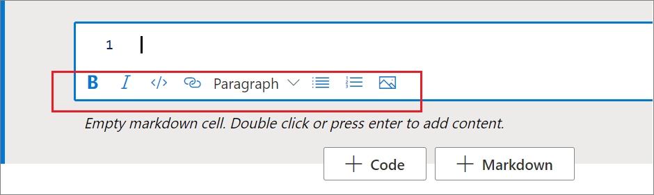

---

<h3 id="undo-redo-cell-operation">Undo/Redo cell operation</h3>

Select the **Undo** / **Redo** button or press **Z** / **Shift+Z** to revoke the most recent cell operations. Now you can undo/redo up to the latest 10 historical cell operations.

   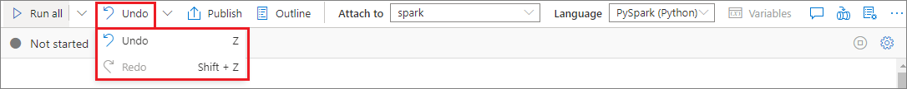

Supported undo cell operations:
+ Insert/Delete cell: You could revoke the delete operations by selecting **Undo**, the text content is kept along with the cell.
+ Reorder cell.
+ Toggle parameter.
+ Convert between Code cell and Markdown cell.

> [!NOTE]
> In-cell text operations and code cell commenting operations are not undoable.
> Now you can undo/redo up to the latest 10 historical cell operations.


---

<h3 id="Code-cell-commenting">Code cell commenting</h3>

1. Select **Comments** button on the notebook toolbar to open **Comments** pane.

   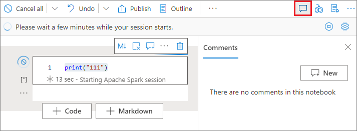

2. Select code in the code cell, click **New** in the **Comments** pane, add comments then click **Post comment** button to save.

   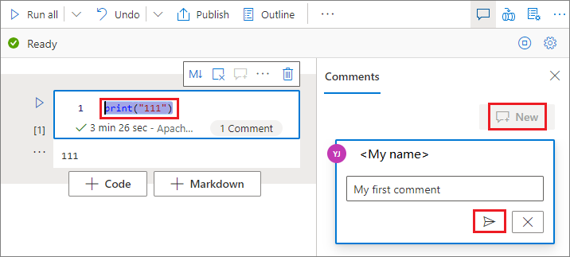

3. You could perform **Edit comment**, **Resolve thread**, or **Delete thread** by clicking the **More** button besides your comment. 

   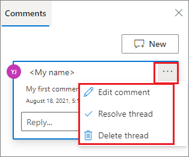

---

<h3 id="move-a-cell">Move a cell</h3>

Click on the left-hand side of a cell and drag it to the desired position. 
    

---

<h3 id="delete-a-cell">Delete a cell</h3>

To delete a cell, select the delete button at the right hand of the cell. 

You can also use [shortcut keys under command mode](#shortcut-keys-under-command-mode). Press **Shift+D** to delete the current cell. 

   

---

<h3 id="collapse-a-cell-input">Collapse a cell input</h3>

Select the **More commands** ellipses (...) on the cell toolbar and **Hide input** to collapse current cell's input. To expand it, Select the **Show input** while the cell is collapsed.

   

---

<h3 id="collapse-a-cell-output">Collapse a cell output</h3>

Select the **More commands** ellipses (...) on the cell toolbar and **Hide output** to collapse current cell's output. To expand it, select the **Show output** while the cell's output is hidden.

   


---

<h3 id="notebook-outline">Notebook outline</h3>

The Outlines (Table of Contents) presents the first markdown header of any markdown cell in a sidebar window for quick navigation. The Outlines sidebar is resizable and collapsible to fit the screen in the best ways possible. You can select the **Outline** button on the notebook command bar to open or hide sidebar

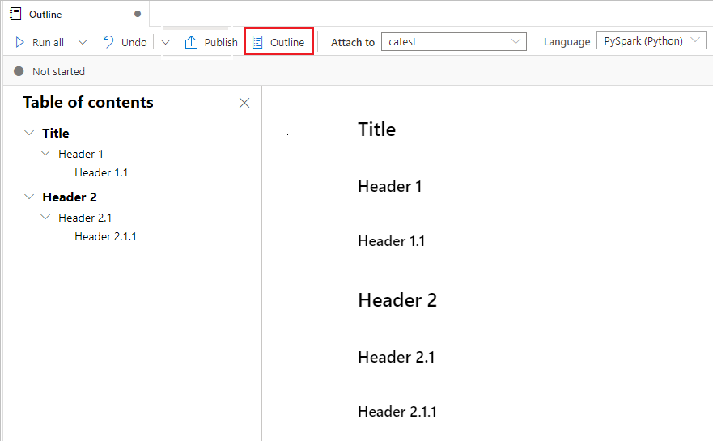

---


## Run notebooks

You can run the code cells in your notebook individually or all at once. The status and progress of each cell is represented in the notebook.

### Run a cell

There are several ways to run the code in a cell.

1. Hover on the cell you want to run and select the **Run Cell** button or press **Ctrl+Enter**.

   
  
2. Use [Shortcut keys under command mode](#shortcut-keys-under-command-mode). Press **Shift+Enter** to run the current cell and select the cell below. Press **Alt+Enter** to run the current cell and insert a new cell below.

---

### Run all cells
Select the **Run All** button to run all the cells in current notebook in sequence.

   


### Run all cells above or below

Expand the dropdown list from **Run all** button, then select **Run cells above** to run all the cells above the current in sequence. Select **Run cells below** to run all the cells below the current in sequence.

   

---

### Cancel all running cells

Select the **Cancel All** button to cancel the running cells or cells waiting in the queue. 
    

---

### Notebook reference

You can use ```%run <notebook path>``` magic command to reference another notebook within current notebook's context. All the variables defined in the reference notebook are available in the current notebook. ```%run``` magic command supports nested calls but not support recursive calls. You receive an exception if the statement depth is larger than **five**.  

Example:
``` %run /<path>/Notebook1 { "parameterInt": 1, "parameterFloat": 2.5, "parameterBool": true,  "parameterString": "abc" } ```.

Notebook reference works in both interactive mode and Synapse pipeline.

> [!NOTE]
> - ```%run``` command currently only supports to pass a absolute path or notebook name only as parameter, relative path is not supported. 
> - ```%run``` command currently only supports to 4 parameter value types: `int`, `float`, `bool`, `string`, variable replacement operation is not supported.
> - The referenced notebooks are required to be published. You need to publish the notebooks to reference them unless [Reference unpublished notebook](#reference-unpublished-notebook) is enabled. Synapse Studio does not recognize the unpublished notebooks from the Git repo.
> - Referenced notebooks do not support statement that depth is larger than **five**.
>

---

### Variable explorer

Synapse notebook provides a built-in variables explorer for you to see the list of the variables name, type, length, and value in the current Spark session for PySpark (Python) cells. More variables show up automatically as they are defined in the code cells. Clicking on each column header sorts the variables in the table.

You can select the **Variables** button on the notebook command bar to open or hide the variable explorer.

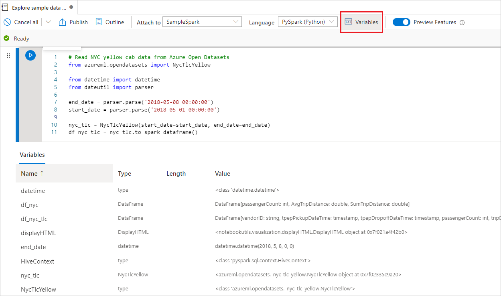

> [!NOTE]
> Variable explorer only supports python.

---

### Cell status indicator

A step-by-step cell execution status is displayed beneath the cell to help you see its current progress. Once the cell run is complete, an execution summary with the total duration and end time are shown and kept there for future reference.


### Spark progress indicator

Synapse notebook is purely Spark based. Code cells are executed on the serverless Apache Spark pool remotely. A Spark job progress indicator is provided with a real-time progress bar appears to help you understand the job execution status.
The number of tasks per each job or stage help you to identify the parallel level of your spark job. You can also drill deeper to the Spark UI of a specific job (or stage) via selecting the link on the job (or stage) name.


### Spark session configuration

You can specify the timeout duration, the number, and the size of executors to give to the current Spark session in **Configure session**. Restart the Spark session is for configuration changes to take effect. All cached notebook variables are cleared.

You can also create a configuration from the Apache Spark configuration or select an existing configuration. For details, please refer to [Apache Spark Configuration Management](../../synapse-analytics/spark/apache-spark-azure-create-spark-configuration.md).

[](./media/apache-spark-development-using-notebooks/synapse-azure-notebook-spark-session-management.png#lightbox)

#### Spark session configuration magic command
You can also specify spark session settings via a magic command **%%configure**. The spark session needs to restart to make the settings effect. We recommend you to run the **%%configure** at the beginning of your notebook. Here is a sample, refer to https://github.com/cloudera/livy#request-body for full list of valid parameters. 

```json
%%configure
{
    //You can get a list of valid parameters to config the session from https://github.com/cloudera/livy#request-body.
    "driverMemory":"28g", // Recommended values: ["28g", "56g", "112g", "224g", "400g", "472g"]
    "driverCores":4, // Recommended values: [4, 8, 16, 32, 64, 80]
    "executorMemory":"28g",
    "executorCores":4, 
    "jars":["abfs[s]://<file_system>@<account_name>.dfs.core.windows.net/<path>/myjar.jar","wasb[s]://<containername>@<accountname>.blob.core.windows.net/<path>/myjar1.jar"],
    "conf":{
    //Example of standard spark property, to find more available properties please visit:https://spark.apache.org/docs/latest/configuration.html#application-properties.
        "spark.driver.maxResultSize":"10g",
    //Example of customized property, you can specify count of lines that Spark SQL returns by configuring "livy.rsc.sql.num-rows".
        "livy.rsc.sql.num-rows":"3000" 
    }
}
```
> [!NOTE]
> - "DriverMemory" and "ExecutorMemory" are recommended to set as same value in %%configure, so do "driverCores" and "executorCores".
> - You can use %%configure in Synapse pipelines, but if it's not set in the first code cell, the pipeline run will fail due to cannot restart session.
> - The %%configure used in mssparkutils.notebook.run is going to be ignored but used in %run notebook will continue executing.
> - The standard Spark configuration properties must be used in the "conf" body. We do not support first level reference for the Spark configuration properties.
> - Some special spark properties including "spark.driver.cores", "spark.executor.cores", "spark.driver.memory", "spark.executor.memory", "spark.executor.instances" won't take effect in "conf" body.
>


#### Parameterized session configuration from pipeline  

Parameterized session configuration allows you to replace the value in %%configure magic with Pipeline run (Notebook activity) parameters. When preparing %%configure code cell, you can override default values (also configurable, 4 and "2000" in the below example) with an object like this:

```
{
      "activityParameterName": "paramterNameInPipelineNotebookActivity",
      "defaultValue": "defaultValueIfNoParamterFromPipelineNotebookActivity"
} 
```

```python
%%configure  

{ 
    "driverCores": 
    { 
        "activityParameterName": "driverCoresFromNotebookActivity", 
        "defaultValue": 4 
    }, 
    "conf": 
    { 
        "livy.rsc.sql.num-rows": 
        { 
            "activityParameterName": "rows", 
            "defaultValue": "2000" 
        } 
    } 
} 
```

Notebook uses default value if run a notebook in interactive mode directly or no parameter that match "activityParameterName" is given from Pipeline Notebook activity.

During the pipeline run mode, you can configure pipeline Notebook activity settings as below:
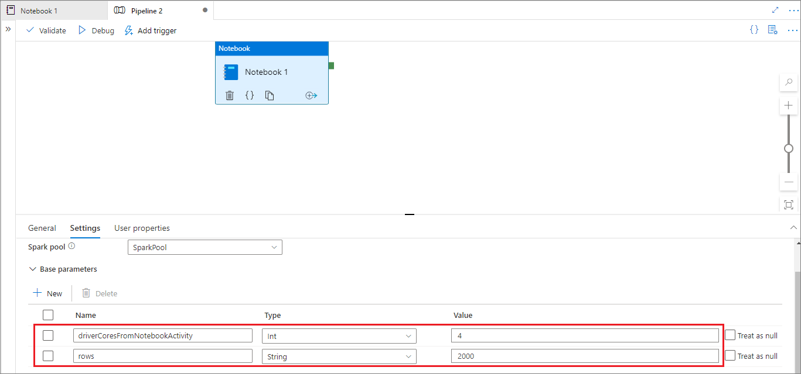

If you want to change the session configuration, pipeline Notebook activity parameters name should be same as activityParameterName in the notebook. When running this pipeline, in this example driverCores in %%configure will be replaced by 8 and livy.rsc.sql.num-rows will be replaced by 4000.

> [!NOTE]
>  If run pipeline failed because of using this new %%configure magic, you can check more error information by running %%configure magic cell in the interactive mode of the notebook. 
>


## Bring data to a notebook

You can load data from Azure Blob Storage, Azure Data Lake Store Gen 2, and SQL pool as shown in the code samples below.

### Read a CSV from Azure Data Lake Store Gen2 as a Spark DataFrame

```python
from pyspark.sql import SparkSession
from pyspark.sql.types import *
account_name = "Your account name"
container_name = "Your container name"
relative_path = "Your path"
adls_path = 'abfss://%s@%s.dfs.core.windows.net/%s' % (container_name, account_name, relative_path)

df1 = spark.read.option('header', 'true') \
                .option('delimiter', ',') \
                .csv(adls_path + '/Testfile.csv')

```

#### Read a CSV from Azure Blob Storage as a Spark DataFrame

```python

from pyspark.sql import SparkSession

# Azure storage access info
blob_account_name = 'Your account name' # replace with your blob name
blob_container_name = 'Your container name' # replace with your container name
blob_relative_path = 'Your path' # replace with your relative folder path
linked_service_name = 'Your linked service name' # replace with your linked service name

blob_sas_token = mssparkutils.credentials.getConnectionStringOrCreds(linked_service_name)

# Allow SPARK to access from Blob remotely

wasb_path = 'wasbs://%s@%s.blob.core.windows.net/%s' % (blob_container_name, blob_account_name, blob_relative_path)

spark.conf.set('fs.azure.sas.%s.%s.blob.core.windows.net' % (blob_container_name, blob_account_name), blob_sas_token)
print('Remote blob path: ' + wasb_path)

df = spark.read.option("header", "true") \
            .option("delimiter","|") \
            .schema(schema) \
            .csv(wasbs_path)
```

### Read data from the primary storage account

You can access data in the primary storage account directly. There's no need to provide the secret keys. In Data Explorer, right-click on a file and select **New notebook** to see a new notebook with data extractor autogenerated.


## IPython Widgets

Widgets are eventful Python objects that have a representation in the browser, often as a control like a slider, textbox etc. IPython Widgets only works in Python environment, it's not supported in other languages (for example, Scala, SQL, C#) yet. 

### To use IPython Widget
1. You need to import `ipywidgets` module first to use the Jupyter Widget framework.
   ```python
   import ipywidgets as widgets
   ```
2. You can use top-level `display` function to render a widget, or leave an expression of **widget** type at the last line of code cell.
   ```python
   slider = widgets.IntSlider()
   display(slider)
   ```

   ```python
   slider = widgets.IntSlider()
   slider
   ```
   
3. Run the cell, the widget displays at the output area.

   

4. You can use multiple `display()` calls to render the same widget instance multiple times, but they remain in sync with each other.

   ```python
   slider = widgets.IntSlider()
   display(slider)
   display(slider)
   ```

   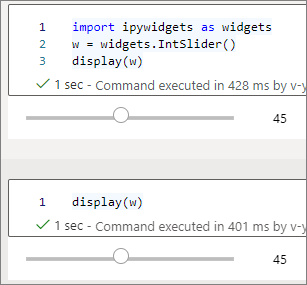

5. To render two widgets independent of each other, create two widget instances:

   ```python
   slider1 = widgets.IntSlider()
   slider2 = widgets.IntSlider()
   display(slider1)
   display(slider2)
   ```


### Supported widgets

|Widgets Type|Widgets|
|--|--|
|Numeric widgets|IntSlider, FloatSlider, FloatLogSlider, IntRangeSlider, FloatRangeSlider, IntProgress, FloatProgress, BoundedIntText, BoundedFloatText, IntText, FloatText|
|Boolean widgets|ToggleButton, Checkbox, Valid|
|Selection widgets|Dropdown, RadioButtons, Select, SelectionSlider, SelectionRangeSlider, ToggleButtons, SelectMultiple|
|String Widgets|Text, Text area, Combobox, Password, Label, HTML, HTML Math, Image, Button|
|Play (Animation) widgets|Date picker, Color picker, Controller|
|Container/Layout widgets|Box, HBox, VBox, GridBox, Accordion, Tabs, Stacked|


### Known limitations

1. The following widgets are not supported yet, you could follow the corresponding workaround as below:

   |Functionality|Workaround|
   |--|--|
   |`Output` widget|You can use `print()` function instead to write text into stdout.|
   |`widgets.jslink()`|You can use `widgets.link()` function to link two similar widgets.|
   |`FileUpload` widget| Not support yet.|

2. Global `display` function provided by Synapse does not support displaying multiple widgets in one call (that is, `display(a, b)`), which is different from IPython `display` function.
3. If you close a notebook that contains IPython Widget, you will not be able to see or interact with it until you execute the corresponding cell again.


---
## Save notebooks

You can save a single notebook or all notebooks in your workspace.

1. To save changes you made to a single notebook, select the **Publish** button on the notebook command bar.

   

2. To save all notebooks in your workspace, select the **Publish all** button on the workspace command bar. 

   

In the notebook properties, you can configure whether to include the cell output when saving.

   

<!--
## Export a notebook
You can Export your notebook to other standard formats. Synapse notebook supports to be exported into: 

+ Standard Notebook file(.ipynb) that is usually used for Jupyter notebooks. 
+ HTML file(.html) that can be opened from browser directly.  
+ Python file(.py).  
+ Latex file(.tex).  

   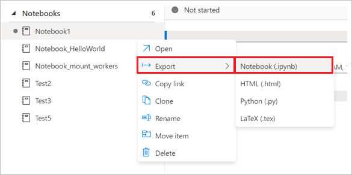

-->

## Magic commands
You can use familiar Jupyter magic commands in Synapse notebooks. Review the following list as the current available magic commands. Tell us [your use cases on GitHub](https://github.com/MicrosoftDocs/azure-docs/issues/new) so that we can continue to build out more magic commands to meet your needs.

> [!NOTE]
> Only following magic commands are supported in Synapse pipeline : %%pyspark, %%spark, %%csharp, %%sql. 
>


Available line magics:
[%lsmagic](https://ipython.readthedocs.io/en/stable/interactive/magics.html#magic-lsmagic), [%time](https://ipython.readthedocs.io/en/stable/interactive/magics.html#magic-time), [%timeit](https://ipython.readthedocs.io/en/stable/interactive/magics.html#magic-timeit), [%history](https://ipython.readthedocs.io/en/stable/interactive/magics.html#magic-history), [%run](#notebook-reference), [%load](https://ipython.readthedocs.io/en/stable/interactive/magics.html#magic-load)

Available cell magics:
[%%time](https://ipython.readthedocs.io/en/stable/interactive/magics.html#magic-time), [%%timeit](https://ipython.readthedocs.io/en/stable/interactive/magics.html#magic-timeit), [%%capture](https://ipython.readthedocs.io/en/stable/interactive/magics.html#cellmagic-capture), [%%writefile](https://ipython.readthedocs.io/en/stable/interactive/magics.html#cellmagic-writefile), [%%sql](#use-multiple-languages), [%%pyspark](#use-multiple-languages), [%%spark](#use-multiple-languages), [%%csharp](#use-multiple-languages), [%%html](https://ipython.readthedocs.io/en/stable/interactive/magics.html#cellmagic-html), [%%configure](#spark-session-configuration-magic-command)

--- 


<h2 id="reference-unpublished-notebook">Reference unpublished notebook</h2>


Reference unpublished notebook is helpful when you want to debug "locally", when enabling this feature, notebook run fetches the current content in web cache, if you run a cell including a reference notebooks statement, you reference the presenting notebooks in the current notebook browser instead of a saved versions in cluster, that means the changes in your notebook editor can be referenced immediately by other notebooks without having to be published(Live mode) or committed(Git mode), by leveraging this approach you can easily avoid common libraries getting polluted during developing or debugging process. 

You can enable Reference unpublished notebook from Properties panel: 

   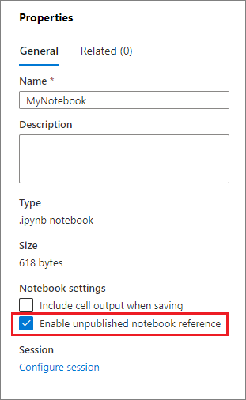


For different cases comparison please check the table below:  

Notice that [%run](./apache-spark-development-using-notebooks.md) and [mssparkutils.notebook.run](./microsoft-spark-utilities.md) has same behavior here. We use `%run` here as an example. 

|Case|Disable|Enable| 
|----|-------|------| 
|**Live Mode**||| 
|- Nb1 (Published) <br/> `%run Nb1`|Run published version of Nb1|Run published version of Nb1| 
|- Nb1 (New) <br/> `%run Nb1`|Error|Run new Nb1| 
|- Nb1 (Previously published, edited) <br/> `%run Nb1`|Run **published** version of Nb1|Run **edited** version of Nb1| 
|**Git Mode**||| 
|- Nb1 (Published) <br/> `%run Nb1`|Run published version of Nb1|Run published version of Nb1| 
|- Nb1 (New) <br/> `%run Nb1`|Error|Run new Nb1| 
|- Nb1 (Not published, committed) <br/> `%run Nb1`|Error|Run committed Nb1| 
|- Nb1 (Previously published, committed) <br/> `%run Nb1`|Run **published** version of Nb1|Run **committed** version of Nb1| 
|- Nb1 (Previously published, new in current branch) <br/> `%run Nb1`|Run **published** version of Nb1|Run **new** Nb1| 
|- Nb1 (Not published, previously committed, edited) <br/> `%run Nb1`|Error|Run **edited** version of Nb1| 
|- Nb1 (Previously published and committed, edited) <br/> `%run Nb1`|Run **published** version of Nb1|Run **edited** version of Nb1| 

 
### Conclusion 

* If disabled, always run **published** version. 
* If enabled, priority is: edited / new > committed > published. 


## Active session management 

You can reuse your notebook sessions conveniently now without having to start new ones. Synapse notebook now supports managing your active sessions in the **Manage sessions** list, you can see all the sessions in the current workspace started by you from notebook.

   

In the **Active sessions**, list you can see the session information and the corresponding notebook that is currently attached to the session. You can operate Detach with notebook, Stop the session, and View in monitoring from here. Moreover, you can easily connect your selected notebook to an active session in the list started from another notebook, the session is detached from the previous notebook (if it's not idle) then attach to the current one.

   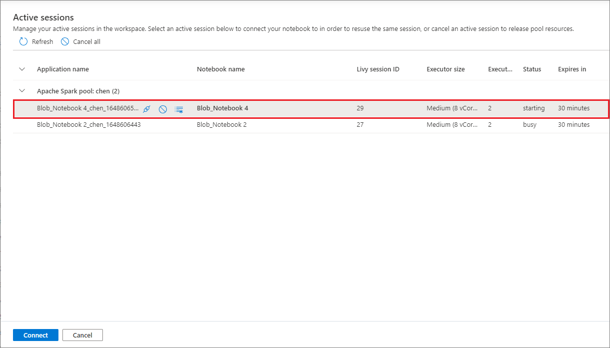


## Python logging in Notebook

You can find Python logs and set different log levels and format following the sample code below: 

```python
import logging

# Customize the logging format for all loggers
FORMAT = "%(asctime)s - %(name)s - %(levelname)s - %(message)s"
formatter = logging.Formatter(fmt=FORMAT)
for handler in logging.getLogger().handlers:
    handler.setFormatter(formatter)

# Customize log level for all loggers
logging.getLogger().setLevel(logging.INFO)

# Customize the log level for a specific logger
customizedLogger = logging.getLogger('customized')
customizedLogger.setLevel(logging.WARNING)

# logger that use the default global log level
defaultLogger = logging.getLogger('default')
defaultLogger.debug("default debug message")
defaultLogger.info("default info message")
defaultLogger.warning("default warning message")
defaultLogger.error("default error message")
defaultLogger.critical("default critical message")

# logger that use the customized log level
customizedLogger.debug("customized debug message")
customizedLogger.info("customized info message")
customizedLogger.warning("customized warning message")
customizedLogger.error("customized error message")
customizedLogger.critical("customized critical message")
```

## Integrate a notebook

### Add a notebook to a pipeline

Select the **Add to pipeline** button on the upper right corner to add a notebook to an existing pipeline or create a new pipeline.


### Designate a parameters cell

To parameterize your notebook, select the ellipses (...) to access the **more commands** at the cell toolbar. Then select **Toggle parameter cell** to designate the cell as the parameters cell.


---

Azure Data Factory looks for the parameters cell and treats this cell as defaults for the parameters passed in at execution time. The execution engine adds a new cell beneath the parameters cell with input parameters in order to overwrite the default values. 


### Assign parameters values from a pipeline

Once you've created a notebook with parameters, you can execute it from a pipeline with the Synapse Notebook activity. After you add the activity to your pipeline canvas, you will be able to set the parameters values under **Base parameters** section on the **Settings** tab. 


When assigning parameter values, you can use the [pipeline expression language](../../data-factory/control-flow-expression-language-functions.md) or [system variables](../../data-factory/control-flow-system-variables.md).


## Shortcut keys

Similar to Jupyter Notebooks,  Synapse notebooks have a modal user interface. The keyboard does different things depending on which mode the notebook cell is in. Synapse notebooks support the following two modes for a given code cell: command mode and edit mode.

1. A cell is in command mode when there is no text cursor prompting you to type. When a cell is in Command mode, you can edit the notebook as a whole but not type into individual cells. Enter command mode by pressing `ESC` or using the mouse to select outside of a cell's editor area.

   

2. Edit mode is indicated by a text cursor prompting you to type in the editor area. When a cell is in edit mode, you can type into the cell. Enter edit mode by pressing `Enter` or using the mouse to select on a cell's editor area.
   
   

### Shortcut keys under command mode

| Action |Synapse notebook Shortcuts  |
|--|--|
|Run the current cell and select below | Shift+Enter |
|Run the current cell and insert below | Alt+Enter |
|Run current cell| Ctrl+Enter |
|Select cell above| Up |
|Select cell below| Down |
|Select previous cell| K |
|Select next cell| J |
|Insert cell above| A |
|Insert cell below| B |
|Delete selected cells| Shift+D |
|Switch to edit mode| Enter |

---

### Shortcut keys under edit mode


Using the following keystroke shortcuts, you can more easily navigate and run code in Synapse notebooks when in Edit mode.

| Action |Synapse notebook shortcuts  |
|--|--|
|Move cursor up | Up |
|Move cursor down|Down|
|Undo|Ctrl + Z|
|Redo|Ctrl + Y|
|Comment/Uncomment|Ctrl + /|
|Delete word before|Ctrl + Backspace|
|Delete word after|Ctrl + Delete|
|Go to cell start|Ctrl + Home|
|Go to cell end |Ctrl + End|
|Go one word left|Ctrl + Left|
|Go one word right|Ctrl + Right|
|Select all|Ctrl + A|
|Indent| Ctrl +]|
|Dedent|Ctrl + [|
|Switch to command mode| Esc |

---

## Next steps
- [Check out Synapse sample notebooks](https://github.com/Azure-Samples/Synapse/tree/master/Notebooks)
- [Quickstart: Create an Apache Spark pool in Azure Synapse Analytics using web tools](../quickstart-apache-spark-notebook.md)
- [What is Apache Spark in Azure Synapse Analytics](apache-spark-overview.md)
- [Use .NET for Apache Spark with Azure Synapse Analytics](spark-dotnet.md)
- [.NET for Apache Spark documentation](/previous-versions/dotnet/spark/what-is-apache-spark-dotnet)
- [Azure Synapse Analytics](../index.yml)
