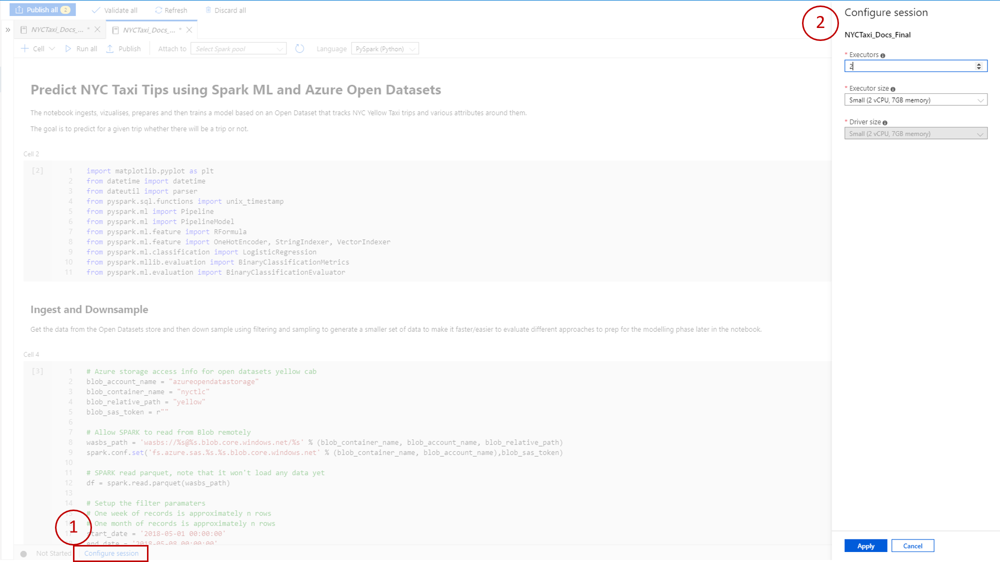
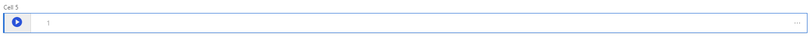
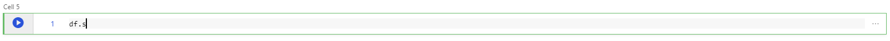
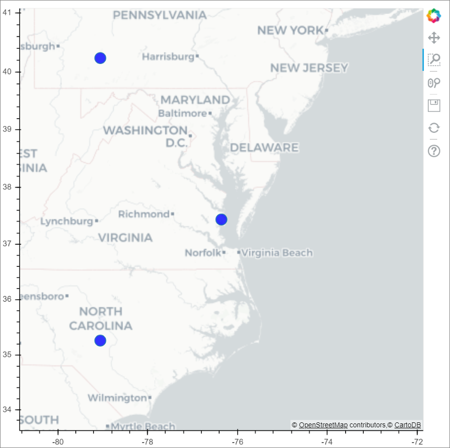
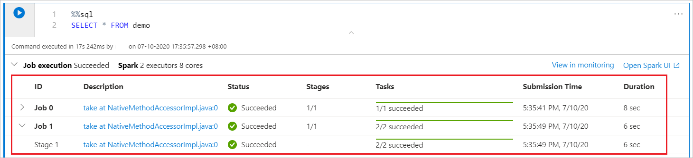

# Using Synapse Analytics Studio Notebook 

This document highlights following capabilities in Synapse Analytics Studio Notebook:


## Spark Session Config
You can specify the number and the size of executors to give to current Spark session in `spark session configuration`. Restarting of spark session is required for the changes to take effect. All cached notebook variables will be cleared.


[back to top](#using-synapse-analytics-studio-notebook)

## Magic Commands
Synapse Analytics Studio Notebook allows you to write multiple languages in one notebook. You can use following magic commands to switch the cell level language.

|Magic Commands |Language | Description |  
|---|------|-----|
|%%pyspark| Python | Execute `Python` query against Spark Context.  |
|%%spark| Scala | Execute `Scala` query against Spark Context.  |  
|%%sql| SparkSQL | Execute `SparkSQL` query against Spark Context.  |
|%%csharp | Spark.NET C# | Execute `Spark.NET C#` query against Spark Context. |

For example, you can write Scala query with `%%spark` or SparkSQL query with `%%sql` in a `pyspark` notebook:


You cannot reference data or variables directly cross different languages in Synapse Analytics Studio Notebook. In Spark, a temporary table can be referenced across languages. Here is an example of reading a `Scala` DataFrame in `PySpark` and `SparkSQL` using Spark Temp Table as a workaround.

Cell 1, read a DataFrame from SQL DW connector using Scala and create a temperate table
```
%%scala
val scalaDataFrame = spark.read.option(“format”, “DW connector predefined type”)
scalaDataFrame.registerTempTable( "mydataframetable" )
```
Cell 2, use data in Spark SQL
```
%%sql
SELECT * FROM mydataframetable

```
Cell 3, use data in PySpark
```
%%pyspark
myNewPythonDataFrame = spark.sql(“SELECT * FROM mydataframetable”)
```
[back to top](#using-synapse-analytics-studio-notebook)

## Language Service


|Languages| Syntax Highlight | Syntax Error Marker  | Syntax Code Completion | Variable Code Completion| System Function Code Completion| User Function Code Completion| Smart Indent | Code Folding|
|--|--|--|--|--|--|--|--|--|
|PySpark (Python)|Y|Y|Y|Y|Y|Y|Y|Y|
|SparkSQL|Y|Y|--|--|--|--|--|--|
|Spark (Scala)|Y|Y|Y|Y|--|--|--|Y|
|Spark.NET (C#)|Y|--|--|--|--|--|--|--|


[back to top](#using-synapse-analytics-studio-notebook)

## Shortcut Keys

Same with Jupyter Notebook, Synapse Analytics Studio Notebook has a modal user interface. The keyboard does different things depending on which mode the Notebook cell is in. Synapse Analytics Studio Notebook supports following two modes for a given code cell:
- Command Mode. Command mode is indicated by a blue cell border. 

    When a cell is in Command mode, you can edit the notebook as a whole but not type into individual cells. Enter command mode by pressing `ESC` or using the mouse to click outside of a cell's editor area.
- Edit Mode. Edit mode is indicated by a green cell border and prompt showing in the editor area.
 
    When a cell is in edit mode, you cant type into the cell. Enter edit mode by pressing `Enter` or using the mouse to click on a cell's editor area.


### Shortcut Keys under Command Mode
| Action |Synapse Analytics Studio Notebook Shortcuts  |
|--|--|
|Run the current cell and select below | Shift+Enter |
|Run the current cell and insert below | Alt+Enter |
|Select cell above| Up |
|Select cell below| Down |
|Insert cell above| A |
|Insert cell below| B |
|Extend selected cells above| Shift+Up |
|Extend selected cells below| Shift+Down|
|Delete selected cells|D,D|
|Switch to edit mode| Enter |


### Shortcut Keys under Edit Mode
| Action |Synapse Analytics Studio Notebook Shortcuts  |
|--|--|
|Move cursor up | Up |
|Move cursor down|Down|
|Undo|Ctrl + Z|
|Redo|Ctrl + Y|
|Comment/Uncomment|Ctrl + /|
|Delete word before|Ctrl + Backspace|
|Delete word after|Ctrl + Delete|
|Go to cell start|Ctrl + Home|
|Go to cell end |Ctrl + End|
|Go one word left|Ctrl + Left|
|Go one word right|Ctrl + Right|
|Select all|Ctrl + A|
|Indent| Ctrl + ]|
|Dedent|Ctrl + [|
|Switch to command mode| Esc |

[back to top](#using-synapse-analytics-studio-notebook)


## Visualization

### display()
 A tabular results view is provided with built-in bar chart, line chart, pie chart, scatter chart, and area chart. You can visualize your data without having to write code. The charts can be customized in the Chart Options. The output of `%%sql` magic commands will appear in the rendered table view by default. For Spark DataFrames or RDDs you can call the `display(<DataFrame name>)` function to produce the rendered table view.


### displayHTML()
You can also use `displayHTML()` function to render HTML or interactive libraries like `bokeh`.

Here is an example of using `bokeh` to show the passengers drop off density of new york city green taxi data.
 




```python
# Bokeh code sample 
# view the dropoff density of new york city green taxi in geographic map
 
# importing plotting pacakges
from bokeh.plotting import figure, show, output_file
from bokeh.tile_providers import get_provider, Vendors
from bokeh.models import BoxZoomTool
from bokeh.embed import components, file_html
from bokeh.resources import CDN
 
# define a base image
NYC = x_range, y_range = ((-8242000,-8210000), (4965000,4990000))
 
plot_width = int(750)
plot_height = int(plot_width//1.2)
 
def base_plot(tools='pan, wheel_zoom, reset', plot_width=plot_width, plot_height=plot_height, **plot_args):
 p = figure(tools=tools, plot_width=plot_width, plot_height=plot_height,
 x_range=x_range, y_range=y_range, x_axis_type="mercator", y_axis_type="mercator")
 
 tile_provider = get_provider(Vendors.CARTODBPOSITRON)
 p.add_tile(tile_provider)
 
 p.axis.visible = True
 p.xgrid.grid_line_color = None
 p.ygrid.grid_line_color = None
 
 p.xaxis.axis_label = "drop off longtitude"
 p.yaxis.axis_label = "drop off latitude"
 return p
 
options = dict(line_color=None, fill_color='blue', size=3)

p = base_plot()
 
# sample data to plot
samples = nyc_green_taxi_df.sample(True, 0.001, seed=10)
 
# convert geographical coordinates (longtitude,latitude) to web mercator coordinates
samplesmercator = samples.withColumn('dropoffLongitudemer',col('dropoffLongitude')*6378137 * 3.14159 / 180)\
 .withColumn('dropoffLatitudemer',log(tan((col('dropoffLatitude')+90) * 3.14159/360))*6378137)
 
# convert spark dataframe columns to list
x = samplesmercator.select('dropoffLongitudemer').rdd.flatMap(lambda x:x).collect()
y = samplesmercator.select('dropoffLatitudemer').rdd.flatMap(lambda x:x).collect()
 
# draw pick up points on 
p.circle(x=x, y=y, **options)
 
# create an html document that embeds the Bokeh plot
html = file_html(p, CDN, "my plot1")
 
# display this html
displayHTML(html)

```


[back to top](#using-synapse-analytics-studio-notebook)


## Spark Progress Indicator

A Spark job progress indicator is provided with a real-time progress bar appears to help you understand the job execution status.


[back to top](#using-synapse-analytics-studio-notebook)


## Next steps

Check this sample notebook for more details: links to be added.