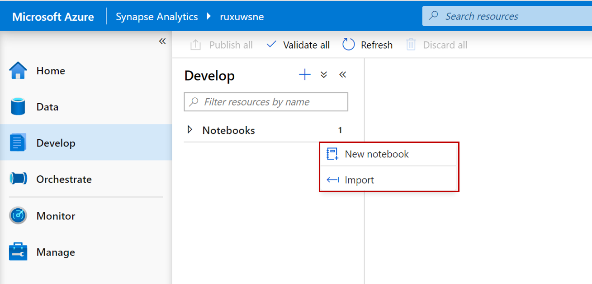
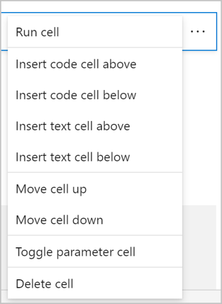
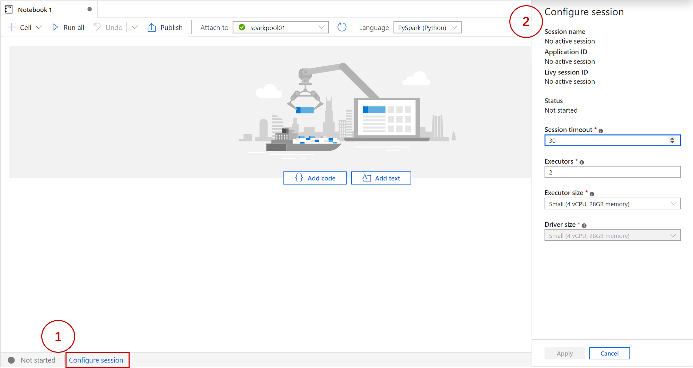
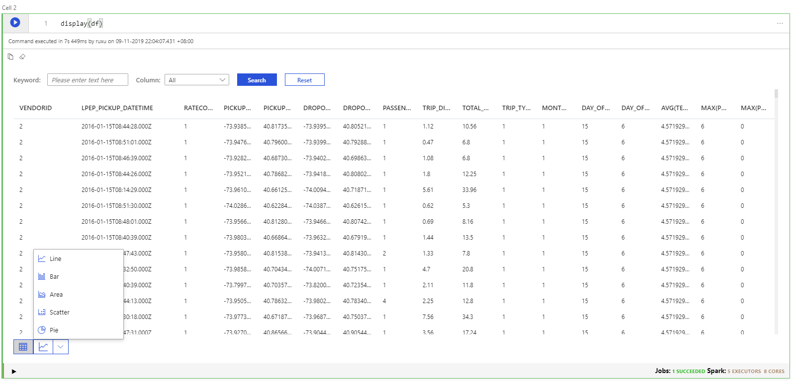
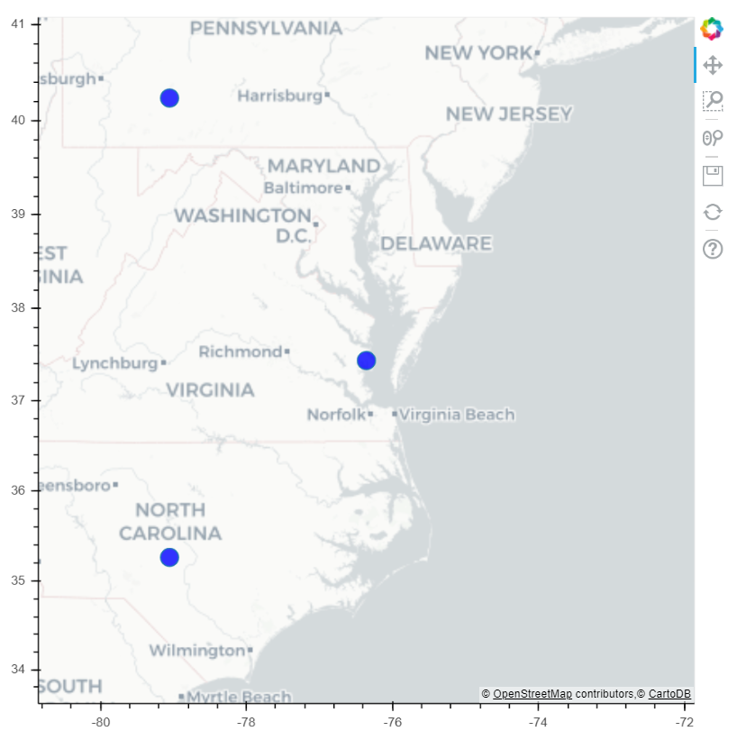
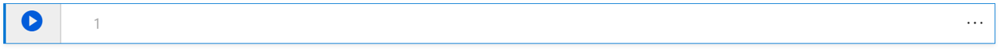
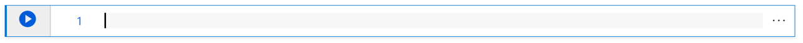

# Create, develop, and maintain Azure Synapse Studio notebooks

An Azure Synapse Studio notebook is a web interface for you to create files that contain live code, visualizations, and narrative text. Notebooks are a good place to validate ideas and use quick experiments to get insights from your data. Notebooks are also widely used in data preparation, data visualization, machine learning, and other Big Data scenarios.

With an Azure Synapse Studio notebook, you can:

* Get started with zero setup effort.
* Keep data secure with built-in enterprise security features.
* Analyze data across raw formats (CSV, txt, JSON, etc.), processed file formats (parquet, Delta Lake, ORC, etc.), and SQL tabular data files against Spark and SQL.
* Be productive with enhanced authoring capabilities and built-in data visualization.

This article describes how to use notebooks in Azure Synapse Studio.

## Create a notebook

There are two ways to create a notebook. You can create a new notebook or import an existing notebook to an Azure Synapse workspace from the **Object Explorer**. Azure Synapse Studio notebooks can recognize standard Jupyter Notebook IPYNB files.



## Develop notebooks

Notebooks consist of cells, which are individual blocks of code or text that can be ran independently or as a group.

### Add a cell

There are multiple ways to add a new cell to your notebook.

1. Expand the upper left **+ Cell** button, and select **Add code cell** or **Add text cell**.

   

2. Hover over the space between two cells and select **Add code** or **Add text**.

   

3. Access the notebook cell menu at the far right by selecting the ellipses **...**. Then, select one of the following menu options:

   * **Insert code cell above**
   * **Insert code cell below**
   * **Insert text cell above**
   * **Insert code text cell below**

   

4. Use [Shortcut keys](#shortcut-keys-under-command-mode).

### Set a primary language

Azure Synapse Studio notebooks support four spark languages:

* pyspark (python)
* spark (Scala)
* sparkSQL
* Spark.NET (C#)

You can set the primary language for new added cells from the dropdown list in the top command bar.


### Use multiple languages

You can use multiple languages in one notebook by specifying the correct language magic command at the beginning of a cell. The following table lists the available magic commands.

|Magic command |Language | Description |  
|---|------|-----|
|%%pyspark| Python | Execute a **Python** query against Spark Context.  |
|%%spark| Scala | Execute a **Scala** query against Spark Context.  |  
|%%sql| SparkSQL | Execute a **SparkSQL** query against Spark Context.  |
|%%csharp | Spark.NET C# | Execute a **Spark.NET C#** query against Spark Context. |

The following image is an example of how you can write a Scala query using the **%%spark** magic command or a SparkSQL query with the **%%sql** magic command in a **pyspark** notebook. Notice that the primary language for the notebook is set to PySpark.


### Use temp tables to reference data across languages

You cannot reference data or variables directly across different languages in a Synapse Studio notebook. In Spark, a temporary table can be referenced across languages. Here is an example of how to read a `Scala` DataFrame in `PySpark` and `SparkSQL` using a Spark temp table as a workaround.

1. In Cell 1, read a DataFrame from SQL DW connector using Scala and create a temporary table.

   ```scala
   %%scala
   val scalaDataFrame = spark.read.option(“format”, “DW    connector predefined type”)
   scalaDataFrame.registerTempTable( "mydataframetable" )
   ```

2. In Cell 2, query the data using Spark SQL.
   
   ```sql
   %%sql
   SELECT * FROM mydataframetable
   ```

3. In Cell 3, use the data in PySpark.

   ```python
   %%pyspark
   myNewPythonDataFrame = spark.sql("SELECT * FROM mydataframetable")
   ```

### IDE-style IntelliSense

Azure Synapse Studio notebooks are integrated with the Monaco editor to bring IDE-style IntelliSense to the cell editor. Syntax highlight, error maker, and automatic code completions help you to write code and identify issues quicker.

The IntelliSense features are at different levels of maturity for different languages. Use the table below to see what's supported.

|Languages| Syntax Highlight | Syntax Error Marker  | Syntax Code Completion | Variable Code Completion| System Function Code Completion| User Function Code Completion| Smart Indent | Code Folding|
|--|--|--|--|--|--|--|--|--|
|PySpark (Python)|Yes|Yes|Yes|Yes|Yes|Yes|Yes|Yes|
|Spark (Scala)|Yes|Yes|Yes|Yes|-|-|-|Yes|
|SparkSQL|Yes|Yes|-|-|-|-|-|-|
|Spark.NET (C#)|Yes|-|-|-|-|-|-|-|

## Run notebooks

You can run the code cells in your notebook individually or all at once. The status and progress of each cell is represented in the notebook.

### Run cells

There are several ways to run the code in a cell.

1. Hover on the cell you want to run and select the **Run Cell** button or press **Ctrl+Enter**.

   

2. To Access the notebook cell menu at the far right, select the ellipses (**...**). Then, select **Run cell**.

   

3. Select the **Run All** button to run all the cells in current notebook in sequence.

   

### Cell status indicator

A step-by-step cell execution status is displayed beneath the cell to help you see its current progress. Once the cell run is complete, an execution summary with the total duration and end time are shown and kept there for future reference.


### Spark progress indicator

Azure Synapse Studio notebook is purely Spark based. Code cells are executed on the Spark pool remotely. A Spark job progress indicator is provided with a real-time progress bar appears to help you understand the job execution status.


### Spark session config

You can specify the number and the size of executors to give to the current Spark session in **Configure session**. You must restart the Spark session is for configuration changes to take effect. All cached notebook variables are cleared.



## Bring data to a notebook

You can load data from Azure Blob Storage, Azure Data Lake Store Gen 2, and SQL Data Warehouse as shown in the code samples below.

### Read a CSV from Azure Data Lake Store Gen2 as a Spark DataFrame

```python
from pyspark.sql import SparkSession
from pyspark.sql.types import *
account_name = "Your account name"
container_name = "Your container name"
relative_path = "Your path"
adls_path = 'abfss://%s@%s.dfs.core.windows.net/%s' % (blob_container_name, blob_account_name,  blob_relative_path)

spark.conf.set("fs.azure.account.auth.type.%s.dfs.core.windows.net" %account_name, "SharedKey")
spark.conf.set("fs.azure.account.key.%s.dfs.core.windows.net" %account_name ,"Your ADLSg2 Primary Key")

df1 = spark.read.option('header', 'true') \
                .option('delimiter', ',') \
                .csv(adls_path + '/Testfile.csv')

```

#### Read a CSV from Azure Blob Storage as a Spark DataFrame

```python

from pyspark.sql import SparkSession
from pyspark.sql.types import *

blob_account_name = "Your blob account name"
blob_container_name = "Your blob container name"
blob_relative_path = "Your blob relative path"
blob_sas_token = "Your blob sas token"

wasbs_path = 'wasbs://%s@%s.blob.core.windows.net/%s' % (blob_container_name, blob_account_name, blob_relative_path)
spark.conf.set('fs.azure.sas.%s.%s.blob.core.windows.net' % (blob_container_name, blob_account_name), blob_sas_token)

df = spark.read.option("header", "true") \
            .option("delimiter","|") \
            .schema(schema) \
            .csv(wasbs_path)

```

### Read data from the primary storage account

You can access data in the primary storage account directly. There's no need to provide the secret keys. In Data Explorer, right-click on a file and select **New notebook** to see a new notebook with data extractor auto-generated.


## Visualize data in a notebook

### Display()

A tabular results view is provided with the option to create a bar chart, line chart, pie chart, scatter chart, and area chart. You can visualize your data without having to write code. The charts can be customized in the **Chart Options**. 

The output of **%%sql** magic commands appear in the rendered table view by default. You can call **display(`<DataFrame name>`)** on Spark DataFrames or Resilient Distributed Datasets (RDD) function to produce the rendered table view.



### DisplayHTML()

You can render HTML or interactive libraries, like **bokeh**, using the **displayHTML()**.

The following image is an example of how you can visualize the passengers drop off density of New York City green taxi data using **bokeh**.



The following code sample was used to create the image above.

```python
# import plotting pacakges
from bokeh.plotting import figure, show, output_file
from bokeh.tile_providers import get_provider, Vendors
from bokeh.models import BoxZoomTool
from bokeh.embed import components, file_html
from bokeh.resources import CDN

# define a base image
NYC = x_range, y_range = ((-8242000,-8210000), (4965000,4990000))

plot_width = int(750)
plot_height = int(plot_width//1.2)

def base_plot(tools='pan, wheel_zoom, reset', plot_width=plot_width, plot_height=plot_height, **plot_args):
 p = figure(tools=tools, plot_width=plot_width, plot_height=plot_height,
 x_range=x_range, y_range=y_range, x_axis_type="mercator", y_axis_type="mercator")

 tile_provider = get_provider(Vendors.CARTODBPOSITRON)
 p.add_tile(tile_provider)

 p.axis.visible = True
 p.xgrid.grid_line_color = None
 p.ygrid.grid_line_color = None

 p.xaxis.axis_label = "drop off longtitude"
 p.yaxis.axis_label = "drop off latitude"
 return p

options = dict(line_color=None, fill_color='blue', size=3)

p = base_plot()

# sample data to plot
samples = nyc_green_taxi_df.sample(True, 0.001, seed=10)

# convert geographical coordinates (longtitude,latitude) to web mercator coordinates
samplesmercator = samples.withColumn('dropoffLongitudemer',col('dropoffLongitude')*6378137 * 3.14159 / 180)\
 .withColumn('dropoffLatitudemer',log(tan((col('dropoffLatitude')+90) * 3.14159/360))*6378137)

# convert spark dataframe columns to list
x = samplesmercator.select('dropoffLongitudemer').rdd.flatMap(lambda x:x).collect()
y = samplesmercator.select('dropoffLatitudemer').rdd.flatMap(lambda x:x).collect()

# draw pick up points on
p.circle(x=x, y=y, **options)

# create an html document that embeds the Bokeh plot
html = file_html(p, CDN, "my plot1")

# display this html
displayHTML(html)

```

## Save notebooks

You have the option to save a single notebook or all notebooks in your workspace.

1. To save changes you made to a single notebook, select the **Publish** button on the notebook command bar.

   

2. To save all notebooks in your workspace, select the **Publish all** button on the workspace command bar. 

   

In the notebook properties, you can configure whether to include the cell output when saving.


## Shortcut keys

Similar to Jupyter Notebooks, Azure Synapse Studio notebooks have a modal user interface. The keyboard does different things depending on which mode the notebook cell is in. Synapse Studio notebooks support the following two modes for a given code cell: command mode and edit mode.

1. A cell is in command mode when there is no text cursor prompting you to type. When a cell is in Command mode, you can edit the notebook as a whole but not type into individual cells. Enter command mode by pressing `ESC` or using the mouse to click outside of a cell's editor area.

   

2. Edit mode is indicated by a text cursor prompting you to type in the editor area. When a cell is in edit mode, you cant type into the cell. Enter edit mode by pressing `Enter` or using the mouse to click on a cell's editor area.

   

### Shortcut keys under command mode

Using the following keystroke shortcuts, you can more easily navigate and run code in Azure Synapse notebooks.

| Action |Synapse Studio notebook Shortcuts  |
|--|--|
|Run the current cell and select below | Shift+Enter |
|Run the current cell and insert below | Alt+Enter |
|Select cell above| Up |
|Select cell below| Down |
|Insert cell above| A |
|Insert cell below| B |
|Extend selected cells above| Shift+Up |
|Extend selected cells below| Shift+Down|
|Delete selected cells|D, D|
|Switch to edit mode| Enter |

### Shortcut keys under edit mode

Using the following keystroke shortcuts, you can more easily navigate and run code in Azure Synapse notebooks when in Edit mode.

| Action |Synapse Studio notebook shortcuts  |
|--|--|
|Move cursor up | Up |
|Move cursor down|Down|
|Undo|Ctrl + Z|
|Redo|Ctrl + Y|
|Comment/Uncomment|Ctrl + /|
|Delete word before|Ctrl + Backspace|
|Delete word after|Ctrl + Delete|
|Go to cell start|Ctrl + Home|
|Go to cell end |Ctrl + End|
|Go one word left|Ctrl + Left|
|Go one word right|Ctrl + Right|
|Select all|Ctrl + A|
|Indent| Ctrl + ]|
|Dedent|Ctrl + [|
|Switch to command mode| Esc |

## Next steps

- [.NET for Apache Spark documentation](https://docs.microsoft.com/dotnet/spark)
- [Azure Synapse Analytics](https://docs.microsoft.com/azure/synapse-analytics)
