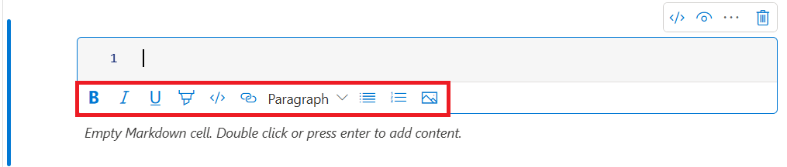

# Create, develop, and maintain Synapse notebooks

A notebook in Azure Synapse Analytics (a Synapse notebook) is a web interface for you to create files that contain live code, visualizations, and narrative text. Notebooks are a good place to validate ideas and use quick experiments to get insights from your data. Notebooks are also widely used in data preparation, data visualization, machine learning, and other big-data scenarios.

With a Synapse notebook, you can:

* Get started with zero setup effort.
* Help keep data secure with built-in enterprise security features.
* Analyze data across raw formats (like CSV, TXT, and JSON), processed file formats (like Parquet, Delta Lake, and ORC), and SQL tabular data files against Spark and SQL.
* Be productive with enhanced authoring capabilities and built-in data visualization.

This article describes how to use notebooks in Synapse Studio.

## Create a notebook

You can create a new notebook or import an existing notebook to a Synapse workspace from **Object Explorer**. Select **Develop**, right-click **Notebooks**, and then select **New notebook** or **Import**. Synapse notebooks recognize standard Jupyter Notebook IPYNB files.


## Develop notebooks

Notebooks consist of cells, which are individual blocks of code or text that you can run independently or as a group.

The following sections describe the operations for developing notebooks:

* [Add a cell](#add-a-cell)
* [Set a primary language](#set-a-primary-language)
* [Use multiple languages](#use-multiple-languages)
* [Use temporary tables to reference data across languages](#use-temp-tables-to-reference-data-across-languages)
* [Use IDE-style IntelliSense](#ide-style-intellisense)
* [Use code snippets](#code-snippets)
* [Format text cells by using toolbar buttons](#format-text-cell-with-toolbar-buttons)
* [Undo or redo a cell operation](#undo-redo-cell-operation)
* [Comment on a code cell](#code-cell-commenting)
* [Move a cell](#move-a-cell)
* [Delete a cell](#delete-a-cell)
* [Collapse cell input](#collapse-a-cell-input)
* [Collapse cell output](#collapse-a-cell-output)
* [Use a notebook outline](#notebook-outline)

> [!NOTE]
> In the notebooks, a `SparkSession` instance is automatically created for you and stored in a variable called `spark`. There's also a variable for `SparkContext` called `sc`. Users can access these variables directly but shouldn't change the values of these variables.

### <a name = "add-a-cell"></a>Add a cell

There are multiple ways to add a new cell to your notebook:

* Hover over the space between two cells and select **Code** or **Markdown**.

  

* Use [shortcut keys in command mode](#shortcut-keys-in-command-mode). Select the A key to insert a cell above the current cell. Select the B key to insert a cell below the current cell.

### <a name = "set-a-primary-language"></a>Set a primary language

Synapse notebooks support four Apache Spark languages:

* PySpark (Python)
* Spark (Scala)
* Spark SQL
* .NET Spark (C#)
* SparkR (R)

You can set the primary language for newly added cells from the **Language** dropdown list on the top command bar.


### <a name = "use-multiple-languages"></a>Use multiple languages

You can use multiple languages in one notebook by specifying the correct language magic command at the beginning of a cell. The following table lists the magic commands to switch cell languages.

|Magic command |Language | Description |  
|---|------|-----|
|`%%pyspark`| Python | Run a Python query against `SparkContext`.  |
|`%%spark`| Scala | Run a Scala query against `SparkContext`.  |  
|`%%sql`| Spark SQL | Run a Spark SQL query against `SparkContext`.  |
|`%%csharp` | .NET for Spark C# | Run a .NET for Spark C# query against `SparkContext`. |
|`%%sparkr` | R | Run an R query against `SparkContext`. |

The following image shows an example of how you can write a PySpark query by using the `%%pyspark` magic command or a Spark SQL query by using the `%%sql` magic command in a Spark (Scala) notebook. The primary language for the notebook is set to PySpark.


### <a name = "use-temp-tables-to-reference-data-across-languages"></a>Use temporary tables to reference data across languages

You can't reference data or variables directly across different languages in a Synapse notebook. In Spark, you can reference a temporary table across languages. Here's an example of how to read a Scala DataFrame in PySpark and Spark SQL by using a Spark temporary table as a workaround:

1. In cell 1, read a DataFrame from a SQL pool connector by using Scala and create a temporary table:

   ```scala
   %%spark
   val scalaDataFrame = spark.read.sqlanalytics("mySQLPoolDatabase.dbo.mySQLPoolTable")
   scalaDataFrame.createOrReplaceTempView( "mydataframetable" )
   ```

2. In cell 2, query the data by using Spark SQL:

   ```sql
   %%sql
   SELECT * FROM mydataframetable
   ```

3. In cell 3, use the data in PySpark:

   ```python
   %%pyspark
   myNewPythonDataFrame = spark.sql("SELECT * FROM mydataframetable")
   ```

### <a name = "ide-style-intellisense"></a>Use IDE-style IntelliSense

Synapse notebooks are integrated with the Monaco editor to bring IDE-style IntelliSense to the cell editor. The features of syntax highlight, error marker, and automatic code completion help you write code and identify issues faster.

The IntelliSense features are at different levels of maturity for different languages. Use the following table to see what's supported.

|Languages| Syntax highlight | Syntax error marker | Syntax code completion | Variable code completion| System function code completion| User function code completion| Smart indent | Code folding|
|--|--|--|--|--|--|--|--|--|
|PySpark (Python)|Yes|Yes|Yes|Yes|Yes|Yes|Yes|Yes|
|Spark (Scala)|Yes|Yes|Yes|Yes|Yes|Yes|No|Yes|
|Spark SQL|Yes|Yes|Yes|Yes|Yes|No|No|No|
|.NET for Spark (C#)|Yes|Yes|Yes|Yes|Yes|Yes|Yes|Yes|

An active Spark session is required to benefit from variable code completion, system function code completion, and user function code completion for .NET for Spark (C#).

### <a name = "code-snippets"></a>Use code snippets

Synapse notebooks provide code snippets that make it easier to enter commonly used code patterns. These patterns include configuring your Spark session, reading data as a Spark DataFrame, and drawing charts by using Matplotlib.

Snippets appear in [shortcut keys of IDE-style IntelliSense](#ide-style-intellisense) mixed with other suggestions. The code snippets' contents align with the code cell language. You can see available snippets by entering **snippet** or any keywords that appear in the snippet title in the code cell editor. For example, by entering **read**, you can see the list of snippets to read data from various data sources.


### <a name = "format-text-cell-with-toolbar-buttons"></a>Format text cells by using toolbar buttons

You can use the format buttons on the text cell toolbar to do common Markdown actions. These actions include making text bold, making text italic, creating paragraphs and headings through a dropdown menu, inserting code, inserting an unordered list, inserting an ordered list, inserting a hyperlink, and inserting an image from a URL.



### <a name = "undo-redo-cell-operation"></a>Undo or redo a cell operation

To revoke the most recent cell operations, select the **Undo** or **Redo** button, or select the Z key or Shift+Z. Now you can undo or redo up to 10 historical cell operations.


Supported cell operations include:

* Insert or delete a cell. You can revoke delete operations by selecting **Undo**. This action keeps the text content along with the cell.
* Reorder cells.
* Turn a parameter cell on or off.
* Convert between a code cell and a Markdown cell.

> [!NOTE]
> You can't undo text operations or commenting operations in a cell.

### <a name = "code-cell-commenting"></a>Comment on a code cell

1. Select the **Comments** button on the notebook toolbar to open the **Comments** pane.

   

2. Select code in the code cell, select **New** on the **Comments** pane, add comments, and then select the **Post comment** button.

   

3. If necessary, you can perform **Edit comment**, **Resolve thread**, and **Delete thread** actions by selecting the **More** ellipsis (**...**) beside your comment.

   

### <a name = "move-a-cell"></a>Move a cell

To move a cell, select the left side of the cell and drag the cell to the desired position.


### <a name = "delete-a-cell"></a>Delete a cell

To delete a cell, select the **Delete** button to the right of the cell.

You can also use [shortcut keys in command mode](#shortcut-keys-in-command-mode). Select Shift+D to delete the current cell.


### <a name = "collapse-a-cell-input"></a>Collapse cell input

To collapse the current cell's input, select the **More commands** ellipsis (**...**) on the cell toolbar, and then select **Hide input**. To expand the input, select **Show input** while the cell is collapsed.


### <a name = "collapse-a-cell-output"></a>Collapse cell output

To collapse the current cell's output, select the **More commands** ellipsis (**...**) on the cell toolbar, and then select **Hide output**. To expand the output, select **Show output** while the cell's output is hidden.


### <a name = "notebook-outline"></a>Use a notebook outline

The outline (table of contents) presents the first Markdown header of any Markdown cell in a sidebar window for quick navigation. The outline sidebar is resizable and collapsible to fit the screen in the best way possible. To open or hide the sidebar, select the **Outline** button on the notebook command bar.

:::image type="content" source="./media/apache-spark-development-using-notebooks/synapse-azure-notebook-outline.png" alt-text="Screenshot of the outline sidebar in a Synapse notebook." link="./media/apache-spark-development-using-notebooks/synapse-azure-notebook-outline.png":::

## Run a notebook

You can run the code cells in your notebook individually or all at once. The status and progress of each cell appears in the notebook.

> [!NOTE]
> Deleting a notebook doesn't automatically cancel any jobs that are currently running. If you need to cancel a job, go to the **Monitor** hub and cancel it manually.

### Run a cell

There are multiple ways to run the code in a cell:

* Hover over the cell that you want to run, and then select the **Run cell** button or select Ctrl+Enter.

   
  
* Use [shortcut keys in command mode](#shortcut-keys-in-command-mode). Select Shift+Enter to run the current cell and select the cell below it. Select Alt+Enter to run the current cell and insert a new cell below it.

### Run all cells

To run all the cells in the current notebook in sequence, select the **Run all** button.


### Run all cells above or below

To run all the cells above the current cell in sequence, expand the dropdown list for the **Run all** button, and then select **Run cells above**. Select **Run cells below** to run all the cells below the current one in sequence.


### Cancel all running cells

To cancel the running cells or the cells waiting in the queue, select the **Cancel all** button.


### <a name = "notebook-reference"></a>Reference a notebook

To reference another notebook within the current notebook's context, use the `%run <notebook path>` magic command. All the variables defined in the reference notebook are available in the current notebook.

Here's an example:

``` %run /<path>/Notebook1 { "parameterInt": 1, "parameterFloat": 2.5, "parameterBool": true,  "parameterString": "abc" } ```

The notebook reference works in both interactive mode and pipelines.

The `%run` magic command has these limitations:

* The command supports nested calls but not recursive calls.
* The command supports passing an absolute path or notebook name only as a parameter. It doesn't support relative paths.
* The command currently supports only four parameter value types: `int`, `float`, `bool`, and `string`. It doesn't support variable replacement operations.
* The referenced notebooks must be published. You need to publish the notebooks to reference them, unless you select the [option to enable an unpublished notebook reference](#reference-unpublished-notebook). Synapse Studio does not recognize the unpublished notebooks from the Git repo.
* Referenced notebooks don't support statement depths larger than five.

### Use the variable explorer

A Synapse notebook provides a built-in variable explorer in the form of a table that lists variables in the current Spark session for PySpark (Python) cells. The table includes columns for variable name, type, length, and value. More variables appear automatically as they're defined in the code cells. Selecting each column header sorts the variables in the table.

To open or hide the variable explorer, select the **Variables** button on the notebook command bar.


> [!NOTE]
> The variable explorer supports only Python.

### Use the cell status indicator

A step-by-step status of a cell run appears beneath the cell to help you see its current progress. After the cell run finishes, a summary with the total duration and end time appears and stays there for future reference.


### Use the Spark progress indicator

A Synapse notebook is purely Spark based. Code cells run on the serverless Apache Spark pool remotely. A Spark job progress indicator with a real-time progress bar helps you understand the job run status.

The number of tasks for each job or stage helps you identify the parallel level of your Spark job. You can also drill deeper to the Spark UI of a specific job (or stage) by selecting the link on the job (or stage) name.


### <a name = "spark-session-configuration"></a>Configure a Spark session

On the **Configure session** pane, you can specify the timeout duration, the number of executors, and the size of executors to give to the current Spark session. Restart the Spark session for configuration changes to take effect. All cached notebook variables are cleared.

You can also create a configuration from the Apache Spark configuration or select an existing configuration. For details, refer to [Manage Apache Spark configuration](../../synapse-analytics/spark/apache-spark-azure-create-spark-configuration.md).

:::image type="content" source="./media/apache-spark-development-using-notebooks/synapse-azure-notebook-spark-session-management.png" alt-text="Screenshot of the pane for configuring a session in a Synapse notebook." link="./media/apache-spark-development-using-notebooks/synapse-azure-notebook-spark-session-management.png":::

#### Magic command for configuring a Spark session

You can also specify Spark session settings via the magic command `%%configure`. To make the settings take effect, restart the Spark session.

We recommend that you run `%%configure` at the beginning of your notebook. Here's a sample. For the full list of valid parameters, refer to the [Livy information on GitHub](https://github.com/cloudera/livy#request-body).

```json
%%configure
{
    //You can get a list of valid parameters to configure the session from https://github.com/cloudera/livy#request-body.
    "driverMemory":"28g", // Recommended values: ["28g", "56g", "112g", "224g", "400g", "472g"]
    "driverCores":4, // Recommended values: [4, 8, 16, 32, 64, 80]
    "executorMemory":"28g",
    "executorCores":4, 
    "jars":["abfs[s]://<file_system>@<account_name>.dfs.core.windows.net/<path>/myjar.jar","wasb[s]://<containername>@<accountname>.blob.core.windows.net/<path>/myjar1.jar"],
    "conf":{
    //Example of a standard Spark property. To find more available properties, go to https://spark.apache.org/docs/latest/configuration.html#application-properties.
        "spark.driver.maxResultSize":"10g",
    //Example of a customized property. You can specify the count of lines that Spark SQL returns by configuring "livy.rsc.sql.num-rows".
        "livy.rsc.sql.num-rows":"3000" 
    }
}

```

Here are some considerations for the `%%configure` magic command:

* We recommend that you use the same value for `driverMemory` and `executorMemory` in `%%configure`. We also recommend that `driverCores` and `executorCores` have the same value.
* You can use `%%configure` in Synapse pipelines, but if you don't set it in the first code cell, the pipeline run will fail because it can't restart the session.
* The `%%configure` command used in `mssparkutils.notebook.run` is ignored, but the command used in `%run <notebook>` continues to run.
* You must use the standard Spark configuration properties in the `"conf"` body. We don't support first-level references for the Spark configuration properties.
* Some special Spark properties won't take effect in `"conf"` body, including `"spark.driver.cores"`, `"spark.executor.cores"`, `"spark.driver.memory"`, `"spark.executor.memory"`, and `"spark.executor.instances"`.

#### <a name = "parameterized-session-configuration-from-pipeline"></a>Parameterized session configuration from a pipeline  

You can use parameterized session configuration to replace values in the `%%configure` magic command with pipeline run (notebook activity) parameters. When you're preparing a `%%configure` code cell, you can override default values by using an object like this:

```
{
      "activityParameterName": "paramterNameInPipelineNotebookActivity",
      "defaultValue": "defaultValueIfNoParamterFromPipelineNotebookActivity"
} 
```

The following example shows default values of `4` and `"2000"`, which are also configurable:

```python
%%configure  

{ 
    "driverCores": 
    { 
        "activityParameterName": "driverCoresFromNotebookActivity", 
        "defaultValue": 4 
    }, 
    "conf": 
    { 
        "livy.rsc.sql.num-rows": 
        { 
            "activityParameterName": "rows", 
            "defaultValue": "2000" 
        } 
    } 
} 
```

The notebook uses the default value if you run the notebook in interactive mode directly or if the pipeline notebook activity doesn't provide a parameter that matches `"activityParameterName"`.

During the pipeline run mode, you can use the **Settings** tab to configure settings for a pipeline notebook activity.


If you want to change the session configuration, the name of the pipeline notebook activity parameter should be the same as `activityParameterName` in the notebook. In this example, during a pipeline run, `8` replaces `driverCores` in `%%configure`, and `4000` replaces `livy.rsc.sql.num-rows`.

If a pipeline run fails after you use the `%%configure` magic command, you can get more error information by running the `%%configure` magic cell in the interactive mode of the notebook.

## Bring data to a notebook

You can load data from Azure Data Lake Storage Gen 2, Azure Blob Storage, and SQL pools, as shown in the following code samples.

### Read a CSV file from Azure Data Lake Storage Gen2 as a Spark DataFrame

```python
from pyspark.sql import SparkSession
from pyspark.sql.types import *
account_name = "Your account name"
container_name = "Your container name"
relative_path = "Your path"
adls_path = 'abfss://%s@%s.dfs.core.windows.net/%s' % (container_name, account_name, relative_path)

df1 = spark.read.option('header', 'true') \
                .option('delimiter', ',') \
                .csv(adls_path + '/Testfile.csv')

```

### Read a CSV file from Azure Blob Storage as a Spark DataFrame

```python

from pyspark.sql import SparkSession

# Azure storage access info
blob_account_name = 'Your account name' # replace with your blob name
blob_container_name = 'Your container name' # replace with your container name
blob_relative_path = 'Your path' # replace with your relative folder path
linked_service_name = 'Your linked service name' # replace with your linked service name

blob_sas_token = mssparkutils.credentials.getConnectionStringOrCreds(linked_service_name)

# Allow Spark to access from Azure Blob Storage remotely

wasb_path = 'wasbs://%s@%s.blob.core.windows.net/%s' % (blob_container_name, blob_account_name, blob_relative_path)

spark.conf.set('fs.azure.sas.%s.%s.blob.core.windows.net' % (blob_container_name, blob_account_name), blob_sas_token)
print('Remote blob path: ' + wasb_path)

df = spark.read.option("header", "true") \
            .option("delimiter","|") \
            .schema(schema) \
            .csv(wasbs_path)
```

### Read data from the primary storage account

You can access data in the primary storage account directly. There's no need to provide the secret keys. In Data Explorer, right-click a file and select **New notebook** to see a new notebook with an automatically generated data extractor.

:::image type="content" source="./media/apache-spark-development-using-notebooks/synapse-data-to-cell.png" alt-text="Screenshot that shows opening a new Spark table to access file data in Azure Synapse Analytics." link="./media/apache-spark-development-using-notebooks/synapse-data-to-cell.png":::

## Use IPython widgets

Widgets are eventful Python objects that have a representation in the browser, often as a control like a slider or text box. IPython widgets work only in Python environments. They're currently not supported in other languages (for example, Scala, SQL, or C#).

### Steps to use IPython widgets

1. Import the `ipywidgets` module to use the Jupyter Widgets framework:

   ```python
   import ipywidgets as widgets
   ```

2. Use the top-level `display` function to render a widget, or leave an expression of `widget` type at the last line of the code cell:

   ```python
   slider = widgets.IntSlider()
   display(slider)
   ```

   ```python
   slider = widgets.IntSlider()
   slider
   ```

3. Run the cell. The widget appears at the output area.

   

You can use multiple `display()` calls to render the same widget instance multiple times, but they remain in sync with each other:

```python
slider = widgets.IntSlider()
display(slider)
display(slider)
```


To render two widgets that are independent of each other, create two widget instances:

```python
slider1 = widgets.IntSlider()
slider2 = widgets.IntSlider()
display(slider1)
display(slider2)
```

### Supported widgets

|Widget type|Widgets|
|--|--|
|Numeric|`IntSlider`, `FloatSlider`, `FloatLogSlider`, `IntRangeSlider`, `FloatRangeSlider`, `IntProgress`, `FloatProgress`, `BoundedIntText`, `BoundedFloatText`, `IntText`, `FloatText`|
|Boolean|`ToggleButton`, `Checkbox`, `Valid`|
|Selection|`Dropdown`, `RadioButtons`, `Select`, `SelectionSlider`, `SelectionRangeSlider`, `ToggleButtons`, `SelectMultiple`|
|String|`Text`, `Text area`, `Combobox`, `Password`, `Label`, `HTML`, `HTML Math`, `Image`, `Button`|
|Play (animation)|`Date picker`, `Color picker`, `Controller`|
|Container/Layout|`Box`, `HBox`, `VBox`, `GridBox`, `Accordion`, `Tabs`, `Stacked`|

### Known limitations

* The following table lists widgets that aren't currently supported, along with workarounds:

   |Functionality|Workaround|
   |--|--|
   |`Output` widget|You can use the `print()` function instead to write text into `stdout`.|
   |`widgets.jslink()`|You can use the `widgets.link()` function to link two similar widgets.|
   |`FileUpload` widget| None available.|

* The global `display` function that Azure Synapse Analytics provides doesn't support displaying multiple widgets in one call (that is, `display(a, b)`). This behavior is different from the IPython `display` function.

* If you close a notebook that contains an IPython widget, you can't view or interact with the widget until you run the corresponding cell again.

## Save notebooks

You can save a single notebook or all notebooks in your workspace:

* To save changes that you made to a single notebook, select the **Publish** button on the notebook command bar.

   

* To save all notebooks in your workspace, select the **Publish all** button on the workspace command bar.

   

On the notebook's **Properties** pane, you can configure whether to include the cell output when saving.


## <a name = "magic-commands"></a>Use magic commands

You can use familiar Jupyter magic commands in Synapse notebooks. Review the following lists of currently available magic commands. Tell us [your use cases on GitHub](https://github.com/MicrosoftDocs/azure-docs/issues/new) so that we can continue to create more magic commands to meet your needs.

> [!NOTE]
> Only the following magic commands are supported in Synapse pipelines: `%%pyspark`, `%%spark`, `%%csharp`, `%%sql`.

Available magic commands for lines:

[`%lsmagic`](https://ipython.readthedocs.io/en/stable/interactive/magics.html#magic-lsmagic), [`%time`](https://ipython.readthedocs.io/en/stable/interactive/magics.html#magic-time), [`%timeit`](https://ipython.readthedocs.io/en/stable/interactive/magics.html#magic-timeit), [`%history`](#view-the-history-of-input-commands), [`%run`](#reference-a-notebook), [`%load`](https://ipython.readthedocs.io/en/stable/interactive/magics.html#magic-load)

Available magic commands for cells:

[`%%time`](https://ipython.readthedocs.io/en/stable/interactive/magics.html#magic-time), [`%%timeit`](https://ipython.readthedocs.io/en/stable/interactive/magics.html#magic-timeit), [`%%capture`](https://ipython.readthedocs.io/en/stable/interactive/magics.html#cellmagic-capture), [`%%writefile`](https://ipython.readthedocs.io/en/stable/interactive/magics.html#cellmagic-writefile), [`%%sql`](#use-multiple-languages), [`%%pyspark`](#use-multiple-languages), [`%%spark`](#use-multiple-languages), [`%%csharp`](#use-multiple-languages), [`%%html`](https://ipython.readthedocs.io/en/stable/interactive/magics.html#cellmagic-html), [`%%configure`](#magic-command-for-configuring-a-spark-session)

## <a name = "reference-unpublished-notebook"></a>Reference an unpublished notebook

Referencing an unpublished notebook is helpful when you want to debug locally. When you enable this feature, a notebook run fetches the current content in web cache. If you run a cell that includes a reference notebook statement, you reference the presenting notebooks in the current notebook browser instead of a saved version in a cluster. Other notebooks can reference the changes in your notebook editor without requiring you to publish (Live mode) or commit (Git mode) the changes. By using this approach, you can prevent the pollution of common libraries during the developing or debugging process.

You can enable referencing an unpublished notebook by selecting the appropriate checkbox on the **Properties** pane.


The following table compares cases. Although [%run](./apache-spark-development-using-notebooks.md) and [mssparkutils.notebook.run](./microsoft-spark-utilities.md) have the same behavior here, the table uses `%run` as an example.

|Case|Disable|Enable|
|----|-------|------|
|**Live mode**|||
|Nb1 (published) <br/> `%run Nb1`|Run published version of Nb1|Run published version of Nb1|
|Nb1 (new) <br/> `%run Nb1`|Error|Run new Nb1|
|Nb1 (previously published, edited) <br/> `%run Nb1`|Run published version of Nb1|Run edited version of Nb1|
|**Git mode**|||
|Nb1 (published) <br/> `%run Nb1`|Run published version of Nb1|Run published version of Nb1|
|Nb1 (new) <br/> `%run Nb1`|Error|Run new Nb1|
|Nb1 (not published, committed) <br/> `%run Nb1`|Error|Run committed Nb1|
|Nb1 (previously published, committed) <br/> `%run Nb1`|Run published version of Nb1|Run committed version of Nb1|
|Nb1 (previously published, new in current branch) <br/> `%run Nb1`|Run published version of Nb1|Run new Nb1|
|Nb1 (not published, previously committed, edited) <br/> `%run Nb1`|Error|Run edited version of Nb1|
|Nb1 (previously published and committed, edited) <br/> `%run Nb1`|Run published version of Nb1|Run edited version of Nb1|

In summary:

* If you disable referencing an unpublished notebook, always run the *published* version.
* If you enable referencing an unpublished notebook, the reference run  always adopts the current version of notebook that appears on the notebook UX.

## Manage active sessions

You can reuse your notebook sessions without having to start new ones. In Synapse notebooks, you can manage your active sessions in a single list. To open the list, select the ellipsis (**...**), and then select **Manage sessions**.


The **Active sessions** pane lists all the sessions in the current workspace that you started from a notebook. The list shows the session information and the corresponding notebooks. The **Detach with notebook**, **Stop the session**, and **View in monitoring** actions are available here. Also, you can connect your selected notebook to an active session that started from another notebook. The session is then detached from the previous notebook (if it's not idle) and attached to the current one.


## Use Python logs in a notebook

You can find Python logs and set different log levels and formats by using the following sample code:

```python
import logging

# Customize the logging format for all loggers
FORMAT = "%(asctime)s - %(name)s - %(levelname)s - %(message)s"
formatter = logging.Formatter(fmt=FORMAT)
for handler in logging.getLogger().handlers:
    handler.setFormatter(formatter)

# Customize the log level for all loggers
logging.getLogger().setLevel(logging.INFO)

# Customize the log level for a specific logger
customizedLogger = logging.getLogger('customized')
customizedLogger.setLevel(logging.WARNING)

# Logger that uses the default global log level
defaultLogger = logging.getLogger('default')
defaultLogger.debug("default debug message")
defaultLogger.info("default info message")
defaultLogger.warning("default warning message")
defaultLogger.error("default error message")
defaultLogger.critical("default critical message")

# Logger that uses the customized log level
customizedLogger.debug("customized debug message")
customizedLogger.info("customized info message")
customizedLogger.warning("customized warning message")
customizedLogger.error("customized error message")
customizedLogger.critical("customized critical message")
```

## View the history of input commands

Synapse notebooks support the magic command `%history` to print the input command history for the current session. The `%history` magic command is similar to the standard Jupyter IPython command and works for multiple language contexts in a notebook.

`%history [-n] [range [range ...]]`

In the preceding code, `-n` is the print execution number. The `range` value can be:

* `N`: Print code of the `Nth` executed cell.
* `M-N`: Print code from the `Mth` to the `Nth` executed cell.

For example, to print input history from the first to the second executed cell, use `%history -n 1-2`.

## Integrate a notebook

### Add a notebook to a pipeline

To add a notebook to an existing pipeline or to create a new pipeline, select the **Add to pipeline** button on the upper-right corner.


### Designate a parameter cell

To parameterize your notebook, select the ellipsis (**...**) to access more commands on the cell toolbar. Then select **Toggle parameter cell** to designate the cell as the parameter cell.


Azure Data Factory looks for the parameter cell and treats this cell as the default for the parameters passed in at execution time. The execution engine adds a new cell beneath the parameter cell with input parameters to overwrite the default values.

### Assign parameters values from a pipeline

After you create a notebook with parameters, you can run it from a pipeline by using a Synapse notebook activity. After you add the activity to your pipeline canvas, you can set the parameter values in the **Base parameters** section of the **Settings** tab.


When you're assigning parameter values, you can use the [pipeline expression language](../../data-factory/control-flow-expression-language-functions.md) or [system variables](../../data-factory/control-flow-system-variables.md).

## Use shortcut keys

Similar to Jupyter Notebooks, Synapse notebooks have a modal user interface. The keyboard does different things, depending on which mode the notebook cell is in. Synapse notebooks support the following two modes for a code cell:

* **Command mode**: A cell is in command mode when no text cursor is prompting you to type. When a cell is in command mode, you can edit the notebook as a whole but not type into individual cells. Enter command mode by selecting the Esc key or by using the mouse to select outside a cell's editor area.

   

* **Edit mode**: When a cell is in edit mode, a text cursor prompts you to type in the cell. Enter edit mode by selecting the Enter key or by using the mouse to select a cell's editor area.

   

### Shortcut keys in command mode

| Action |Synapse notebook shortcut |
|--|--|
|Run the current cell and select below | Shift+Enter |
|Run the current cell and insert below | Alt+Enter |
|Run current cell| Ctrl+Enter |
|Select cell above| Up |
|Select cell below| Down |
|Select previous cell| K |
|Select next cell| J |
|Insert cell above| A |
|Insert cell below| B |
|Delete selected cells| Shift+D |
|Switch to edit mode| Enter |

### Shortcut keys in edit mode

| Action |Synapse notebook shortcut |
|--|--|
|Move cursor up | Up |
|Move cursor down|Down|
|Undo|Ctrl+Z|
|Redo|Ctrl+Y|
|Comment/Uncomment|Ctrl+/|
|Delete word before|Ctrl+Backspace|
|Delete word after|Ctrl+Delete|
|Go to cell start|Ctrl+Home|
|Go to cell end |Ctrl+End|
|Go one word left|Ctrl+Left|
|Go one word right|Ctrl+Right|
|Select all|Ctrl+A|
|Indent| Ctrl+]|
|Dedent|Ctrl+[|
|Switch to command mode| Esc |

## Related content

* [Synapse sample notebooks](https://github.com/Azure-Samples/Synapse/tree/master/Notebooks)
* [Quickstart: Create an Apache Spark pool in Azure Synapse Analytics using web tools](../quickstart-apache-spark-notebook.md)
* [What is Apache Spark in Azure Synapse Analytics?](apache-spark-overview.md)
* [Use .NET for Apache Spark with Azure Synapse Analytics](spark-dotnet.md)
* [.NET for Apache Spark documentation](/previous-versions/dotnet/spark/what-is-apache-spark-dotnet)
* [Azure Synapse Analytics documentation](../index.yml)
