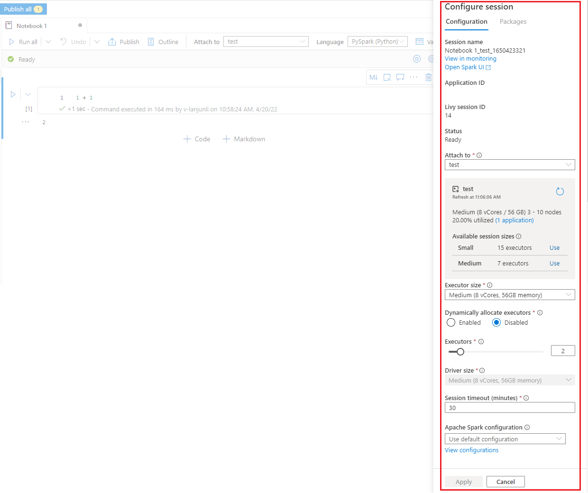

# Create, develop, and maintain notebooks in Azure Synapse Analytics

A notebook in Azure Synapse Analytics is a web interface for you to create files that contain live code, visualizations, and narrative text. Notebooks are a good place to validate ideas and use quick experiments to get insights from your data. Notebooks are also widely used in data preparation, data visualization, machine learning, and other big data scenarios.

With a notebook, you can:

* Get started with zero setup effort.
* Help keep data secure with built-in enterprise security features.
* Analyze data across raw formats (like .csv, .txt, and .json), processed file formats (like Parquet, Delta Lake, and ORC), and SQL tabular data files against Spark and SQL.
* Be productive with enhanced authoring capabilities and built-in data visualization.

This article describes how to use notebooks in Synapse Studio.

## Create a notebook

You can create a new notebook or import an existing notebook to an Azure Synapse Analytics workspace from **Object Explorer**. Select **Develop**, and then right-click **New notebook** or **Import**. Azure Synapse Analytics notebooks recognize standard Jupyter Notebook IPYNB files.


## Develop notebooks

Notebooks consist of cells, which are individual blocks of code or text that you can run independently or as a group.

The following sections describe the operations for developing notebooks:

* [Add a cell](#add-a-cell)
* [Set a primary language](#set-a-primary-language)
* [Use multiple languages](#use-multiple-languages)
* [Use temporary tables to reference data across languages](#use-temp-tables-to-reference-data-across-languages)
* [Use IDE-style IntelliSense](#ide-style-intellisense)
* [Use code snippets](#code-snippets)
* [Format text cells by using toolbar buttons](#format-text-cell-with-toolbar-buttons)
* [Undo or redo a cell operation](#undo-redo-cell-operation)
* [Comment on a code cell](#code-cell-commenting)
* [Move a cell](#move-a-cell)
* [Delete a cell](#delete-a-cell)
* [Collapse cell input](#collapse-a-cell-input)
* [Collapse cell output](#collapse-a-cell-output)
* [Use a notebook outline](#notebook-outline)

> [!NOTE]
> In the notebooks, a `SparkSession` instance is automatically created for you, stored in a variable called `spark`. There's also a variable for `SparkContext` called `sc`. Users can access these variables directly and should not change the values of these variables.

### <a name = "add-a-cell"></a>Add a cell

There are multiple ways to add a new cell to your notebook:

* Hover over the space between two cells and select **Code** or **Markdown**.

    

* Use [shortcut keys in command mode](#shortcut-keys-in-command-mode). Select the A key to insert a cell above the current cell. Select the B key to insert a cell below the current cell.

---

### <a name = "set-a-primary-language"></a>Set a primary language

Azure Synapse Analytics notebooks support four Apache Spark languages:

* PySpark (Python)
* Spark (Scala)
* Spark SQL
* .NET Spark (C#)
* SparkR (R)

You can set the primary language for newly added cells from the **Language** dropdown list on the top command bar.


### <a name = "use-multiple-languages"></a>Use multiple languages

You can use multiple languages in one notebook by specifying the correct language magic command at the beginning of a cell. The following table lists the magic commands to switch cell languages.

|Magic command |Language | Description |  
|---|------|-----|
|`%%pyspark`| Python | Run a Python query against `SparkContext`.  |
|`%%spark`| Scala | Run a Scala query against `SparkContext`.  |  
|`%%sql`| SparkSQL | Run a Spark SQL query against `SparkContext`.  |
|`%%csharp` | .NET for Spark C# | Run a .NET for Spark C# query against `SparkContext`. |
|`%%sparkr` | R | Run an R query against `SparkContext`. |

The following image is an example of how you can write a PySpark query by using the `%%pyspark` magic command or a Spark SQL query by using the `%%sql` magic command in a Spark (Scala) notebook. The primary language for the notebook is set to PySpark.


### <a name = "use-temp-tables-to-reference-data-across-languages"></a>Use temporary tables to reference data across languages

You can't reference data or variables directly across different languages in an Azure Synapse Analytics notebook. In Spark, you can reference a temporary table across languages. Here's an example of how to read a Scala DataFrame in PySpark and Spark SQL by using a Spark temporary table as a workaround.

1. In cell 1, read a DataFrame from a SQL pool connector by using Scala and create a temporary table:

   ```scala
   %%spark
   val scalaDataFrame = spark.read.sqlanalytics("mySQLPoolDatabase.dbo.mySQLPoolTable")
   scalaDataFrame.createOrReplaceTempView( "mydataframetable" )
   ```

2. In cell 2, query the data by using Spark SQL:

   ```sql
   %%sql
   SELECT * FROM mydataframetable
   ```

3. In cell 3, use the data in PySpark:

   ```python
   %%pyspark
   myNewPythonDataFrame = spark.sql("SELECT * FROM mydataframetable")
   ```

### <a name = "ide-style-intellisense"></a>Use IDE-style IntelliSense

Azure Synapse Analytics notebooks are integrated with the Monaco editor to bring IDE-style IntelliSense to the cell editor. The features of syntax highlight, error marker, and automatic code completion help you to write code and identify issues faster.

The IntelliSense features are at different levels of maturity for different languages. Use the following table to see what's supported.

|Languages| Syntax highlight | Syntax error marker | Syntax code completion | Variable code completion| System function code completion| User function code completion| Smart indent | Code folding|
|--|--|--|--|--|--|--|--|--|
|PySpark (Python)|Yes|Yes|Yes|Yes|Yes|Yes|Yes|Yes|
|Spark (Scala)|Yes|Yes|Yes|Yes|Yes|Yes|-|Yes|
|SparkSQL|Yes|Yes|Yes|Yes|Yes|-|-|-|
|.NET for Spark (C#)|Yes|Yes|Yes|Yes|Yes|Yes|Yes|Yes|

> [!NOTE]
> An active Spark session is required to benefit from variable code completion, system function code completion，and user function code completion for .NET for Spark (C#).

### <a name = "code-snippets"></a>Use code snippets

Azure Synapse Analytics notebooks provide code snippets that make it easier to enter commonly used code patterns. These patterns include configuring your Spark session, reading data as a Spark DataFrame, and drawing charts by using Matplotlib.

Snippets appear in [shortcut keys of IDE-style IntelliSense](#ide-style-intellisense) mixed with other suggestions. The code snippets' contents align with the code cell language. You can see available snippets by entering **snippet** or any keywords that appear in the snippet title in the code cell editor. For example, by entering **read**, you can see the list of snippets to read data from various data sources.


### <a name = "format-text-cell-with-toolbar-buttons"></a>Format text cells by using toolbar buttons

You can use the format buttons on the text cell toolbar to do common markdown actions. These actions include making text bold, making text italic, creating paragraphs and headings through a dropdown menu, inserting code, inserting an unordered list, inserting an ordered list, inserting a hyperlink, and inserting an image from a URL.


---

### <a name = "undo-redo-cell-operation"></a>Undo or redo a cell operation

To revoke the most recent cell operations, select the **Undo** or **Redo** button, or select the Z key or Shift+Z. Now you can undo or redo up to the latest 10 historical cell operations.


Supported cell operations include:

* Insert or delete cell: You can revoke delete operations by selecting **Undo**. This action keeps the text content along with the cell.
* Reorder cell.
* Turn a parameter cell on or off.
* Convert between a code cell and a Markdown cell.

> [!NOTE]
> You can't undo text operations or commenting operations in a cell.

---

### <a name = "code-cell-commenting"></a>Comment on a code cell

1. Select the **Comments** button on the notebook toolbar to open the **Comments** pane.

   

2. Select code in the code cell, click **New** on the **Comments** pane, add comments, and then select the **Post comment** button to save the comment.

   

   If necessary, you can perform **Edit comment**, **Resolve thread**, and **Delete thread** actions by selcting the **More** button beside your comment.

   

---

### <a name = "move-a-cell"></a>Move a cell

To move a cell, select the left side of the cell and drag the cell to the desired position.


---

### <a name = "delete-a-cell"></a>Delete a cell

To delete a cell, select the **Delete** button to the right of the cell.

You can also use [shortcut keys in command mode](#shortcut-keys-in-command-mode). Select Shift+D to delete the current cell.


---

### <a name = "collapse-a-cell-input"></a>Collapse cell input

To collapse the current cell's input, select the **More commands** ellipsis (...) on the cell toolbar, and the select **Hide input**. To expand it, select **Show input** while the cell is collapsed.


---

### <a name = "collapse-a-cell-output"></a>Collapse cell output

To collapse the current cell's output, select the **More commands** ellipsis (...) on the cell toolbar, and then select **Hide output**. To expand it, select **Show output** while the cell's output is hidden.


---

### <a name = "notebook-outline"></a>Use a notebook outline

The outline (table of contents) presents the first markdown header of any markdown cell in a sidebar window for quick navigation. The outline sidebar is resizable and collapsible to fit the screen in the best way possible. To open or hide the sidebar, select the **Outline** button on the notebook's command bar.


---

## Run notebooks

You can run the code cells in your notebook individually or all at once. The status and progress of each cell appears in the notebook.

> [!NOTE]
> Deleting a notebook doesn't automatically cancel any jobs that are currently running. If you need to cancel a job, go to the **Monitor** hub and cancel it manually.

### Run a cell

There are multiple ways to run the code in a cell:

* Hover over the cell that you want to run, and then select the **Run Cell** button or select Ctrl+Enter.

   
  
* Use [shortcut keys in command mode](#shortcut-keys-in-command-mode). Select Shift+Enter to run the current cell and select the cell below it. Select Alt+Enter to run the current cell and insert a new cell below it.

---

### Run all cells

To run all the cells in current notebook in sequence, select the **Run All** button.


### Run all cells above or below

To run all the cells above the current cell in sequence, expand the dropdown list for the **Run all** button, and then select **Run cells above**. Select **Run cells below** to run all the cells below the current one in sequence.


---

### Cancel all running cells

To cancel the running cells or cells waiting in the queue, select the **Cancel All** button.


---

### Notebook reference

To reference another notebook within the current notebook's context, use the `%run <notebook path>` magic command. All the variables defined in the reference notebook are available in the current notebook.

Here's an example:

``` %run /<path>/Notebook1 { "parameterInt": 1, "parameterFloat": 2.5, "parameterBool": true,  "parameterString": "abc" } ```

The notebook reference works in both interactive mode and pipelines.

The `run` magic command has these limitations:

* The command supports nested calls but not recursive calls.
* The command supports passing an absolute path or notebook name only as a parameter. It doesn't suppport relative paths.
* The command currently supports only four parameter value types: `int`, `float`, `bool`, and `string`. It doesn't support variable replacement operations.
* The referenced notebooks must be published. You need to publish the notebooks to reference them unless you select the [option to enable an unpublished notebook reference](#reference-unpublished-notebook). Synapse Studio does not recognize the unpublished notebooks from the Git repo.
* Referenced notebooks don't support statement depths larger than five.

---

### Variable explorer

An Azure Synapse Analytics notebook provides a built-in variable explorer in the form of a table that lists variables in the current Spark session for PySpark (Python) cells. The table includes columns for variable name, type, length, and value. More variables appear automatically as they're defined in the code cells. Selecting each column header sorts the variables in the table.

To open or hide the variable explorer, select the **Variables** button on the notebook's command bar.


> [!NOTE]
> The variable explorer supports only Python.

---

### Cell status indicator

A step-by-step status of a cell run appears beneath the cell to help you see its current progress. After the cell run finishes, a summary with the total duration and end time appears and stays there for future reference.


### Spark progress indicator

An Azure Synapse Analytics notebook is purely Spark based. Code cells run on the serverless Apache Spark pool remotely. A Spark job progress indicator with a real-time progress bar appears to help you understand the job run status.

The number of tasks for each job or stage help you identify the parallel level of your Spark job. You can also drill deeper to the Spark UI of a specific job (or stage) by selecting the link on the job (or stage) name.


### Spark session configuration

You can specify the timeout duration, the number, and the size of executors to give to the current Spark session on the **Configure session** pane. Restart the Spark session for configuration changes to take effect. All cached notebook variables are cleared.

You can also create a configuration from the Apache Spark configuration or select an existing configuration. For details, refer to [Manage Apache Spark configuration](../../synapse-analytics/spark/apache-spark-azure-create-spark-configuration.md).

[](./media/apache-spark-development-using-notebooks/synapse-azure-notebook-spark-session-management.png#lightbox)

#### Magic command for Spark session configuration

You can also specify Spark session settings via the magic command `%%configure`. To make the settings take effect, restart the Spark session.

We recommend that you run `%%configure` at the beginning of your notebook. Here's a sample. For the full list of valid parameters, refer to the [Livy information on GitHub](https://github.com/cloudera/livy#request-body).

```json
%%configure
{
    //You can get a list of valid parameters to configure the session from https://github.com/cloudera/livy#request-body.
    "driverMemory":"28g", // Recommended values: ["28g", "56g", "112g", "224g", "400g", "472g"]
    "driverCores":4, // Recommended values: [4, 8, 16, 32, 64, 80]
    "executorMemory":"28g",
    "executorCores":4, 
    "jars":["abfs[s]://<file_system>@<account_name>.dfs.core.windows.net/<path>/myjar.jar","wasb[s]://<containername>@<accountname>.blob.core.windows.net/<path>/myjar1.jar"],
    "conf":{
    //Example of a standard Spark property. To find more available properties, go to https://spark.apache.org/docs/latest/configuration.html#application-properties.
        "spark.driver.maxResultSize":"10g",
    //Example of a customized property. You can specify the count of lines that Spark SQL returns by configuring "livy.rsc.sql.num-rows".
        "livy.rsc.sql.num-rows":"3000" 
    }
}

```

Here are some considerations for the `%%configure` magic command:

* We recommend that you use the same value for `driverMemory` and `executorMemory` in `%%configure`. We also recommend that `driverCores` and `executorCores` have the same value.
* You can use `%%configure` in Azure Synapse Analytics pipelines, but if you don't set it in the first code cell, the pipeline run will fail because it can't restart the session.
* The `%%configure` command used in `mssparkutils.notebook.run` is ignored, but the command used in `%run <notebook>` continues to run.
* You must use the standard Spark configuration properties in the `"conf"` body. We don't support first-level references for the Spark configuration properties.
* Some special Spark properties won't take effect in `"conf"` body, including `"spark.driver.cores"`, `"spark.executor.cores"`, `"spark.driver.memory"`, `"spark.executor.memory"`, and `"spark.executor.instances"`.

#### Parameterized session configuration from a pipeline  

You can use parameterized session configuration to replace values in the `%%configure` magic command with pipeline run (notebook activity) parameters. When you're preparing a `%%configure` code cell, you can override default values by using an object like this:

```
{
      "activityParameterName": "paramterNameInPipelineNotebookActivity",
      "defaultValue": "defaultValueIfNoParamterFromPipelineNotebookActivity"
} 
```

The following example shows default values of `4` and `"2000"`, which are also configurable:

```python
%%configure  

{ 
    "driverCores": 
    { 
        "activityParameterName": "driverCoresFromNotebookActivity", 
        "defaultValue": 4 
    }, 
    "conf": 
    { 
        "livy.rsc.sql.num-rows": 
        { 
            "activityParameterName": "rows", 
            "defaultValue": "2000" 
        } 
    } 
} 
```

The notebook uses the default value if you run the notebook in interactive mode directly or if the pipeline notebook activity doesn't provide a parameter that matches `"activityParameterName"`.

During the pipeline run mode, you can use the **Settings** tab to configure settings for a pipeline notebook activity.


If you want to change the session configuration, the name of the pipeline notebook activity parameter should be same as `activityParameterName` in the notebook. In this example, during a pipleline run, `driverCores` in `%%configure` will be replaced by `8` and `livy.rsc.sql.num-rows` will be replaced by `4000`.

> [!NOTE]
> If a pipeline run fails after you use the `%%configure` magic command, you can get more error information by running the `%%configure` magic cell in the interactive mode of the notebook.

## Bring data to a notebook

You can load data from Azure Data Lake Storage Gen 2, Azure Blob Storage, and SQL pools, as shown in the following code samples.

### Read a CSV file from Azure Data Lake Storage Gen2 as a Spark DataFrame

```python
from pyspark.sql import SparkSession
from pyspark.sql.types import *
account_name = "Your account name"
container_name = "Your container name"
relative_path = "Your path"
adls_path = 'abfss://%s@%s.dfs.core.windows.net/%s' % (container_name, account_name, relative_path)

df1 = spark.read.option('header', 'true') \
                .option('delimiter', ',') \
                .csv(adls_path + '/Testfile.csv')

```

#### Read a CSV file from Azure Blob Storage as a Spark DataFrame

```python

from pyspark.sql import SparkSession

# Azure storage access info
blob_account_name = 'Your account name' # replace with your blob name
blob_container_name = 'Your container name' # replace with your container name
blob_relative_path = 'Your path' # replace with your relative folder path
linked_service_name = 'Your linked service name' # replace with your linked service name

blob_sas_token = mssparkutils.credentials.getConnectionStringOrCreds(linked_service_name)

# Allow Spark to access from Azure Blob Storage remotely

wasb_path = 'wasbs://%s@%s.blob.core.windows.net/%s' % (blob_container_name, blob_account_name, blob_relative_path)

spark.conf.set('fs.azure.sas.%s.%s.blob.core.windows.net' % (blob_container_name, blob_account_name), blob_sas_token)
print('Remote blob path: ' + wasb_path)

df = spark.read.option("header", "true") \
            .option("delimiter","|") \
            .schema(schema) \
            .csv(wasbs_path)
```

### Read data from the primary storage account

You can access data in the primary storage account directly. There's no need to provide the secret keys. In Data Explorer, right-click a file and select **New notebook** to see a new notebook with an automatically generated data extractor.


## IPython Widgets

Widgets are eventful Python objects that have a representation in the browser, often as a control like a slider, textbox etc. IPython Widgets only works in Python environment, it's not supported in other languages (for example, Scala, SQL, C#) yet.

### To use IPython Widget

1. You need to import `ipywidgets` module first to use the Jupyter Widget framework.

   ```python
   import ipywidgets as widgets
   ```

2. You can use top-level `display` function to render a widget, or leave an expression of **widget** type at the last line of code cell.

   ```python
   slider = widgets.IntSlider()
   display(slider)
   ```

   ```python
   slider = widgets.IntSlider()
   slider
   ```

3. Run the cell, the widget displays at the output area.

   

4. You can use multiple `display()` calls to render the same widget instance multiple times, but they remain in sync with each other.

   ```python
   slider = widgets.IntSlider()
   display(slider)
   display(slider)
   ```

   

5. To render two widgets independent of each other, create two widget instances:

   ```python
   slider1 = widgets.IntSlider()
   slider2 = widgets.IntSlider()
   display(slider1)
   display(slider2)
   ```

### Supported widgets

|Widgets Type|Widgets|
|--|--|
|Numeric widgets|IntSlider, FloatSlider, FloatLogSlider, IntRangeSlider, FloatRangeSlider, IntProgress, FloatProgress, BoundedIntText, BoundedFloatText, IntText, FloatText|
|Boolean widgets|ToggleButton, Checkbox, Valid|
|Selection widgets|Dropdown, RadioButtons, Select, SelectionSlider, SelectionRangeSlider, ToggleButtons, SelectMultiple|
|String Widgets|Text, Text area, Combobox, Password, Label, HTML, HTML Math, Image, Button|
|Play (Animation) widgets|Date picker, Color picker, Controller|
|Container/Layout widgets|Box, HBox, VBox, GridBox, Accordion, Tabs, Stacked|

### Known limitations

1. The following widgets are not supported yet, you could follow the corresponding workaround as below:

   |Functionality|Workaround|
   |--|--|
   |`Output` widget|You can use `print()` function instead to write text into stdout.|
   |`widgets.jslink()`|You can use `widgets.link()` function to link two similar widgets.|
   |`FileUpload` widget| Not support yet.|

2. Global `display` function provided by Synapse does not support displaying multiple widgets in one call (that is, `display(a, b)`), which is different from IPython `display` function.

3. If you close a notebook that contains IPython Widget, you will not be able to see or interact with it until you execute the corresponding cell again.

---

## Save notebooks

You can save a single notebook or all notebooks in your workspace.

1. To save changes you made to a single notebook, select the **Publish** button on the notebook command bar.

   

2. To save all notebooks in your workspace, select the **Publish all** button on the workspace command bar.

   

In the notebook properties, you can configure whether to include the cell output when saving.

   

## Magic commands

You can use familiar Jupyter magic commands in Synapse notebooks. Review the following list as the current available magic commands. Tell us [your use cases on GitHub](https://github.com/MicrosoftDocs/azure-docs/issues/new) so that we can continue to build out more magic commands to meet your needs.

> [!NOTE]
> Only following magic commands are supported in Synapse pipeline : %%pyspark, %%spark, %%csharp, %%sql.

Available line magics:

[%lsmagic](https://ipython.readthedocs.io/en/stable/interactive/magics.html#magic-lsmagic), [%time](https://ipython.readthedocs.io/en/stable/interactive/magics.html#magic-time), [%timeit](https://ipython.readthedocs.io/en/stable/interactive/magics.html#magic-timeit), [%history](#view-the-history-of-input-commands), [%run](#notebook-reference), [%load](https://ipython.readthedocs.io/en/stable/interactive/magics.html#magic-load)

Available cell magics:

[%%time](https://ipython.readthedocs.io/en/stable/interactive/magics.html#magic-time), [%%timeit](https://ipython.readthedocs.io/en/stable/interactive/magics.html#magic-timeit), [%%capture](https://ipython.readthedocs.io/en/stable/interactive/magics.html#cellmagic-capture), [%%writefile](https://ipython.readthedocs.io/en/stable/interactive/magics.html#cellmagic-writefile), [%%sql](#use-multiple-languages), [%%pyspark](#use-multiple-languages), [%%spark](#use-multiple-languages), [%%csharp](#use-multiple-languages), [%%html](https://ipython.readthedocs.io/en/stable/interactive/magics.html#cellmagic-html), [%%configure](#spark-session-configuration-magic-command)

---

## <a name = "reference-unpublished-notebook"></a>Reference an unpublished notebook

Reference unpublished notebook is helpful when you want to debug "locally", when enabling this feature, notebook run fetches the current content in web cache, if you run a cell including a reference notebooks statement, you reference the presenting notebooks in the current notebook browser instead of a saved versions in cluster, that means the changes in your notebook editor can be referenced immediately by other notebooks without having to be published(Live mode) or committed(Git mode), by leveraging this approach you can easily avoid common libraries getting polluted during developing or debugging process.

You can enable Reference unpublished notebook from Properties panel:


For different cases comparison please check the table below:  

Notice that [%run](./apache-spark-development-using-notebooks.md) and [mssparkutils.notebook.run](./microsoft-spark-utilities.md) has same behavior here. We use `%run` here as an example.

|Case|Disable|Enable|
|----|-------|------|
|**Live Mode**|||
|- Nb1 (Published) <br/> `%run Nb1`|Run published version of Nb1|Run published version of Nb1|
|- Nb1 (New) <br/> `%run Nb1`|Error|Run new Nb1|
|- Nb1 (Previously published, edited) <br/> `%run Nb1`|Run **published** version of Nb1|Run **edited** version of Nb1|
|**Git Mode**|||
|- Nb1 (Published) <br/> `%run Nb1`|Run published version of Nb1|Run published version of Nb1|
|- Nb1 (New) <br/> `%run Nb1`|Error|Run new Nb1|
|- Nb1 (Not published, committed) <br/> `%run Nb1`|Error|Run committed Nb1| 
|- Nb1 (Previously published, committed) <br/> `%run Nb1`|Run **published** version of Nb1|Run **committed** version of Nb1|
|- Nb1 (Previously published, new in current branch) <br/> `%run Nb1`|Run **published** version of Nb1|Run **new** Nb1|
|- Nb1 (Not published, previously committed, edited) <br/> `%run Nb1`|Error|Run **edited** version of Nb1|
|- Nb1 (Previously published and committed, edited) <br/> `%run Nb1`|Run **published** version of Nb1|Run **edited** version of Nb1|

In summary:

* If disabled, always run **published** version.
* If enabled, the reference run will always adopt the current version of notebook you can see from the notebook UX.

## Active session management

You can reuse your notebook sessions conveniently now without having to start new ones. Synapse notebook now supports managing your active sessions in the **Manage sessions** list, you can see all the sessions in the current workspace started by you from notebook.


In the **Active sessions**, list you can see the session information and the corresponding notebook that is currently attached to the session. You can operate Detach with notebook, Stop the session, and View in monitoring from here. Moreover, you can easily connect your selected notebook to an active session in the list started from another notebook, the session is detached from the previous notebook (if it's not idle) then attach to the current one.


## Python logging in a notebook

You can find Python logs and set different log levels and format following the sample code below:

```python
import logging

# Customize the logging format for all loggers
FORMAT = "%(asctime)s - %(name)s - %(levelname)s - %(message)s"
formatter = logging.Formatter(fmt=FORMAT)
for handler in logging.getLogger().handlers:
    handler.setFormatter(formatter)

# Customize log level for all loggers
logging.getLogger().setLevel(logging.INFO)

# Customize the log level for a specific logger
customizedLogger = logging.getLogger('customized')
customizedLogger.setLevel(logging.WARNING)

# logger that use the default global log level
defaultLogger = logging.getLogger('default')
defaultLogger.debug("default debug message")
defaultLogger.info("default info message")
defaultLogger.warning("default warning message")
defaultLogger.error("default error message")
defaultLogger.critical("default critical message")

# logger that use the customized log level
customizedLogger.debug("customized debug message")
customizedLogger.info("customized info message")
customizedLogger.warning("customized warning message")
customizedLogger.error("customized error message")
customizedLogger.critical("customized critical message")
```

## View the history of input commands

Synapse notebook support magic command ```%history``` to print the input command history that executed in the current session, comparing to the standard Jupyter Ipython command the ```%history``` works for multiple languages context in notebook. 

``` %history [-n] [range [range ...]] ```

For options:

* **-n**: Print execution number.

Where range can be:

* **N**: Print code of **Nth** executed cell.
* **M-N**: Print code from **Mth** to **Nth** executed cell.

Example:

* Print input history from 1st to 2nd executed cell: ``` %history -n 1-2 ```

## Integrate a notebook

### Add a notebook to a pipeline

Select the **Add to pipeline** button on the upper right corner to add a notebook to an existing pipeline or create a new pipeline.


### Designate a parameters cell

To parameterize your notebook, select the ellipses (...) to access the **more commands** at the cell toolbar. Then select **Toggle parameter cell** to designate the cell as the parameters cell.


---

Azure Data Factory looks for the parameters cell and treats this cell as defaults for the parameters passed in at execution time. The execution engine adds a new cell beneath the parameters cell with input parameters in order to overwrite the default values.

### Assign parameters values from a pipeline

Once you've created a notebook with parameters, you can execute it from a pipeline with the Synapse Notebook activity. After you add the activity to your pipeline canvas, you will be able to set the parameters values under **Base parameters** section on the **Settings** tab.


When assigning parameter values, you can use the [pipeline expression language](../../data-factory/control-flow-expression-language-functions.md) or [system variables](../../data-factory/control-flow-system-variables.md).

## Shortcut keys

Similar to Jupyter Notebooks,  Synapse notebooks have a modal user interface. The keyboard does different things depending on which mode the notebook cell is in. Synapse notebooks support the following two modes for a given code cell: command mode and edit mode.

1. A cell is in command mode when there is no text cursor prompting you to type. When a cell is in Command mode, you can edit the notebook as a whole but not type into individual cells. Enter command mode by pressing `ESC` or using the mouse to select outside of a cell's editor area.

   

2. Edit mode is indicated by a text cursor prompting you to type in the editor area. When a cell is in edit mode, you can type into the cell. Enter edit mode by pressing `Enter` or using the mouse to select on a cell's editor area.

   

### Shortcut keys in command mode

| Action |Synapse notebook Shortcuts  |
|--|--|
|Run the current cell and select below | Shift+Enter |
|Run the current cell and insert below | Alt+Enter |
|Run current cell| Ctrl+Enter |
|Select cell above| Up |
|Select cell below| Down |
|Select previous cell| K |
|Select next cell| J |
|Insert cell above| A |
|Insert cell below| B |
|Delete selected cells| Shift+D |
|Switch to edit mode| Enter |

---

### Shortcut keys in edit mode

Using the following keystroke shortcuts, you can more easily navigate and run code in Synapse notebooks when in Edit mode.

| Action |Synapse notebook shortcuts  |
|--|--|
|Move cursor up | Up |
|Move cursor down|Down|
|Undo|Ctrl + Z|
|Redo|Ctrl + Y|
|Comment/Uncomment|Ctrl + /|
|Delete word before|Ctrl + Backspace|
|Delete word after|Ctrl + Delete|
|Go to cell start|Ctrl + Home|
|Go to cell end |Ctrl + End|
|Go one word left|Ctrl + Left|
|Go one word right|Ctrl + Right|
|Select all|Ctrl + A|
|Indent| Ctrl +]|
|Dedent|Ctrl + [|
|Switch to command mode| Esc |

---

## Related content

* [Check out Synapse sample notebooks](https://github.com/Azure-Samples/Synapse/tree/master/Notebooks)
* [Quickstart: Create an Apache Spark pool in Azure Synapse Analytics using web tools](../quickstart-apache-spark-notebook.md)
* [What is Apache Spark in Azure Synapse Analytics](apache-spark-overview.md)
* [Use .NET for Apache Spark with Azure Synapse Analytics](spark-dotnet.md)
* [.NET for Apache Spark documentation](/previous-versions/dotnet/spark/what-is-apache-spark-dotnet)
* [Azure Synapse Analytics](../index.yml)
