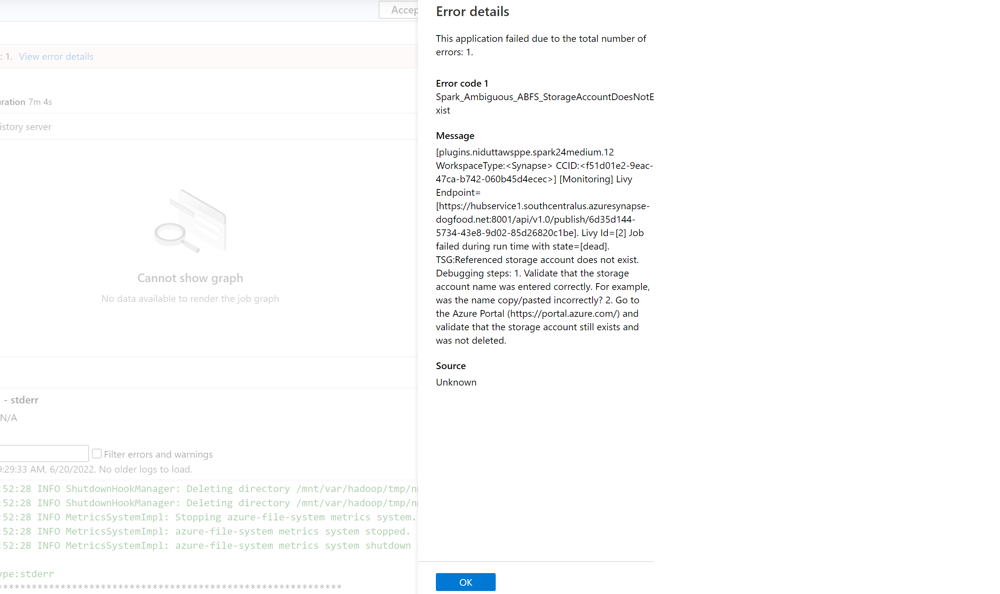

# Interpreting error codes in Synapse

There are many factors that can play into why a spark application fails in Azure Synapse Analytics today, for instance, it can be due to a system error or even a user related error. Previously, all errors in failing jobs on
Synapse were surfaced with a generic error code displaying LIVY_JOB_STATE_DEAD. This error code gave no further insight into why the job has failed and requires significant effort to identify the root cause by digging into the driver, executor, Spark Event and Livy logs and find a resolution for it.


To make this process easier, we have introduced a more precise list of error codes, to replace the previous generic one, that describes the cause of failure. Now whenever a job fails on Azure Synapse Analytics, the error handling feature parses and checks the logs on the backend to identify the root cause and display it to the user on the monitoring pane along with the steps to take to resolve the issue.



## Enable error classification in Synapse

This error classification feature can be enabled or disabled by setting the following Spark config to `true` or `false` at the job or pool level - `livy.rsc.synapse.error-classification.enabled` .

Please find below the list of all error types we support today. Please note, we are continuously refining and adding to these error codes by improving our model.

## Supported error codes and what they mean

Each error code falls under one of the following four buckets:

1. **User** - Indicating a user error
2. **System** - Indicating a system error
3. **Ambiguous** - Could be either user or system error
4. **Unknown** - No classification yet, most probably because the error type isn't included in the model

1. **Spark_Ambiguous_ABFS_StorageAccountDoesNotExist**
    
    Referenced storage account does not exist. Debugging steps:

    Validate that the storage account name was entered correctly. For example, was the name copy/pasted incorrectly?
    Go to the Azure Portal (https://portal.azure.com/ ) and validate that the storage account still exists and was not deleted.

2. **Spark_Ambiguous_ClassLoader_NoClassDefFound**

    A class required by the code could not be found during runtime of the script.

    Please refer to the following pages for package management documentation:

    For Notebook scenarios: [Apache Spark manage packages for interactive jobs](./apache-spark-manage-scala-packages.md) 

    For Spark batch scenarios (see section 6): [Apache Spark manage packages for batch jobs](./apache-spark-job-definitions.md#create-an-apache-spark-job-definition-for-apache-sparkscala )

    Ensure all code dependencies are included in the JARs Synapse runs. If you do not or cannot include third party JARs with your own code, ensure that all dependencies are included in the workspace packages for the Spark pool you are executing code on or included in the "Reference files" listing for the Spark batch submission. See attached documentation.

3. **Spark_Ambiguous_Executor_MaxExecutorFailures**

    Application failed because too many executors failed. The number of acceptable executor failures is controlled by the config spark.yarn.max.executor.failures.

    To investigate this failure, look at the executor logs and error codes.

4. **Spark_Ambiguous_JDBC_ConnectionFailed**

    Connection to the SQL server has failed.

    Ensure the hostname is correct in your SQL server database connection string.
    Ensure the port is properly specified for the database connection.
    Ensure the firewall settings configured on your SQL Server allow connections from your Synapse workspace.

5. **Spark_Ambiguous_JDBC_SQLServerException**

    An error occurred during the execution of SQL statement.

    Ensure that any SQL statements you are issuing have valid syntax.
    Ensure that any SQL tables or functions that you are calling exist and your user as proper permissions for the actions your code is attempting to make. This applies to both standard SQL tables as well as external SQL tables.
    Ensure that the columns referenced in your code exist in the target tables.
    Check the logs for this Spark application by clicking the Monitor tab in left side of the Synapse Studio UI, select "Apache Spark Applications" from the "Activities" section, and find your Spark job from this list. Inspect the logs available in the "Logs" tab in the bottom part of this page.

6. **Spark_Ambiguous_SparkSQL_AnalysisException**

    No TSG is available yet for this error code. This usually means there is a semantic error in the query.

7. **Spark_Ambiguous_TypeChecker_IncompatibleJar**

    No TSG is available yet for this error code.

8. **Spark_Ambiguous_Unknown_AllNodesDisallowed**

    No TSG is available yet for this error code.

9. **Spark_Ambiguous_Unknown_ClassInstantiationError**

    Error instantiating class. Please inspect the namespace of the class and determine if your application code references that class. If so, make sure that your application code constructs the class correctly.

10. **Spark_Ambiguous_UserApp_JobAborted**

    Job was aborted due to user runtime error.

    This can be be for many reasons, a common cause is:

    Ensure the files you are loading are of the format. If you're loading data via read.parquet, ensure the format of the data that is being read is indeed parquet. Consider gating wildcard loads with the file type suffix you intend to load to avoid. For example, instead of using a load string like

    `/path/to/my/parquet/files/*`

    Change this to:

    `/path/to/my/parquet/files/*.parquet`

    To avoid loading JSON files that might exist in the directory.

11. **Spark_Ambiguous_UserApp_NullPointer**

    The code tried to dereference a null value.

    At some point the code attempted to call a method or access a property on a null value. To avoid de-referencing null add null check guards around method calls or property accesses on values that can potentially be null.

    Check the logs for this Spark application by clicking the Monitor tab in left side of the Synapse Studio UI, select "Apache Spark Applications" from the "Activities" section, and find your Spark job from this list. Inspect the logs available in the "Logs" tab in the bottom part of this page for a clearer indication of what was de-referenced.

12. **Spark_Ambiguous_UserApp_SparkContextShutDown**

    Spark Context was shut down.

    While there are many causes for this error, one common cause is when the Spark driver or executor tasks use up too much memory.

    Try running your computation again with a bigger SKU with more memory and with additional nodes.
    Ensure tasks are being parallelized appropriately. Look for foreach statements in your main driver code and convert these foreach loops into parallel tasks executed via Spark API functions.
    Check the executor logs for this Spark application by clicking the Monitor tab in left side of the Synapse Studio UI, select "Apache Spark Applications" from the "Activities" section, and find your Spark job from this list. Click on the "Spark UI" link in the top tab. Once this new page loads click on "Executors" in the top tab. Here you can see all the executors that ran. Inspect the logs for these executors to find the underlying cause of failure.

13. **Spark_Ambiguous_YARN_AllNodesDisallowed**

    Cannot run job because all available nodes are disallowed (Spark internals refer to this as "blacklisted").

    Nodes and executors become disallowed when the configuration `spark.blacklist.enabled` is set to true and too many tasks have failed.

    To investigate this failure, look at task failures section below.

14. **Spark_Ambiguous_YARN_ApplicationAttemptNotFound**

    No TSG is available yet for this error code.

15. **Spark_System_ABFS_OperationFailed**

    An operation with ADLS Gen2 has failed.

    This is typically due to a permissions issue.

    Please ensure that for all ADLS Gen2 resources referenced in the Spark job, that the user running the code has RBAC roles "Storage Blob Data Contributor" on storage accounts the job is expected to read and write from.
    Check the logs for this Spark application by clicking the Monitor tab in left side of the Synapse Studio UI, select "Apache Spark Applications" from the "Activities" section, and find your Spark job from this list. Inspect the logs available in the "Logs" tab in the bottom part of this page for the ADLS Gen2 storage account name that is experiencing this issue.

16. **Spark_System_ABFS_ReadTimedOut**

    Read timed out when access ABFS resource.

    Most common causes for this would be a system issue with configuration of network access points or a transient error.

    While the ABFS driver has built in retry capabilities, try re-running your job after the job fails with this read timeout failure.
    Increase the number of times the ABFS driver will retry before giving up. For example: `spark.conf.set("fs.azure.io.retry.max.retries", "20")`
    Reduce the buffer size requested for ABFS. The default is `8MB`. The minimum is `16KB`, setting this lower might avoid the read timeouts at the expense of much greater network overhead. For example: `spark.conf.set("fs.azure.read.request.size", "16384 ")`

17. **Spark_System_AMRMTokenSecretManager_AppAttemptNotFound**

    The application attempt runs were not found by Synapse.

    This is a system error. Please retry your job and if the failure persists, please contact support for further assistance. Please include the Synapse workspace name, Synapse Spark pool name and this error description in your bug report.

18. **Spark_System_CustomTokenProvider_TimeOut**

    A operation timed out during acquisition of a authorization token.

    This is a system error. Please retry your job and if the failure persists, please contact support for further assistance. Please include the Synapse workspace name, Synapse Spark pool name and this error description in your bug report.

19. **Spark_System_InteractiveSessionDriver_ClientClosedBeforeSASLNegotiation**

    The interactive session could not be started.

    This is a system error. Please retry your job and if the failure persists, please contact support for further assistance. Please include the Synapse workspace name, Synapse Spark pool name and this error description in your bug report.

20. **Spark_System_InteractiveSessionDriver_NoRouteToHost**

    No TSG is available yet for this error code.

21. **Spark_System_InteractiveSessionDriver_RSCDriverInitializeServerFailure**

    The interactive session driver failed to start up.

    This is a system error. Please retry your job and if the failure persists, please contact support for further assistance. Please include the Synapse workspace name, Synapse Spark pool name and this error description in your bug report.

22. **Spark_System_InteractiveSessionDriver_ThreadPoolExecutorRejectedTask**

    The Livy session failed to create a new session.

    This is a system error. Please retry your job and if the failure persists, please contact support for further assistance. Please include the Synapse workspace name, Synapse Spark pool name and this error description in your bug report.

23. **Spark_System_InteractiveSessionDriver_UnableToConnectToPorts**

    No TSG is available yet for this error code.

24. **Spark_System_MetaStore_ConnectionTimeOut**

    No TSG is available yet for this error code.

25. **Spark_System_MetaStore_HiveException**

    Error reading or writing to the Metastore.

    Among other things the Metastore keeps track of information about Spark tables. While the Metastore doesn't store the information contained in the tables, it contains information for Spark to read and write to those tables.

    Ensure that the table doesn't already exist if you're attempting to create a table.
    Ensure that your user account has the correct permissions on the has "Storage Blob Data Contributor" role on the ADLS Gen2 storage account that is storing the Metadata information.
    Check the logs for this Spark application by clicking the Monitor tab in left side of the Synapse Studio UI, select "Apache Spark Applications" from the "Activities" section, and find your Spark job from this list. Inspect the logs available in the "Logs" tab in the bottom part of this page for a clearer indication of which table relation is causing this issue.

26. **Spark_System_MetaStore_HiveException_InsertFailed**

    Error inserting data using the Metastore.

    The Metastore keeps track of tables and views used by Spark. This error typically means that your code referred to a table or view that did not exist, or a column within a table or view that does not exist.

    Ensure the table or view you are referring to exists.
    Ensure all columns that that are being referenced in the insert exist in the target tables.
    Check the logs for this Spark application by clicking the Monitor tab in left side of the Synapse Studio UI, select "Apache Spark Applications" from the "Activities" section, and find your Spark job from this list. Inspect the logs available in the "Logs" tab in the bottom part of this page for a clearer indication of which table relation is causing this issue.

27. **Spark_System_MetaStore_UnableToInstantiateSessionHiveMetaStoreClient**

    Unable to connect to the MetaStore.

    This is typically a system error. However, if you're using an external Metastore, please ensure the setup specified at [Share Hive metastore with Synapse](../../hdinsight/share-hive-metastore-with-synapse.md) is followed.

28. **Spark_System_NonJvmUserApp_FileDoesNotMatchContent**

    No TSG is available yet for this error code.

29. **Spark_System_NonJvmUserApp_UncaughtException**

    No TSG is available yet for this error code.

30. **Spark_System_SQLAnalyticsConnector_CouldNotFindServer**

    Could not find server associated with with SQL Analytics for this workspace.

    This is a system error. Please retry your job and if the failure persists, please contact support for further assistance. Please include the Synapse workspace name, Synapse Spark pool name and this error description in your bug report.

31. **Spark_System_SqlAnalytics_CouldNotFindPrecreatedFolder**
    No TSG is available yet for this error code.

32. **Spark_System_SqlAnalytics_InvalidABFSRestOperation**

    No TSG is available yet for this error code.

33. **Spark_System_SqlAnalytics_WriteFail**

    No TSG is available yet for this error code.

34. **Spark_User_ABFS_DirectoryNotFound**

    No TSG is available yet for this error code.

35. **Spark_User_ABFS_OutputDirectoryAlreadyExists**

    The application is attempting to create a directory or file on a storage path that already exists.

    Please follow the documentation [here](../get-started-analyze-storage.md) on how to correctly work with data in a storage account and locate the existing directory or file.

    To overwrite the existing file, set `mode("overwrite")` on the DataFrameWriter. For more information, please see the mode section of Spark DataFrameWriter [here](https://spark.apache.org/docs/latest/api/java/org/apache/spark/sql/DataFrameWriter.html#mode-org.apache.spark.sql.SaveMode-) .

36. **Spark_User_ABFS_Unauthorized**

    Access unauthorized on the provided ADLS Gen2 account.

    To ensure that you have permission to access the storage account:

    Navigate to the Azure Portal (https://portal.azure.com/ ) to find the storage account.

    Under Access Control (IAM), assign the role "Storage Blob Data contributor" to yourself as well as to the workspace managed identity.

    More details can be found [here](../security/how-to-grant-workspace-managed-identity-permissions.md#grant-permissions-to-managed-identity-after-workspace-creation)

37. **Spark_User_ADLS_OutputDirectoryAlreadyExist**

    No TSG is available yet for this error code.

38. **Spark_User_DataError_NoNumericTypesToAggregate**

    No TSG is available yet for this error code.

39. **Spark_User_FileInput_FileNotFound**

    File not found. Please validate that file at the provided path exists and that you have the permissions required to access the file.

40. **Spark_User_FileInput_InputPathDoesNotExist**

    The application is attempting to access a path in storage that does not exist.

    Please follow the documentation [here](../get-started-analyze-storage.md) on how to correctly work with data in a storage account and verify the correct input path.

41. **Spark_User_HDFS_UnsupportedFileSystem**

    The scheme given for accessing the data resource isn't supported.

    When specifying a fileset to read/write you've also supplied a scheme. This scheme defines how Spark will attempt to communicate the storage backend in the given URL. The scheme you've provided is unknown to Synapse. For example:

    http://www.example.com/myfile.txt 

    This has a scheme of "http". Synapse will attempt to find a driver that can load something with a scheme of "http". Data storage backends have a specific scheme that is used to specify how Synapse will access them.

    Some common data storage backends and their schemes:

    ```
    Azure Blob Storage: wasb
    Azure Blob Storage (Secure): wasbs
    Azure Data Lake Storage Gen1: adl
    Azure Data Lake Storage Gen1 (Secure): adls
    Azure Data Lake Storage Gen2: abfs
    Azure Data Lake Storage Gen2 (Secure): abfss
    Amazon S3: s3a
    Google Cloud Storage: gs
    ```

    To fix this issue:

    Check your resource reading/writing lines and ensure the schemes given for resource URLs is correct.
    If you're using a custom data driver for a data backend, ensure that the JAR file providing support for the desired schema is included in the workspace packages for the pool you're executing code on.
    Check the logs for this Spark application by clicking the Monitor tab in left side of the Synapse Studio UI, select "Apache Spark Applications" from the "Activities" section, and find your Spark job from this list. Inspect the logs available in the "Logs" tab in the bottom part of this page to identify the exact storage URL that is encountering this issue.

42. **Spark_User_ImportError_CannotImportName**

    No TSG is available yet for this error code.

43. **Spark_User_JDBC_LoginFailed**

    The application does not have correct credentials to access Microsoft SQL Database through Java Database Connectivity (JDBC) driver.

    Please validate that you have entered the correct credentials.

    For more information on how to setup Synapse SQL with JDBC, please visit: [Connect overview](../sql/connect-overview.md) and [Guide to connection strings](../sql/connection-strings.md).

44. **Spark_User_Jackson_CouldNotResolveTypeId**

    No TSG is available yet for this error code.

45. **Spark_User_Jackson_InvalidDeserializationFormat**

    No TSG is available yet for this error code.

46. **Spark_User_Kusto_InternalServiceError**

    No TSG is available yet for this error code.

47. **Spark_User_Kusto_OperationFailure**

    No TSG is available yet for this error code.

48. **Spark_User_LinkedServiceName_ConfigurationNotProvided**

    LinkedServiceName is not provided in spark configuration. Please set `spark.storage.synapse.linkedServiceName`.

    For more information on how to use ADLS Gen2 storage with linked services, please visit: [Secure credentials with TokenLibrary](./apache-spark-secure-credentials-with-tokenlibrary.md?pivots=programming-language-scala#adls-gen2-storage-with-linked-services).

49. **Spark_User_MetaStore_NoSuchDatabase**

    No TSG is available yet for this error code.

50. **Spark_User_MetaStore_TableOrViewNotFound**

    No TSG is available yet for this error code.

51. **Spark_User_MicrosoftSQLServer_ObjectAlreadyExist**

    No TSG is available yet for this error code.

52. **Spark_User_NameError_NameIsNotDefined**

    No TSG is available yet for this error code.

53. **Spark_User_Parquet_NeedsManualSchema**

    The given parquet fileset's schema cannot be inferred.

    Ensure that the target parquet directory contains parquet files. If no parquet files exist in the target directory, then Synapse cannot determine a schema and will fail.
    If the target parquet directory only contains subdirectories that you wish to load, ensure your globbing pattern uses the directory recursing "**" versus the non-recursing "*".
    Check the logs for this Spark application by clicking the Monitor tab in left side of the Synapse Studio UI, select "Apache Spark Applications" from the "Activities" section, and find your Spark job from this list. Inspect the logs available in the "Logs" tab in the bottom part of this page to identify the exact storage URL that is encountering this issue.

54. **Spark_User_SparkPerformanceToolkit_OutputDirectoryAlreadyExists**

    No TSG is available yet for this error code.

55. **Spark_User_SparkSQL_CannotResolve**

    No TSG is available yet for this error code.

56. **Spark_User_SparkSQL_FailedToMergeIncompatibleDataTypes**

    No TSG is available yet for this error code.

57. **Spark_User_SparkSQL_PathAlreadyExists**

    No TSG is available yet for this error code.

58. **Spark_User_SparkSQL_PathDoesNotExist**

    No TSG is available yet for this error code.

59. **Spark_User_SparkSQL_ReadTimedOut**

    No TSG is available yet for this error code.

60. **Spark_User_Storage_FailedToAuthenticateException**

    No TSG is available yet for this error code.

61. **Spark_User_TypeError_BytesLikeObjectRequired**

    No TSG is available yet for this error code.

62. **Spark_User_TypeError_IntegerIsRequiredGotBytes**

    No TSG is available yet for this error code.

63. **Spark_User_TypeError_ObjectIsNotCallable**

    No TSG is available yet for this error code.

64. **Spark_User_TypeError_SubclassArgMustBeAClass**

    No TSG is available yet for this error code.

65. **Spark_User_TypeError_TypeNotIterable**

    In Python, the error TypeError: argument of type 'insert type' is not iterable occurs when the membership operator (in, not in) is used to validate the membership of a value in non iterable objects such as list, tuple, dictionary. This is usually due to the search of value in a non-iterable object. Possible solutions:

    Check if the value is present in the iterable object
    If you want to check one value to another, use logical operator instead of Membership Operator.
    If the membership operator contains `None` value, it won't be able to iterate and a `null` check or assigned default must be done.
    Check if the type of the value used can actually be checked and the typing is correct.

66. **Spark_User_TypeError_UnableToInferSchemaForParquet**

    No TSG is available yet for this error code.

67. **Spark_User_TypesafeConfig_MissingConfigurationSetting**

    No TSG is available yet for this error code.

68. **Spark_User_UserApp_ArrayIndexOutOfBoundsException**

    Please verify if the application is attempting to access a non-existent array index. Remember that arrays are 0-indexed, so a 3-element array will have indexes 0, 1, 2.

69. **Spark_User_UserApp_AssertionError**

    No TSG is available yet for this error code.

70. **Spark_User_UserApp_AttributeError**

    No TSG is available yet for this error code.

71. **Spark_User_UserApp_CalledSystemExit**

    User application called `System.exit()`. Spark treats this as a user error, and marks the application as FAILED.

    If the application ran successfully, then instead of calling `System.exit(0)`, simply return from `main()`. If the application failed, then throw an Exception instead of calling `System.exit(1)`.

72. **Spark_User_UserApp_ChangingPermissionsFailedError**

    No TSG is available yet for this error code.

73. **Spark_User_UserApp_DriverOutOfMemory**

    No TSG is available yet for this error code.

74. **Spark_User_UserApp_IllegalArgument**

    A function was called with an invalid or illegal argument.

    There are many causes that could trigger this. Common situations that cause this error are:

    Referencing a non-existent column in a dataframe. Please check the name of the columns being referenced in dataframe manipulation.
    Function calls are called with property arity and provided types match expected types of the function.
    Datetime strings being parsed into Datetime objects have the expected format.
    Resource URLs being read or written are well formed.
    Check the logs for this Spark application by clicking the Monitor tab in left side of the Synapse Studio UI, select "Apache Spark Applications" from the "Activities" section, and find your Spark job from this list. Inspect the logs available in the "Logs" tab in the bottom part of this page to identify the underlying cause.

75. **Spark_User_UserApp_IncompatibleDataTypes**

    No TSG is available yet for this error code.

76. **Spark_User_UserApp_InvalidNumberFormat**

    An attempt was made to parse a non-numerical string to integer.

    Check if your code parses any strings to number types. If so, validate whether there are any edge cases or corner cases where a non-numerical string could be parsed.

    For example: In Python: Is the application parsing a non-numerical string with `int()` or `float()`? In Scala: Is the application parsing a non-numerical string with `.toInt` or `.toFloat`?

77. **Spark_User_UserApp_JSONDecodeError**

    No TSG is available yet for this error code.

78. **Spark_User_UserApp_JobCancelledException**

    No TSG is available yet for this error code.

79. **Spark_User_UserApp_KeyError**

    No TSG is available yet for this error code.

80. **Spark_User_UserApp_MethodNotImplemented**

    No TSG is available yet for this error code.

81. **Spark_User_UserApp_ModuleNotFoundError

    No TSG is available yet for this error code.

82. **Spark_User_UserApp_NoSuchElementException**

    The application is accessing an element that does not exist or is null.

    Debugging steps:

    Please check if the application is calling .next on an empty iterator.
    Please check if the application is accessing a non-existent key in a dictionary.
    Please check if the application is calling .get on a None Option type. For more information, please see: https://www.scala-lang.org/api/current/scala/Option.html .

83. **Spark_User_UserApp_NoSuchMethod**

    The application is calling a method that is not available in the Java classpath. This usually means that the application was submitted without a necessary dependency JAR.

    Likely mitigation steps:

    Locate the dependency in question after `java.lang.NoSuchMethodError:` in the driver error stacktrace.

    If the dependency is missing, please visit the below link for instructions on how to include it in your application. For Notebook scenarios: [Apache Spark manage packages for interactive jobs](./apache-spark-manage-scala-packages.md)

    For Spark batch scenarios (see section 6): [Apache Spark manage packages for batch jobs](./apache-spark-job-definitions.md#create-an-apache-spark-job-definition-for-apache-sparkscala )

    If the dependency is incompatible with Spark and Scala version of your spark pool, please replace the dependency with the compatible versions. For example, Spark 2.4 requires Scala 2.11 and Spark 3.1 requires Scala 2.12.

84. **Spark_User_UserApp_NotImplementedError**
    
    No TSG is available yet for this error code.

85. **Spark_User_UserApp_OutOfMemory**

    No TSG is available yet for this error code.

86. **Spark_User_UserApp_ResultSizeExceedsMaxResultSize**

    No TSG is available yet for this error code.

87. **Spark_User_UserApp_RpcMessageExceedsMaxAllowed**

    No TSG is available yet for this error code.

88. **Spark_User_UserApp_SchemaConversionError**

    No TSG is available yet for this error code.

89. **Spark_User_UserApp_SparkContextNotStarted**

    User application did not start `SparkContext`. Spark treats this as a user error, and marks the application as FAILED.

90. **Spark_User_UserApp_StreamNotFoundError**

    No TSG is available yet for this error code.

91. **Spark_User_UserApp_TaskNotSerializable**

    There appears to be an unserializable object in your application code that prevents Spark executing your code.

    For more details please visit: https://spark.apache.org/docs/latest/tuning.html#data-serialization .

    Likely mitigation steps:

    Please check the exception stacktrace in the driver stderr logs and locate the value not serializable under Serialization stack -> object not serializable -> value.
    If the value is a storage account, please verify the account name is entered correctly or go to the Azure Portal (https://portal.azure.com/ ) and validate that the storage account still exists and was not deleted.
    If the value is not a storage account, please consider making the unserializable class implement the Serializable interface: https://docs.oracle.com/javase/8/docs/api/java/io/Serializable.html  by adding "extends Serializable" to the class interface.

92. **Spark_User_UserApp_TooManySparkContexts**

    The application code has instantiated more than one SparkContext.

    Only one `SparkContext` may be running in a given JVM. For more details, please visit https://issues.apache.org/jira/browse/SPARK-2243 .

    If you are running a notebook or interactive session, please verify if your notebook code is instantiating a SparkContext. Synapse has already prepared a SparkContext for your session so please do not instantiate another one. The variable `spark` is the SparkSession object and the variable `sc` is the SparkContext object.

93. **Spark_User_UserApp_ValueError**

    No TSG is available yet for this error code.

94. **Spark_User_WASB_NoCredentials**

    Credentials were not provided for the WASB URI.

    Verify that you meant to specify the storage path using a WASB URI. For example, if your storage account uses Azure Data Lake Storage Gen2, please specify storage URIs using the ABFS URI scheme:

    `abfss://file_system@account_name.dfs.core.windows.net/<path>/<path>/<file_name>`

    For more information regarding the ABFS URI scheme, please consult [this article](/azure/storage/blobs/data-lake-storage-introduction-abfs-uri.md)

    If you are certain that you want to read from a WASB URI, then you will need to provide a SAS token. To do so, register your Azure Storage account as a Linked Service on the workspace, then use this function to get the SAS token:

    `val token = mssparkutils.credentials.getConnectionStringOrCreds(<linked service name>)`

    Once you have the SAS token, configure the SparkSession to use the token when connecting to the storage account via WASB:

    `spark.conf.set("fs.azure.sas.<container name>.<storage account name>.blob.core.windows.net", token)`

    A full example is provided in [this article](./apache-spark-development-using-notebooks.md?tabs=classical#read-a-csv-from-azure-blob-storage-as-a-spark-dataframe).

95. **Spark_User_WASB_PathDoesNotExist**

    Given file path does not exist in the user storage.

    Synapse provides storage for storing tables and files. When you read or write data without giving a fully qualified URL, Synapse will assume you want to read or write relative to this provided location. This error arises when a table that you've requested or a file you've requested does not exist in this location.

    Ensure that you do not mean to fully qualify your URL to reference some other storage account.
    If you do mean to use the Synapse provided storage, ensure that you have successfully written a file or table by the name you're using to read.
    Check the logs for this Spark application by clicking the Monitor tab in left side of the Synapse Studio UI, select "Apache Spark Applications" from the "Activities" section, and find your Spark job from this list. Inspect the logs available in the "Logs" tab in the bottom part of this page to identify the exact storage URL that is encountering this issue.

96. **Spark_Ambiguous_Unknown_ClassNotFound**

    Error instantiating class. Please inspect the namespace of the class and determine if your application code references that class. If so, make sure that you are providing the required JAR when submitting your application.

97. **Spark_Ambiguous_UserApp_IllegalStateException**

    No TSG is available yet for this error code.

98. **Spark_Ambiguous_ApplicationMaster_SparkContextInitializationTimedOut**

    Spark jobs failed waiting for internal services to be setup correctly.

    Something took too long to load while the initial Spark context was being setup.

    This can be caused by plugins registered with the Spark context taking too long to load.

    Ensure that your Spark code is not defining the master to be local. Remove the specification of `.master()` from your SparkSession creation command.
    Disable any custom Spark plugins. This would be done through a custom Spark configuration. Click the "Manage" button on the far left tab in the Synapse Studio UI. Click "Apache Spark pools" under the "Analytics pools" section. Find the pool the code is executing against. Mouse over the pool and click the three dot icon and select "Apache Spark configuration". Inspect this configuration for added plugins and remove them as necessary.

99. **Spark_Ambiguous_UserApp_SparkBroadcastJoinTimeout**

    Spark broadcast variables allow programmers to keep a read-only variable cached on each machine rather than shipping a copy of it with tasks. A timeout can occur when the DataFrames is extremely large taking a lot of time hence timing out. Potential Solutions:

    Increase `spark.sql.broadcastTimeout`
    Use `persist()` on DataFrames then Spark will use Shuffle Join
    Disable broadcast by setting `spark.sql.autoBroadcastJoinThreshold` to `-1`
    Increase memory of node or driver to handle larger broadcast joins


> [!NOTE]
> If you have built any tooling around Synapse job monitoring that checks for a failing job by checking against the error code `LIVY_JOB_STATE_DEAD`, that would no longer work as the returned error codes would be different as mentioned above. Please modify any scripts accordingly in order to utilize this feature, or disable the feature if not needed.
