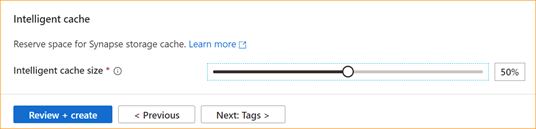
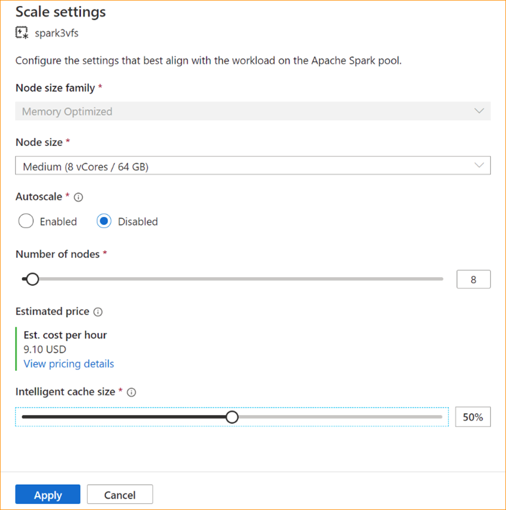
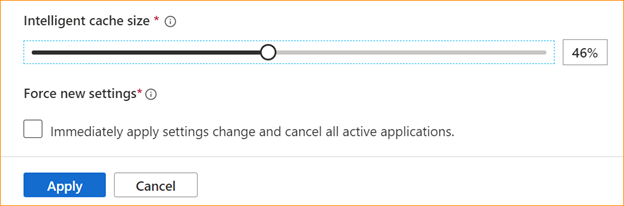

# Intelligent Cache in Azure Synapse Analytics

The Intelligent Cache works seamlessly behind the scenes and caches data to help speed up the execution of Spark as it reads from your ADLS Gen2 data lake. It also automatically detects changes to the underlying files and will automatically refresh the files in the cache, providing you with the most recent data and when the cache size reaches its limit, the cache will automatically release the least read data to make space for more recent data. This feature lowers the total cost of ownership by improving performance up to 65% on subsequent reads of the files that are stored in the available cache for Parquet files and 50% for CSV files. 

When querying a file or table from your data lake, the Apache Spark engine in Synapse will make a call to the remote ADLS Gen2 storage to read the underlying files. With every query request to read the same data, the Spark engine must make a call to remote ADLS Gen2 storage. This redundant process adds latency to your total processing time. Spark provides a caching feature that you must manually set the cache and release the cache to minimize the latency and improve overall performance. However, this can cause results to have stale data if the underlying data changes. 

The Synapse Intelligent Cache simplifies this process by automatically caching each read within the allocated cache storage space on each Spark node. Each request for a file will check to see if the file exists in the cache and compare the tag from the remote storage to determine if the file is stale. If the file doesn't exist or if the file is stale, then Spark will read the file and store it in the cache. When the cache becomes full, the file with the oldest last access time will be evicted from the cache to allow for more recent files. 

The Synapse cache is a single cache per node. If you're using a medium size node and run with two small executors on a single medium size node, these two executors would share the same cache. 

## Enable or Disable the cache

The cache size can be adjusted based on the percent of total disk size available for each Apache Spark pool. By default, the cache is set to disabled but it's as easy as moving the **slider** bar from 0 (disabled) to the desired percentage for your cache size to enable it. We reserve a minimum of 20% of available disk space for data shuffles. For shuffle intensive workloads, you can minimize the cache size or disable the cache. We recommend starting with a 50% cache size and adjust as necessary. It's important to note that if your workload requires a lot of disk space on the local SSD for shuffle or RDD caching, then consider reducing the cache size to reduce the chance of failure due to insufficient storage. The actual size of the available storage and the cache size on each node will depend on the node family and node size.


### Enabling cache for new Spark pools

When creating a new Spark pool, browse under the **additional settings** tab to find the **Intelligent Cache slider** you can move to your preferred size to enable the feature. 




### Enabling/Disabling cache for existing Spark pools

For existing Spark pools, browse to the **Scale settings** of your Apache Spark pool of choice to enable, by moving the **slider** to a value more than 0, or disable it, by moving **slider** to 0.




### Changing cache size for existing Spark pools

To change the Intelligent Cache size of a pool, you must force a restart if the pool has active sessions. If the Spark pool has an active session, then it will show **Force new settings**.  Click on the **check box** and select **Apply** to automatically restart the session. 




### Enabling and disabling the cache within the session

Easily disable the Intelligent Cache within a session by running the following code in your notebook: 
```scala
   %spark 

   spark.conf.set("spark.synapse.vegas.useCache", "false") 
```

```python
   %pyspark 

   spark.conf.set('spark.synapse.vegas.useCache', 'false') 
```

And enable by running:  
```scala
   %spark 

   spark.conf.set("spark.synapse.vegas.useCache", "true") 
```

```python
   %pyspark 

   spark.conf.set('spark.synapse.vegas.useCache', 'true') 
```


## When to use the Intelligent Cache and when not to? 

This feature will benefit you if:
* Your workload requires reading the same file multiple times and the file size can fit into the cache. 

* Your workload uses Delta tables, parquet file formats and CSV files. 

* You're using Apache Spark 3 or higher on Azure Synapse. 


You won't see the benefit of this feature if:
* You're reading a file that exceeds the cache size because the beginning of the files could be evicted and subsequent queries will have to refetch the data from the remote storage. In this case, you won't see any benefits from the Intelligent Cache and you may want to increase your cache size and/or node size.  

* Your workload requires large amounts of shuffle, then disabling the Intelligent Cache will free up available space to prevent your job from failing due to insufficient storage space.  

* You're using a Spark 3.1 pool, you'll need to upgrade your pool to the latest version of Spark. 


## Learn more
To learn more on Apache Spark, see the following articles:
  - [What is Apache Spark](./spark/../apache-spark-concepts.md)
  - [Apache Spark core concepts](./spark/../apache-spark-concepts.md)
  - [Azure Synapse Runtime for Apache Spark 3.2](./spark/../apache-spark-32-runtime.md)
  - [Apache Spark pool sizes and configurations](./spark/../apache-spark-pool-configurations.md)

To learn about configuring Spark session settings
  - [Configure Spark session settings](./spark/../apache-spark-development-using-notebooks.md)
  - [How to set Spark / Pyspark custom configs](https://techcommunity.microsoft.com/t5/azure-synapse-analytics-blog/how-to-set-spark-pyspark-custom-configs-in-synapse-workspace/ba-p/2114434)


## Next steps
An Apache Spark pool provides open-source big data compute capabilities where data can be loaded, modeled, processed, and distributed for faster analytic insight. To learn more about how to create one to run your Spark workloads, visit the following tutorials:
  - [Create a new serverless Apache Spark pool using the Azure portal](./spark/../../quickstart-create-apache-spark-pool-portal.md)
  - [Create a serverless Apache Spark pool using Synapse Studio](./spark/../../quickstart-create-apache-spark-pool-studio.md)


