# Tutorial: Create Apache Spark job definition in Synapse Studio

This tutorial demonstrates how to use the Azure Synapse Studio to create Apache Spark job definitions, and then submit them to an Apache Spark pool.

This tutorial covers the following tasks:

* Create an Apache Spark job definition for PySpark (Python)
* Create an Apache Spark job definition for Spark(Scala)
* Create an Apache Spark job definition for .NET Spark(C#)
* Submit an Apache Spark job definition as a batch job
* Add an Apache Spark job definition into pipeline

## Prerequisites

Before you start with this tutorial, make sure to meet the following requirements:

* An Azure Synapse Analytics workspace. For instructions, see [Create an Azure Synapse Analytics workspace](../../machine-learning/how-to-manage-workspace.md?toc=/azure/synapse-analytics/toc.json&bc=/azure/synapse-analytics/breadcrumb/toc.json#create-a-workspace).
* An Apache Spark pool
* An ADLS Gen2 storage account. You need to be the Storage Blob Data Owner of the ADLS Gen2 filesystem you want to work with. If you aren't, you need to add the permission manually.

## Create an Apache Spark job definition for PySpark (Python)

In this section, you create an Apache Spark job definition for PySpark (Python).

1. Open [Azure Synapse Studio](https://web.azuresynapse.net/).

2. You can go to [Sample files for creating Apache Spark job definitions](https://github.com/Azure-Samples/Synapse/tree/master/Spark/Python) to download **wordcount.jar** and **shakespear.txt**. And then, upload these files into Azure Storage: Click **Data**, select **Storage accounts**, and upload related files to your ADLS Gen2 filesystem. Skip this step if your files are already in the Azure storage. 

     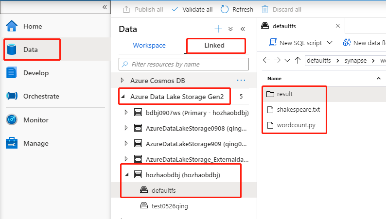

3. Click **Develop** hub, Select **Spark job definitions** from the left pane, click '…' Action node next to the **Spark job definition**, then select **New Spark job definition** in the context menu.

     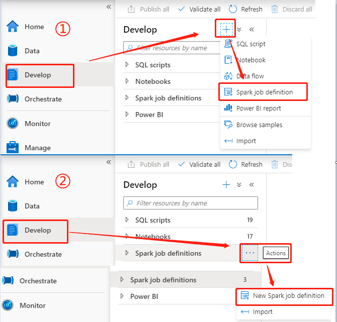

4. Select **PySpark (Python)** from the Language drop down list in the Apache Spark job definition main window.

5. Fill in information for Apache Spark job definition. You can copy the sample information.

     |  Property   | Description   |  
     | ----- | ----- |  
     |Job definition name| Enter a name for your Apache Spark job definition. This name can be updated at any time until it's published. Sample: `job definition sample`|
     |Main definition file| The main file used for the job. Select a PY file from your storage. You can select **Upload file** to upload the file to a storage account. Sample: `abfss://azureportaldeploy@storageaccountname.dfs.core.windows.net/synapse/workspaces/workspace name/batchjobs/python/fileexists.py`|
     |Command-line arguments| Optional arguments to the job. Sample: `shakespeare.txt`|
     |Reference files| Additional files used for reference in the main definition file. You can select **Upload file** to upload the file to a storage account. Sample: `abfss://azureportaldeploy@storageaccountname.dfs.core.windows.net/synapse/workspaces/workspace name/batchjobs/python/shakespeare.txt`|
     |Spark pool| The job will be submitted to the selected Apache Spark pool.|
     |Spark version| Version of Apache Spark that the Apache Spark pool is running.|
     |Executors| Number of executors to be given in the specified Apache Spark pool for the job.|
     |Executor size| Number of cores and memory to be used for executors given in the specified Apache Spark pool for the job.|  
     |Driver size| Number of cores and memory to be used for driver given in the specified Apache Spark pool for the job.|

     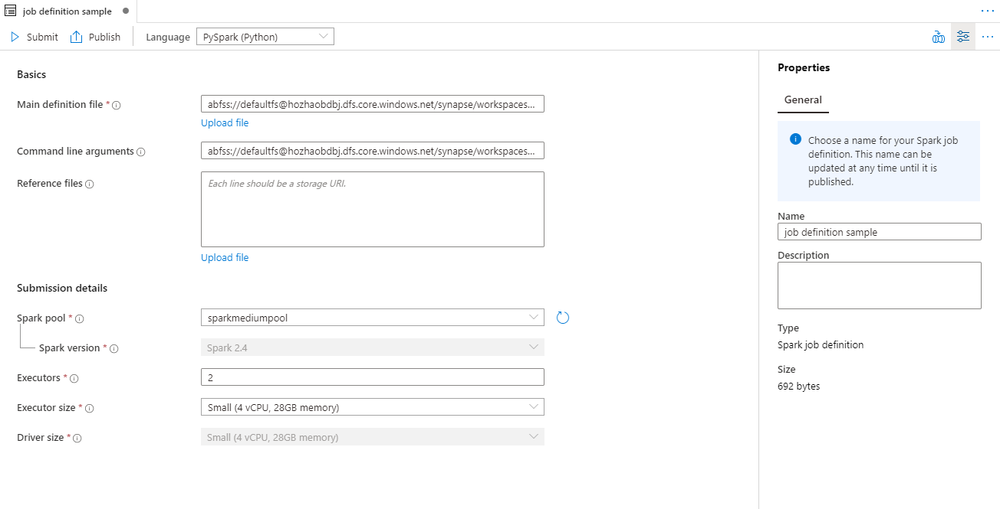

6. Select **Publish** to save the Apache Spark job definition.

     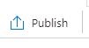

## Create an Apache Spark job definition for Apache Spark(Scala)

In this section, you create an Apache Spark job definition for Apache Spark(Scala).

 1. Open [Azure Synapse Studio](https://web.azuresynapse.net/).

 2. You can go to [Sample files for creating Apache Spark job definitions](https://github.com/Azure-Samples/Synapse/tree/master/Spark/Scala) to download **wordcount.jar** and **shakespear.txt**. And then, upload these files into Azure Storage: Click **Data**, select **Storage accounts**, and upload related files to your ADLS Gen2 filesystem. Skip this step if your files are already in the Azure storage. 
 
     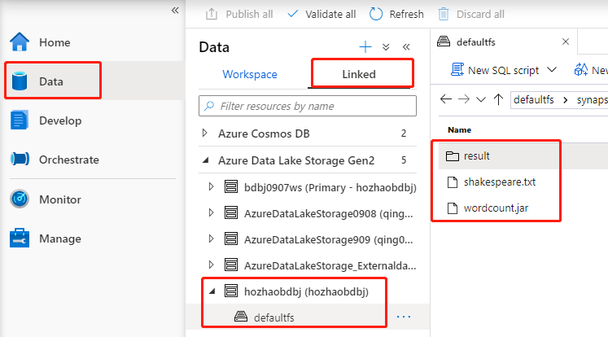

 3. Click **Develop** hub, Select **Spark job definitions** from the left pane, click '…' Action node next to the **Spark job definition**, then select **New Spark job definition** in the context menu.
     

 4. Select **Spark(Scala)** from the Language drop down list in the Apache Spark job definition main window.

 5. Fill in information for Apache Spark job definition. You can copy the sample information.

     |  Property   | Description   |  
     | ----- | ----- |  
     |Job definition name| Enter a name for your Apache Spark job definition. This name can be updated at any time until it's published. Sample: `job definition sample`|
     |Main definition file| The main file used for the job. Select a JAR file from your storage. You can select **Upload file** to upload the file to a storage account. Sample: `abfss://sparkjob@storageaccountname.dfs.core.windows.net/scala/wordcount/wordcount.jar`|
     |Main class name| The fully qualified identifier or the main class that is in the main definition file. Sample: `WordCount`|
     |Command-line arguments| Optional arguments to the job. Sample: `abfss://sparkjob@storageaccountname.dfs.core.windows.net/scala/wordcount/shakespeare.txt abfss://sparkjob@storageaccountname.dfs.core.windows.net/scala/wordcount/result`|
     |Reference files| Additional files used for reference in the main definition file. You can select **Upload file** to upload the file to a storage account.|
     |Spark pool| The job will be submitted to the selected Apache Spark pool.|
     |Spark version| Version of Apache Spark that the Apache Spark pool is running.|
     |Executors| Number of executors to be given in the specified Apache Spark pool for the job.|  
     |Executor size| Number of cores and memory to be used for executors given in the specified Apache Spark pool for the job.|
     |Driver size| Number of cores and memory to be used for driver given in the specified Apache Spark pool for the job.|

     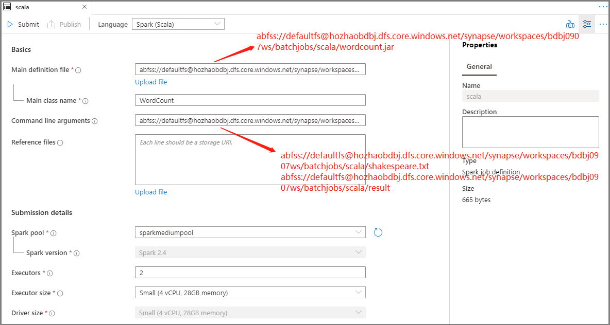

 6. Select **Publish** to save the Apache Spark job definition.

     

## Create an Apache Spark job definition for .NET Spark(C#)

In this section, you create an Apache Spark job definition for .NET Spark(C#).
 1. Open [Azure Synapse Studio](https://web.azuresynapse.net/).

 2. You can go to [Sample files for creating Apache Spark job definitions](https://github.com/Azure-Samples/Synapse/tree/master/Spark/DotNET) to download **wordcount.zip** and **shakespear.txt**. And then, upload these files into Azure Storage: Click **Data**, select **Storage accounts**, and upload related files to your ADLS Gen2 filesystem. Skip this step if your files are already in the Azure storage. 

     

 3. Click **Develop** hub, Select **Spark job definitions** from the left pane, click '…' Action node next to the **Spark job definition**, then select **New Spark job definition** in the context menu.

     

 4. Select **.NET Spark(C#/F#)** from the Language drop down list in the Apache Spark Job Definition main window.

 5. Fill in information for Apache Spark Job Definition. You can copy the sample information.
     |  Property   | Description   |  
     | ----- | ----- |  
     |Job definition name| Enter a name for your Apache Spark job definition. This name can be updated at any time until it's published. Sample: `job definition sample`|
     |Main definition file| The main file used for the job. Select a ZIP file that contains your .NET for Apache Spark application(that is, the main executable file, DLLs containing user-defined functions, and other required files) from your storage. You can select **Upload file** to upload the file to a storage account. Sample: `abfss://sparkjob@storageaccountname.dfs.core.windows.net/dotnet/wordcount/wordcount.zip`|
     |Main executable file| The main executable file in the main definition ZIP file. Sample: `WordCount`|
     |Command-line arguments| Optional arguments to the job. Sample: `abfss://sparkjob@storageaccountname.dfs.core.windows.net/dotnet/wordcount/shakespeare.txt abfss://sparkjob@storageaccountname.dfs.core.windows.net/dotnet/wordcount/result`|
     |Reference files| Additional files needed by the worker nodes for executing the .NET for Apache Spark application that isn't included in the main definition ZIP file(that is, dependent jars, additional user-defined function DLLs, and other config files). You can select **Upload file** to upload the file to a storage account.|
     |Spark pool| The job will be submitted to the selected Apache Spark pool.|
     |Spark version| Version of Apache Spark that the Apache Spark pool is running.|
     |Executors| Number of executors to be given in the specified Apache Spark pool for the job.|  
     |Executor size| Number of cores and memory to be used for executors given in the specified Apache Spark pool for the job.|
     |Driver size| Number of cores and memory to be used for driver given in the specified Apache Spark pool for the job.|

     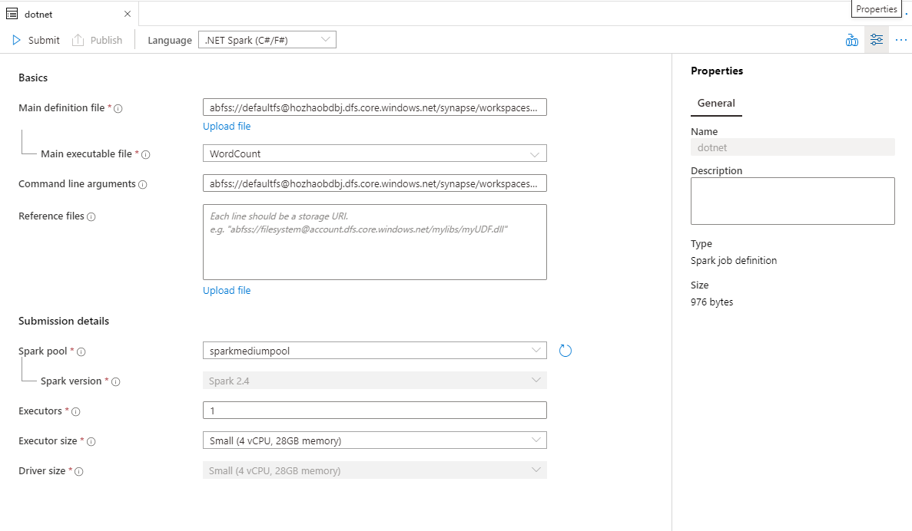

 6. Select **Publish** to save the Apache Spark job definition.

      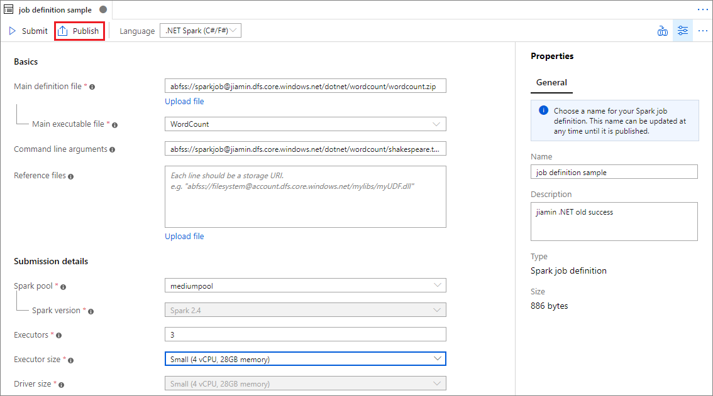

## Submit an Apache Spark job definition as a batch job

After creating an Apache Spark job definition, you can submit it to an Apache Spark pool. Make sure you are the Storage Blob Data Owner of the ADLS Gen2 filesystem you want to work with. If you aren't, you need to add the permission manually.

### Scenario 1: Submit Apache Spark job definition
 1. Open an Apache spark job definition window by clicking it.

      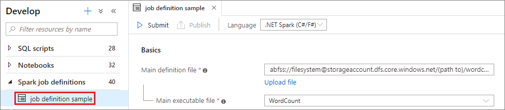

 2. Click **submit** icon to submit your project to the selected Apache Spark Pool. You can click **Spark monitoring URL** tab to see the LogQuery of the Apache Spark application.

    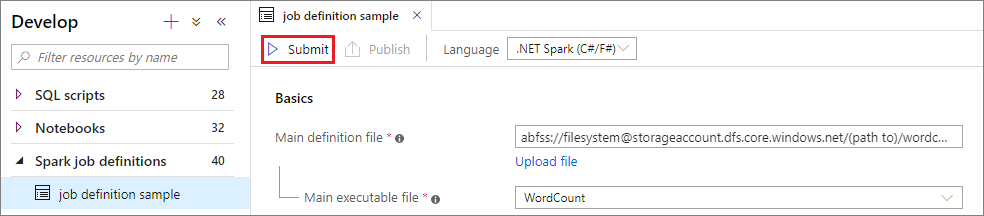

    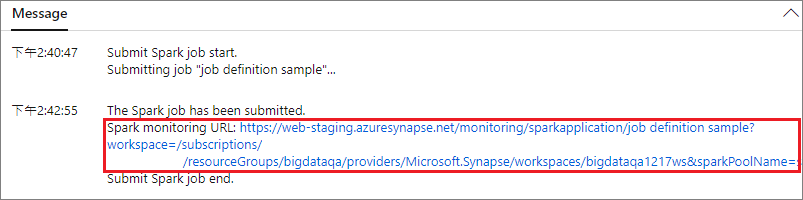

### Scenario 2: View Apache Spark job running progress

 1. Click **Monitor**, then select the **Spark applications** option. You can find the submitted Apache Spark application.

     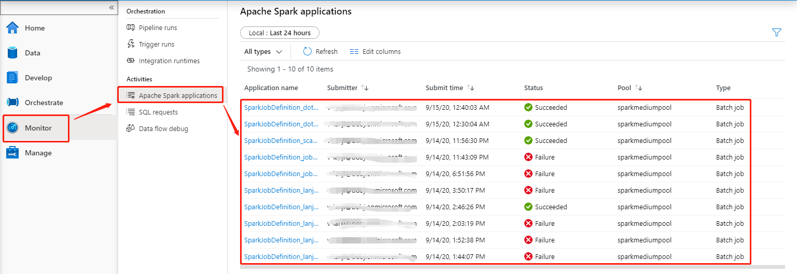

 2. Then click the Apache Spark application, **LogQuery** window displays. You can view the job execution progress from **LogQuery**.
     
     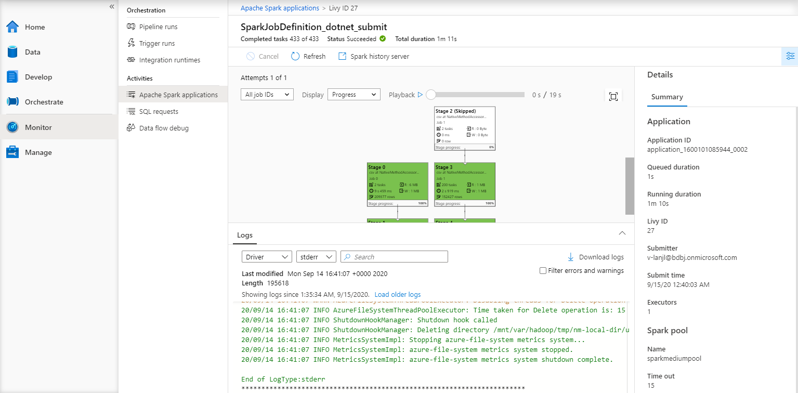

### Scenario 3: Check output file

 1. Click **Data**, then select **Storage accounts**. After a successful run, you can go to the ADLS Gen2 storage and check outputs are generated.

     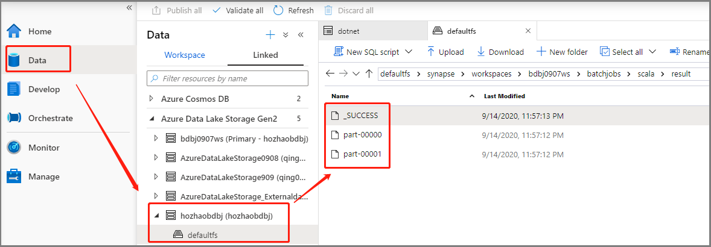

## Add an Apache Spark job definition into pipeline

In this section, you add an Apache Spark job definition into pipeline.

 1. Open an existing Apache Spark job definition.

 2. Click the icon on the top right of Apache Spark job definition, choose **Existing Pipeline**, or **New pipeline**. You can refer to Pipeline page for more information.

     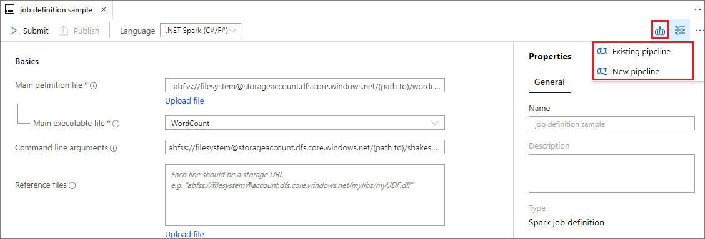

     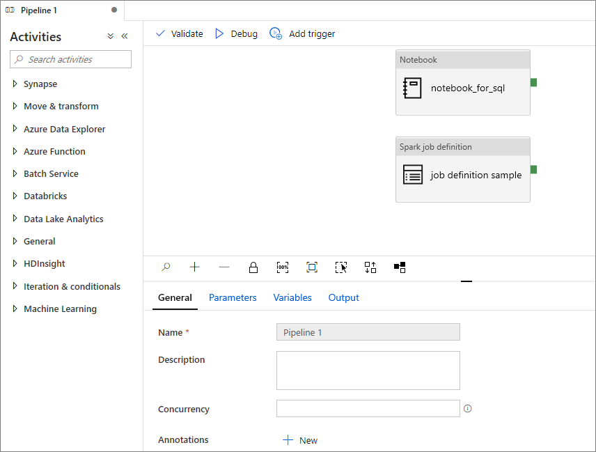

## Next steps

This tutorial demonstrates how to use the Azure Synapse Studio to create Apache Spark job definitions, and then submit them to an Apache Spark pool. Next you can use the Azure Synapse Studio to create Power BI datasets and manage Power BI data.

