# Tutorial: Create Apache Spark job definition in Synapse Studio

This tutorial demonstrates how to use the Synapse Studio to create Apache Spark job definitions, and then submit them to a serverless Apache Spark pool.

This tutorial covers the following tasks:
> [!div class="checklist"]
>
> - Create an Apache Spark job definition for PySpark (Python)
> - Create an Apache Spark job definition for Spark (Scala)
> - Create an Apache Spark job definition for .NET Spark (C#/F#)
> - Create job definition by importing a JSON file
> - Exporting an Apache Spark job definition file to local
> - Submit an Apache Spark job definition as a batch job
> - Add an Apache Spark job definition into pipeline


## Prerequisites

Before you start with this tutorial, make sure to meet the following requirements:

* An Azure Synapse Analytics workspace. For instructions, see [Create an Azure Synapse Analytics workspace](../../machine-learning/how-to-manage-workspace.md).
* A serverless Apache Spark pool.
* An ADLS Gen2 storage account. You need to be the **Storage Blob Data Contributor** of the ADLS Gen2 filesystem you want to work with. If you aren't, you need to add the permission manually.
* If you don’t want to use the workspace default storage, link the required ADLS Gen2 storage account in Synapse Studio. 


## Create an Apache Spark job definition for PySpark (Python)

In this section, you create an Apache Spark job definition for PySpark (Python).

1. Open [Synapse Studio](https://web.azuresynapse.net/).

2. You can go to [Sample files for creating Apache Spark job definitions](https://github.com/Azure-Samples/Synapse/tree/master/Spark/Python) to download **sample files for python.zip**, then unzip the compressed package, and extract the **wordcount.py** and **shakespeare.txt** files. 

     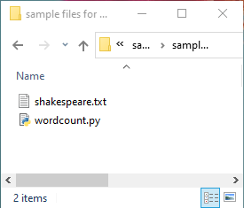

3. Select **Data** -> **Linked** -> **Azure Data Lake Storage Gen2**, and upload **wordcount.py** and **shakespeare.txt** into your ADLS Gen2 filesystem. 

     

4. Select **Develop** hub, select the '+' icon and select **Spark job definition** to create a new Spark job definition. 

     

5. Select **PySpark (Python)** from the Language drop down list in the Apache Spark job definition main window.

     

6. Fill in information for Apache Spark job definition. 

     |  Property   | Description   |  
     | ----- | ----- |  
     |Job definition name| Enter a name for your Apache Spark job definition. This name can be updated at any time until it's published. <br> Sample: `job definition sample`|
     |Main definition file| The main file used for the job. Select a PY file from your storage. You can select **Upload file** to upload the file to a storage account. <br> Sample: `abfss://…/path/to/wordcount.py`|
     |Command-line arguments| Optional arguments to the job. <br> Sample: `abfss://…/path/to/shakespeare.txt` `abfss://…/path/to/result` <br> *Note: Two arguments for the sample job definition are separated by a space.*|
     |Reference files| Additional files used for reference in the main definition file. You can select **Upload file** to upload the file to a storage account. |
     |Spark pool| The job will be submitted to the selected Apache Spark pool.|
     |Spark version| Version of Apache Spark that the Apache Spark pool is running.|
     |Executors| Number of executors to be given in the specified Apache Spark pool for the job.|
     |Executor size| Number of cores and memory to be used for executors given in the specified Apache Spark pool for the job.|  
     |Driver size| Number of cores and memory to be used for driver given in the specified Apache Spark pool for the job.|
     |Apache Spark configuration| Customize configurations by adding properties below. If you do not add a property, Azure Synapse will use the default value when applicable.|

     

7. Select **Publish** to save the Apache Spark job definition.

     

## Create an Apache Spark job definition for Apache Spark(Scala)

In this section, you create an Apache Spark job definition for Apache Spark(Scala).

 1. Open [Azure Synapse Studio](https://web.azuresynapse.net/).

 2. You can go to [Sample files for creating Apache Spark job definitions](https://github.com/Azure-Samples/Synapse/tree/master/Spark/Scala) to download **sample files for scala.zip**, then unzip the compressed package, and extract the **wordcount.jar** and **shakespeare.txt** files. 
 
     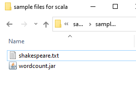

 3. Select **Data** -> **Linked** -> **Azure Data Lake Storage Gen2**, and upload **wordcount.jar** and **shakespeare.txt** into your ADLS Gen2 filesystem.
 
     

 4. Select **Develop** hub, select the '+' icon and select **Spark job definition** to create a new Spark job definition. (The sample image is the same as step 4 of **Create an Apache Spark job definition (Python) for PySpark**.)

 5. Select **Spark(Scala)** from the Language drop down list in the Apache Spark job definition main window.

     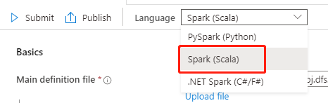

 6. Fill in information for Apache Spark job definition. You can copy the sample information.

     |  Property   | Description   |  
     | ----- | ----- |  
     |Job definition name| Enter a name for your Apache Spark job definition. This name can be updated at any time until it's published. <br> Sample: `scala`|
     |Main definition file| The main file used for the job. Select a JAR file from your storage. You can select **Upload file** to upload the file to a storage account. <br> Sample: `abfss://…/path/to/wordcount.jar`|
     |Main class name| The fully qualified identifier or the main class that is in the main definition file. <br> Sample: `WordCount`|
     |Command-line arguments| Optional arguments to the job. <br> Sample: `abfss://…/path/to/shakespeare.txt` `abfss://…/path/to/result` <br> *Note: Two arguments for the sample job definition are separated by a space.* |
     |Reference files| Additional files used for reference in the main definition file. You can select **Upload file** to upload the file to a storage account.|
     |Spark pool| The job will be submitted to the selected Apache Spark pool.|
     |Spark version| Version of Apache Spark that the Apache Spark pool is running.|
     |Executors| Number of executors to be given in the specified Apache Spark pool for the job.|  
     |Executor size| Number of cores and memory to be used for executors given in the specified Apache Spark pool for the job.|
     |Driver size| Number of cores and memory to be used for driver given in the specified Apache Spark pool for the job.|
     |Apache Spark configuration| Customize configurations by adding properties below. If you do not add a property, Azure Synapse will use the default value when applicable.|

     
     

 7. Select **Publish** to save the Apache Spark job definition.

      

## Create an Apache Spark job definition for .NET Spark(C#/F#)

In this section, you create an Apache Spark job definition for .NET Spark(C#/F#).
 1. Open [Azure Synapse Studio](https://web.azuresynapse.net/).

 2. You can go to [Sample files for creating Apache Spark job definitions](https://github.com/Azure-Samples/Synapse/tree/master/Spark/DotNET) to download **sample files for dotnet.zip**, then unzip the compressed package, and extract the **wordcount.zip** and **shakespeare.txt** files. 

     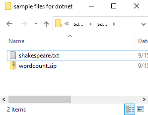

 3. Select **Data** -> **Linked** -> **Azure Data Lake Storage Gen2**, and upload **wordcount.zip** and **shakespeare.txt** into your ADLS Gen2 filesystem.
 
     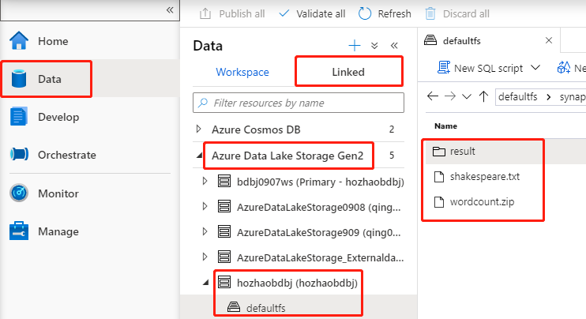

 4. Select **Develop** hub, select the '+' icon and select **Spark job definition** to create a new Spark job definition. (The sample image is the same as step 4 of **Create an Apache Spark job definition (Python) for PySpark**.)

 5. Select **.NET Spark(C#/F#)** from the Language drop down list in the Apache Spark Job Definition main window.

     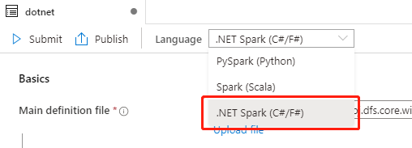

 6. Fill in information for Apache Spark Job Definition. You can copy the sample information.
    
     |  Property   | Description   |  
     | ----- | ----- |  
     |Job definition name| Enter a name for your Apache Spark job definition. This name can be updated at any time until it's published. <br> Sample: `dotnet`|
     |Main definition file| The main file used for the job. Select a ZIP file that contains your .NET for Apache Spark application (that is, the main executable file, DLLs containing user-defined functions, and other required files) from your storage. You can select **Upload file** to upload the file to a storage account. <br> Sample: `abfss://…/path/to/wordcount.zip`|
     |Main executable file| The main executable file in the main definition ZIP file. <br> Sample: `WordCount`|
     |Command-line arguments| Optional arguments to the job. <br> Sample: `abfss://…/path/to/shakespeare.txt` `abfss://…/path/to/result` <br> *Note: Two arguments for the sample job definition are separated by a space.* |
     |Reference files| Additional files needed by the worker nodes for executing the .NET for Apache Spark application that isn't included in the main definition ZIP file (that is, dependent jars, additional user-defined function DLLs, and other config files). You can select **Upload file** to upload the file to a storage account.|
     |Spark pool| The job will be submitted to the selected Apache Spark pool.|
     |Spark version| Version of Apache Spark that the Apache Spark pool is running.|
     |Executors| Number of executors to be given in the specified Apache Spark pool for the job.|  
     |Executor size| Number of cores and memory to be used for executors given in the specified Apache Spark pool for the job.|
     |Driver size| Number of cores and memory to be used for driver given in the specified Apache Spark pool for the job.|
     |Apache Spark configuration| Customize configurations by adding properties below. If you do not add a property, Azure Synapse will use the default value when applicable.|
     
     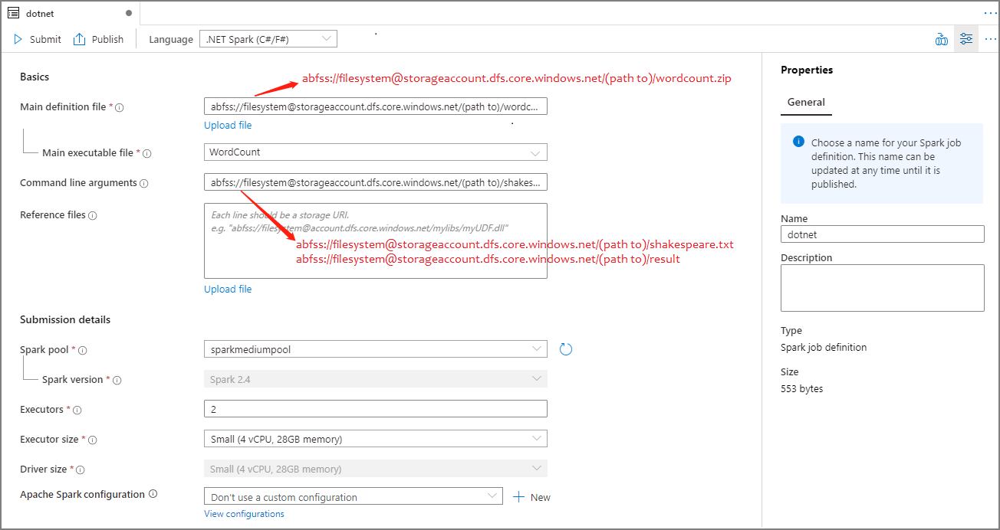

 7. Select **Publish** to save the Apache Spark job definition.

      


> [!NOTE] 
>
> For Apache Spark configuration, if the Apache Spark configuration Apache Spark job definition does not do anything special, the default configuration will be used when running the job.


## Create Apache Spark job definition by importing a JSON file

 You can import an existing local JSON file into Azure Synapse workspace from the **Actions** (...) menu of the Apache Spark job definition Explorer to create a new Apache Spark job definition.

 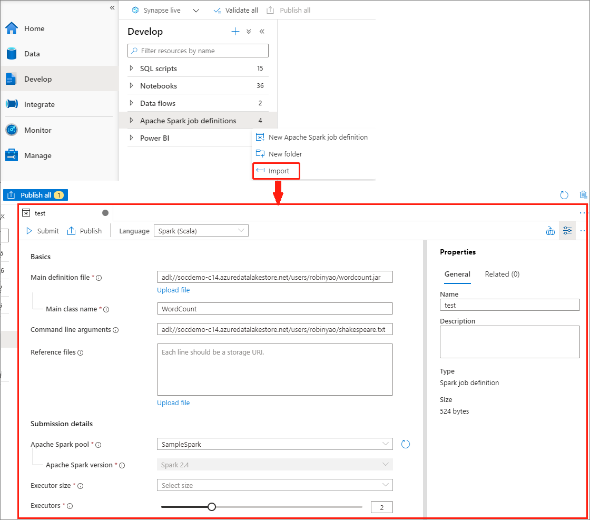

 
 The Spark job definition is fully compatible with Livy API. You can add additional parameters for other Livy properties [(Livy Docs - REST API (apache.org)](https://livy.incubator.apache.org/docs/latest/rest-api.html) in the local JSON file. You can also specify the Spark configuration related parameters in the config property as shown below. Then, you can import the JSON file back to create a new Apache Spark job definition for your batch job. Example JSON for spark definition import:
 
```Scala
   {
  "targetBigDataPool": {
    "referenceName": "socdemolarge",
    "type": "BigDataPoolReference"
  },
  "requiredSparkVersion": "2.3",
  "language": "scala",
  "jobProperties": {
    "name": "robinSparkDefinitiontest",
    "file": "adl://socdemo-c14.azuredatalakestore.net/users/robinyao/wordcount.jar",
    "className": "WordCount",
    "args": [
      "adl://socdemo-c14.azuredatalakestore.net/users/robinyao/shakespeare.txt"
    ],
    "jars": [],
    "files": [],
    "conf": {
      "spark.dynamicAllocation.enabled": "false",
      "spark.dynamicAllocation.minExecutors": "2",
      "spark.dynamicAllocation.maxExecutors": "2"
    },
    "numExecutors": 2,
    "executorCores": 8,
    "executorMemory": "24g",
    "driverCores": 8,
    "driverMemory": "24g"
  }
}

```

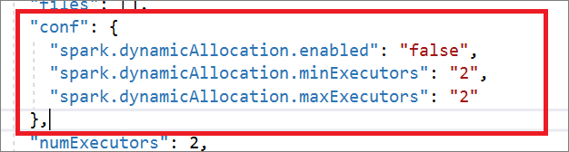

## Export an existing Apache Spark job definition file

 You can export existing Apache Spark job definition files to local from **Actions** (...) menu of the File Explorer. You can further update the JSON file for additional Livy properties, and import it back to create new job definition if necessary.

 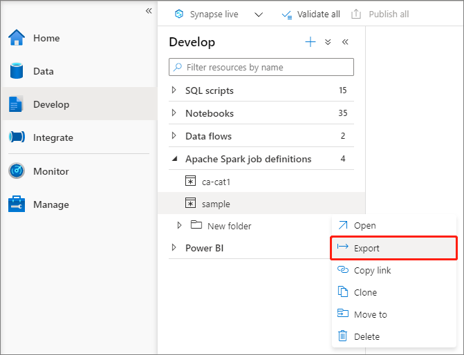

 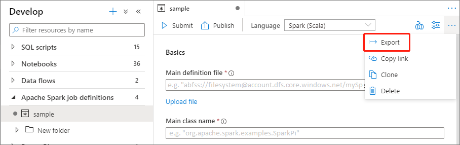

## Submit an Apache Spark job definition as a batch job

After creating an Apache Spark job definition, you can submit it to an Apache Spark pool. Make sure you are the **Storage Blob Data Contributor** of the ADLS Gen2 filesystem you want to work with. If you aren't, you need to add the permission manually.

### Scenario 1: Submit Apache Spark job definition
 1. Open an Apache spark job definition window by selecting it.

      

 2. Select **Submit** button to submit your project to the selected Apache Spark Pool. You can select **Spark monitoring URL** tab to see the LogQuery of the Apache Spark application.

    

    

### Scenario 2: View Apache Spark job running progress

 1. Select **Monitor**, then select the **Apache Spark applications** option. You can find the submitted Apache Spark application.

     

 2. Then select an Apache Spark application, the **SparkJobDefinition** job window displays. You can view the job execution progress from here.
     
     

### Scenario 3: Check output file

 1. Select **Data** -> **Linked** -> **Azure Data Lake Storage Gen2** (hozhaobdbj), open the **result** folder created earlier, you can go to the result folder and check if the output is generated.

     

## Add an Apache Spark job definition into pipeline

In this section, you add an Apache Spark job definition into pipeline.

 1. Open an existing Apache Spark job definition.

 2. Select the icon on the top right of Apache Spark job definition, choose **Existing Pipeline**, or **New pipeline**. You can refer to Pipeline page for more information.

     

     


## Next steps

Next you can use Azure Synapse Studio to create Power BI datasets and manage Power BI data. Advance to the [Linking a Power BI workspace to a Synapse workspace](../quickstart-power-bi.md) article to learn more. 
