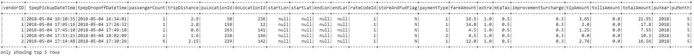
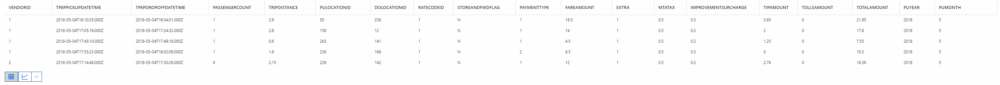

# Use Apache Spark MLlib to build a machine learning application and analyze a dataset

Learn how to use Apache Spark [MLlib](https://spark.apache.org/mllib/) to create a machine learning application to do simple predictive analysis on an Azure open dataset. Spark's built-in machine learning libraries, this example uses *classification* through logistic regression. 

MLlib is a core Spark library that provides many utilities useful for machine learning tasks, including utilities that are suitable for:

* Classification
* Regression
* Clustering
* Topic modeling
* Singular value decomposition (SVD) and principal component analysis (PCA)
* Hypothesis testing and calculating sample statistics

## Understand classification and logistic regression

*Classification*, a popular machine learning task, is the process of sorting input data into categories. It is the job of a classification algorithm to figure out how to assign "labels" to input data that you provide. For example, you could think of a machine learning algorithm that accepts stock information as input and divides the stock into two categories: stocks that you should sell and stocks that you should keep.

Logistic regression is the algorithm that you use for classification. Spark's logistic regression API is useful for *binary classification*, or classifying input data into one of two groups. For more information about logistic regressions, see [Wikipedia](https://en.wikipedia.org/wiki/Logistic_regression).

In summary, the process of logistic regression produces a *logistic function* that can be used to predict the probability that an input vector belongs in one group or the other.  

## Predictive analysis example on NYC Taxi data

In this example, you use Spark to perform some predictive analysis on taxi trip tip data from New York. The data was acquired through Azure Open datasets, see [Azure Open Datasets](https://azure.microsoft.com/en-us/services/open-datasets/catalog/nyc-taxi-limousine-commission-yellow-taxi-trip-records/)]. This dataset contains information about yellow taxi trips, including information about each trip, the start, and end time and locations, the cost, and other interesting attributes.

> [!IMPORTANT]
> There may be additional charges for pulling this data from its storage location

In the steps below, you develop a model to predict whether a particular trip will include a tip or not.

## Create an Apache Spark MLlib machine learning app

1. Create a notebook using the PySpark kernel. For the instructions, see [Create a notebook](./apache-spark-notebook-create-spark-use-sql.md#create-a-notebook).

2. Import the types required for this application. Copy and paste the following code into an empty cell, and then press **SHIFT + ENTER**, or run the cell by using the blue play icon to the left of the code.

    ```python
    import numpy as np
    import matplotlib.pyplot as plt
    import matplotlib.pyplot as plt
    from datetime import datetime
    from dateutil import parser
    from sklearn.metrics import roc_curve,auc
    from pyspark.sql.functions import unix_timestamp
    from pyspark.ml import Pipeline
    from pyspark.ml.feature import OneHotEncoder, StringIndexer, VectorIndexer
    from pyspark.ml.classification import LogisticRegression
    from pyspark.ml.feature import RFormula
    from pyspark.mllib.evaluation import BinaryClassificationMetrics
    ```

    Because of the PySpark kernel, you do not need to create any contexts explicitly. The Spark context is automatically created for you when you run the first code cell. 

## Construct the input dataframe

Because the raw data is in a Parquet format, you can use the Spark context to pull the file into memory as a dataframe directly. While the code below uses the default options, it is possible to force mapping of data types and other schema attributes if needed.

1. Run the following lines to create a Spark Dataframe by pasting the code into a new cell.

    ```python
    # Azure storage access info
    blob_account_name = "azureopendatastorage"
    blob_container_name = "nyctlc"
    blob_relative_path = "yellow"
    blob_sas_token = r""

    # Allow SPARK to read from Blob remotely
    wasbs_path = 'wasbs://%s@%s.blob.core.windows.net/%s' % (blob_container_name, blob_account_name, blob_relative_path)
    spark.conf.set('fs.azure.sas.%s.%s.blob.core.windows.net' % (blob_container_name, blob_account_name),blob_sas_token)

    # SPARK read parquet, note that it won't load any data yet by now
    df = spark.read.parquet(wasbs_path)
    ```

2. Pulling all of this data will generate around 1.5 billion rows, depending on the size of your Spark pool the raw data may be too large or take too much time to operate on. You can filter this data down to something smaller. Add the following lines to filter the data down to around 2 million rows for a more responsive experience if needed. Using these parameters will pull one week of data.

    ```python
    # Create an ingestion filter
    start_date = '2018-05-01 12:34:56'
    end_date = '2018-05-08 00:00:00'

    filtered_df = df.filter('tpepPickupDateTime > "' + start_date + '" and tpepPickupDateTime < "' + end_date + '"')
    ```

3. The downside to simple filtering is that from a statistical perspective it may introduce bias into the data, another approach is to use the sampling built into Spark. The code below will reduce the dataset down to around 2000 rows if applied after the code above. A sampling step can be used instead of the simple filter above or in conjunction with.

    ```python
    #To make development easier, faster and less expensive down sample for now
    sampled_taxi_df = filtered_df.sample(True, 0.001, seed=1234)
    ```

4. It is now possible to look at the data to see what was read, it is normally better to do review data with a subset rather than the full set depending on the size of the dataset. The code below offers two different ways to view the data, the former being basic and the later providing a much richer grid experience as well as the capability to visualize the data graphically.

    ```python
    sampled_taxi_df.show(5)
    display(sampled_taxi_df.show(5))
    ```




5. Depending on the dataset size generated above and your need to experiment/run the notebook many times it may be advisable to cache the dataset locally in the workspace. There are three ways to do perform explicit caching:
    * Save the dataframe locally as a file
    * Save the dataframe as a temporary table or view
    * Save the dataframe as a permanent table

Examples are included of the first 2 of these approaches below. The write and load lines should be uncommented out or commented depending on whether you are writing to the file cache or reading from the file cache. This cache will be persisted between sessions and Spark instance restarts.

Creating a temp table or view provides different access paths to the data but only lasts for the duration of the Spark instance session.

    ```Python
    # As the data read from remote storage takes the longest cache the filtered, downsampled results locally in the workspace
    # Save the data once per filter change and write the data out then comment out the write call and uncomment the load call
    sampled_taxi_df.write.mode('overwrite').save('sampledNYCTaxi', format='parquet')
    
    #sampled_taxi_df = spark.read.load('sampledNYCTaxi')
    
    # Creating a temp table allows easier manipulation during the session, they are not persisted between sessions, 
    # for that write the data to storage like above.
    sampled_taxi_df.createOrReplaceTempView("nytaxi")
    ```

## Understand the data

Normally you would go through a phase of exploratory data analysis (EDA) at this point to develop an understanding of the data. The code below shows three different visualizations of the data related to tips that lead to conclusions about the state and quality of the data.


## Preparing the data to be consumed by a logistic regression model

The data in its raw form is frequently not suitable for passing directly to a model. A series of actions must be performed on the data to get it into a state where the model can consume it.

In the code below four classes of operations are performed:

* The removal of outliers/incorrect values through filtering
* The removal of columns, which are not needed
* The creation of new columns derived from the raw data to make the model work more effectively, sometimes called featurization
* Labeling, as you are undertaking binary classification (will there be a tip or not on a given trip) there is a need to convert the trip amount into a 0 or 1 value.

    ```python
    # Create a new dataframe that has only the columns that are needed or that are needed to create features, create features and apply filters.
    sqlStatementSelect = """
    SELECT 
        totalAmount, fareAmount, tipAmount, paymentType, rateCodeId, passengerCount, tripDistance, tpepPickupDateTime, tpepDropoffDateTime,
        hour(tpepPickupDateTime) as pickupHour, 
        date_format(tpepPickupDateTime, 'EEEE') as weekdayString,
        unix_timestamp(tpepDropoffDateTime) - unix_timestamp(tpepPickupDateTime) as tripTimeSecs,
        CASE
            WHEN (tipAmount > 0) THEN 1
            ELSE 0
        END as tipped """
    sqlStatementFrom = """
    FROM 
        nytaxi 
    """ 
    sqlStatementWhere = """
    WHERE 
        passengerCount > 0 AND passengerCount < 8 AND 
        tipAmount >= 0  AND tipAmount <= 25 AND 
        fareAmount >= 1 AND fareAmount <= 250 AND 
        tipAmount < fareAmount AND 
        tripDistance > 0 AND tripDistance <= 100 AND 
        rateCodeId <= 5 AND 
        paymentType in ('1','2')
    """
    taxi_df = spark.sql(sqlStatementSelect + sqlStatementFrom + sqlStatementWhere)
    
    # Once again cache in a temp table
    taxi_df.createOrReplaceTempView("nytaxi_filtered")
    ```

A second pass is then made over the data to add the final features

    ```python
    # Complete the column reduction, filtering and featurisation
    sqlStatement2Select = """ 
    SELECT totalAmount, fareAmount, tipAmount, paymentType, passengerCount, tripDistance, weekdayString, pickupHour, tripTimeSecs, tipped,
        CASE
         WHEN (pickupHour <= 6 OR pickupHour >= 20) THEN "Night" 
         WHEN (pickupHour >= 7 AND pickupHour <= 10) THEN "AMRush" 
         WHEN (pickupHour >= 11 AND pickupHour <= 15) THEN "Afternoon"
         WHEN (pickupHour >= 16 AND pickupHour <= 19) THEN "PMRush"
        END as trafficTimeBins"""
    sqlStatement2From = """
    FROM 
        nytaxi_filtered
    """
    sqlStatement2Where = """
    WHERE
        tripTimeSecs >= 30 AND tripTimeSecs < 7200
    """
    taxi_featurised_df = spark.sql(sqlStatement2Select + sqlStatement2From + sqlStatement2Where)
    
    # Cache again
    taxi_featurised_df.createOrReplaceTempView("nytaxi_featurised")
    ```

## Create a logistic regression model from the input dataframe

The final task is to convert the labeled data into a format that can be analyzed by logistic regression. The input to a logistic regression algorithm needs to be a set of *label-feature vector pairs*, where the "feature vector" is a vector of numbers representing the input point. So, we need to convert the categorical columns into numbers. The `trafficTimeBins` and `weekdayString` columns need converted into integer representations. There are multiple approaches to performing the conversion, however for this example the approach that is being taken is OneHotEncoding, a common approach.

    ```python
    # The sample uses an algorithm that only works with numeric features convert them so they can be consumed
    sI1 = StringIndexer(inputCol="trafficTimeBins", outputCol="trafficTimeBinsIndex") 
    en1 = OneHotEncoder(dropLast=False, inputCol="trafficTimeBinsIndex", outputCol="trafficTimeBinsVec")
    sI2 = StringIndexer(inputCol="weekdayString", outputCol="weekdayIndex")
    en2 = OneHotEncoder(dropLast=False, inputCol="weekdayIndex", outputCol="weekdayVec")
    
    # Create a new dataframe that has had the encodings applied
    encoded_final_df = Pipeline(stages=[sI1, en1, sI2, en2]).fit(taxi_featurised_df).transform(taxi_featurised_df)
    ```
This results in a new dataframe with the columns all in the right format to train a model.

## Train a logistic regression model

The first task is to split the dataset into a training set and a testing or validation set. The split here is arbitrary and you should play around with different split settings to see if they impact the model.

    ```python
    #Decide on the split between training and testing data from the dataframe 
    trainingFraction = 0.7
    testingFraction = (1-trainingFraction)
    seed = 1234

    # Split the dataframe into test and training dataframes
    train_data_df, test_data_df = encoded_final_df.randomSplit([trainingFraction, testingFraction], seed=seed)
    ```
Now that there are two dataframes the next task is to create the model formula and run it against the training dataframe, then validate against the testing data frame. You should experiment with different versions of the model formula to see the impact of different combinations.

    ```python
    ## Create a new LR object for the model
    logReg = LogisticRegression(maxIter=10, regParam=0.3, labelCol = 'tipped')
    
    ## The formula for the model
    classFormula = RFormula(formula="tipped ~ pickupHour + weekdayVec + passengerCount + tripTimeSecs + tripDistance + fareAmount + paymentType+ trafficTimeBinsVec")
    
    ## Undertake training and create an LR model
    lrModel = Pipeline(stages=[classFormula, logReg]).fit(train_data_df)
    
    ## Saving the model is optional but its another form of inter session cache
    datestamp = datetime.now().strftime('%m-%d-%Y-%s')
    fileName = "lrModel_" + datestamp
    logRegDirfilename = fileName
    lrModel.save(logRegDirfilename)
    
    ## Predict tip 1/0 (yes/no) on the test dataset, evaluation using AUROC
    predictions = lrModel.transform(test_data_df)
    predictionAndLabels = predictions.select("label","prediction").rdd
    metrics = BinaryClassificationMetrics(predictionAndLabels)
    print("Area under ROC = %s" % metrics.areaUnderROC)
    ```

The output from this cell is

    ```shell
    Area under ROC = 0.9779470729751403
    ```

## Create a visual representation of the prediction

You can now construct a final visualization to help you reason about the results of this test. An [ROC Curve](https://en.wikipedia.org/wiki/Receiver_operating_characteristic) is one way to review the result.


## Shut down the Spark instance

After you have finished running the application, you should shut down the notebook to release the resources by closing the tab or select **End Session** from the status panel at the bottom of the notebook.

## See also

* [Overview: Apache Spark on Azure Synapse Analytics](apache-spark-overview.md)

### Scenarios

> [!IMPORTANT]
> TODO Need to rewrite this section

### Create and run applications

> [!IMPORTANT]
> TODO Need to rewrite this section

### Tools and extensions

> [!IMPORTANT]
> TODO Need to rewrite this section

### Manage resources

> [!IMPORTANT]
> TODO Need to rewrite this section
