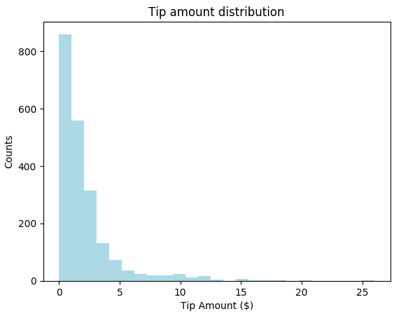
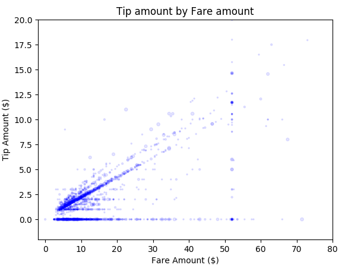

# Build a machine learning app with Apache Spark MLlib and Azure Synapse Analytics

In this article, you learn how to use Apache Spark [MLlib](https://spark.apache.org/mllib/) to create a machine learning application that does simple predictive analysis on an Azure open dataset. Spark provides built-in machine learning libraries. This example uses *classification* through logistic regression.

MLlib is a core Spark library that provides many utilities that are useful for machine learning tasks, including utilities that are suitable for:

- Classification
- Regression
- Clustering
- Topic modeling
- Singular value decomposition (SVD) and principal component analysis (PCA)
- Hypothesis testing and calculating sample statistics

## Understand classification and logistic regression

*Classification*, a popular machine learning task, is the process of sorting input data into categories. It is the job of a classification algorithm to figure out how to assign *labels* to input data that you provide. For example, you can think of a machine learning algorithm that accepts stock information as input and divides the stock into two categories: stocks that you should sell and stocks that you should keep.

*Logistic regression* is an algorithm that you can use for classification. Spark's logistic regression API is useful for *binary classification*, or classifying input data into one of two groups. For more information about logistic regressions, see [Wikipedia](https://en.wikipedia.org/wiki/Logistic_regression).

In summary, the process of logistic regression produces a *logistic function* that can be used to predict the probability that an input vector belongs in one group or the other.

## Predictive analysis example on NYC Taxi data

In this example, you use Spark to perform some predictive analysis on taxi trip tip data from New York. The data is available through [Azure Open Datasets](https://azure.microsoft.com/services/open-datasets/catalog/nyc-taxi-limousine-commission-yellow-taxi-trip-records/). This subset of the dataset contains information about yellow taxi trips, including information about each trip, the start and end time and locations, the cost, and other interesting attributes.

> [!IMPORTANT]
> There may be additional charges for pulling this data from its storage location.

In the following steps, you develop a model to predict whether a particular trip includes a tip or not.

## Create an Apache Spark MLlib machine learning app

1. Create a notebook using the PySpark kernel. For the instructions, see [Create a notebook](../quickstart-apache-spark-notebook.md#create-a-notebook).
2. Import the types required for this application. Copy and paste the following code into an empty cell, and then press **SHIFT + ENTER**, or run the cell by using the blue play icon to the left of the code.

    ```python
    import matplotlib.pyplot as plt
    from datetime import datetime
    from dateutil import parser
    from pyspark.sql.functions import unix_timestamp, date_format, col, when
    from pyspark.ml import Pipeline
    from pyspark.ml import PipelineModel
    from pyspark.ml.feature import RFormula
    from pyspark.ml.feature import OneHotEncoder, StringIndexer, VectorIndexer
    from pyspark.ml.classification import LogisticRegression
    from pyspark.mllib.evaluation import BinaryClassificationMetrics
    from pyspark.ml.evaluation import BinaryClassificationEvaluator
    ```

    Because of the PySpark kernel, you do not need to create any contexts explicitly. The Spark context is automatically created for you when you run the first code cell.

## Construct the input dataframe

Because the raw data is in a Parquet format, you can use the Spark context to pull the file into memory as a dataframe directly. While the code below uses the default options, it is possible to force mapping of data types and other schema attributes if needed.

1. Run the following lines to create a Spark dataframe by pasting the code into a new cell. This retrieves the data via the Open Datasets API. Pulling all of this data generates about 1.5 billion rows. Depending on the size of your Spark pool (preview), the raw data may be too large or take too much time to operate on. You can filter this data down to something smaller. The use of start_date and end_date applies a filter that returns a month of data.

    ```python
    from azureml.opendatasets import NycTlcYellow

    end_date = parser.parse('2018-06-06')
    start_date = parser.parse('2018-05-01')
    nyc_tlc = NycTlcYellow(start_date=start_date, end_date=end_date)
    filtered_df = nyc_tlc.to_spark_dataframe()
    ```

2. The downside to simple filtering is that, from a statistical perspective, it may introduce bias into the data. Another approach is to use the sampling built into Spark. The following code reduces the dataset down to about 2000 rows, if applied after the code above. This sampling step can be used instead of the simple filter or in conjunction with the simple filter.

    ```python
    # To make development easier, faster and less expensive down sample for now
    sampled_taxi_df = filtered_df.sample(True, 0.001, seed=1234)
    ```

3. It is now possible to look at the data to see what was read. It is normally better to review data with a subset rather than the full set depending on the size of the dataset. The following code offers two ways to view the data: the former being basic and the latter providing a much richer grid experience, as well as the capability to visualize the data graphically.

    ```python
    #sampled_taxi_df.show(5)
    display(sampled_taxi_df)
    ```

4. Depending on the size of the dataset size generated and your need to experiment or run the notebook many times, it may be advisable to cache the dataset locally in the workspace. There are three ways to do perform explicit caching:

   - Save the dataframe locally as a file
   - Save the dataframe as a temporary table or view
   - Save the dataframe as a permanent table

The first 2 of these approaches are included in the following code examples.

Creating a temp table or view provides different access paths to the data, but only lasts for the duration of the Spark instance session.

```Python
sampled_taxi_df.createOrReplaceTempView("nytaxi")
```

## Understand the data

Normally you would go through a phase of *exploratory data analysis* (EDA) at this point to develop an understanding of the data. The following code shows three different visualizations of the data related to tips that lead to conclusions about the state and quality of the data.

```python
# The charting package needs a Pandas dataframe or numpy array do the conversion
sampled_taxi_pd_df = sampled_taxi_df.toPandas()

# Look at tips by amount count histogram
ax1 = sampled_taxi_pd_df['tipAmount'].plot(kind='hist', bins=25, facecolor='lightblue')
ax1.set_title('Tip amount distribution')
ax1.set_xlabel('Tip Amount ($)')
ax1.set_ylabel('Counts')
plt.suptitle('')
plt.show()

# How many passengers tip'd by various amounts
ax2 = sampled_taxi_pd_df.boxplot(column=['tipAmount'], by=['passengerCount'])
ax2.set_title('Tip amount by Passenger count')
ax2.set_xlabel('Passenger count')
ax2.set_ylabel('Tip Amount ($)')
plt.suptitle('')
plt.show()

# Look at the relationship between fare and tip amounts
ax = sampled_taxi_pd_df.plot(kind='scatter', x= 'fareAmount', y = 'tipAmount', c='blue', alpha = 0.10, s=2.5*(sampled_taxi_pd_df['passengerCount']))
ax.set_title('Tip amount by Fare amount')
ax.set_xlabel('Fare Amount ($)')
ax.set_ylabel('Tip Amount ($)')
plt.axis([-2, 80, -2, 20])
plt.suptitle('')
plt.show()
```





## Preparing the data

The data in its raw form is frequently not suitable for passing directly to a model. A series of actions must be performed on the data to get it into a state where the model can consume it.

In the code below four classes of operations are performed:

- The removal of outliers/incorrect values through filtering.
- The removal of columns, which are not needed.
- The creation of new columns derived from the raw data to make the model work more effectively, sometimes called featurization.
- Labeling, as you are undertaking binary classification (will there be a tip or not on a given trip) there is a need to convert the tip amount into a 0 or 1 value.

```python
taxi_df = sampled_taxi_df.select('totalAmount', 'fareAmount', 'tipAmount', 'paymentType', 'rateCodeId', 'passengerCount'\
                                , 'tripDistance', 'tpepPickupDateTime', 'tpepDropoffDateTime'\
                                , date_format('tpepPickupDateTime', 'hh').alias('pickupHour')\
                                , date_format('tpepPickupDateTime', 'EEEE').alias('weekdayString')\
                                , (unix_timestamp(col('tpepDropoffDateTime')) - unix_timestamp(col('tpepPickupDateTime'))).alias('tripTimeSecs')\
                                , (when(col('tipAmount') > 0, 1).otherwise(0)).alias('tipped')
                                )\
                        .filter((sampled_taxi_df.passengerCount > 0) & (sampled_taxi_df.passengerCount < 8)\
                                & (sampled_taxi_df.tipAmount >= 0) & (sampled_taxi_df.tipAmount <= 25)\
                                & (sampled_taxi_df.fareAmount >= 1) & (sampled_taxi_df.fareAmount <= 250)\
                                & (sampled_taxi_df.tipAmount < sampled_taxi_df.fareAmount)\
                                & (sampled_taxi_df.tripDistance > 0) & (sampled_taxi_df.tripDistance <= 100)\
                                & (sampled_taxi_df.rateCodeId <= 5)
                                & (sampled_taxi_df.paymentType.isin({"1", "2"}))
                                )
```

A second pass is then made over the data to add the final features.

```Python
taxi_featurised_df = taxi_df.select('totalAmount', 'fareAmount', 'tipAmount', 'paymentType', 'passengerCount'\
                                                , 'tripDistance', 'weekdayString', 'pickupHour','tripTimeSecs','tipped'\
                                                , when((taxi_df.pickupHour <= 6) | (taxi_df.pickupHour >= 20),"Night")\
                                                .when((taxi_df.pickupHour >= 7) & (taxi_df.pickupHour <= 10), "AMRush")\
                                                .when((taxi_df.pickupHour >= 11) & (taxi_df.pickupHour <= 15), "Afternoon")\
                                                .when((taxi_df.pickupHour >= 16) & (taxi_df.pickupHour <= 19), "PMRush")\
                                                .otherwise(0).alias('trafficTimeBins')
                                              )\
                                       .filter((taxi_df.tripTimeSecs >= 30) & (taxi_df.tripTimeSecs <= 7200))
```

## Create a logistic regression model

The final task is to convert the labeled data into a format that can be analyzed by logistic regression. The input to a logistic regression algorithm needs to be a set of *label-feature vector pairs*, where the *feature vector* is a vector of numbers representing the input point. So, we need to convert the categorical columns into numbers. The `trafficTimeBins` and `weekdayString` columns need to be converted into integer representations. There are multiple approaches to performing the conversion, however the approach taken in this example is *OneHotEncoding*, a common approach.

```python
# The sample uses an algorithm that only works with numeric features convert them so they can be consumed
sI1 = StringIndexer(inputCol="trafficTimeBins", outputCol="trafficTimeBinsIndex")
en1 = OneHotEncoder(dropLast=False, inputCol="trafficTimeBinsIndex", outputCol="trafficTimeBinsVec")
sI2 = StringIndexer(inputCol="weekdayString", outputCol="weekdayIndex")
en2 = OneHotEncoder(dropLast=False, inputCol="weekdayIndex", outputCol="weekdayVec")

# Create a new dataframe that has had the encodings applied
encoded_final_df = Pipeline(stages=[sI1, en1, sI2, en2]).fit(taxi_featurised_df).transform(taxi_featurised_df)
```

This results in a new dataframe with all columns in the right format to train a model.

## Train a logistic regression model

The first task is to split the dataset into a training set and a testing or validation set. The split here is arbitrary and you should play around with different split settings to see if they impact the model.

```python
#Decide on the split between training and testing data from the dataframe
trainingFraction = 0.7
testingFraction = (1-trainingFraction)
seed = 1234

# Split the dataframe into test and training dataframes
train_data_df, test_data_df = encoded_final_df.randomSplit([trainingFraction, testingFraction], seed=seed)
```

Now that there are two DataFrames, the next task is to create the model formula and run it against the training DataFrame, then validate against the testing DataFrame. You should experiment with different versions of the model formula to see the impact of different combinations.

> [!Note]
> To save the model, you will need the Azure Storage Blob Data Contributor RBAC role. Under your storage account, navigate to Access Control (IAM), and select Add role assignment. Assign Storage Blob Data Contributor RBAC role to your SQL Database server. Only members with Owner privilege can perform this step. For various built-in roles for Azure resources, refer to this [guide](../../role-based-access-control/built-in-roles.md?toc=/azure/synapse-analytics/sql-data-warehouse/toc.json&bc=/azure/synapse-analytics/sql-data-warehouse/breadcrumb/toc.json).

```python
## Create a new LR object for the model
logReg = LogisticRegression(maxIter=10, regParam=0.3, labelCol = 'tipped')

## The formula for the model
classFormula = RFormula(formula="tipped ~ pickupHour + weekdayVec + passengerCount + tripTimeSecs + tripDistance + fareAmount + paymentType+ trafficTimeBinsVec")

## Undertake training and create an LR model
lrModel = Pipeline(stages=[classFormula, logReg]).fit(train_data_df)

## Saving the model is optional but its another form of inter session cache
datestamp = datetime.now().strftime('%m-%d-%Y-%s')
fileName = "lrModel_" + datestamp
logRegDirfilename = fileName
lrModel.save(logRegDirfilename)

## Predict tip 1/0 (yes/no) on the test dataset, evaluation using AUROC
predictions = lrModel.transform(test_data_df)
predictionAndLabels = predictions.select("label","prediction").rdd
metrics = BinaryClassificationMetrics(predictionAndLabels)
print("Area under ROC = %s" % metrics.areaUnderROC)
```

The output from this cell is

```shell
Area under ROC = 0.9779470729751403
```

## Create a visual representation of the prediction

You can now construct a final visualization to help you reason about the results of this test. An [ROC Curve](https://en.wikipedia.org/wiki/Receiver_operating_characteristic) is one way to review the result.

```python
## Plot the ROC curve, no need for pandas as this uses the modelSummary object
modelSummary = lrModel.stages[-1].summary

plt.plot([0, 1], [0, 1], 'r--')
plt.plot(modelSummary.roc.select('FPR').collect(),
         modelSummary.roc.select('TPR').collect())
plt.xlabel('False Positive Rate')
plt.ylabel('True Positive Rate')
plt.show()
```


## Shut down the Spark instance

After you have finished running the application, shut down the notebook to release the resources by closing the tab or select **End Session** from the status panel at the bottom of the notebook.

## See also

- [Overview: Apache Spark on Azure Synapse Analytics](apache-spark-overview.md)

## Next steps

- [.NET for Apache Spark documentation](/dotnet/spark?toc=/azure/synapse-analytics/toc.json&bc=/azure/synapse-analytics/breadcrumb/toc.json)
- [Azure Synapse Analytics](https://docs.microsoft.com/azure/synapse-analytics)
- [Apache Spark official documentation](https://spark.apache.org/docs/latest/)

>[!NOTE]
> Some of the official Apache Spark documentation relies on using the Spark console, which is not available on Azure Synapse Spark. Use the [notebook](../quickstart-apache-spark-notebook.md?toc=/azure/synapse-analytics/toc.json&bc=/azure/synapse-analytics/breadcrumb/toc.json) or [IntelliJ](../spark/intellij-tool-synapse.md?toc=/azure/synapse-analytics/toc.json&bc=/azure/synapse-analytics/breadcrumb/toc.json) experiences instead.
