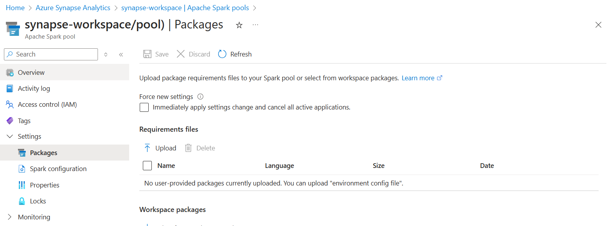
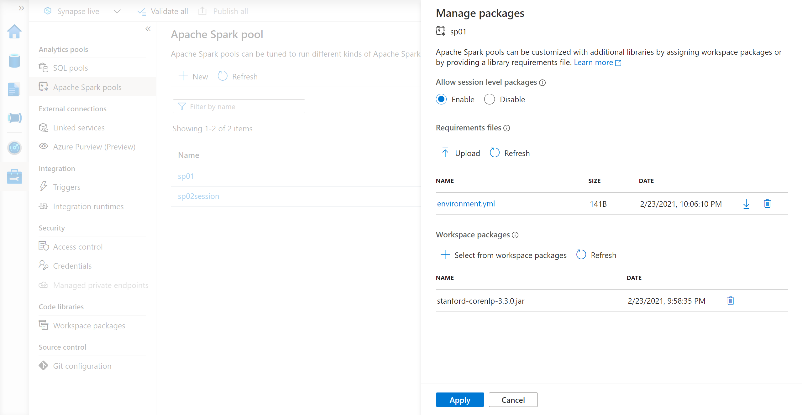
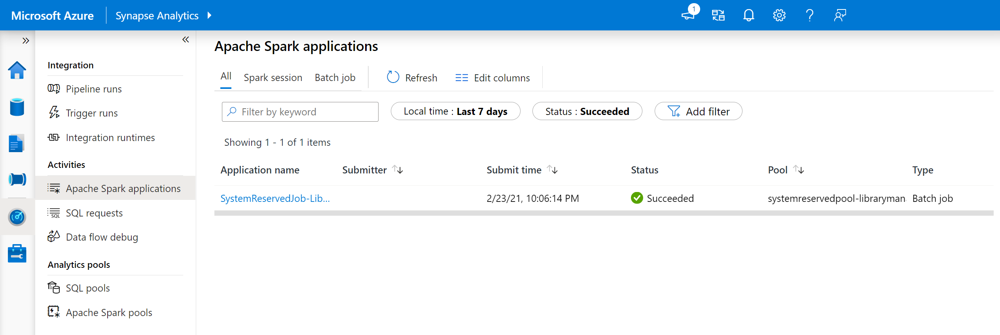
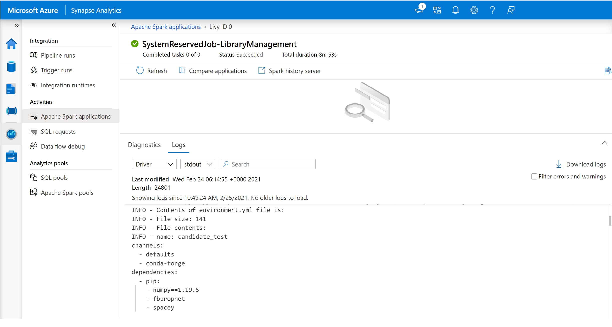
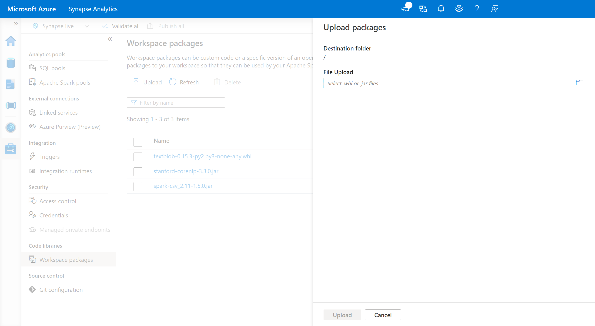
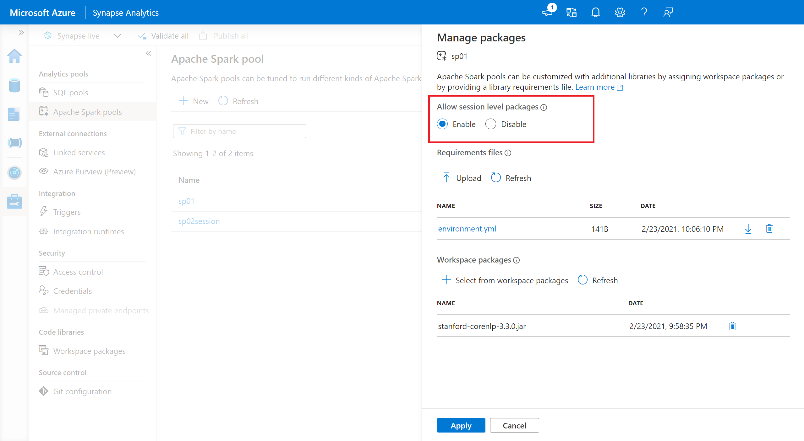
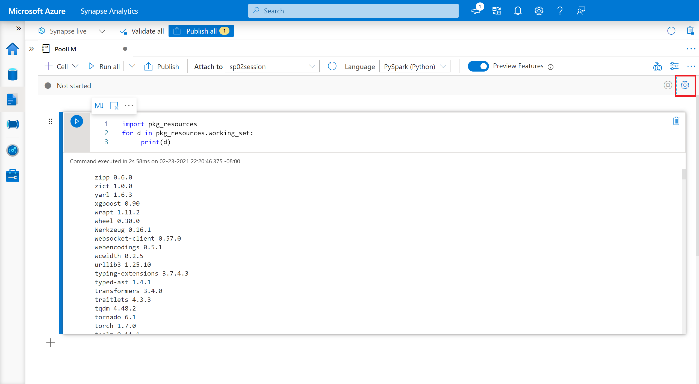

# Manage Python libraries for Apache Spark in Azure Synapse Analytics

Libraries provide reusable code that you may want to include in your programs or projects. 

You may need to update your serverless Apache Spark pool environment for various reasons. For example, you may find that:
- one of your core dependencies just released a new version.
- you need an extra package for training your machine learning model or preparing your data.
- you have found a better package and no longer need the older package.

To make third party or locally built code available to your applications, you can install a library onto one of your serverless Apache Spark pools or notebook session. In this article, we will cover how you can manage Python libraries across your serverless Apache Spark pool.

## Default Installation
Apache Spark in Azure Synapse Analytics has a full set of libraries for common data engineering, data preparation, machine learning, and data visualization tasks. The full libraries list can be found at [Apache Spark version support](apache-spark-version-support.md). 

When a Spark instance starts up, these libraries will automatically be included. Extra Python and custom-built packages can be added at the Spark pool and session level.

## Pool libraries
Once you have identified the Python libraries that you would like to use for your Spark application, you can install them into a Spark pool. Pool-level libraries are available to all notebooks and jobs running on the pool.

There are two primary ways to install a library on a cluster:
-  Install a workspace library that has been uploaded as a workspace package.
-  Provide a *requirements.txt* or *Conda environment.yml* environment specification to install packages from repositories like PyPI, Conda-Forge, and more.

> [!IMPORTANT]
> - If the package you are installing is large or takes a long time to install, this affects the Spark instance start up time.
> - Altering the PySpark, Python, Scala/Java, .NET, or Spark version is not supported.
> - Installing packages from external repositories like PyPI, Conda-Forge, or the default Conda channels is not supported within DEP-enabled workspaces.

### Install Python packages
Python packages can be installed from repositories like PyPI and Conda-Forge by providing an environment specification file. 

#### Environment specification formats

##### PIP requirements.txt
A *requirements.txt* file (output from the `pip freeze` command) can be used to upgrade the environment. When a pool is updated, the packages listed in this file are downloaded from PyPI. The full dependencies are then cached and saved for later reuse of the pool. 

The following snippet shows the format for the requirements file. The PyPI package name is listed along with an exact version. This file follows the format described in the [pip freeze](https://pip.pypa.io/en/stable/reference/pip_freeze/) reference documentation. 

This example pins a specific version. 
```
absl-py==0.7.0
adal==1.2.1
alabaster==0.7.10
```
##### YML format (preview)
In addition, you can also provide an *environment.yml* file to update the pool environment. The packages listed in this file are downloaded from the default Conda channels, Conda-Forge, and PyPI. You can specify other channels or remove the default channels by using the configuration options.

This example specifies the channels and Conda/PyPI dependencies. 

```
name: stats2
channels:
- defaults
dependencies:
- bokeh
- numpy
- pip:
  - matplotlib
  - koalas==1.7.0
```
For details on creating an environment from this environment.yml file, see [Creating an environment from an environment.yml file](https://conda.io/projects/conda/en/latest/user-guide/tasks/manage-environments.html#activating-an-environment
).

#### Update Python packages
Once you have identified the environment specification file or set of libraries you want to install on the Spark pool, you can update the Spark pool libraries by navigating to the Azure Synapse Studio or Azure portal. Here, you can provide the environment specification and select the workspace libraries to install. 

Once the changes are saved, a Spark job will run the installation and cache the resulting environment for later reuse. Once the job is complete, new Spark jobs or notebook sessions will use the updated pool libraries. 

##### Manage packages from Azure Synapse Studio or Azure portal
Spark pool libraries can be managed either from the Azure Synapse Studio or Azure portal. 

To update or add  libraries to a Spark pool:
1. Navigate to your Azure Synapse Analytics workspace from the Azure portal.

    If you are updating from the **Azure portal**:

    - Under the **Synapse resources** section, select the **Apache Spark pools** tab and select a Spark pool from the list.
     
    - Select the **Packages** from the **Settings** section of the Spark pool.
  
    
   
    If you are updating from the **Synapse Studio**:
    - Select **Manage** from the main navigation panel and then select **Apache Spark pools**.

    - Select the **Packages** section for a specific Spark pool.
    
   
2. Upload the environment configuration file using the file selector in the  **Packages** section of the page.
3. You can also select additional **workspace packages** to add to your pool. 
4. Once you save your changes, a system job will be triggered to install and cache the specified libraries. This process helps reduce overall session startup time. 
5. Once the job has successfully completed, all new sessions will pick up the updated pool libraries.

> [!IMPORTANT]
> By selecting the option to **Force new settings**, you will end the all current sessions for the selected Spark pool. Once the sessions are ended, you will have to wait for the pool to restart. 
>
> If this setting is unchecked, then you  will have to wait for the current Spark session to end or stop it manually. Once the session has ended, you will need to let the pool restart.


##### Track installation progress (preview)
A system reserved Spark job is initiated each time a pool is updated with a new set of libraries. This Spark job helps monitor the status of the library installation. If the installation fails due to library conflicts or other issues, the Spark pool will revert to its previous or default state. 

In addition, users can also inspect the installation logs to identify dependency conflicts or see which libraries were installed during the pool update.

To view these logs:
1. Navigate to the Spark applications list in the **Monitor** tab. 
2. Select the system Spark application job that corresponds to your pool update. These system jobs run under the *SystemReservedJob-LibraryManagement* title.
   
3. Switch to view the **driver** and **stdout** logs. 
4. Within the results, you will see the logs related to the installation of your dependencies.
    

## Install wheel files
Python wheel files are a common way for packaging Python libraries. Within Azure Synapse Analytics, users can upload their wheel files to a well-known location the Azure Data Lake Storage account or upload using the Azure Synapse Workspace packages interface.

### Workspace packages (preview)
Workspace packages can be custom or private wheel files. You can upload these packages to your workspace and later assign them to a specific Spark pool.

To add workspace packages:
1. Navigate to the **Manage** > **Workspace packages** tab.
2. Upload your wheel files by using the file selector.
3. Once the files have been uploaded to the Azure Synapse workspace, you can add these packages to a given Apache Spark pool.



>[!WARNING]
>- Within Azure Synapse, an Apache Spark pool can leverage custom libraries that are either uploaded  as Workspace Packages or uploaded within a well-known Azure Data Lake Storage path. However, both of these options cannot be used simultaneously within the same Apache Spark pool. If packages are provided using both methods, only the wheel files specified in the Workspace packages list will be installed. 
>
>- Once Workspace Packages (preview) are used to install packages on a given Apache Spark pool, there is a limitation that you can no longer specify packages using the Storage account path on the same pool.  

### Storage account
Custom-built wheel packages can be installed on the Apache Spark pool by uploading all the wheel files into the Azure Data Lake Storage (Gen2) account that is linked with the Synapse workspace. 

The files should be uploaded to the following path in the storage account's default container: 

```
abfss://<file_system>@<account_name>.dfs.core.windows.net/synapse/workspaces/<workspace_name>/sparkpools/<pool_name>/libraries/python/
```

>[!WARNING]
> In some cases, you may need to create the file path based on the structure above if it does not already exist. For example, you may need to add the ```python``` folder within the ```libraries``` folder if it does not already exist.

> [!IMPORTANT]
> To install custom libraries using the Azure DataLake Storage method, you must have the **Storage Blob Data Contributor** or **Storage Blob Data Owner** permissions on the primary Gen2 Storage account that is linked to the Azure Synapse Analytics workspace.


## Session-scoped packages (preview)
In addition to pool level packages, you can also specify session-scoped libraries at the beginning of a notebook session.  Session-scoped libraries let you specify and use custom Python environments within a notebook session. 

When using session-scoped libraries, it is important to keep the following points in mind:
   - When you install session-scoped libraries, only the current notebook has access to the specified libraries. 
   - These libraries will not impact other sessions or jobs using the same Spark pool. 
   - These libraries are installed on top of the base runtime and pool level libraries. 
   - Notebook libraries will take the highest precedence.

To specify session-scoped packages:
1.	Navigate to the selected Spark pool and ensure that you have enabled session-level libraries.  You can enable this setting by navigating to the **Manage** > **Apache Spark pool** > **Packages** tab.
  
2.	Once the setting has been applied, you can open a notebook and select **Configure Session**> **Packages**.
  
3.	Here, you can upload a Conda *environment.yml* file to install or upgrade packages within a session. Once you start your session, the specified libraries will be installed. Once your session ends, these libraries will no longer be available as they are specific to your session.

## Verify installed libraries
To verify if the correct versions of the correct libraries are installed from PyPI, run the following code:
```python
import pkg_resources
for d in pkg_resources.working_set:
     print(d)
```
In some cases, to view the package versions from Conda, you may need to inspect the package version individually.

## Next steps
- View the default libraries: [Apache Spark version support](apache-spark-version-support.md)
- Troubleshoot library installation errors: [Troubleshoot library errors](apache-spark-troubleshoot-library-errors.md)
- Create a private Conda channel using your Azure Data Lake Storage Account: [Conda private channels](./spark/../apache-spark-custom-conda-channel.md)
