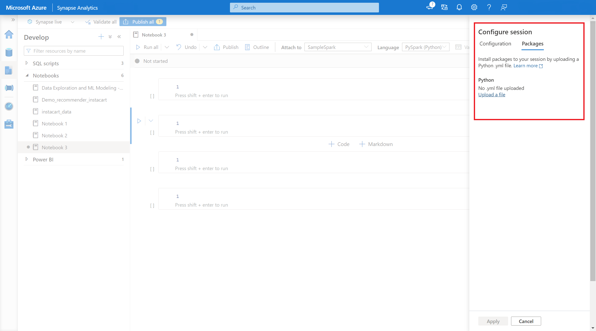

# Manage session-scoped packages

In addition to pool level packages, you can also specify session-scoped libraries at the beginning of a notebook session. Session-scoped libraries let you specify and use Python, jar, and R packages within a notebook session.

When using session-scoped libraries, it's important to keep the following points in mind:

- When you install session-scoped libraries, only the current notebook has access to the specified libraries.
- These libraries have no impact on other sessions or jobs using the same Spark pool.
- These libraries install on top of the base runtime and pool level libraries, and take the highest precedence.
- Session-scoped libraries don't persist across sessions.

## Session-scoped Python packages

### Manage session-scoped Python packages through *environment.yml* file

To specify session-scoped Python packages:

1. Navigate to the selected Spark pool and ensure that you have enabled session-level libraries.  You can enable this setting by navigating to the **Manage** > **Apache Spark pool** > **Packages** tab.
  :::image type="content" source="./media/apache-spark-azure-portal-add-libraries/enable-session-packages.png" alt-text="Screenshot of enabling session packages." lightbox="./media/apache-spark-azure-portal-add-libraries/enable-session-packages.png":::
2. Once the setting applies, you can open a notebook and select **Configure Session**> **Packages**.
  
  
3. Here, you can upload a Conda *environment.yml* file to install or upgrade packages within a session.The specified libraries are present once the session starts. These libraries will no longer be available after session ends.

### Manage session-scoped Python packages through *%pip* and *%conda* commands

You can use the popular *%pip* and *%conda* commands to install additional third party libraries or your custom libraries during your Apache Spark notebook session. In this section, we use *%pip* commands to demonstrate several common scenarios.

> [!NOTE]
>
> - We recommend to put the *%pip* and *%conda* commands at the first cell of your notebook if you want to install new libraries. The Python interpreter will be restarted after the session-level library being managed to bring the changes effective.
> - These commands of managing Python libraries will be disabled when running pipeline jobs. If you want to install a package within a pipeline, you must leverage the library management capabilities at the pool level.
> - Session-scoped Python libraries are automatically installed across both the driver and worker nodes.
> - The following *%conda* commands are not supported: *create*, *clean*, *compare*, *activate*, *deactivate*, *run*, *package*.
> - You can refer to [%pip commands](https://pip.pypa.io/en/stable/cli/) and [%conda commands](https://docs.conda.io/projects/conda/en/latest/commands.html) for the full list of commands.

#### Install a third party package

You can easily install a Python library from [PyPI](https://pypi.org/).

```python
# Install vega_datasets
%pip install altair vega_datasets
```

To verify the installing result, you can run the following code to visualize vega_datasets

```python
# Create a scatter plot
# Plot Miles per gallon against the horsepower across different region

import altair as alt
from vega_datasets import data

cars = data.cars()
alt.Chart(cars).mark_point().encode(
    x='Horsepower',
    y='Miles_per_Gallon',
    color='Origin',
).interactive()
```

#### Install a wheel package from storage account

In order to install library from storage, you need to mount to your storage account by running following commands.

```python
from notebookutils import mssparkutils  
 
mssparkutils.fs.mount(  
    "abfss://<<file system>>@<<storage account>.dfs.core.windows.net",  
    "/<<path to wheel file>>",  
    {"linkedService":"<<storage name>>"}  
) 
```

And then, you can use the *%pip install* command to install the required wheel package

```python
%pip install /<<path to wheel file>>/<<wheel package name>>.whl
```

#### Install another version of built-in library

You can use the following command to see what's the built-in version of certain package. We use *pandas* as an example

```python
%pip show pandas
```

The result is as following log:

```markdown
Name: pandas
Version: **1.2.3**
Summary: Powerful data structures for data analysis, time series, and statistics
Home-page: https://pandas.pydata.org
... ...
```

You can use the following command to switch *pandas* to another version, let's say *1.2.4*

```python
%pip install pandas==1.2.4
```

#### Uninstall a session-scoped library

If you want to uninstall a package, which installed on this notebook session, you may refer to following commands. However, you cannot uninstall the built-in packages.

```python
%pip uninstall altair vega_datasets --yes
```

#### Using *%pip* command to install libraries from a *requirement.txt* file

```python
%pip install -r  /<<path to requirement file>>/requirements.txt
```

## Session-scoped Java or Scala packages

To specify session-scoped Java or Scala packages, you can use the ```%%configure``` option:

```scala
%%configure -f
{
    "conf": {
        "spark.jars": "abfss://<<file system>>@<<storage account>.dfs.core.windows.net/<<path to JAR file>>",
    }
}
```

> [!NOTE]
>
> - We recommend you to run the %%configure at the beginning of your notebook. You can refer to this [document](https://github.com/cloudera/livy#request-body) for the full list of valid parameters.

## Session-scoped R packages (Preview)

Azure Synapse Analytics pools include many popular R libraries out-of-the-box. You can also install extra third party libraries during your Apache Spark notebook session.

> [!NOTE]
>
> - These commands of managing R libraries will be disabled when running pipeline jobs. If you want to install a package within a pipeline, you must leverage the library management capabilities at the pool level.
> - Session-scoped R libraries are automatically installed across both the driver and worker nodes.

### Install a package

You can easily install an R library from [CRAN](https://cran.r-project.org/).

```r
# Install a package from CRAN
install.packages(c("nycflights13", "Lahman"))
```

You can also use CRAN snapshots as the repository to ensure to download the same package version each time.

```r
install.packages("highcharter", repos = "https://cran.microsoft.com/snapshot/2021-07-16/")
```

### Using devtools to install packages

The ```devtools``` library simplifies package development to expedite common tasks. This library is installed within the default Azure Synapse Analytics runtime.

You can use ```devtools``` to specify a specific version of a library to install. These libraries will be installed across all nodes within the cluster.

```r
# Install a specific version. 
install_version("caesar", version = "1.0.0") 
```

Similarly, you can install a library directly from GitHub.

```r
# Install a GitHub library. 

install_github("jtilly/matchingR") 
```

Currently, the following ```devtools``` functions are supported within Azure Synapse Analytics:

| Command         | Description     |
|--------------|-----------|
| install_github()  | Installs an R package from GitHub |
| install_gitlab()  | Installs an R package from GitLab  |
| install_bitbucket() | Installs an R package from BitBucket |
| install_url() | Installs an R package from an arbitrary URL |
| install_git() | Installs from an arbitrary git repository |
| install_local() | Installs from a local file on disk |
| install_version() | Installs from a specific version on CRAN |

### View installed libraries

You can query all the libraries installed within your session using the ```library``` command.

```r
library()
```

You can use the ```packageVersion``` function to check the version of the library:

```r
packageVersion("caesar")
```

### Remove an R package from a session

You can use the ```detach``` function to remove a library from the namespace. These libraries stay on disk until they're loaded again.

```r
# detach a library

detach("package: caesar")
```

To remove a session-scoped package from a notebook, use the ```remove.packages()``` command. This library change has no impact on other sessions on the same cluster. Users can't uninstall or remove built-in libraries of the default Azure Synapse Analytics runtime.

```r
remove.packages("caesar")
```

> [!NOTE]
> You can't remove core packages like SparkR, SparklyR, or R.

### Session-scoped R libraries and SparkR

Notebook-scoped libraries are available on SparkR workers.

```r
install.packages("stringr")
library(SparkR)

str_length_function <- function(x) {
  library(stringr)
  str_length(x)
}

docs <- c("Wow, I really like the new light sabers!",
               "That book was excellent.",
               "R is a fantastic language.",
               "The service in this restaurant was miserable.",
               "This is neither positive or negative.")

spark.lapply(docs, str_length_function)
```

### Session-scoped R libraries and SparklyR

With spark_apply() in SparklyR, you can use any R package inside Spark. By default, in sparklyr::spark_apply(), the packages argument sets to FALSE. This copies libraries in the current libPaths to the workers, allowing you to import and use them on workers. For example, you can run the following to generate a caesar-encrypted message with sparklyr::spark_apply():

```r
install.packages("caesar", repos = "https://cran.microsoft.com/snapshot/2021-07-16/")

spark_version <- "3.2"
config <- spark_config()
sc <- spark_connect(master = "yarn", version = spark_version, spark_home = "/opt/spark", config = config)

apply_cases <- function(x) {
  library(caesar)
  caesar("hello world")
}
sdf_len(sc, 5) %>%
  spark_apply(apply_cases, packages=FALSE)
```

## Next steps

- View the default libraries: [Apache Spark version support](apache-spark-version-support.md)
- Manage the packages outside Synapse Studio portal: [Manage packages through Az commands and REST APIs](apache-spark-manage-packages-outside-ui.md)
