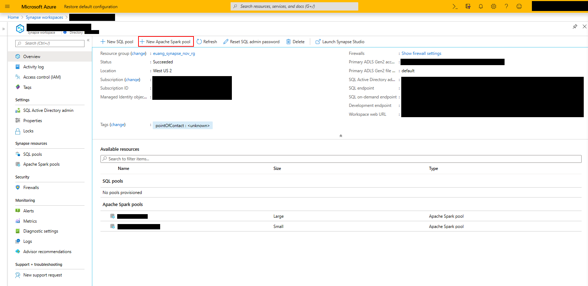
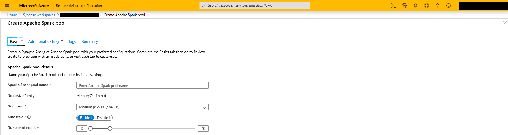
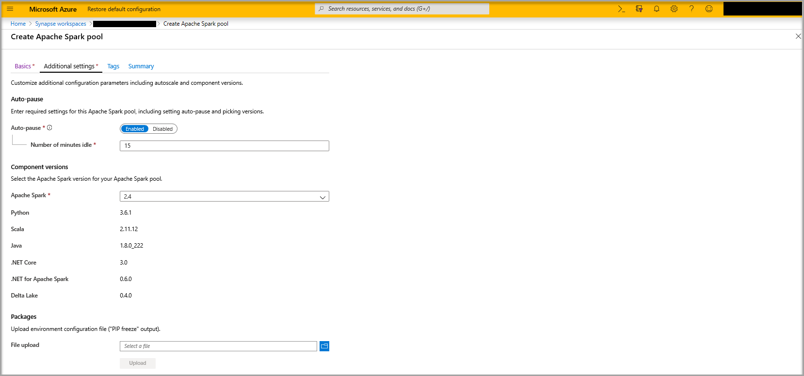
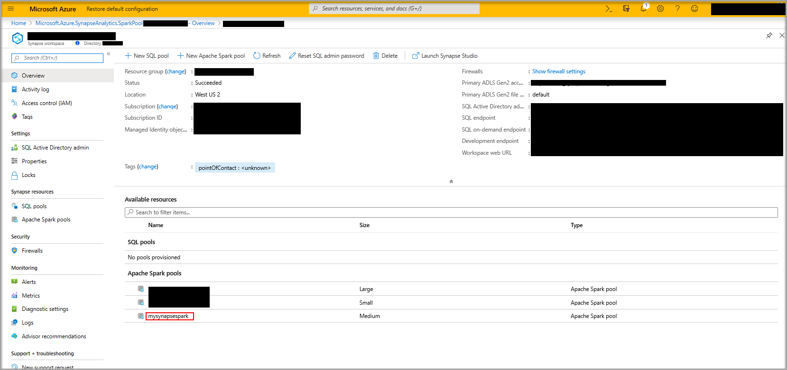
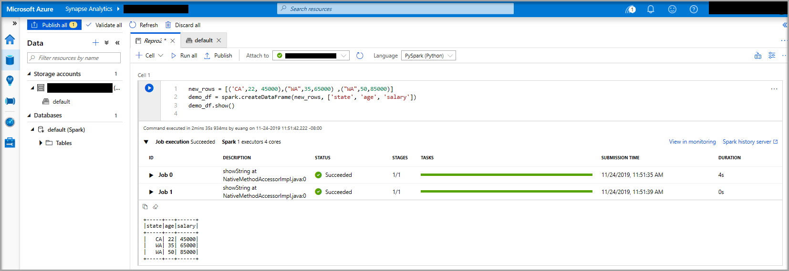
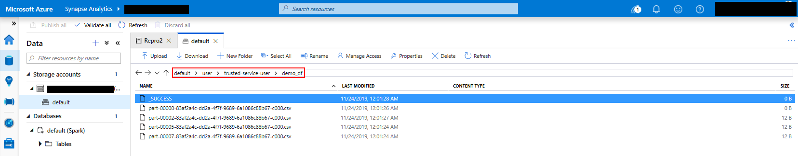
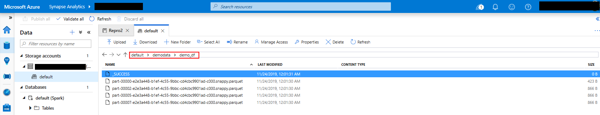
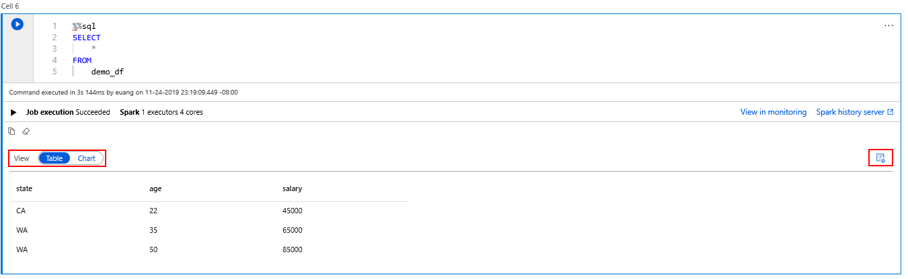
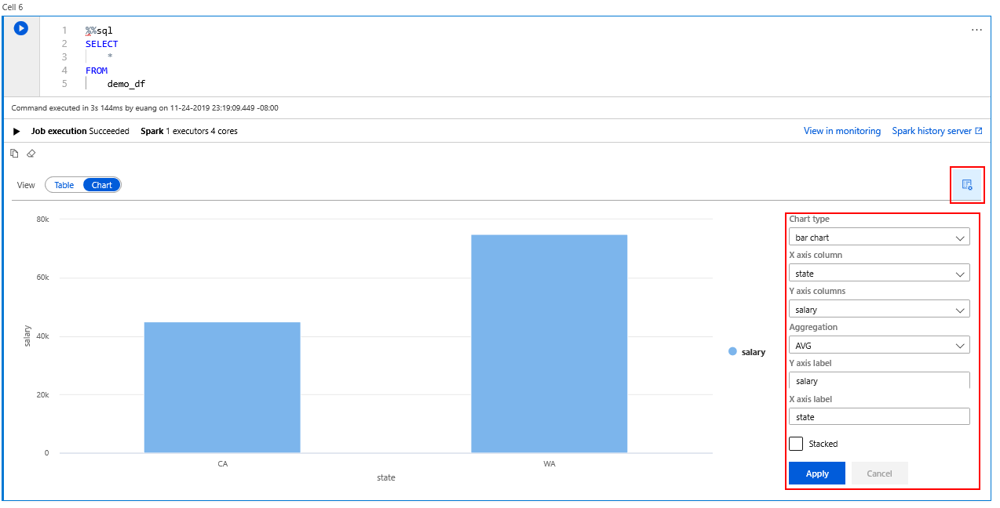

# Quickstart: Create an Apache Spark pool in Synapse Analytics using web tools

Learn how to create an Apache Spark pool in Azure Synapse Analytics and run Spark SQL queries against files and tables. Apache Spark enables fast data analytics and cluster computing using in-memory processing. For information on Spark on Synapse Analytics, see [Overview: Apache Spark on Azure Synapse Analytics](apache-spark-overview.md).

In this Quickstart, you use the Synapse Analytics tools to create a Spark pool and then connect to a Spark pool created from that template.
<!---For more information on using Data Lake Storage Gen2, see the following article:--->

<!---Need a link to a Gen 2 Storage in Synapse Analytics article--->

> [!IMPORTANT]  
> Billing for Spark instances is prorated per minute, whether you are using them or not. Be sure to shutdown your Spark instance after you have finished using it, or set a short timeout. For more information, see the **Clean up resources** section of this article.

If you don't have an Azure subscription, [create a free account](https://azure.microsoft.com/free/) before you begin.

## Create a Synapse Analytics Apache Spark pool

<!---If you do not already have a Synapse Analytics workspace created, go to

> TODO Need a link to a create a workspace article
--->

1. In the Azure portal, select the correct Azure Synapse Analytics workspace.

    
2. From the toolbar, select **+ New Apache Spark pool**.
3. Under **Basics**, provide the following values:

    |Property  |Description  |
    |---------|---------|
    |**Apache Spark pool name**     | Give a name to your Synapse Analytics Spark pool. The pool name used for this quickstart is **mysynapasespark**.|
    |**Node size**     | From the drop-down, select a node size to be used for all the nodes in the pool.
    |**Autoscale**| If enabled, your Spark pool automatically scales up and down based on the amount of activity|
    |**Number of nodes**| This sets the minimum and maximum node count for pool. If auto scale is enabled, the pool node count does not grow to be greater than the maximum|

    

    Select **Next** to continue to the **Additional settings** page.
4. Under **Additional Settings**, provide the following values:

    |Property  |Description  |
    |---------|---------|
    |**Autopause**| If enabled, the Spark pools created from this template automatically pause after a specified amount of idle time|
    |**Number of minutes idle**| The amount of time before a pool automatically pauses|
    |**Packages**| Add additional Python libraries. For more information, see [Adding additional Python libraries](apache-spark-azure-portal-add-libraries.md)|

    

     Select **Next** to continue to the **Tags** page.

5. Select **Next** to continue to the **Summary** page.

6. On **Summary**, select **Create**. The creation of a Spark pool should be fast, in the order of seconds.

At this point, there are no resources running, you have created metadata about the Spark instances you want to create.



Once an Apache Spark pool has been created it can't be edited, only deleted and recreated.

## Create a notebook

A notebook is an interactive environment that supports various programming languages. The notebook allows you to interact with your data, combine code with markdown, text and perform simple visualizations.

1. From the Azure portal view for the Synapse Analytics workspace you want to use, select **Launch Synapse Studio**.

2. Once Synapse Analytics Studio has launched, select **Develop**. Then, hover over the **Notebooks** entry. Select the ellipsis (**...**).

3. From there, select **Create Notebook**. A new notebook is created and opened with an automatically generated name.

4. To rename the notebook, select the notebook in the navigation view. Select the ellipsis (**...**) and then select **Rename**. You can name the notebook anything you want.

5. Select **Publish All** on the toolbar.

6. If there is only one Spark pool in your workspace, then it is selected by default. Use the drop-down to select the correct Spark pool if none is selected.

7. The default language is `Pyspark`. You are going to use a mix of Pyspark and Spark SQL, so the default choice is fine.

8. Next you create a simple Spark DataFrame object to manipulate. In this case, you create it from code. There are three rows and three columns:

   ```python
   new_rows = [('CA',22, 45000),("WA",35,65000) ,("WA",50,85000)]
   demo_df = spark.createDataFrame(new_rows, ['state', 'age', 'salary'])
   demo_df.show()
   ```

9. Now run the cell using one of the following methods:

    * Press **SHIFT + ENTER**.
    * Select the blue play icon to the left of the cell.
    * Select the **Run all** button on the toolbar.

10. If the Spark pool instance is not already running, it is automatically started. You can see the status of the Spark pool instance below the cell you are running and also on the status panel at the bottom of the notebook. Depending on the size of pool, starting should take 2-5 minutes. Once the code has finished running, information below the cell displays showing how long it took to run and its execution. In the output cell, you see the output.

    

11. The data now exists in a DataFrame from there you can use the data in many different ways. You are going to need it in different formats for the rest of this quickstart.

 Enter the code below in another cell and run it, this creates a Spark table, a CSV, and a Parquet file all with copies of the data:

   ```python
   demo_df.createOrReplaceTempView('demo_df')
   demo_df.write.csv('demo_df', mode='overwrite')
   demo_df.write.parquet('abfss://<<TheNameOfAStorageAccountFileSystem>>@<<TheNameOfAStorageAccount>>.dfs.core.windows.net/demodata/demo_df', mode='overwrite')
   ```

   If you use the storage explorer, it is possible to see the impact of the two different ways of writing a file used above. When no file system is specified then the default is used, in this case `default>user>trusted-service-user>demo_df`. The data is saved to the location of the specified file system.

  Notice in both the "csv" and "parquet" formats, write operations a directory is created with many partitioned files.

   

   

## Run Spark SQL statements

SQL (Structured Query Language) is the most common and widely used language for querying and defining data. Spark SQL functions as an extension to Apache Spark for processing structured data, using the familiar SQL syntax.

1. Paste the following code in an empty cell, and then run the code. The command lists the tables on the pool.

   ```sql
   %%sql
   SHOW TABLES
   ```

   When you use a Notebook with your Synapse Analytics Spark pool, you get a preset `sqlContext` that you can use to run queries using Spark SQL. `%%sql` tells the notebook to use the preset `sqlContext` to run the query. The query retrieves the top 10 rows from a system table that comes with all Synapse Analytics Spark pools by default.

2. Run another query to see the data in `demo_df`.

    ```sql
    %%sql
    SELECT * FROM demo_df
    ```

    The code produces two output cells, one that contains data results the other, which shows the job view.

    By default the results view shows a grid, but there is a view switcher underneath the grid that allows the view to switch between grid and graph views.

    

3. In the **View** switcher, select **Chart**

4. Select the **View options** icon from the far right-hand side.

5. In the **Chart type** field, select "bar chart".

6. In the X-axis column field, select "state".

7. In the Y-axis column field, select "salary".

8. In the **Aggregation** field, select to "AVG".

9. Select **Apply**.

   

10. It is possible to get the same experience of running SQL but without having to switch languages. You can do this by replacing the SQL cell above with this PySpark cell, the output experience is the same because the **display** command is used:

   ```python
   display(spark.sql('SELECT * FROM demo_df'))
   ```

11. Each of the cells that previously executed had the option to go to **History Server** and **Monitoring**. Clicking the links takes you to different parts of the User Experience.

<!---If you want more information then go here and here

> TODO Need a link to Spark Monitoring and Spark History Server
--->

## Clean up resources

Synapse Analytics saves your data in Azure Data Lake Storage. You can safely let a Spark instance shut down when it is not in use. You are charged for a Synapse Analytics Spark pool as long as it is running, even when it is not in use. Since the charges for the pool are many times more than the charges for storage, it makes economic sense to let Spark instances shut down when they are not in use.

To ensure the Spark instance is shut down, end any connected sessions(notebooks). The pool shuts down when the **idle time** specified in the Spark pool is reached. You can also select **end session** from the status bar at the bottom of the notebook.

## Next steps

In this quickstart, you learned how to create a Synapse Analytics Spark pool and run a basic Spark SQL query.

* [.NET for Apache Spark documentation](https://docs.microsoft.com/dotnet/spark)
* [Azure Synapse Analytics](https://docs.microsoft.com/azure/synapse-analytics)