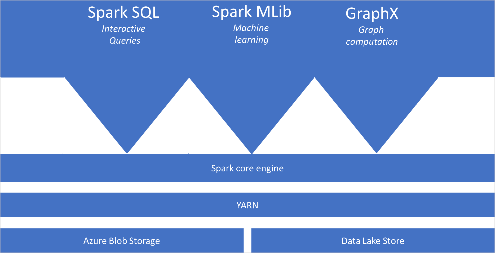
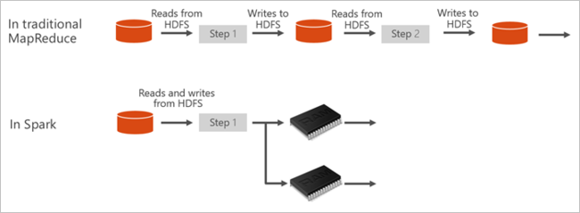

# What is Apache Spark in Azure Synapse Analytics

Apache Spark is a parallel processing framework that supports in-memory processing to boost the performance of big-data analytic applications. Apache Spark in Azure Synapse Analytics is one of Microsoft's implementations of Apache Spark in the cloud. Azure Synapse makes it easy to create and configure a Spark pool (preview) in Azure. Spark pools in Azure Synapse are compatible with Azure Storage and Azure Data Lake Generation 2 Storage. So you can use Azure Spark pools to process your data stored in Azure.

[!INCLUDE [preview](../includes/note-preview.md)]

## What is Apache Spark

Apache Spark provides primitives for in-memory cluster computing. A Spark job can load and cache data into memory and query it repeatedly. In-memory computing is much faster than disk-based applications. Spark also integrates with multiple programming languages to let you manipulate distributed data sets like local collections. There's no need to structure everything as map and reduce operations.

Spark pools in Azure Synapse offer a fully managed Spark service. The benefits of creating a Spark pool in Synapse Analytics are listed here.

| Feature | Description |
| --- | --- |
| Speed and efficiency |Spark instances start in approximately 2 minutes for fewer than 60 nodes and approximately 5 minutes for more than 60 nodes. The instance shuts down, by default, 5 minutes after the last job executed unless it is kept alive by a notebook connection. |
| Ease of creation |You can create a new Spark pool in Azure Synapse in minutes using the Azure portal, Azure PowerShell, or the Synapse Analytics .NET SDK. See [Get started with Spark pools in Synapse Analytics](../quickstart-create-apache-spark-pool-studio.md). |
| Ease of use |Synapse Analytics includes a custom notebook derived from [Nteract](https://nteract.io/). You can use these notebooks for interactive data processing and visualization.|
| REST APIs |Spark in Synapse Analytics includes [Apache Livy](https://github.com/cloudera/hue/tree/master/apps/spark/java#welcome-to-livy-the-rest-spark-server), a REST API-based Spark job server to remotely submit and monitor jobs. |
| Support for Azure Data Lake Storage Generation 2| Spark pools in Azure Synapse can use Azure Data Lake Storage Generation 2 as well as BLOB storage. For more information on Data Lake Storage, see [Overview of Azure Data Lake Storage](../../data-lake-store/data-lake-store-overview.md). |
| Integration with third-party IDEs | Azure Synapse provides an IDE plugin for [JetBrains' IntelliJ IDEA](https://www.jetbrains.com/idea/) that is useful to create and submit applications to a Spark pool. |
| Pre-loaded Anaconda libraries |Spark pools in Azure Synapse come with Anaconda libraries pre-installed. [Anaconda](https://docs.continuum.io/anaconda/) provides close to 200 libraries for machine learning, data analysis, visualization, etc. |
| Scalability | Apache Spark in Azure Synapse pools can have Auto-Scale enabled, so that pools scale by adding or removing nodes as needed. Also, Spark pools can be shut down with no loss of data since all the data is stored in Azure Storage or Data Lake Storage. |

Spark pools in Azure Synapse include the following components that are available on the pools by default.

- [Spark Core](https://spark.apache.org/docs/latest/). Includes Spark Core, Spark SQL, GraphX, and MLlib.
- [Anaconda](https://docs.continuum.io/anaconda/)
- [Apache Livy](https://github.com/cloudera/hue/tree/master/apps/spark/java#welcome-to-livy-the-rest-spark-server)
- [Nteract notebook](https://nteract.io/)

## Spark pool architecture

It is easy to understand the components of Spark by understanding how Spark runs on Synapse Analytics.

Spark applications run as independent sets of processes on a pool, coordinated by the SparkContext object in your main program (called the driver program).

The SparkContext can connect to the cluster manager, which allocates resources across applications. The cluster manager is [Apache Hadoop YARN](https://hadoop.apache.org/docs/current/hadoop-yarn/hadoop-yarn-site/YARN.html). Once connected, Spark acquires executors on nodes in the pool, which are processes that run computations and store data for your application. Next, it sends your application code (defined by JAR or Python files passed to SparkContext) to the executors. Finally, SparkContext sends tasks to the executors to run.

The SparkContext runs the user's main function and executes the various parallel operations on the nodes. Then, the SparkContext collects the results of the operations. The nodes read and write data from and to the file system. The nodes also cache transformed data in-memory as Resilient Distributed Datasets (RDDs).

The SparkContext connects to the Spark pool and is responsible for converting an application to a directed acyclic graph (DAG). The graph consists of individual tasks that get executed within an executor process on the nodes. Each application gets its own executor processes, which stay up for the duration of the whole application and run tasks in multiple threads.

## Apache Spark in Synapse Analytics use cases

Spark pools in Synapse Analytics enable the following key scenarios:

### Data Engineering/Data Preparation

Apache Spark includes many language features to support preparation and processing of large volumes of data so that it can be made more valuable and then consumed by other services within Synapse Analytics. This is enabled through multiple languages (C#, Scala, PySpark, Spark SQL) and supplied libraries for processing and connectivity.

### Machine Learning

Apache Spark comes with [MLlib](https://spark.apache.org/mllib/), a machine learning library built on top of Spark that you can use from a Spark pool in Synapse Analytics. Spark pools in Synapse Analytics also include Anaconda, a Python distribution with a variety of packages for data science including machine learning. When combined with built-in support for notebooks, you have an environment for creating machine learning applications.

## Where do I start

Use the following articles to learn more about Apache Spark in Synapse Analytics:

- [Quickstart: Create a Spark pool in Azure Synapse](../quickstart-create-apache-spark-pool-portal.md)
- [Quickstart: Create an Apache Spark notebook](../quickstart-apache-spark-notebook.md)
- [Tutorial: Machine learning using Apache Spark](./apache-spark-machine-learning-mllib-notebook.md)
- [Apache Spark official documentation](https://spark.apache.org/docs/latest/)

> [!NOTE]
> Some of the official Apache Spark documentation relies on using the spark console, this is not available on Azure Synapse Spark, use the notebook or IntelliJ experiences instead

## Next steps

In this overview, you get a basic understanding of Apache Spark in Azure Synapse Analytics. Advance to the next article to learn how to create a Spark pool in Azure Synapse Analytics:

- [Create a Spark pool in Azure Synapse](../quickstart-create-apache-spark-pool-portal.md)
