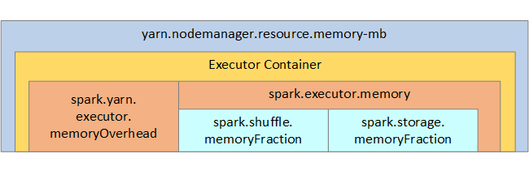

# Optimize Apache Spark jobs in Azure Synapse Analytics

Learn how to optimize an [Apache Spark](https://spark.apache.org/) cluster configuration for your particular workload.  The most common challenge is memory pressure, because of improper configurations (particularly wrong-sized executors), long-running operations, and tasks that result in Cartesian operations. You can speed up jobs with appropriate caching, and by allowing for [data skew](#optimize-joins-and-shuffles). For the best performance, monitor and review long-running and resource-consuming Spark job executions.

The following sections describe common Spark job optimizations and recommendations.

## Choose the data abstraction

Earlier Spark versions use RDDs to abstract data, Spark 1.3, and 1.6 introduced DataFrames and DataSets, respectively. Consider the following relative merits:

* **DataFrames**
  * Best choice in most situations.
  * Provides query optimization through Catalyst.
  * Whole-stage code generation.
  * Direct memory access.
  * Low garbage collection (GC) overhead.
  * Not as developer-friendly as DataSets, as there are no compile-time checks or domain object programming.
* **DataSets**
  * Good in complex ETL pipelines where the performance impact is acceptable.
  * Not good in aggregations where the performance impact can be considerable.
  * Provides query optimization through Catalyst.
  * Developer-friendly by providing domain object programming and compile-time checks.
  * Adds serialization/deserialization overhead.
  * High GC overhead.
  * Breaks whole-stage code generation.
* **RDDs**
  * You don't need to use RDDs, unless you need to build a new custom RDD.
  * No query optimization through Catalyst.
  * No whole-stage code generation.
  * High GC overhead.
  * Must use Spark 1.x legacy APIs.

## Use optimal data format

Spark supports many formats, such as csv, json, xml, parquet, orc, and avro. Spark can be extended to support many more formats with external data sources - for more information, see [Apache Spark packages](https://spark-packages.org).

The best format for performance is parquet with *snappy compression*, which is the default in Spark 2.x. Parquet stores data in columnar format, and is highly optimized in Spark. In addition, while *snappy compression* may result in larger files than say gzip compression. Due to the splittable nature of those files, they will decompress faster.

## Use the cache

Spark provides its own native caching mechanisms, which can be used through different methods such as `.persist()`, `.cache()`, and `CACHE TABLE`. This native caching is effective with small data sets as well as in ETL pipelines where you need to cache intermediate results. However, Spark native caching currently doesn't work well with partitioning, since a cached table doesn't keep the partitioning data.

## Use memory efficiently

Spark operates by placing data in memory, so managing memory resources is a key aspect of optimizing the execution of Spark jobs.  There are several techniques you can apply to use your cluster's memory efficiently.

* Prefer smaller data partitions and account for data size, types, and distribution in your partitioning strategy.
* Consider the newer, more efficient [Kryo data serialization](https://github.com/EsotericSoftware/kryo), rather than the default Java serialization.
* Monitor and tune Spark configuration settings.

For your reference, the Spark memory structure and some key executor memory parameters are shown in the next image.

### Spark memory considerations

Apache Spark in Azure Synapse uses YARN [Apache Hadoop YARN](https://hadoop.apache.org/docs/current/hadoop-yarn/hadoop-yarn-site/YARN.html), YARN controls the maximum sum of memory used by all containers on each Spark node.  The following diagram shows the key objects and their relationships.



To address 'out of memory' messages, try:

* Review DAG Management Shuffles. Reduce by map-side reducing, pre-partition (or bucketize) source data, maximize single shuffles, and reduce the amount of data sent.
* Prefer `ReduceByKey` with its fixed memory limit to `GroupByKey`, which provides aggregations, windowing, and other functions but it has an unbounded memory limit.
* Prefer `TreeReduce`, which does more work on the executors or partitions, to `Reduce`, which does all work on the driver.
* Leverage DataFrames rather than the lower-level RDD objects.
* Create ComplexTypes that encapsulate actions, such as "Top N", various aggregations, or windowing operations.

## Optimize data serialization

Spark jobs are distributed, so appropriate data serialization is important for the best performance.  There are two serialization options for Spark:

* Java serialization is the default.
* Kryo serialization is a newer format and can result in faster and more compact serialization than Java.  Kryo requires that you register the classes in your program, and it doesn't yet support all Serializable types.

## Use bucketing

Bucketing is similar to data partitioning, but each bucket can hold a set of column values rather than just one. Bucketing works well for partitioning on large (in the millions or more) numbers of values, such as product identifiers. A bucket is determined by hashing the bucket key of the row. Bucketed tables offer unique optimizations because they store metadata about how they were bucketed and sorted.

Some advanced bucketing features are:

* Query optimization based on bucketing meta-information.
* Optimized aggregations.
* Optimized joins.

You can use partitioning and bucketing at the same time.

## Optimize joins and shuffles

If you have slow jobs on a Join or Shuffle, the cause is probably *data skew*, which is asymmetry in your job data. For example, a map job may take 20 seconds, but running a job where the data is joined or shuffled takes hours. To fix data skew, you should salt the entire key, or use an *isolated salt* for  only some subset of keys. If you're using an isolated salt, you should further filter to isolate your subset of salted keys in map joins. Another option is to introduce a bucket column and pre-aggregate in buckets first.

Another factor causing slow joins could be the join type. By default, Spark uses the `SortMerge` join type. This type of join is best suited for large data sets, but is otherwise computationally expensive because it must first sort the left and right sides of data before merging them.

A `Broadcast` join is best suited for smaller data sets, or where one side of the join is much smaller than the other side. This type of join broadcasts one side to all executors, and so requires more memory for broadcasts in general.

You can change the join type in your configuration by setting `spark.sql.autoBroadcastJoinThreshold`, or you can set a join hint using the DataFrame APIs (`dataframe.join(broadcast(df2))`).

```scala
// Option 1
spark.conf.set("spark.sql.autoBroadcastJoinThreshold", 1*1024*1024*1024)

// Option 2
val df1 = spark.table("FactTableA")
val df2 = spark.table("dimMP")
df1.join(broadcast(df2), Seq("PK")).
    createOrReplaceTempView("V_JOIN")

sql("SELECT col1, col2 FROM V_JOIN")
```

If you're using bucketed tables, then you have a third join type, the `Merge` join. A correctly pre-partitioned and pre-sorted dataset will skip the expensive sort phase from a `SortMerge` join.

The order of joins matters, particularly in more complex queries. Start with the most selective joins. Also, move joins that increase the number of rows after aggregations when possible.

To manage parallelism for Cartesian joins, you can add nested structures, windowing, and perhaps skip one or more steps in your Spark Job.

### Select the correct executor size

When deciding your executor configuration, consider the Java garbage collection (GC) overhead.

* Factors to reduce executor size:
  * Reduce heap size below 32 GB to keep GC overhead < 10%.
  * Reduce the number of cores to keep GC overhead < 10%.

* Factors to increase executor size:
  * Reduce communication overhead between executors.
  * Reduce the number of open connections between executors (N2) on larger clusters (>100 executors).
  * Increase heap size to accommodate for memory-intensive tasks.
  * Optional: Reduce per-executor memory overhead.
  * Optional: Increase utilization and concurrency by oversubscribing CPU.

As a general rule of thumb when selecting the executor size:

* Start with 30 GB per executor and distribute available machine cores.
* Increase the number of executor cores for larger clusters (> 100 executors).
* Modify size based both on trial runs and on the preceding factors such as GC overhead.

When running concurrent queries, consider the following:

* Start with 30 GB per executor and all machine cores.
* Create multiple parallel Spark applications by oversubscribing CPU (around 30% latency improvement).
* Distribute queries across parallel applications.
* Modify size based both on trial runs and on the preceding factors such as GC overhead.

Monitor your query performance for outliers or other performance issues, by looking at the timeline view, SQL graph, job statistics, and so forth. Sometimes one or a few of the executors are slower than the others, and tasks take much longer to execute. This frequently happens on larger clusters (> 30 nodes). In this case, divide the work into a larger number of tasks so the scheduler can compensate for slow tasks. 

For example, have at least twice as many tasks as the number of executor cores in the application. You can also enable speculative execution of tasks with `conf: spark.speculation = true`.

## Optimize job execution

* Cache as necessary, for example if you use the data twice, then cache it.
* Broadcast variables to all executors. The variables are only serialized once, resulting in faster lookups.
* Use the thread pool on the driver, which results in faster operation for many tasks.

Key to Spark 2.x query performance is the Tungsten engine, which depends on whole-stage code generation. In some cases, whole-stage code generation may be disabled. 

For example, if you use a non-mutable type (`string`) in the aggregation expression, `SortAggregate` appears instead of `HashAggregate`. For example, for better performance, try the following and then re-enable code generation:

```sql
MAX(AMOUNT) -> MAX(cast(AMOUNT as DOUBLE))
```

## Next steps

- [Tuning Apache Spark](https://spark.apache.org/docs/2.4.5/tuning.html)
- [How to Actually Tune Your Apache Spark Jobs So They Work](https://www.slideshare.net/ilganeli/how-to-actually-tune-your-spark-jobs-so-they-work)
- [Kryo Serialization](https://github.com/EsotericSoftware/kryo)
