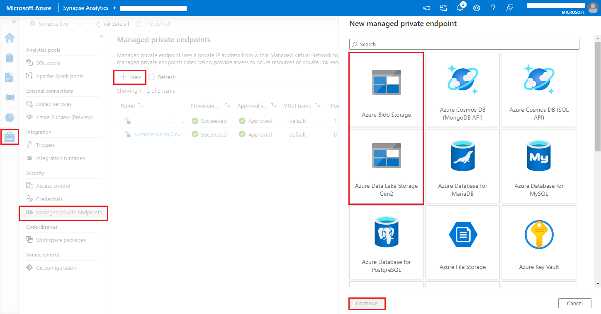
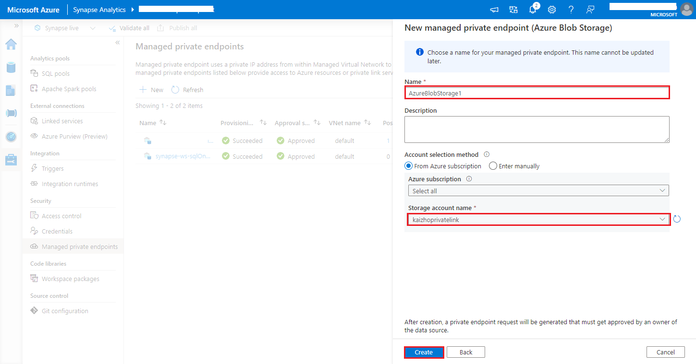

# Collect your Apache Spark applications logs and metrics using Azure Storage account

The Synapse Apache Spark diagnostic emitter extension is a library that enables the Apache Spark application to emit the logs, event logs, and metrics to one or more destinations, including Azure Log Analytics, Azure Storage, and Azure Event Hubs. 

In this tutorial, you learn how to use the Synapse Apache Spark diagnostic emitter extension to emit Apache Spark applications’ logs, event logs, and metrics to your Azure storage account.

## Collect logs and metrics to storage account

### Step 1: Create a storage account

To collect diagnostic logs and metrics to storage account, you can use existing Azure Storage accounts. Or if you don't have one, you can [create an Azure blob storage account](../../storage/common/storage-account-create.md) or [create a storage account to use with Azure Data Lake Storage Gen2](../../storage/blobs/create-data-lake-storage-account.md).

### Step 2: Create an Apache Spark configuration file

Create a `diagnostic-emitter-azure-storage-conf.txt` and copy following contents to the file. Or download a [sample template file](https://go.microsoft.com/fwlink/?linkid=2169375) for Apache Spark pool configuration.

```
spark.synapse.diagnostic.emitters MyDestination1
spark.synapse.diagnostic.emitter.MyDestination1.type AzureStorage
spark.synapse.diagnostic.emitter.MyDestination1.categories Log,EventLog,Metrics
spark.synapse.diagnostic.emitter.MyDestination1.uri https://<my-blob-storage>.blob.core.windows.net/<container-name>/<folder-name>
spark.synapse.diagnostic.emitter.MyDestination1.auth AccessKey
spark.synapse.diagnostic.emitter.MyDestination1.secret <storage-access-key>
```

Fill in the following parameters in the configuration file: `<my-blob-storage>`, `<container-name>`, `<folder-name>`, `<storage-access-key>`.
For more description of the parameters, you can refer to [Azure Storage configurations](#available-configurations)

### Step 3: Upload the Apache Spark configuration file to Synapse Studio and use it in the Spark pool

1. Open the Apache Spark configurations page **(Manage -> Apache Spark configurations)**.
2. Click on **Import** button to upload the Apache Spark configuration file to Synapse Studio.
3. Navigate to your Apache Spark pool in Synapse Studio **(Manage -> Apache Spark pools)**.
4. Click the **"..."** button on the right of your Apache Spark pool and select **Apache Spark configuration**.
5. You can select the configuration file you just uploaded in the drop-down menu.
6. Click **Apply** after selecting configuration file.

### Step 4: View the logs files in Azure storage account

After you submit a job to the configured Apache Spark pool, you should be able to see the logs and metrics files in destination storage account.
The logs will be placed in corresponding paths according to different applications by `<workspaceName>.<sparkPoolName>.<livySessionId>`.
All the logs files will be in JSON lines format (also called newline-delimited JSON, ndjson), which is convenient for data processing.

## Available configurations

| Configuration | Description |
| --- | --- |
| `spark.synapse.diagnostic.emitters`                                         | Required. The comma-separated destination names of diagnostic emitters. For example, `MyDest1,MyDest2` |
| `spark.synapse.diagnostic.emitter.<destination>.type`                       | Required. Built-in destination type. To enable Azure storage destination, `AzureStorage` needs to be included in this field. |
| `spark.synapse.diagnostic.emitter.<destination>.categories`                 | Optional. The comma-separated selected log categories. Available values include `DriverLog`, `ExecutorLog`, `EventLog`, `Metrics`. If not set, the default value is **all** categories. |
| `spark.synapse.diagnostic.emitter.<destination>.auth`                       | Required. `AccessKey` for using storage account [access key](../../storage/common/storage-account-keys-manage.md) authorization. `SAS` for [shared access signatures](../../storage/common/storage-sas-overview.md) authorization. |
| `spark.synapse.diagnostic.emitter.<destination>.uri`                        | Required. The destination blob container folder uri. Should match pattern `https://<my-blob-storage>.blob.core.windows.net/<container-name>/<folder-name>`. |
| `spark.synapse.diagnostic.emitter.<destination>.secret`                     | Optional. The secret (AccessKey or SAS) content. |
| `spark.synapse.diagnostic.emitter.<destination>.secret.keyVault`            | Required if `.secret` is not specified. The [Azure Key vault](../../key-vault/general/overview.md) name where the secret (AccessKey or SAS) is stored. |
| `spark.synapse.diagnostic.emitter.<destination>.secret.keyVault.secretName` | Required if `.secret.keyVault` is specified. The Azure Key vault secret name where the secret (AccessKey or SAS) is stored. |
| `spark.synapse.diagnostic.emitter.<destination>.secret.keyVault.linkedService` | Optional. The Azure Key vault linked service name. When enabled in Synapse pipeline, this is necessary to obtain the secret from AKV. (Please make sure MSI has read permission on the AKV). |
| `spark.synapse.diagnostic.emitter.<destination>.filter.eventName.match`     | Optional. The comma-separated spark event names, you can specify which events to collect. For example: `SparkListenerApplicationStart,SparkListenerApplicationEnd` |
| `spark.synapse.diagnostic.emitter.<destination>.filter.loggerName.match`    | Optional. The comma-separated log4j logger names, you can specify which logs to collect. For example: `org.apache.spark.SparkContext,org.example.Logger` |
| `spark.synapse.diagnostic.emitter.<destination>.filter.metricName.match`    | Optional. The comma-separated spark metric name suffixes, you can specify which metrics to collect. For example: `jvm.heap.used` |

## Log data sample

Here is a sample log record in JSON format:

```json
{
    "timestamp": "2021-01-02T12:34:56.789Z",
    "category": "Log|EventLog|Metrics",
    "workspaceName": "<my-workspace-name>",
    "sparkPool": "<spark-pool-name>",
    "livyId": "<livy-session-id>",
    "applicationId": "<application-id>",
    "applicationName": "<application-name>",
    "executorId": "<driver-or-executor-id>",
    "properties": {
        // The message properties of logs, events and metrics.
        "timestamp": "2021-01-02T12:34:56.789Z",
        "message": "Registering signal handler for TERM",
        "logger_name": "org.apache.spark.util.SignalUtils",
        "level": "INFO",
        "thread_name": "main"
        // ...
    }
}
```

## Synapse workspace with data exfiltration protection enabled

Azure Synapse Analytics workspaces support enabling data exfiltration protection for workspaces. With exfiltration protection, the logs and metrics cannot be sent out to the destination endpoints directly. You can create corresponding [managed private endpoints](../../synapse-analytics/security/synapse-workspace-managed-private-endpoints.md) for different destination endpoints or [create IP firewall rules](../../synapse-analytics/security/synapse-workspace-ip-firewall.md) in this scenario.


1. Navigate to **Synapse Studio > Manage > Managed private endpoints**, click **New** button, select **Azure Blob Storage** or **Azure Data Lake Storage Gen2** and **continue**.
   > [!div class="mx-imgBorder"]
   > 

    > [!NOTE]
    >
    > We can support both Azure Blob Storage and Azure Data Lake Storage Gen2.
    > But we were unable to parse the **abfss://** format. Azure Data Lake Storage Gen2 endpoints should be formatted as a blob URL:
    >
    > ```
    > https://<my-blob-storage>.blob.core.windows.net/<container-name>/<folder-name> 
    > ```

2. Choose your Azure Storage account in the **Storage account name**, and click **Create** button.
   > [!div class="mx-imgBorder"]
   > 
3. Wait a few minutes for private endpoint provisioning.
4. Navigate to your storage account in Azure portal, on the **Networking** > **Private Endpoint connections** page, select the connection provisioned and **Approve**.


